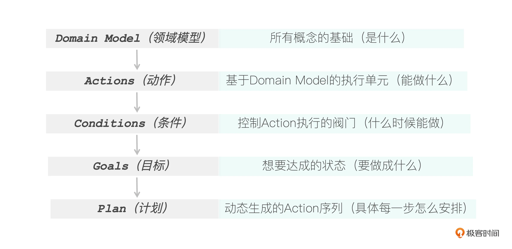
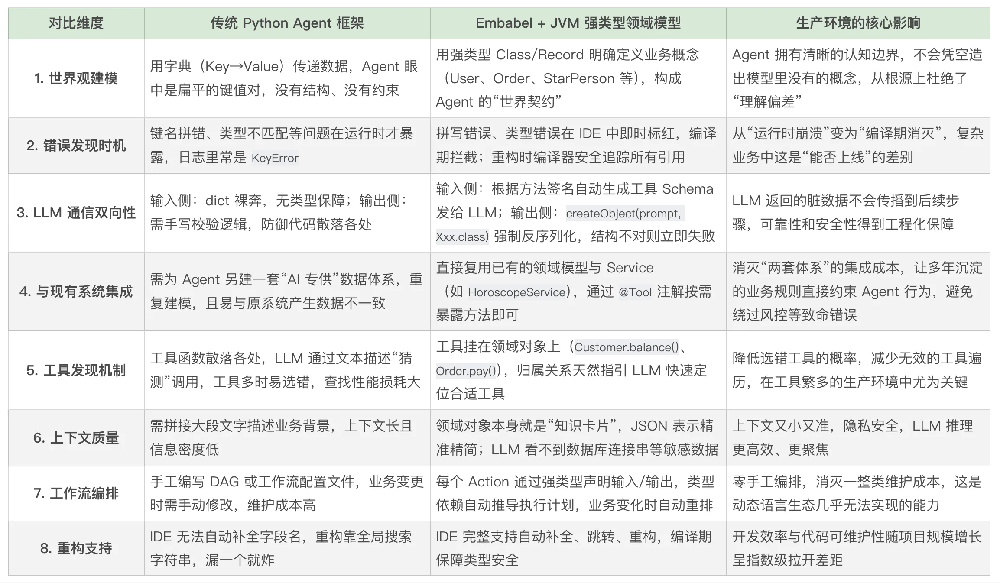

# 05｜Java 的绝招：强类型领域建模是复杂业务的关键
你好，我是张嘉熙。

前几节课，我们已经了解了Embabel中的Action、Condition、Goal，以及Spring AI和Embabel之间的关系。今天，我们要进入Embabel真正的核心地带，讨论一个比“调用模型”更底层的问题：Embabel Agent到底如何“理解世界”？

这个问题听起来有些抽象，但非常关键。就拿电商系统来说吧，无论一个电商Agent看起来多智能，它最终都必须理解：

- 什么是用户？

- 什么是订单？

- 用户有哪些能力？

- 订单里哪些信息允许被外部访问？


也就是说：在Embabel的设计中，Agent必须先拥有一套“世界认知”，才可能真正参与业务。而Embabel给出的答案，就是 **领域模型（Domain Model）**。当 Agent 从原型走向生产，从简单 Demo 走向复杂业务时，真正的决胜因素变了——类型安全、可维护性、与现有系统的深度集成，恰恰是 Java 和强类型领域模型的拿手好戏。

## 什么是领域模型？

领域模型是用代码把“业务世界”表达出来。现实业务世界里有什么，代码里就对应有什么对象。比如一个电商系统里有User、Order、Product、Coupon、Payment，这些都属于领域模型，因为它们代表的是：“业务世界中的核心概念”，而不是技术概念。

比如下面的代码对User定义了一个领域模型：

```plain
public class User {
    private String userId;
    private String name;
    private String email;
    // 余额，单位：分
    private long balance;

    // 构造方法、getter 略...

    /** 领域行为：充值 */
    public void deposit(long amount) {
        if (amount <= 0) throw new IllegalArgumentException("充值金额必须大于0");
        this.balance += amount;
    }

    /** 判断是否能支付某金额 */
    public boolean canAfford(long amount) {
        return this.balance >= amount;
    }
}

```

注意，这个类有两个特点：

- 它承载数据：userId、name、email 描述了“一个用户是什么”。

- 它封装行为： `deposit()` 和 `canAfford()` 描述了“一个用户能做什么”，并把“充值金额不能为负”“付钱前先检查余额”这些业务规则写进了领域模型内部。


在Embabel中，领域模型就是由强类型类（如Java Class / Kotlin Class）定义的一组业务对象， **它们既承载数据又能封装行为，构成** **Agent** **理解世界的“统一契约”。**

## 从“面向对象”说起

作为 JVM 开发者，我们有一个根深蒂固的习惯：接到需求时，不是先写方法，而是先去找（或新建）对应的类；不是先铺业务逻辑，而是先确认领域模型里有没有现成的行为可以复用。

举个例子，如果需求是“实现用户退款”，你不会直接写一个 `userRefund` 的方法。你会先看有没有现成的 `User` 类， `User` 类上或者对应的 `UserService` 类上有没有现成的或类似的方法。

这就是面向对象的本质：先有对象，再谈对象的行为。

Embabel 正是把这套方法论带进了 AI Agent 开发。在 Embabel 中，领域模型就是 Agent 世界里的“对象”，我们用强类型的 Java Class 或 Kotlin Class，把业务世界中的“用户”“订单”“地址”等概念固定下来。有了这些对象，后续的一切，Action（能做什么）、Condition（什么时候能做）、Goal（要做成什么），才有了可以依附的实体。

然而，过去大多数 Python Agent 框架恰恰跳过了这一步。它们习惯用字典（字符串 Key-Value）或者字符串传递数据。整个世界在 Agent 眼中是一堆扁平的键值对或文本，没有结构，没有约束，也没有内化的业务规则。

这套经典的面向对象的成熟方法论，在 AI Agent 领域被长期忽视。让 AI Agent 直接操作 JVM 上已有的领域模型，不只是锦上添花，更是用AI快速触达并赋能企业核心业务的最优路径。 **Embabel 的出发点，就是把这层被忽略的“世界建模”重新捡起来，将 JVM 生态里几十年沉淀下来的领域驱动设计，变成 Agent 的认知骨架。**

## Embabel 五大核心概念的层次关系

在继续深入了解Domain Model之前，我们先看清Embabel中五大核心概念之间的层次关系。

Embabel用这五个概念模型化了整个Agent行为：



在Embabel框架中，我们可以清晰地看到，Domain Model定义了Agent世界的统一契约：Actions的输入输出、Conditions的评估依据、Goals的达成状态、乃至Plan的Action序列全都遵循这套契约。

一个普通的Java Bean就是一个Domain Model。它用类型安全的方式定义了Agent世界中的基础概念，就连Action、Condition、Goal本身也是Agent这个特殊的Domain Model里的一部分。

Embabel鼓励用Java Class（包括Java Record）或Kotlin Class来构建领域模型，这确保了Embabel的项目总是类型安全的、可靠的，并且经得起重构考验。

## **领域集成上下文工程**

Rod Johnson 在他的 [Blog](https://medium.com/@springrod/context-engineering-needs-domain-understanding-b4387e8e4bf8) 中创造性地提出了一个很务实的理念—— **领域集成上下文工程**（DICE, Domain-Integrated Context Engineering）。名字听起来学术，但其实非常接地气。

传统上下文工程主要研究“怎样把更好的上下文喂给大模型”，用Andrej Karpathy的话说是“为下一步操作填充恰当信息的精妙艺术与科学”。这当然重要，但 Rod Johnson 发现它留下了两个关键问题。

### 问题一：LLM 通信的双向性

我们既要管“发给模型什么”，也要管“模型返回的东西能不能被系统安全、准确地执行”。如果模型返回的是一段不可靠的文本或结构随意的 JSON，后续代码就得写大量防御逻辑，甚至根本执行不下去。

Embabel 是如何解决这个的呢？

以Embabel官方提供的 [这个 Java 示例](https://github.com/embabel/embabel-agent#show-me-the-code) 来说，在 `findNewsStories` 方法中生成发给 LLM的提示词时，提示词内的占位符和特定的领域模型字段一一对应。比如 `person.name(), person.sign(), horoscope.summary()`，提示词的拼装逻辑是：“从 `StarPerson` 类里的 `name`， `sign` 字段和 `Horoscope` 类里的 `summary` 字段取值”。这是用强类型领域模型明确定义了“提示词参数的具体构成和对应类型”。如果向提示词传递的参数类型不对， **编译期就会立即报错，不会像Python一样在运行时才发现问题。**

LLM 返回给我们的那一侧，通过 `ai.withDefaultLlm().createObject(prompt,RelevantNewstories.class)` 这样的调用，模型生成的文本会被立即反序列化成强类型的 `RelevantNewstories` 实例。如果模型返回的 JSON 结构不对、字段类型错误，反序列化直接失败， **Agent 流程不会带着脏数据继续前进**。

这就像两个系统之间通过一份共享的接口定义进行对接。领域模型在双方之间充当了那唯一的一份语言契约，它既定义了请求的 Schema，也保证了响应的合规性。双向通信的答案，就是让领域模型成为双向的共同语言。

### 问题二：Agent 与现有业务系统的联系

企业里早已存在大量经过打磨的领域模型和业务服务。那不是没用的老代码或需要绕开的障碍，而是现成的高精度业务知识库。对于具有复杂业务逻辑和大量现存领域模型的企业级应用来说，如果我们凭空再造一套“AI 专供”的数据结构，不仅重复劳动，还会丢掉原有领域模型里沉淀的业务约束，导致 Agent 的决策脱离真实系统可以执行的边界——这简直是噩梦，代价高昂且充满风险。

举个例子：你的系统里有一个 `User` 领域模型，它不光有 `balance` 和 `canAfford()`，还关联着数据库映射、风控检查、账务流水。如果为了引入 Agent 而重新写一套“AI 版”的数据结构，那些已经沉淀在原有模型里的业务约束就很可能会被丢掉。Agent 可能生成一个绕过风控的支付计划，或者调用一个现实中不允许的操作。

Embabel 的做法完全相反： **它让你直接复用现有的领域模型，让 Agent 成为这些成熟业务对象的操作者。** 你只需在 `@Action` 方法里调用已有的 Service 或领域方法，Agent 的每一个决策步骤，都会自动受到这些方法内部业务规则的约束。

这就是 DICE 理念的真正威力：不是让 AI 在业务的空地上重新造轮子，而是把 AI 直接接入已经运转良好的业务系统。 **你现有的领域模型，就是你最大的 AI 资产。**

## 领域模型的深层价值

领域模型作为传统软件工程的经典概念，远远超越了普通数据结构的意义，在AI Agent时代依然焕发着不可替代的价值。 **通过DICE（领域集成上下文工程），“填充上下文窗口这门微妙的艺术和科学”将不再那么微妙，而更加科学。** 除了我们上面提到的，领域模型的其他优势还有很多：用SQL等方式搜索持久化后的领域对象比向量搜索更精确；领域模型本身更易于测试，调试，观测。而在Embabel的设计中，领域模型还隐藏着更深层的价值…

### 领域对象 = 天然的知识卡片

每个领域模型本身就是某项业务知识的精炼载体。一个 `User` 对象，包含了姓名、邮箱、余额、偏好，这本身就是一张高价值的“知识卡片”。还有 `User` 和 `Order` 等对象之间的关联关系，也让这张卡片上的内容更加丰富。

对 LLM 来说，这意味着两件事：

- 上下文精准：给模型看一个 `User` 对象的 JSON 表示，比给它一大段描述文字要精确得多，也短得多。尤其是在需要多步流程的复杂业务中可以高效操控上下文，避免质量下降与成本飙升。

- 隐私安全：LLM 不需要看到用户的全部隐私数据，只能看到我们设置为public的数据。这一点在调用第三方LLM API时会很重要。


通过领域对象，我们可以非常便捷地 **最小化上下文、最大化精度，同时将敏感数据隔绝在 LLM 之外**。这是一个非常经典而又高效的设计。

### 领域方法 = 自带的工具发现机制

领域模型内部不仅有字段（属性），还可以有领域方法来封装“行为”。这些行为天然归属于某个领域对象的范围之内，这一特点恰好可以辅助解决Agent工具使用中的可发现问题。

Embabel 把工具直接挂在领域对象上，比如 `User` 有 `balance()` 工具， `Order` 有 `pay()` 工具。模型在调用工具时会很自然地理解有哪些工具可用，迅速找到合适的工具，因为工具和对象的归属关系本身就是一种隐式的指引。这种归属关系极大降低了 LLM 选错工具的几率以及查找工具的性能损耗。在企业级复杂业务场景下，工具往往数量庞大，Python的Agent工具发现机制经常因此陷入查找效率低下、甚至难以匹配合适工具的困境——而这一问题，领域模型却能自然而然地化解。

我们来看Embabel [官方示例](https://docs.embabel.com/embabel-agent/guide/0.3.5/#objects-with-behavior) 中Customer领域对象定义：

```plain
// 领域对象：客户，通过@Tool注解暴露方法给LLM调用
@Entity
public class Customer {
    private String name;
    private LoyaltyLevel loyaltyLevel;
    private List<Order> orders;
    // 领域行为，同时也是工具
    @Tool(description = "Calculate the customer's loyalty discount percentage")
    public BigDecimal getLoyaltyDiscount() {
        return loyaltyLevel.calculateDiscount(orders.size());
    }
    // 领域行为，同时也是工具
    @Tool(description = "Check if customer is eligible for premium service")
    public boolean isPremiumEligible() {
        return orders.stream()
            .mapToDouble(Order::getTotal)
            .sum() > 1000.0;
    }

    public void updateLoyaltyLevel() {
        // Internal business logic
    }
}

```

这就是Embabel支持的tool object模式。将 `Customer` 领域对象作为工具对象提供，使 LLM 能够调用其带有 `@Tool` 注解的方法。LLM 可以访问 `customer.getLoyaltyDiscount()` 和 `customer.isPremiumEligible()`。但是注意 `updateLoyaltyLevel` 方法没有 `@Tool` 注解所以不会被LLM调用。

```plain
@Action
public Recommendation generateRecommendation(Customer customer, OperationContext context) {
    var prompt = String.format(
        "Generate a personalized recommendation for %s based on their profile",
        customer.getName()
    );

    return context.ai()
    // 通过withToolObject显示指定customer作为tool object可以被LLM调用
        .withToolObject(customer)
        .withDefaultLlm()
        .createObject(prompt, Recommendation.class);
}

```

领域对象通过 `@Tool` 注解将自己的方法暴露给LLM，再结合 `withToolObject` 方法，让LLM可以直接调用领域对象内特定的业务逻辑。开发者通过选择性地添加注解，精确控制哪些领域方法允许LLM调用，哪些保持私有。

对比一下其他框架的做法：它们通常需要你单独编写工具方法，手动声明参数和返回值的 JSON Schema。而在 Embabel 里，你只需在已有的领域方法上加一个注解。

### 类型依赖关系 = 自动规划的根基

现在我们进入Embabel另一个令人惊叹的部分。Domain Model不只是为了类型安全——它直接驱动了Agent的核心能力：规划（Planning）。这里的秘密就在于： **类型即契约**。

每一个Action都清晰地声明了它的“前置条件”（通过输入参数类型）和“后置效果”（通过返回类型）。一个Action需要Order对象作为输入，那就意味着：只有在Order对象已经产生之后，这个Action才应该被执行。框架根据类型依赖自动推导执行顺序，不需要开发者手动编排。

我们看一个典型的代码示例：

```plain
@Action
public Blog fetchArticle(UserInput input) { /* ... */ }         // 步骤1
@Action
public SocialMediaPost generatePost(Blog blog) { /* ... */ }    // 步骤2（自动排在步骤1之后）
@Action
@AchievesGoal
public ReviewedPost reviewPost(SocialMediaPost post) { /* ... */ }  // 步骤3（最终目标）

```

开发者并没有写：先执行A，再执行B，最后执行C。但Embabel仍然知道：UserInput–Blog–SocialMediaPost–ReviewedPost。因为类型关系，本身就是执行顺序。开发者没有写任何一行编排代码，只需根据类型签名，框架就能自动推断出执行计划。如果你从零开始设计过复杂工作流，那你一定懂得这有多方便。

## 本讲小结

这一讲，你拿下了Embabel最硬核的根基——领域模型。学完这一讲的内容，相信你对那句“生产环境，属于JVM”有了更深刻的理解。

1. **你掌握了Agent世界的“造物主视角”**

在Embabel中，Domain Model就是世界的契约。你用强类型的Class（或Java Record）定义“有什么”，后面的Action、Condition、Goal、Plan就自动有了依附。先定义世界，再让世界动起来——这是你关于超越Python框架的第一层认知。

2. **你获得了三个“自动生效”的超级能力**
   - 领域对象自动变成知识卡片，喂给LLM的上下文又小又准；

   - 领域方法加个@Tool，直接变成LLM可调用的工具，精准暴露特定的方法；

   - 更炸裂的是：你不用写一行编排代码，类型依赖自动等于执行计划。输入类型是谁，前面必须产出什么，顺序自然就出来了。
3. **你看到了Embabel后来居上的底气**


Python框架还在运行时爆炸，你在编译期就把错误消灭了；别人另起炉灶重新建模，你直接复用沉淀多年的业务资产；别人手工编排工作流，你的框架自己就会基于类型搞定。



下节课，我们趁热打铁，进入Plan——看框架如何动态编织你的Agent行动路径。

## 思考题

请动手完成以下练习，真正掌握本讲内容。

1. 领域模型定义

假设你正在构建一个“图书借阅助手”，请使用Java records定义以下领域模型：

- `Book`：包含 `id`、 `title`、 `author`、 `available` 字段

- `Borrower`：包含 `id`、 `name`、 `maxBorrowLimit` 字段

- `LoanRecord`：包含 `borrower`、 `book`、 `dueDate` 字段


并为一个 `Borrower` 添加一个领域方法 `canBorrow()`，返回 `boolean`，判断当前借阅人是否还可以借书（简单起见，假设只要当前有借书记录的数量不超过 `maxBorrowLimit` 即可）。

2. 工具暴露

为你定义的 `Borrower` 的 `canBorrow()` 方法加上合适的Embabel注解，使其能被LLM作为工具调用，并写一段文字描述这个工具的功能。

3. 规划推演

定义两个Action：

- `searchBook(UserQuery query)`：接收用户的查询条件，返回一个 `List<Book>`

- `createLoan(Borrower borrower, Book book)`：接收借阅人和一本书，返回 `LoanRecord`（假设已经有库存判断）。若Agent的最终目标是得到一个 `LoanRecord`，请根据类型依赖关系推导出框架可能会自动生成的执行计划，并说明需要额外提供的参数是从哪里来的。


4. 对比思考

假设你用Python Agent框架实现同样的“图书借阅助手”，在 `searchBook` 和 `createLoan` 两者之间传递数据时，你可能会遇到哪些由于缺少强类型而带来的问题？（至少写出两点）

欢迎你把自己实现的代码链接分享到留言区，如果这节课的内容对你有帮助的话也欢迎你分享给需要的朋友，我们下节课再见！