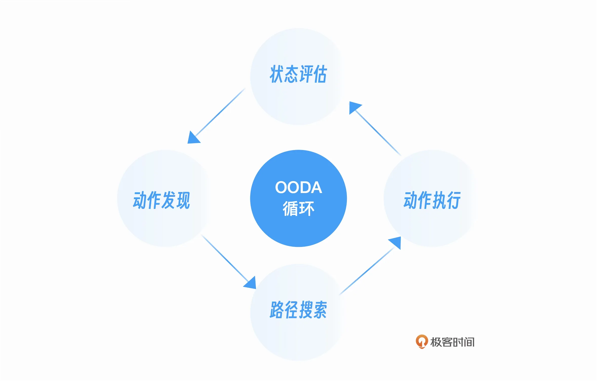
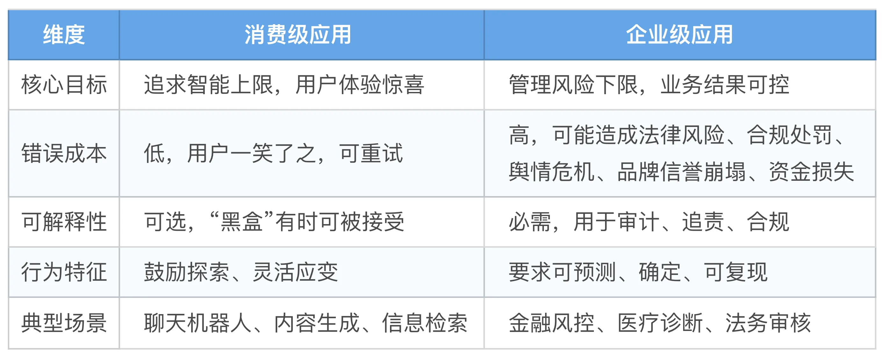
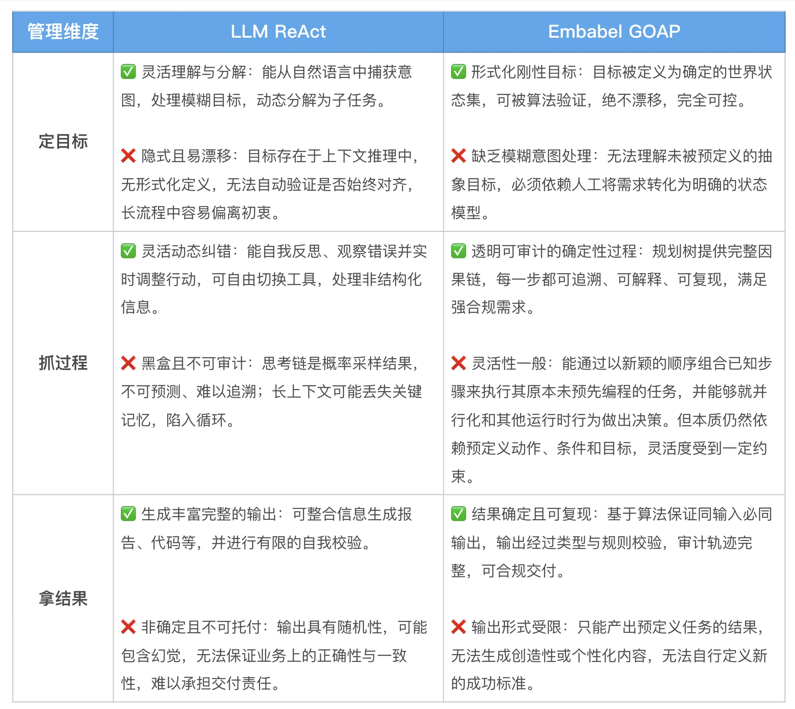
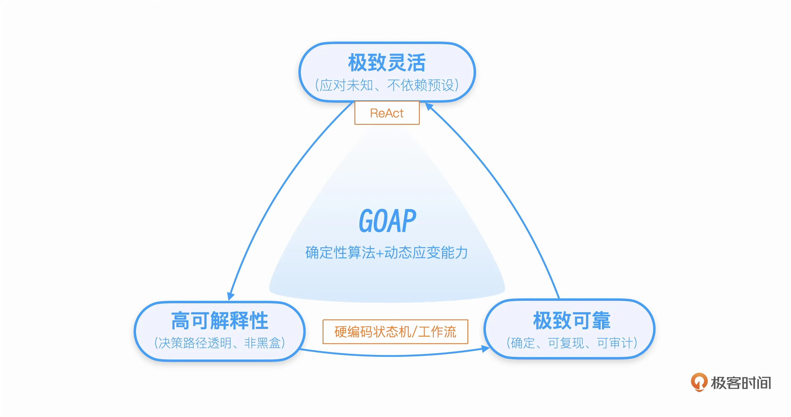

# 06｜GOAP vs ReAct：为什么复杂业务需要目标导向规划？
你好，我是张嘉熙。

上一讲你学会了用 Domain Model 定义 Agent 世界的“对象”，还发现了一个令人兴奋的能力：类型依赖可以自动推导执行顺序，比如生成 Blog 之后框架就知道该发社交媒体贴子了，从类型签名就把活儿办了，看起来不需要你写任何编排代码。

这个能力确实很酷。但如果你深想一步，就会发现一个关键问题：类型依赖能覆盖所有场景吗？

答案是不能。类型依赖只能回答“谁先谁后”，A 的返回值是 B 的输入，那么 A 一定在 B 之前，但它回答不了“分岔时该走哪条路”这样的问题。当一条业务流程出现分岔，决定往左还是往右的，不是类型签名，而是 **运行时状态**。

这就是本讲主角 Plan（规划）登场的时刻。

在 Embabel 的核心概念中，Plan 是最“智能”的一环。如果说类型依赖提供了静态的“骨架”，声明了 Action 之间可能的连接方式，那么 Plan 就是在每个分岔口做出决策的动态“大脑”。Embabel 对它的定义非常明确：Plan 是框架动态生成的 Action 序列，每次执行后重新规划，形成 OODA 循环。开发者不需要写流程代码，规划的责任完全由框架承担。

而驱动这个大脑的引擎，就是 **GOAP（目标导向行动规划）**。

本讲我们将深入拆解 Embabel 的规划机制，并让它与业界主流的 ReAct 模式正面交锋（ [03讲](https://time.geekbang.org/column/article/979178) 我们已对比过工作流和状态机）。看完你会理解，为什么说“复杂业务需要目标导向行动规划”。

## 从类型依赖到 GOAP：为什么需要更强大的规划？

现在，我们揭开悬念。要真正理解 GOAP 的价值，你得先看清类型依赖到底能做什么，更要看清它在哪里“撞了南墙”。

### 类型依赖：谁先谁后

上一讲的 Blog 例子是类型依赖的经典应用：

```plain
@Action
public Blog fetchArticle(UserInput input) { /* ... */ }         // 步骤1
@Action
public SocialMediaPost generatePost(Blog blog) { /* ... */ }    // 步骤2（自动排在步骤1之后）

```

generatePost 需要 Blog，而 Blog 由 fetchArticle 产出。框架看到这个类型“契约”，二话不说就把它们串起来了。当依赖关系本身就是一条直线（A→B→C），并且关键信息全在类型签名里时，类型依赖足以直接驱动规划。这种感觉，就像一条设计精良的流水线：上游工位产出的零件，恰好是下游工位要用的原料，一环扣一环，无需额外调度，整条线自己就跑起来了。

### 类型依赖的边界：分岔路口，谁来做选择？

可惜，生产环境从来不是一条大道通罗马。我们再来看一个常见不过的退款场景：

```plain
@Action
public EligibilityResult checkEligibility(RefundRequest request) { /* ... */ }

@Action
public RefundConfirmation processRefund(EligibilityResult result) { /* ... */ }

@Action
public RejectionNotice rejectRefund(EligibilityResult result) { /* ... */ }

```

processRefund 和 rejectRefund 都需要 EligibilityResult 作为输入，输出类型却截然不同。类型系统只能告诉你“这两条路在结构上都走得通”，但它永远无法回答那个最关键的问题：这个客户，此刻是该退款还是该拒绝？

决定走哪条路的依据，藏在 EligibilityResult 的肚子里——是 eligible 还是 not\_eligible。这是在运行时才浮出水面的状态，不是类型签名能提前写死的。

Embabel 官方文档对此说得很明白：“应用开发者通常不需要直接处理条件概念，因为大多数条件源于代码中定义的数据流，系统能自动推断前置条件和后置条件。” 也就是说，大部分时候，类型依赖帮你打通了可能性空间，你完全不用操心什么 pre/post——这是框架的温柔。可一旦条件逻辑介入，分岔口出现，你就必须把决策权交出去，交给一个能在运行时读懂世界状态的规划器。

## Embabel 的默认规划器：GOAP

GOAP 的核心思想就是把规划变成寻路游戏：

> 把你所有可用的 Action 当作地图上的节点，每个 Action 都有“进门条件”（前置条件）和“出门效果”（后置效果），然后用 A\* 搜索找到从当前位置到目标的最短路径。

这就像你在一个巨大的地铁站里，每个站台是一个 Action，进站要满足某些条件，出站后状态也会发生变化，比如某条线路突然暂停运营了。GOAP 是一个永不知疲倦的导航员，瞬间算出“从现在的站台，到你想去的终点，哪个换乘方案最快、最省钱”。

这个导航能在 Embabel 里跑起来，关键前提之一是你在 Domain Model 中已经用强类型签了“契约”。每个 Action 的输入输出类型，天然构成它在状态空间里的坐标和连接规则。上一讲我们花那么多篇幅讲 Domain Model，就是因为如果没有这些类型锚点，GOAP 的搜索就会失去地基。

### Plan 是如何生成的？四步 OODA 闭环

在 Embabel 中，GOAP 规划器的工作流程是OODA四个步骤的闭环，每一步都咬合得很紧：

1. 评估当前世界状态，包括读取 Blackboard 中的共享数据，以及评估那些可访问外部系统（如数据库）的动态条件 (@Condition)。此时，规划器就拿到了战前的完整“态势图”。

2. 根据当前世界状态，筛选出所有前置条件已满足的候选 Action。

3. 用 A\* 算法，拿当前状态当起点，目标状态当终点，在所有可行的 Action 组合中，算出总代价最低的那条路径，从路径中拿到第一个Action。

4. 执行这个 Action，执行完立刻触发新一轮的状态评估，开启下一轮 OODA 循环。


这就是 OODA 闭环：观察（Observe）、判断（Orient）、决策（Decide）、行动（Act），循环不息。



整个过程，规划器会自动过滤掉不合适的 Action——条件不满足的靠边站，类型对不上的压根不考虑。随后，A\* 搜索在合法 Action 构成的序列空间中找出总代价最低的路径，执行第一个 Action。执行完这个Action就重新评估状态、重新规划，一步一步逼近 Goal。

我们来看看 Rod Johnson在 [Blog](https://medium.com/@springrod/ai-focus-groups-that-evolve-your-messaging-while-you-sleep-3c7b2a836a17) 里讲到的FocusGroupAgent，你体会一下“零流程代码”的爽感：

```plain
@Agent(
    name = "focus-group-agent",
    description = "Evolves marketing messages based on virtual focus group feedback",
    planner = PlannerType.GOAP
)
public class FocusGroupAgent {

    // 执行焦点小组，收集虚拟参与者反馈。
    // 前置: RUN_FOCUS_GROUP_CONDITION，后置: DONE_CONDITION，可重复执行。
    @Action(pre = {RUN_FOCUS_GROUP_CONDITION},
            post = {DONE_CONDITION},
            canRerun = true)
    public FocusGroupRun runFocusGroup(
            FocusGroup focusGroup,
            Positioning positioning,
            BestScoringVariants bestVariants,
            OperationContext context) {
        // 并发调用 LLM，返回含 Likert 评分的反馈
    }

    // 根据反馈进化消息措辞。
    // cost=1.0，后置: DONE_CONDITION，可重复执行。
    @Action(cost = 1.0, post = {DONE_CONDITION}, canRerun = true)
    public Positioning evolvePositioning(
            FocusGroupRun run,
            BestScoringVariants bestVariants,
            Ai ai) {
        // 调用 LLM，结合历史最佳变体，返回新 Positioning
    }

    // 输出最终结果。前置: DONE_CONDITION，@AchievesGoal 声明目标达成。
    @Action(pre = {DONE_CONDITION})
    @AchievesGoal(description = "Focus group has evaluated positioning and found optimal messages")
    public BestScoringVariants results(BestScoringVariants best) {
        // 返回筛选出的最佳消息变体
        return best;
    }

    // 判断迭代完成：次数达上限或适应度评分达标
    @Condition(name = DONE_CONDITION)
    boolean done(FocusGroupRun run, OperationContext context) {
        return context.count(FocusGroupRun.class) >= maxIterations
            || fitnessFunction.test(run);
    }
}

```

仔细看，这里面没有一个 while 循环，没有一行手写的迭代逻辑。你只做了三件事：

1. 定义目标

2. 设定Action

3. 给每个 Action 标清楚之前要什么条件（pre）、之后会留下什么效果（post），以及成本（cost）


GOAP 规划器自动组合出了完整的 Action 序列：

```plain
runFocusGroup (第一轮)
→ evolvePositioning
→ runFocusGroup (第二轮)
→ evolvePositioning
→ ...
→ results

```

更绝的是 **动态应变**，如果某一轮焦点小组的评分低于阈值，DONE\_CONDITION 为假，规划器就会继续调度 runFocusGroup 和 evolvePositioning，自动再跑一轮。当评分达标或达到最大迭代次数时，DONE\_CONDITION 变真，规划器自动调用 results 结束流程。这种“你只负责定义目标、武器和使用条件，框架自动决定战术”的体验，是任何硬编码工作流都给不了的。

## ReAct 模式：LLM 驱动规划的典型代表

要真正理解GOAP为何是企业级复杂业务下的默认最优解，我们需要一位顶级的参照物。业界最主流的LLM驱动范式ReAct，就是最好的镜子。

ReAct（Reasoning + Acting）是学术界在 2022 年提出的，随后被 LangChain、Llama Stack 等框架广泛吸收。它的思路听起来也很直接：不预设路线，让 LLM 每走一步都停下来想一想：我看到了什么，现在该用哪个工具，然后行动，观察结果，再思考，再行动……一直循环到任务完成。

```plain
Reason（推理）
→ Act（行动）
→ Observe（观察）
→ Reason
→ Act
→ Observe
→ ...

```

在这个模式里，Agent 没有固定的路线图，完全由 LLM 在每一步动态决定方向。就像一个人摸着石头过河，看不清整条河的深浅，只能每迈一步之前，先用脚探一探，再决定下一步踩哪里。每一步都依赖上一步的反馈，没有全局路线图。

典型的 ReAct 实现：

```plain
# 1. 推理：LLM 决定下一步做什么
thought, action = self.llm.generate(prompt)
# 2. 行动：执行选中的工具
result = self.tools[action].execute()
# 3. 观察：把结果记下来
self.memory.append(...)
# 4. 判断收工还是继续
if self._is_complete(result): ...

```

ReAct 能够成为当下最主流的 Agent 范式，绝非偶然。它的核心优势在于 **灵活、应变和通用性**。它不要求预定义条件或状态模型，注册工具只需自然语言描述；LLM 的推理链让它能动态调整策略应对意外结果；预训练知识库则赋予它跨领域常识，无需为每个新领域重新建模。这让 ReAct 在原型验证、探索性任务和对话场景中如鱼得水。

然而，当我们把坐标系从“灵活应变”转向“可靠执行”，尤其是面对企业级复杂业务的核心流程时，评估的权重就会发生根本性的变化。接下来，让我们看看企业级场景究竟提出了怎样不同的要求。

## GOAP vs ReAct：企业级场景下谁是最优解

任何技术选型或对比都不能脱离具体场景，消费级应用与企业级应用的差别极大：前者的错误成本或许只是个人不便，后者则可能升级为系统性的业务灾难，甚至引发法律责任。你可以通过我文中的表格来对比一下它们的差别。



企业需要的是可管理的能力。大多数企业级Agent系统的核心需求，是构建“ **行为可预测、过程可审计、结果可负责**”的确定性系统，从而将其可靠地嵌入到复杂的商业契约、组织协作和法规治理之中。它的核心是管理风险，而非追求智能上限。

因此企业级Agent系统开发必须将整个业务流程纳入管理闭环。



### 在不可能三角中找到最合适的点

通过上面的对比，我们可以看到 GOAP 和 ReAct 各有所长，GOAP更可靠，解释性更强，而ReAct则更灵活。那有没有既可靠，解释性强同时又非常灵活的完美规划方式呢？

这其实是一个典型的不可能三角，Embabel在这里做出了自己的选择，那就是它的默认规划算法：GOAP。



- 最上方：纯 LLM 规划（ReAct），极致灵活，但不可靠、不可解释。

- 最下方：硬编码工作流或有限状态机，极致可靠，可解释，但死板，遇到没写过的分支/状态直接趴窝。

- 中间的答案：GOAP，用非 LLM 的确定性算法做规划，同时保留了动态应变能力，又能给出可靠、可解释的规划，而且还成本极低。


我们都知道，工程设计上最大的难点就在于，在几个互相矛盾的维度上进行Trade-off（权衡/折中），从而找到最合适的那个点。Embabel看到了企业级应用的本质，在受控的风险内换取商业价值，因此在框架中将Agent的规划逻辑专门抽出来，作为一个单独的规划层，在这一层默认采用可靠性与可解释性更强的GOAP算法来“把控全局”。

### 互补融合：GOAP为骨，LLM为肉

GOAP 并非要排斥 LLM，恰恰相反，Embabel 的架构实现了二者的有机融合。GOAP 决定了Action之间的顺序，而 LLM 则可以在 Action 内部使用，甚至可以在工具内部协调调度子工具。上层总体规划归 GOAP，下层具体执行（包括工具层级的轻量级编排）归 LLM。这种分工 **让 LLM 的智能在安全边界内得到最大释放，而整个流程的纪律则由 GOAP 牢牢把握，这正是点睛之笔。**

Embabel的设计就是把 LLM 从做总体规划决策的驾驶座上请下来，让它只专注自己最强的能力——理解自然语言、生成内容、做模糊判断。LLM 依然是你的超强队友，只是站在了它最该站的位置上。

## 不只 GOAP：可插拔的规划器生态

你也许会问：既然 GOAP 在企业级复杂业务场景下这么强，为什么 Embabel 还要支持别的规划器？

答案很务实： **没有一种规划器可以通吃所有场景**。当你要处理的是“阅读 100 封投诉邮件，判断严重级别，再决定升级路径”这种充满模糊语义的活儿，LLM 的参与就变得必要甚至核心。GOAP 的确定性在那种场景下反而可能是束缚。

所以，Embabel 把 Plan 做成了可插拔模块。默认配的是 GOAP，但你还可以换用 Utility AI、Supervisor 等其他规划器。这意味着当场景需要 LLM 的灵活时，你同样有得选。这不是选边站，而是一种务实的成熟。关于其他规划器的详细机制，我们会在09讲单独拆解。

## 本讲小结

这一讲，你拿下了 Embabel 最“有脑子”的组件——Plan，以及驱动它的目标导向规划体系。

你不再停留在“类型依赖能推导规划”的初级爽感，而是看懂了它的边界，并理解了 GOAP 为什么是最后那块拼图。

我们握住了一个从游戏圈跨界而来的工业级规划武器。 GOAP 用 A\* 搜索在所有 Action 中自动找最优路径。爽点就在于：加一个新 Action，别的地方一行代码都不用碰，规划器自行发现、自行组合。你构建的 Agent 不但能动态应变，还能持续进化，而维护成本稳如地平线。

你看清了 GOAP 和 ReAct 的各自优势。Embabel 让确定性算法掌舵，LLM 回到内容理解和生成的本位。确定性规划为骨，生成式智能为肉——这套架构让 AI 的创造力在安全边界内释放，而不是放任它掌控方向盘。

GOAP 不是唯一的答案，可插拔的规划器生态才是王道。规划器决定了‘做什么、何时做’，但具体‘怎么做’——谁来做精确的数学计算、谁来发邮件？下一讲，我们将拆解 Embabel 的工具体系，看它如何用标准化接口设计解决工具治理的难题。

## 思考题

请动手推演以下场景，真正把 GOAP 的直觉内化成自己的肌肉记忆。

1. 类型依赖与 GOAP 分工推演

你定义了一个“智能客服退款”Agent，包含以下 Action：

- `checkEligibility(request)` → `EligibilityResult`，post = `["eligible"]` 或 `["not_eligible"]`

- `processRefund(EligibilityResult)` → `RefundConfirmation`，pre = `["eligible"]`，post = `["refund_processed"]`

- `rejectRefund(EligibilityResult)` → `RejectionNotice`，pre = `["not_eligible"]`

- `notifyCustomer(any)` → `NotificationResult`，post = `["customer_notified"]`


假设 Blackboard 中已存在 `amount_below_100` 条件，Goal 是到达 `customer_notified` 状态。请回答：

（a）仅靠类型依赖，能推导出哪些可能连接？哪些分岔口是类型依赖解决不了的？

（b）GOAP 会怎么利用 pre/post 做决策？画出两条可能完整路径（退款成功 / 拒绝退款），并说明每一步的 pre 是如何被满足的。

2. 动态重规划场景

在第 1 题基础上，假设 `checkEligibility()` 执行后，发现该订单不合退款条件（Blackboard 里产生了 `not_eligible`）。请问：

- GOAP 会怎么处理？请描述重规划的完整过程。

- 如果是硬编码工作流，会遇到什么问题？


3. 对比分析：GOAP vs ReAct

改用 ReAct 实现同一“智能客服退款”场景，请分析：

（a）什么情况下 ReAct 的表现可能接近 GOAP？

（b）什么情况下 ReAct 可能翻车或表现不稳？至少写出两种具体情境。

（c）如果系统里有 50 个不同的退款相关 Action，ReAct 和 GOAP 各会面临什么挑战？

欢迎你把自己实现的代码和设计思路分享到留言区，如果这节课的内容对你有帮助的话也欢迎你分享给需要的朋友，我们下节课再见！