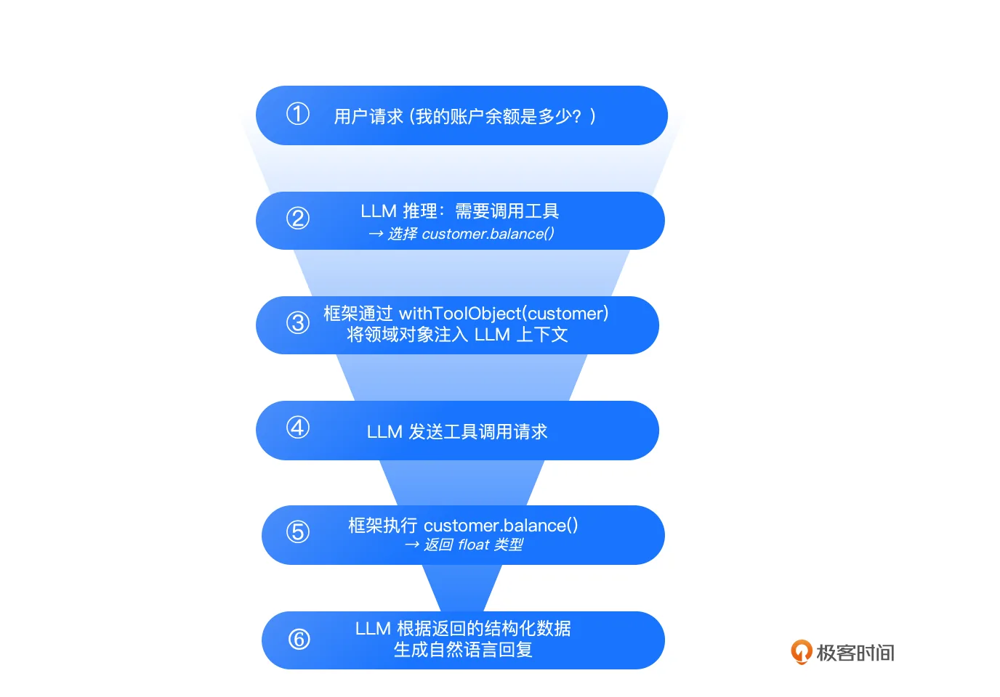
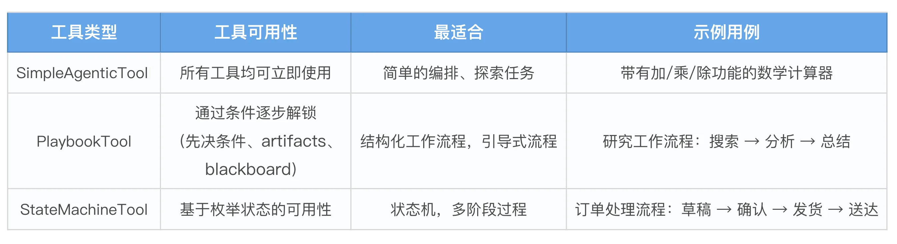
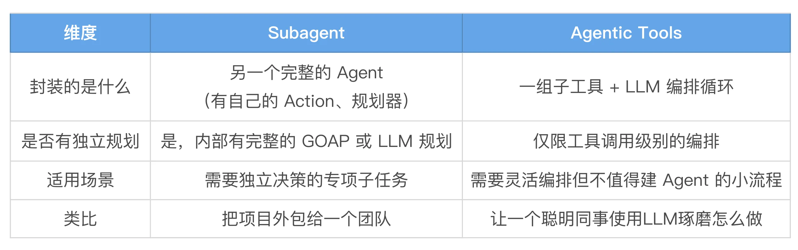
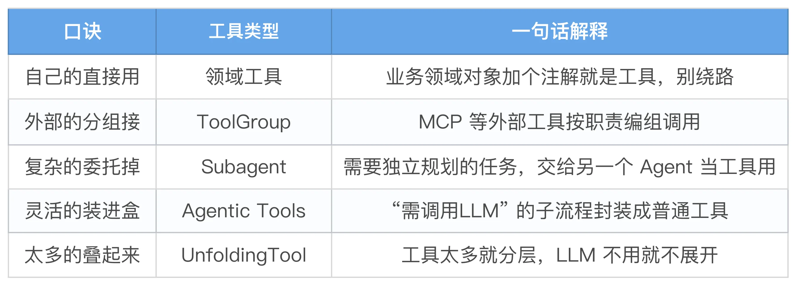
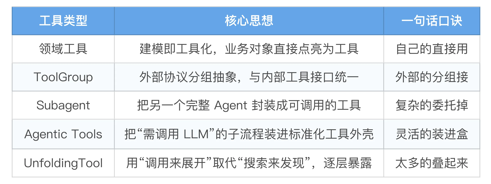

# 07｜@Tool 遇上 MCP：标准化工具接口设计
你好，我是张嘉熙。

前面几讲我们一直在讲 Embabel 如何在“内部”精确运转——领域模型定义世界，GOAP 驱动规划。但Agent，最终是要和“外部”打交道的：调 API、搜网页、发邮件等等。这就引出了几个核心问题：工具（Tool）怎么设计才能既标准化、可复用又能应对不同的场景？大量工具并存时如何进行治理？

这一讲，我们就来系统拆解 Embabel 的工具体系，用“标准化接口设计”解决工具治理的难题。

## 工具的本质：LLM 与真实世界的桥梁

在深入 Embabel 的工具机制之前，我们先退一步问一个基本问题：工具到底是什么？

LLM 本质上是一个文本预测模型，它在已知的训练数据和当前上下文中寻找最可能的输出。这让它擅长推理、写作、对话，但也带来一个原生局限：它自身不具备直接感知环境或执行动作的能力（没有眼睛和手）。它不知道今天的天气，不知道你的订单状态，算不出精确的复利，因为它只活在文本里。

而工具就是打破次元壁的关键。

简单地讲： **工具就是将文本预测变成现实行动的那个“执行器”。**

## 内部的工具怎么组织：领域工具

在讲外部工具之前，我们先回顾一下前面的课程。之前我们已经讲过，Embabel 中的工具可以直接绑定在领域对象上。我们已经看过 @Tool 注解的使用案例，事实上@Tool 来自于 Spring AI ，我们更推荐使用Embabel的原生注解 @LlmTool 。Embabel 的 @LlmTool 把领域建模和工具暴露合二为一：建模即工具化。你不只是在定义 LLM 可以调用的函数，你是在构建一个完整的业务领域模型，并把其中适合暴露给 AI 的部分通过注解“点亮”。

```plain
public record Customer(Long id, String name, float balance) {
    // 用Embabel原生注解声明一个可以暴露给LLM的工具
    @LlmTool(description = "Find the balance of a customer")
    public float balance() {
        return balance;
    }
}

```

在 Agent 的 `supportCustomer()` Action 中，代码是这么写的：

```plain
@Action
@AchievesGoal
public SupportOutput supportCustomer(SupportInput input) {
    Customer customer = customerRepository.findById(input.id())
        .orElseThrow(() -> new RuntimeException("Customer not found"));
    return context.ai()
        .withToolObject(customer)   // 将 domain 对象作为工具注入
        .createObject(/* ... */);   // LLM 在推理过程中可以随时调用 customer 上的 @LlmTool 方法
}

```

关键就在于 `withToolObject(customer)` 这一行：它告诉框架“把这个领域对象上所有带 `@LlmTool` 注解的方法，注册为 LLM 在当前会话中可调用的工具”。此后 LLM 在推理过程中，可以自动发现并选择调用 `customer.balance()`。

完整工作流如下：



这里提醒大家注意几点：

1. 在实际业务中一个常见的场景是你的领域方法已经承载了某些特定业务逻辑，它们其实就是现成的工具。这时候，直接把领域模型中的方法用 @LlmTool 暴露给LLM就好。在MCP的概念风靡之后，业界有一种不大好的趋势，即过度设计，尤其是过度使用MCP。切记， **MCP 是一种集成技术，仅在真正需要集成外部能力时才使用它**，在系统内部自己调用自己的情况下并不需要强行MCP化。

2. **暴露** `@LlmTool` **方法必须谨慎**，这是一个重要的设计原则。当你在领域对象上使用 `@LlmTool` 暴露方法时，一定要确保这些工具本身是安全的。即便是最先进的LLM也可能产生“幻觉”，它可能会调用不该调用的工具。为了最大限度降低风险，必须仔细审计所有对外暴露的领域方法，精确控制哪些领域方法对 LLM 可见，哪些保持私有。只要你不加 `@LlmTool`，LLM 就完全不知道它的存在。


## 外部的工具怎么调用：ToolGroup

在真实世界中的 Agent 往往需要调用外部服务，比如搜索引擎、工单系统、容器编排平台等等。这些外部服务可能由不同团队开发，使用不同技术栈，部署在不同的环境中。

如果每个外部服务都要写一个专用的适配器，那么工具的集成成本将是灾难性的。这就是 MCP（Model Context Protocol）要解决的问题。Embabel 引入了 ToolGroup（工具组）的概念，完全支持基于MCP的工具调用。ToolGroup 本质上是在用户意图和具体的工具选择之间建立了一种间接联系，或者说这是一种针对工具的分层抽象。

打个比方：当你想搜索网页时，你不会直接说调用 Google或调用 Brave，而是说用网页工具。这种抽象对于Java开发者来说一定非常熟悉，这正是Spring生态框架最经典的分层抽象的设计理念。

很显然，ToolGroup的设计让所有工具从“散兵游勇”变成“有编制、有职责、可替换”的模块，而不是“工具散落各处，命名冲突，无法按环境或职责动态选择”。

下面这个官方示例展示了通过Spring Bean方式创建一个使用MCP工具的ToolGroup。

```plain
@Configuration // 表明这是一个Spring配置类，用于定义Bean
public class ToolGroupsConfiguration {

    // 注入所有可用的MCP同步客户端列表
    private final List<McpSyncClient> mcpSyncClients;

    // 构造器注入MCP客户端列表
    public ToolGroupsConfiguration(List<McpSyncClient> mcpSyncClients) {
        this.mcpSyncClients = mcpSyncClients;
    }

    @Bean // 定义一个ToolGroup Bean
    public ToolGroup mcpWebToolsGroup() {
        return new McpToolGroup(
            CoreToolGroups.WEB_DESCRIPTION,          // 工具组描述，来自核心常量
            "docker-web",                            // 工具组名称
            "Docker",                                // 工具组供应商
            Set.of(ToolGroupPermission.INTERNET_ACCESS), // 访问权限
            mcpSyncClients,                          // 绑定的MCP客户端列表
            callback -> {
                // 工具过滤逻辑：只暴露特定的网络工具
                String name = callback.getToolDefinition().name();
                // 名称中包含"brave"或"fetch"，但排除brave_local_search
                return (name.contains("brave") || name.contains("fetch")) &&
                       !name.contains("brave_local_search");
            }
        );
    }
}

```

注意一点，在Embabel的设计里，认为工具的使用应该是聚焦的，有针对性的。所以 **ToolGroup必须定义在Action层级**，而不是agent层级，这是ToolGroup重要的初始设定。

## 复杂工具如何构建

刚刚我们讲的领域工具和 ToolGroup 是大多数场景的基石，但是在企业级业务场景中，有时也需要构建一些非常复杂的工具，Embabel提供了一整套复杂的标准化工具接口来应对。下面我们就来看看到底怎么使用他们。

### 把其他agent当成工具：Subagent

在设计代理系统时，我们很容易陷入一种惯性思维：把 LLM 看作中心调度器，把工具看作被动的功能片段，一个个孤立地排列在提示词里。但真实世界的任务往往不是扁平的，它们有层次，甚至需要另一个“大脑”来独立规划和执行。这就是子代理（Subagent）的用武之地：它把代理本身变成了一种工具，从而实现了决策权的层层下放。

```plain
@Action
public Concert assembleConcert(ConcertPlan plan, OperationContext context) {
    return context.ai()
        .withDefaultLlm()
        // 将子代理PerformanceFinder当做工具
        .withTool(Subagent.ofClass(PerformanceFinder.class)
        // 提供WorksToFind输入以委托性能搜索任务
                .consuming(WorksToFind.class))
        .creating(Concert.class)
        .fromPrompt("Assemble a concert based on: " + plan);
}

```

### 协调其他工具的工具：Agentic Tools

想象一下你给同事安排任务，如果任务是“把这份数据导入数据库”，你直接告诉他步骤，这叫确定性逻辑。但如果任务是“帮我调研一下竞品的最新动态”，你只会给目标和范围，具体怎么做、先查哪个后看哪个，由他自己决定。这就是代理工具的本质。

在 Embabel 中，代理工具就是把一段需要“自己看着办”的子流程，封装成一个看起来普普通通的工具。外部 LLM 只看到“这是一个能做某事的工具”，完全不知道里面还藏着一个独立的LLM 在调度。

你可能会想：“那就让 LLM 自由调度呗”。问题在于，完全的自由等于完全的不可靠。Embabel 给了你三个梯度的控制手段：



SimpleAgenticTool 是最自由的，把所有子工具一股脑丢给 LLM，它自己琢磨怎么用。适合探索性任务，比如“帮我查点东西，可能要搜索、可能要计算、可能要格式化”。优点是实现快，缺点是结果不可控，LLM 可能走弯路。

PlaybookTool 给了你“先决条件”这个武器。你不再是“全给你，你看着用”，而是“先用 A，A 用完了 B 才能解锁”。这就像一个引导式的研究流程：先搜索 → 搜索完了才能分析 → 分析完了才能总结。LLM 依然有自主权，但路径被你引导着，不会跑偏。

StateMachineTool 是最严格的，它用枚举定义状态，每个状态里只有特定的工具可用，某些工具调用后会触发状态转移。比如订单处理：草稿状态只能加商品和确认，确认后进入已确认状态才能发货。这适合有明确阶段划分的业务流程，LLM 的角色从“决策者”变成了“状态内的执行者”。

选择哪种，取决于你的流程“确定性”有多高。 **越确定的流程，越应该用更强的约束来保证结果。** 注意：对于具有明确输出、分支逻辑、循环或状态管理的复杂工作流，请改用 Embabel 的GOAP 规划器（06讲）、Utility AI（09讲）或状态机。这些提供确定性、类型安全的规划，比 LLM 驱动的编排更强大、更可预测。

总结一句话：Agentic Tools是把“需要思考”的子任务封装成“看起来不需要思考”的普通工具。但这种封装本身需要你深思熟虑，选对控制力度，才能在灵活性和可靠性之间找到平衡点。

### Subagent vs Agentic Tools



## 海量工具如何应对：UnfoldingTool

你肯定见过这种应用：刚打开，满屏的按钮、菜单、工具栏，让人不知道该点哪里。好产品会做减法，首页只放最核心的几个入口，点进去才逐步展开更多功能。LLM 面对工具时也是一样。Embabel 的 UnfoldingTool 的逻辑很简单：给工具包一个“包装纸”，LLM 先看到包装纸上的概要说明，只有它决定“我要用这个”时，才撕开包装纸，里面的下一层工具才暴露出来。

**UnfoldingTool用“调用来展开”取代“搜索来发现”。** 其他绝大多数框架都在 LLM 调用之前，通过各种手段搜索筛选该展示哪些工具。

比如 Anthropic 用专门的工具搜索工具，LangGraph 用向量语义检索，LangChain4j 用消息内容预过滤。这些方案有一个共同前提——在 LLM 调用之前，先帮它筛选一轮。

这听起来合理，但有三个硬伤：

- 搜不准：语义搜索的结果依赖参数阈值调整，调高了漏工具，调低了多冗余。

- 额外成本：你需要嵌入模型、向量数据库，甚至多一次 LLM 调用来筛选，这些都是算力和维护开销。

- 静态限制：搜索只能返回已经存在的工具，无法根据运行时参数“当场造一个”。


而 UnfoldingTool 彻底颠覆了这个逻辑， **它只在 LLM 明确说“我要做这个”的时候，才展开对应的工具集**。注意，这是Embabel的另一个独特之处。

### 一个最简单的例子：数据库操作

假设你有三个数据库工具：查询、插入、删除。传统做法是把它们三个全部注册进去。UnfoldingTool 的做法是把它们打包成一个：

```plain
// 创建 UnfoldingTool facade
var databaseTool = UnfoldingTool.of(
    "database_operations",
    "Use this tool to work with the database. Invoke to see specific operations.",
    List.of(queryTool, insertTool, deleteTool)
);

```

LLM 一开始只看到 database\_operations 这一个工具，描述已经告诉它“里面是数据库相关操作”。当用户说“帮我查一下订单表”，LLM 自然会调用它，然后 queryTool、insertTool、deleteTool 才全部亮相。这时候 LLM 已经明确了意图，不会被无关工具干扰。

### 进阶一：按类别选择——让 LLM 自己说“我要哪类”

如果你的工具天然分属不同类别，比如文件操作有“读”和“写”两大类，你甚至不需要让 LLM 一次看到所有子工具。用 byCategory 让它先选类别：

```plain
Map<String, List<Tool>> toolsByCategory = Map.of(
    "read", List.of(readFileTool, listDirectoryTool),
    "write", List.of(writeFileTool, deleteFileTool)
);

var fileTool = UnfoldingTool.byCategory(
    "file_operations",
    "文件操作。请传入 category 参数：'read' 用于读取，'write' 用于修改。",
    toolsByCategory
);

```

LLM 调用时传入 `{"category": "read"}`，就只看到读取类工具；传入 write，就只看到写入类工具。这相当于 LLM 带着“我要具体干什么”的声明来打开工具包，而你按它的声明精准供给。

### 进阶二：动态创建工具——根据参数当场“造”一个

这是 UnfoldingTool 最颠覆性的能力（绝招中的绝招），也是其他框架的搜索筛选方案都做不到的。用 selectable，你可以在 LLM 调用外观工具时，根据它传入的参数，动态生成一套全新的工具实例。

举个例子：一个多租户数据库工具。不同租户连不同的数据库，你不可能为每个租户预先注册一套工具。但用 selectable，你可以在 LLM 指定数据库连接串的那一刻，当场创建出绑定了该连接串的工具：

```plain
var databaseTool = UnfoldingTool.selectable(
    "database",
    "数据库操作。传入 connection 参数指定目标数据库。",
    Collections.emptyList(),
    Tool.InputSchema.of(
        Tool.Parameter.string("connection", "数据库连接串")
    ),
    true,
    input -> {
        String connection = parseConnection(input);
        // 这里的工具连接串已经被“捕获”进去了
        return List.of(
            Tool.create("query", "在 " + connection + " 上执行查询", ...),
            Tool.create("insert", "向 " + connection + " 插入数据", ...)
        );
    }
);

```

当 LLM 调用时传入 `{"connection": "prod-db"}`，返回的 query 和 insert 工具就已经绑定了生产库；传入 dev-db，则是另一套指向开发库的工具。 **工具可以不是预先存在的，可以是响应 LLM 的意图被创造出来的，这就是“通过调用来展开”的真正威力。**

### 进阶三：嵌套——把复杂性装进多层级抽屉

当工具有几十上百个时，单层分组可能不够用。UnfoldingTool 支持任意层级的嵌套——把一个展开工具放到另一个展开工具里面，形成一棵工具树：

```plain
// 内层：用户管理
var userManagement = UnfoldingTool.of("user_management", "用户管理操作",
    List.of(createUserTool, deleteUserTool));

// 内层：系统配置
var systemConfig = UnfoldingTool.of("system_config", "系统配置操作",
    List.of(backupTool, restoreTool));

// 外层：管理面板
var adminTool = UnfoldingTool.of("admin_operations", "管理操作。调用以查看可用模块。",
    List.of(userManagement, systemConfig));

```

LLM 的体验就像浏览一个菜单：先看到“管理操作”，点进去看到“用户管理”和“系统配置”，再点进去才能看到具体的工具。这种层级导航极大降低了查找开销，多数场景下，LLM 只需要两三次调用就能精准到达。

### 什么时候用 UnfoldingTool？

不是所有工具都需要打包。一个简单的判断标准：当工具数量让 LLM 的“注意力”开始分散时，就是引入展开工具的时候。具体场景包括：

- 工具超过 10 个，且明显分属不同领域（数据库、文件、网络……）

- 某些工具只在特定场景下才需要（比如管理后台工具，普通对话不需要看到）

- 工具需要根据运行时参数动态配置（多租户、多环境）


如果你的工具只有三五个，直接注册反而更简单。记住，UnfoldingTool 解决的是“太多了怎么办”，而不是“所有工具都应该包起来”。 **避免过度设计的原则在这里同样适用：从扁平开始，复杂度够高时再引入层次。**

总之，让工具像 App 的菜单一样组织。用户不点，就不展开；点了什么，就精准呈现什么。这比任何“猜你想要什么”的搜索方案都更简单、更准确、也更便宜。

## 快速决策表：如何选择Embabel工具类型？



## 本讲小结

恭喜你，完成了 Embabel 工具体系的全景穿越。你不再只是会写一个领域工具方法的开发者，而是掌握了从内部到外部、从简单到复杂、从少量到海量的完整工具治理框架。这份能力地图，会成为你构建企业级 Agent 的核心底气。



记住这条设计金线： **接口要标准化，选择要场景化，复杂要分层化，过度设计要勇于说“不”。**

现在，你的 Agent 已经能说会干了——但它还缺少一个关键能力：拥有实时、准确的外部知识。下一讲，我们将把 RAG 集成进来，让 Embabel 的 Agent 既能调用工具执行动作，又能从海量文档中即时汲取知识，真正实现“知行合一”。

## 思考题

1. 领域工具设计

假设你正在构建一个“智能订单管理”Agent，请用 Java 设计一个 Order 领域对象，包含 id、status、totalAmount 和 items 字段，并至少暴露两个 @LlmTool 方法（例如 canCancel() 和 calculateShipping()）。请说明：你选择暴露这两个方法而非其他方法的设计考量是什么？如果 Order 上还有一个 applyDiscount() 方法，你会选择暴露它吗？为什么？

2. Subagent vs Agentic Tools 选择

你正在构建一个“旅行规划”Agent，需要实现“根据目的地推荐行程安排”的功能。这个子任务需要先搜索景点、再根据季节筛选、最后组合成一日游或多日游方案。你会选择用 Subagent 还是 Agentic Tools 来实现？请说明你的决策依据，并写出核心代码骨架。

欢迎你把你的设计分享到留言区，如果你觉得这节课的内容对你有帮助，也欢迎你分享给其他朋友，我们下节课再见！