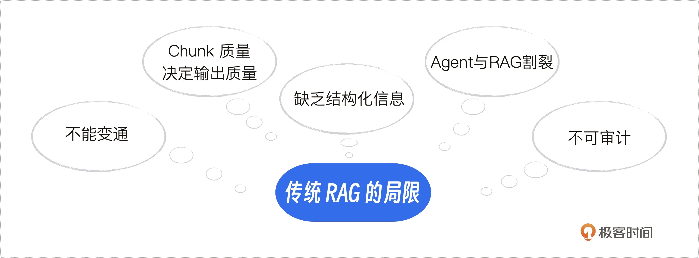
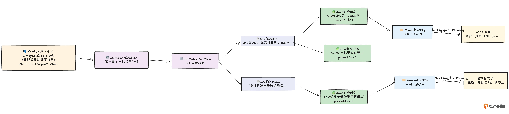
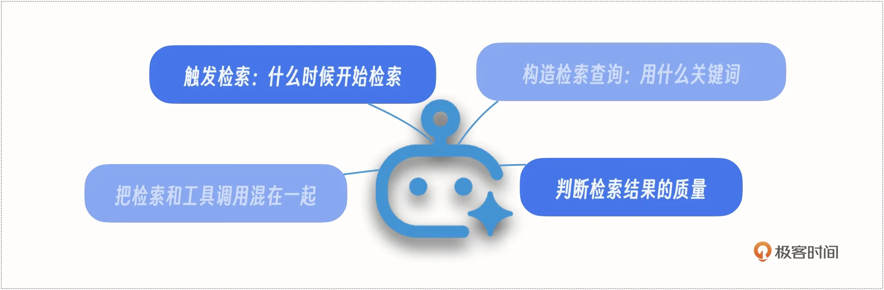
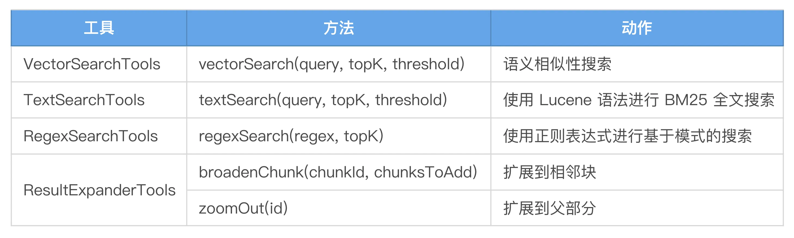

# 08｜Embabel 与 RAG 集成：让 Agent 真正“读懂”你的私有知识
你好，我是张嘉熙。

我们都知道，LLM的训练数据有特定范围，有截止日期，它不知道你的公司内部的产品文档、请假政策和今天刚刚发布的行业报告。RAG（Retrieval-Augmented Generation）就是为了解决这个问题而诞生的，它让LLM在回答问题之前，先去外部知识库中检索相关信息，用检索结果增强提示词，从而给出准确、有据可查的回答。

但传统RAG有一个根本问题，它的检索过程是一个硬编码的线性Pipeline：用户提问 → 向量检索 → 拼接提示词 → LLM回答。这种“一问一答”的模式在面对复杂问题时往往力不从心，它不知道什么时候该多搜几次，也不知道怎么主动调整搜索策略。

这就是Embabel引入Agentic RAG的原因。Embabel的RAG实现，不是简单地在外面挂一个向量数据库，而是让LLM掌控检索过程：自主决定什么时候搜索、用什么搜索、以及如何利用搜索结果。这一讲我们就来深入拆解Embabel的RAG集成方式。

## 传统RAG的局限：Pipeline式检索

LlamaIndex是传统RAG范式的典型代表，它是一个数据优先的框架，专门为Pipeline式的检索模式设计。工作流程非常直观：

```plain
用户提问 → 向量数据库检索相似chunk → 将chunk拼入提示词 → LLM生成回答

```

举个例子：用户问“退货政策是什么？”，系统在FAQ知识库中找到最相似的几条记录，塞进提示词，LLM据此回答。如果知识库里确实有准确的答案，这种模式效果不错——简单、直接、低成本。

但随着Agent应用场景从“简单问答”走向“复杂业务决策”，传统RAG的Pipeline检索模式开始暴露根本性问题：



其一，流程僵化、不知变通，请求仅触发一次检索且无纠错机制，答案质量完全押注在“单发”检索的运气上。

其二，输出质量高度受制于分块与上下文扩展策略，需针对每个数据集精细调优，且内容结构一旦变化策略就容易失效。

其三，返回的是文本碎片而非结构化实体，难以回答“某客户最近三笔订单”这类业务问题。

其四，LLM与RAG深度割裂，RAG只作为外部组件被动响应，既无法根据检索结果调整后续动作，也感知不到LLM的执行上下文。

其五，全链路不可审计，回答出错时很难区分是检索未命中关键块，还是大模型理解有偏差，整个Pipeline如同黑箱。

要解决上面这些问题，我们从两个方面入手，一个是 **优化知识构建过程**；另一个是 **重构RAG的检索过程**，从Pipeline式检索升级到智能化代理化的检索。下面我们分别来看。

## 知识构建：内容模型与Ingestion机制

很多 RAG 系统对数据摄入（Ingestion）的理解非常简单粗暴：把文档切成大小差不多的文本块（Chunk），给每个块算个向量，存进向量数据库，完事。这就像把一本书撕成纸屑，然后期望每次提问（相似度搜索）都能恰好捡起对的那一片——运气好的时候还行，运气不好就抓瞎。知识本身是有结构的，为什么存进 RAG 之后就变成了一地碎片？

Embabel 设计了一套超越平面存储的分层内容模型，以及一套将原始文档“翻译”成这套模型的摄入机制。前者定义了知识的理想形态，后者铺设了通往这种形态的工程路径，两者实际上是一体两面。

### 一张图看懂分层内容模型

Embabel 的内容模型做了特别的设计：不仅仅构建了可供向量检索的神经末梢（Chunk），还构建了多层次的文档骨骼结构，让向量搜索和结构导航完美联动。

为了便于理解，我们适当简化了Embabel的内容模型（ [原内容模型](https://docs.embabel.com/embabel-agent/guide/0.3.5/#our-model)），如下所示。



这张图里有三条信息流，恰好对应 Embabel Agent 分层模型的核心设计：

**左侧的文档骨骼**：从 NavigableDocument 到 ContainerSection 再到 LeafSection，严格保持了文档的原始层级。这不是装饰，而是让 LLM 能够准确“翻到第三章、找到3.1节、查看那两段文字”。

**中间的检索神经**：每个 LeafSection 的真实文本被切割成若干 Chunk。每个 Chunk 都能通过 parentId 锚定回它对应的LeafSection。于是，向量搜索定位到某个 Chunk 时，系统瞬间就能知道它属于哪份文档、哪一章、哪一节，并可以通过 pathFromRoot 算出完整路径。

**右侧的知识节点**：从 Chunk 中提炼出的 NamedEntity，不再是散落的关键词，而是有类型契约的领域对象（如“公司”、“项目”）。通过 toTypedInstance() 实例化，它们可以直接变成包含业务属性的实例，供 LLM 进行结构化推理。我们可以猜到，我们甚至还可以构建出实体之间的依赖关系图。

表面上这张图只是一个静态的数据模型，但它实际上为 RAG 的动态探索预埋了三条“跑道”：

- **纵深跑道**：Chunk → LeafSection → ContainerSection → NavigableDocument，支持从细节到全局的关联。

- **横向跑道**：同一 ContainerSection 下的多个 LeafSection 和它们的 Chunk，支持相邻内容的横向关联。

- **跳跃跑道**：NamedEntity 之间隐含的关系（如“公司”与“项目”的申请关系），支持从一块内容跳到另一块看似不相关但实体相连的内容，拼出隐藏的逻辑链。


正是这些预埋的“跑道”，让后续的 Agentic RAG 能够像侦探一样，在知识库中自由穿行、主动追问，而不是只能做一次性相似度搜索。

### Ingestion机制

Ingestion（数据摄入）不是搬运，而是对知识的结构化翻译。翻译的质量，决定了后续所有检索和生成的天花板。Embabel提供了一条精密的Pipeline（与检索不同，对于Ingestion这种步骤确定的批处理逻辑来说，Pipeline仍然是需要的）来处理数据摄入。

1. **结构化“拆开”文档**

Embabel 选择了 Apache Tika 来解析文档，但它用的不是普通的“提取所有文字”模式，而是 TikaHierarchicalContentReader。这个选择极为关键。

普通的 Tika 用法只是把 PDF 或 Word 文档转成一大段连续文本，原本的标题、段落、列表结构全部丢失。TikaHierarchicalContentReader 做的事情则精细得多： **它试图还原文档的层级结构**——哪部分是标题，哪部分是章节，哪部分是正文段落。

注意，拆分到Chunk层级时，每个 Chunk 都牢牢携带 parentId，直指生出它的 LeafSection。于是，沿 pathFromRoot 可以随时还原出完整的文档路径——“报告 → 第三章 → 3.1 节 → 这段文字”。这就像给每一张便签纸条都写上了它所属的书名、章、节和页码。

这里直接呼应了上文中我们讨论的“分层知识模型”。你喂进去的不再是一堆无序的文字碎片，而是一棵有组织、可导航的文档树。有了这棵树，LLM 才能在后续进行各种高级操作。解析阶段多保留一分结构，检索阶段可能就多三分精准。

2. **给 Chunk 注入“场景记忆”**

把长文档切成小块（Chunking）是 RAG 的常规操作。但大多数系统只关注“切多大、重叠多少”这两个参数。Embabel 的点睛之笔在于 **ChunkTransformer**——在分块之后、存储之前，给每个块注入“出身信息”。

[官方文档](https://docs.embabel.com/embabel-agent/guide/0.3.5/#addtitleschunktransformer) 中举了一个很精妙的例子。一个数据块里写着：

```plain
与基准相比，该方法可将性能提高 40%。

```

如果这就是你存进向量库的全部内容，那这个块基本是废的。没人知道“该方法”指什么，“基准”是什么。

Embabel默认的 **AddTitlesChunkTransformer** 解决了这个问题。它会自动把这个块变成：

```plain
标题：性能优化指南
# URI：https://docs.example.com/performance
# 章节：缓存策略

与基准相比，该方法可将性能提高 40%。

```

这一步，把“死块”变成了“活块”。它本质上是在做一种无损的元数据注入：把原本属于父节点（标题、URI、章节名）的信息，“遗传”给了每个子节点（Chunk）。当你对“缓存策略”做语义搜索时，这个富含上下文的块更容易被命中；当 LLM 读到这个块时，它不用猜测背景，直接就能理解含义。

更妙的是，在需要的时候（多数场景用AddTitlesChunkTransformer就够了），你还可以链式组装多个 Transformer，流水线式给数据块添加业务元数据，如文档类型、所属部门、安全级别。这已经超出了简单的“数据准备”，上升到了数据治理的层面。

## 侦探式推理：Agentic RAG

Agentic RAG的核心理念非常简洁：好比一个手拿放大镜（工具）、能自由穿梭于图书馆的侦探（LLM）。它不相信“一次检索就能命中答案”，而是坚信：好的答案源于迭代、探索和上下文追溯。在Embabel的设计中，原生支持Agentic RAG, 使得LLM能够完全自主地控制文档检索过程，而不是将检索视为一个僵化的处理步骤。

这意味着什么？



- **LLM自主决定什么时候检索**，不是每个问题都要检索。简单问题LLM自己就会回答，只有遇到不确定的内容才触发检索。

- **LLM自主构造检索查询**，不是把用户的原始问题直接丢给向量数据库，而是思考“我应该搜什么关键词才能找到最相关的信息”。

- **LLM自主判断检索结果够不够用**，如果第一次检索不满意，换一个查询再搜；如果结果很好，直接进入下一步。

- **LLM可以把检索和工具调用混在一起**，先检索文档，发现需要查数据库验证，再去调数据库工具，交叉验证后才生成最终回答。


### Embabel Agentic RAG的完整执行流程

Embabel Agentic RAG的执行流程如下：

```plain
用户提问 ("Embabel的GOAP规划器是怎么工作的？")
    ↓
LLM推理：这个问题需要检索知识库 → 决定启动检索
    ↓
工具调用：sources_vectorSearch({"query":"GOAP goal oriented action planning","topK":10})
    ↓
框架执行：LuceneSearchOperations执行向量搜索 → 返回相关chunks
    ↓
LLM评估：检索结果质量不错，但还需要更精确 → 构造更具体的查询
    ↓
工具调用：sources_textSearch({"query":"\"GOAP\" AND (planner OR planning) AND deterministic","topK":20})
    ↓
框架执行：LuceneSearchOperations执行全文搜索 → 返回精确匹配的chunks
    ↓
LLM评估：现在信息充足 → 综合多次检索结果，生成最终回答
    ↓
返回给用户

```

我们可以看到，Embabel Agentic RAG 先执行了一次向量搜索，然后根据结果“微调查询”，又执行了一次全文搜索，这次还使用了AND和OR布尔操作符来精确锁定内容。

而Embabel的 [系统提示词](https://github.com/embabel/embabel-agent/blob/4b79b884d83ce612e916773e48c2d207d16d2b54/embabel-agent-rag/embabel-agent-rag-core/src/main/kotlin/com/embabel/agent/rag/tools/ToolishRag.kt#L260) 中明确告诉LLM：“继续搜索直到问题被回答，或者你不得不放弃。要富有创意，尝试不同类型的查询。要彻底，尝试不同的方法。如果实在没有用，请报告说找不到答案”。

这就是Agentic RAG与传统RAG的本质区别：不是“一个请求一个回答”，而是 **完全基于LLM和工具的“侦探式探索”，LLM 对检索过程拥有完全控制权。**

### ToolishRag：RAG工具的统一外观

要实现“侦探式探索”，关键在于一个叫做 ToolishRag 的类。这个类里包含了下面即将讲到的SearchOperations，并将它们打包成LLM工具。这一点其实可以从 ToolishRag 这个名字猜出来——Toolish 意为基于工具的。

你可以看一下ToolishRag公开给LLM的工具。



ToolishRag 自身就是一个用于工具暴露的外观（Facade），它能对外提供一致的接口（Facade设计模式）。下面我们看看这个 [官方示例](https://docs.embabel.com/embabel-agent/guide/0.3.5/#step-1-create-action-methods) 中的片段，了解 ToolishRag 的使用。

```plain
/**
 * 响应用户消息的动作。
 * canRerun = true 表示该动作可被重复执行（如因重新规划等原因再次调用），
 * trigger = UserMessage.class 表示当工作内存中出现 UserMessage 类型的事实时触发此动作。
 */
@Action(canRerun = true, trigger = UserMessage.class)
void respond(Conversation conversation, ActionContext context) {
    // 通过上下文获取 AI 接口，构建包含工具、系统提示的对话请求，并生成助手消息
    var assistantMessage = context.ai()
            // 指定使用 properties 中配置的聊天语言模型
            .withLlm(properties.chatLlm())
            // 请注意此处：将 toolishRag 作为 LlmReference 注入，使 LLM 可以访问 RAG 工具和相关提示
            .withReference(toolishRag)
            // 使用 "ragbot" 渲染器对最终回复进行格式化（如 Markdown 渲染、资产链接处理等）
            .rendering("ragbot")
            // 基于当前会话和系统提示模板生成回复，同时将 properties 作为模板变量传入
            .respondWithSystemPrompt(conversation, Map.of(
                    "properties", properties
            ));
    // 将生成的助手消息添加到会话历史中，并通过上下文的消息通道发送给用户
    context.sendMessage(conversation.addMessage(assistantMessage));
}

```

### SearchOperations：搜索功能的标签接口

SearchOperations是搜索功能的最外层的标签接口，它将底层存储机制进行了统一抽象，具体实现会根据自身功能实现它下面的一个或多个子接口。这种设计使得每种搜索功能只需专注实现自己的专属能力，比如对向量数据库进行相似度搜索，对Lucene进行文本检索等。

举个例子，对于向量搜索，就存在一个实现了SearchOperations接口的VectorSearch子接口。

```plain
public interface VectorSearch extends SearchOperations {
    <T extends Retrievable> List<SimilarityResult<T>> vectorSearch(
        TextSimilaritySearchRequest request,
        Class<T> clazz
    );
}

```

而在VectorSearch子接口下面，我们又能看到一个SpringVectorStoreVectorSearch类。

```plain
/**
 * 实现 {@link VectorSearch} 接口，适配 Spring AI 的 {@link VectorStore}，
 * 使 Embabel 可以无缝对接任何 Spring AI 支持的向量数据库。
 */
public class SpringVectorStoreVectorSearch implements VectorSearch {

    // 被适配的 Spring AI 向量存储实例
    private final VectorStore vectorStore;

    /**
     * 构造注入，接收 Spring AI 的 VectorStore 实现。
     * @param vectorStore 具体的向量存储实例（如 Pinecone、Weaviate、pgvector 等）
     */
    public SpringVectorStoreVectorSearch(VectorStore vectorStore) {
        this.vectorStore = vectorStore;
    }

    /**
     * 执行向量相似度搜索，并返回匹配的相似度结果列表。
     *
     * @param request 搜索请求，包含查询文本、相似度阈值、返回数量等参数
     * @param clazz   结果对象的目标类型，需实现 {@link Retrievable}
     * @param <T>     结果类型泛型
     * @return 按相似度排序的结果列表
     */
    @Override
    public <T extends Retrievable> List<SimilarityResult<T>> vectorSearch(
            TextSimilaritySearchRequest request,
            Class<T> clazz) {

        // 将 Embabel 的搜索请求转换为 Spring AI 的 SearchRequest
        SearchRequest searchRequest = SearchRequest
            .builder()
            .query(request.getQuery())                          // 查询文本
            .similarityThreshold(request.getSimilarityThreshold()) // 相似度阈值
            .topK(request.getTopK())                            // 返回结果数量
            .build();

        // 调用底层 VectorStore 执行相似度搜索，得到 Spring AI 的 Document 列表
        List<Document> results = vectorStore.similaritySearch(searchRequest);

        // 将 Document 列表转换为 Embabel 的 SimilarityResult 列表（省略具体转换逻辑）
        // ... convert results
    }
}

```

看到这里，你是否有似曾相识之感。我们在 [04 讲](https://time.geekbang.org/column/article/979287) 介绍Embabel和Spring AI的依赖关系时，代码示例就是通过直接调用Spring AI中的VectorStore来处理向量存储，和这里的逻辑其实是一样的。正如我们现在看到的，Embabel已经统一封装好了这些底层搜索逻辑，在绝大多数时候其实并不需要直接调用Spring AI，直接用Embabel中的封装好的更高层次抽象就好，比如VectorSearch。

我们继续往下层来看，Embabel的RAG存储层也是可插拔的，目前主要支持以下几种存储。

- Lucene：本地高性能全文与向量搜索

- Neo4j：图数据库驱动的 RAG

- PostgreSQL + pgvector：关系型数据库中的混合搜索

- Spring AI VectorStore 适配器：你可以接入 Pinecone、Weaviate、Milvus、Chroma、Redis、MongoDB Atlas 等数十种向量数据库


如果这些还不能满足你的需求，Embabel还支持我们实现自己的RAG存储。比如你们公司在用某种上面没提到的向量数据库，那你可以自己实现VectorSearch这个子接口进行自定义拓展。

## 本讲小结

这一讲，我们看穿了传统RAG的致命软肋，一次性检索、碎片化存储、LLM与知识库割裂。同时，一步步重建整个范式。

你建造了一座结构化的知识库，而不是满地纸屑。通过分层内容模型，你让文档保留了骨骼（章节层级）和神经末梢（Chunk），并给每一个“Chunk”都打上了出身的烙印。Ingestion不再是粗糙的搬运，而是一条精密的Pipeline：拆骨骼、切神经、注入场景记忆。

你赋予LLM侦探般的自主权。它不再被动接受一次检索的结果，而是自己决定何时搜、搜什么、搜得够不够。向量搜索、全文检索、正则匹配、上下文扩展，这些工具任由LLM在探索中自由组合，反复追问，直到拼出完整的证据链。

你拥有了一套可插拔、可扩展的搜索军火库。ToolishRag 把一切复杂性封装成统一的工具外观，SearchOperations 让你的存储层随意切换：Lucene、Neo4j、pgvector，或者通过Spring AI接入任何你想要的向量数据库。

我们把企业知识真正变成了可推理、追溯、交叉验证的活的记忆，具备了用Embabel构建生产级Agentic RAG系统的核心能力。下一讲，我们将学习核心篇的最后一个核心知识点，全面深入了解 Embabel 的规划器生态。

## 思考题

1. Embabel的分层内容模型为文档保留了“骨骼”，又为Chunk注入了“场景记忆”。请设想一个需要跨章节推理的问题（如“对比第三章和第五章的实验结论”），描述LLM如何利用parentId、pathFromRoot和AddTitlesChunkTransformer注入的上下文，一步步完成检索和推理。如果去掉这些设计，RAG检索会退化到哪里？

2. 阅读Embabel agent源码（0.3.5版本），深入分析SearchOperations接口及其底层实现，画出完整的依赖关系图，思考一下SearchOperations底层都有哪些子接口，哪些实现类，他们分别都是做什么的，如果要你来设计SearchOperations接口的底层实现，你会怎么做。


欢迎你把你的设计分享到留言区，也欢迎你把这节课的内容分享给需要的朋友，我们下节课再见！