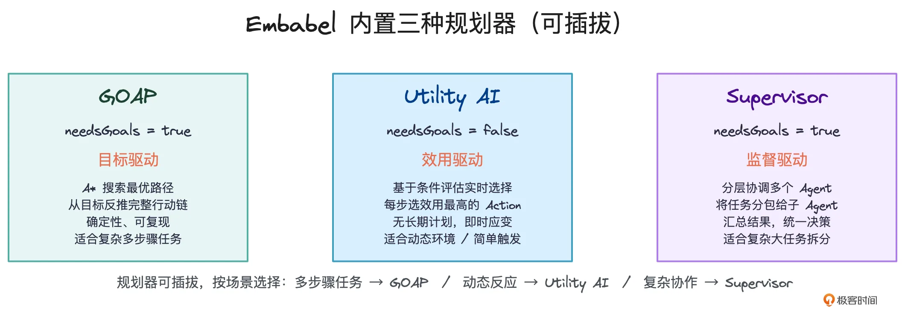
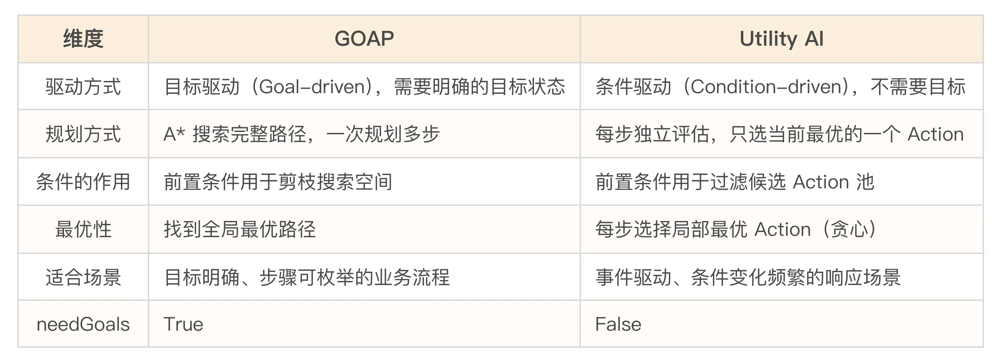
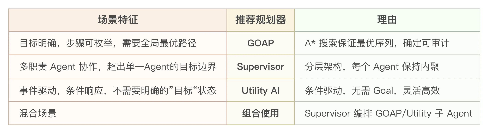

# 09｜其他规划策略：Utility AI 和 Supervisor
你好，我是张嘉熙。

在 [06 讲](https://time.geekbang.org/column/article/980824) 我们花了大量篇幅拆解 GOAP——Embabel 的默认规划器，以及它如何用确定性 A\* 搜索在复杂业务场景中吊打 ReAct。但在结尾处，我留了一个钩子：Embabel 的 Plan 组件是可插拔的，除了 GOAP，框架还内置了另外两种规划器：Utility AI 和 Supervisor。

这不是备胎，不是“顺便支持一下”。恰恰相反，这三种规划器共同构成了 Embabel 在规划层的完整设计哲学：不是所有任务都需要目标导向，也不是所有复杂度都能被一个单体 Agent 消化。 不同的任务形态，需要不同的规划策略。GOAP 是默认的最优解，但不是万能的唯一解。

本讲，我们就来拆解这两个“非默认”规划器：它们分别解决什么问题、怎么工作、什么时候该用。看完你会理解，为什么说 Embabel 的规划器生态不是三选一的单选题，而是一套可以按需组合的武器库。

## 三种规划器，一张全景图

在深入细节之前，先把三种规划器放在一张全景图中俯瞰：



Embabel 对这三种规划器有明确的定义和分类。注意，一个隐秘但极其关键的信息是 `needsGoals` 这个布尔参数，它直接暴露了 Utility AI 和其他两种规划器在设计哲学上的根本分岔：

- GOAP 和 Supervisor 需要 Goal，它们依赖于一个明确的目标作为规划的“北极星”。没有目标，A\* 搜索不知道该往哪个状态走，Supervisor 不知道该把任务分包给哪个子 Agent。

- Utility AI 不需要 Goal，它不问“我要达成什么”，只问“现在什么最重要”。这是一种从“目标驱动”到“条件驱动”的根本性转变，意味着 Utility AI 的工作方式与 GOAP 有本质不同，它不构建完整的多步骤计划，而是在每个决策点选择效用最高的单个 Action 执行。


三者共同实现了一个设计主张： **规划是独立层，算法可按场景切换**。

## Utility AI：从“达成什么”到“现在什么最重要”

GOAP 的工作原理建立在一个隐含假设上： **你知道目标是什么。** 部署的目标是把应用推到生产环境，退款的目标是完成退款流程并通知客户结果，这些目标的终点状态是清晰的、可枚举的。

但很多企业场景中，“目标状态”这个概念本身就不适用。考虑下面这个场景：你是一个云基础设施监控 Agent。某个深夜，系统突然报告了一组事件：CPU 使用率飙升、磁盘 I/O 异常、某个服务节点响应超时、错误日志中出现 OOM 关键词。

作为 Agent，你的“目标”是什么？你没有一个叫 “incident\_resolved” 的终点状态。因为事态随时可能在恶化，你不知道下一步会发生什么。你需要的不是“朝一个目标走”，而是根据当前条件的紧迫性，动态决定现在该采取什么行动：

- 如果 CPU 飙升且伴随 OOM，那就先重启受影响的服务节点，这是最紧急的；

- 如果是内存缓慢升高但服务仍正常运行，那就先拉日志分析，还不需要跳起来；

- 如果多个条件同时为真，那就判断哪一个行动的“效用”最高。


这种场景，GOAP 就显得力不从心了。你不是在寻找一条从 A 到 B 的最优路径，而是在一个开放的问题空间中，根据实时条件做连续判断。这就是 Utility AI 的主场。

### Utility AI 的核心思想

Utility AI 同样起源于游戏工业。它与 GOAP 的分工很清晰：GOAP 解决的是 “如何选择一串有序的动作来达成某个目标”（例如：先开门，再进门，最后关门）；而 Utility AI 解决的是 “在多个互不依赖的选项中，选出当前最合理的那一个”。举个例子：一个游戏角色同时面临“血量低需要治疗”“敌人在附近需要战斗”“弹药不足需要补给”。这三个选项没有固定的先后顺序，角色必须根据当前的紧急程度，挑出一个“效用最高”的动作来执行。

Embabel 直接支持 Utility AI。它与 GOAP 共享同一个 @Action 池，你可以在 Agent 上切换规划器类型，Action逻辑一行都不用改。两者的区别主要体现在以下两点：

**第一，条件的处理方式不同。**

GOAP 依赖硬性的前置/后置条件（pre / post）。条件不满足，动作就被剪掉不可用。而 Utility AI 不依赖硬性条件，它为每个动作计算一个动态的效用分数（比如 0.8、0.3），条件不再是是非门槛，而是转化为柔性权重——影响分数，但不一刀切。

**第二，驱动逻辑的根本差异，这是两者最本质的区别。**

GOAP 需要明确的目标（needsGoals = true），它关心“我要去哪里”，然后规划出一条从当前状态到目标状态的行动路径。这种逻辑本质上是“串行依赖”——就像做菜：必须先洗菜，再切菜，最后炒菜，顺序错了就做不成。适合目标明确、步骤环环相扣的任务。

而 Utility AI 不需要目标（needsGoals = false）。它不问长远方向，只关心当下“现在哪件事对我最划算”。这种逻辑本质上是“并行择优”——就像选餐厅：A 餐厅评分 4.9，B 餐厅评分 4.2，选 A，不关心顺序，只关心谁的分数高。适合多条件并发、需要实时响应的场景。

> 总结一句话：GOAP 问“我要怎么一步步到达目的地”，Utility AI 问“此时此刻，迈哪只脚最舒服”。

### 在 Embabel 中，Utility AI 如何工作？

我们来看一下 Embabel官方文档中的 [TicketTriageAgent 示例](https://docs.embabel.com/embabel-agent/guide/0.3.5/#reference.planners__utility)。

```plain
@Agent(
    description = "Triage and process support tickets",  // 工单分类与处理
    planner = PlannerType.UTILITY                         // 使用效用驱动的规划器
)
public class TicketTriageAgent {

    // 领域对象：工单
    public record Ticket(String id, String description, String customerId) {}
    // 领域对象：处理完成的工单
    public record ResolvedTicket(String id, String resolution, String handledBy) {}

    // 接口：工单分类的三种状态
    @State
    public sealed interface TicketCategory permits CriticalTicket, BugTicket, GeneralTicket {}

    // 分类动作：根据工单描述中的关键词，将其转化为对应的状态对象
    @Action
    public TicketCategory triageTicket(Ticket ticket) {
        if (ticket.description().toLowerCase().contains("down")) {
            return new CriticalTicket(ticket);
        } else if (ticket.description().toLowerCase().contains("bug")) {
            return new BugTicket(ticket);
        } else {
            return new GeneralTicket(ticket);
        }
    }

    // 状态：紧急工单
    @State
    public record CriticalTicket(Ticket ticket) implements TicketCategory {
        @AchievesGoal(description = "Handle critical ticket with immediate escalation")  // 达成目标：立即升级处理紧急工单
        @Action
        public ResolvedTicket handleCritical() {
            return new ResolvedTicket(
                ticket.id(),
                "Escalated to on-call engineer",
                "CRITICAL_RESPONSE_TEAM"
            );
        }
    }

    // 状态：Bug 工单
    @State
    public record BugTicket(Ticket ticket) implements TicketCategory {
        @AchievesGoal(description = "Handle bug report")
        @Action
        public ResolvedTicket handleBug() {
            return new ResolvedTicket(
                ticket.id(),
                "Bug logged in issue tracker",
                "ENGINEERING_TEAM"
            );
        }
    }

    // 状态：一般咨询工单
    @State
    public record GeneralTicket(Ticket ticket) implements TicketCategory {
        @AchievesGoal(description = "Handle general inquiry")
        @Action
        public ResolvedTicket handleGeneral() {
            return new ResolvedTicket(
                ticket.id(),
                "Response sent with FAQ links",
                "SUPPORT_TEAM"
            );
        }
    }
}

```

这段代码体现了 Utility AI 与 `@State` 的结合： `triageTicket` 根据工单描述将 `Ticket` 转化为 `CriticalTicket`、 `BugTicket` 或 `GeneralTicket` 状态。每个状态子类内嵌了一个标记 `@AchievesGoal` 的处理方法。当状态确定后，框架扫描当前状态对象上可用的 `@Action`，计算效用分数。由于每个状态通常只提供一个处理动作，最高效用选项就是唯一动作，Utility AI 立即执行。整个过程不依赖全局目标或多步骤顺序，决策扁平而直接。

我们用一张表来看清楚 Utility AI 与 GOAP 的关键区别：



有一个重要的边界需要澄清：Utility AI 是贪心的。 它在每一步只选当前效用最高的 Action，不保证全局最优序列。在部署流水线这样的场景中，贪心很可能出错，你需要先 runTests 再 build，而不是一步跳到 deployProduction。但在事件响应场景中，贪心恰恰是对的，你需要的不是“全局最优路径”，而是“当前最紧急的处置”。

## Supervisor：当复杂度超越单一 Agent

我们继续用部署流水线举例。你有一个 DeploymentAgent，它用 GOAP 自动串联了 `runTests → build → deployStaging → smokeTests → deployProduction`。这个 Agent 运作得很好——直到有一天，需求变了：

- 部署之前需要先从 Jira 拉取关联的 Issue，确认所有 Issue 都已 `Done`；

- 部署完成后需要通知 Slack 频道、更新 ServiceNow CMDB、发送部署报告邮件；

- 如果部署到生产环境后监控系统报警，需要触发回滚流程；

- 并行部署到多个区域的 staging 环境，然后汇总各区域的 smoke test 结果。


你当然可以把这些 Action 全部塞进 DeploymentAgent，加 20 个 Action，再加几十个 `pre`/ `post` 条件。但很快你会发现两个问题：

1. 搜索空间爆炸：GOAP 的 A\* 搜索复杂度随 Action 数量呈指数增长。一个拥有 5 个 Action 的 Agent，A\* 轻松搞定；一个有 50 个 Action 的 Agent，A\* 的状态空间可能膨胀到难以在合理时间内求解。

2. 语义混乱：Jira 操作、Slack 通知、监控回滚——这些 Action 在语义上属于完全不同的职责域，强行塞在一起破坏了内聚性。一个 Agent 同时负责“部署”和“发消息”和“回滚”，它的“职责”边界变得模糊，这对于测试、维护和团队协作都是灾难。


这就是单体 Agent 的认知天花板。当任务复杂度超出了单个 GOAP 规划器的有效求解范围，或者任务本身就是多个不同职责域的组合，你就需要一种分层架构。Supervisor 规划器正是为这个场景设计的。

### Supervisor 的核心思想

Supervisor 源于软件工程中经典的“分层控制”模式：一个高层的监督者（Supervisor）不直接执行业务逻辑，而是将一个大任务分解为多个子任务，分派给不同的子 Agent，协调它们的执行顺序，汇总它们的结果。

Embabel 官方 API 文档中专门定义了 `SupervisorInvocation` 类——这是一个带 Goal 类型参数的调用契约，表明 Supervisor 模式下的调用是 typed invocation，目标明确，但执行路径由 Supervisor 协调多个 Agent 完成。

如果你接触过 LangChain 或 LangGraph 中的 Supervisor 模式，Embabel 的 Supervisor 有一个本质区别：它工作在强类型的 Domain Model 之上，而不是在字符串之间传递信息。 Supervisor 协调的子 Agent 之间通过类型安全的领域对象交流，这意味着：

- 编译期就能发现类型不匹配：子 Agent A 产出 `DeploymentResult`，子 Agent B 需要 `DeploymentResult`，类型检查器自然验证这个契约；

- 重构时 IDE 能追踪所有依赖：不会出现改了 Agent A 的返回类型，Agent B 在运行时才爆炸的情况；

- Supervisor 的调度逻辑本身也是类型安全的：它不是在字符串上做模式匹配，而是在类型签名上做契约验证。


### 在 Embabel 中，Supervisor 如何工作？

```plain
@Agent(
    planner = PlannerType.SUPERVISOR,                    // 使用监督式规划器，由 Supervisor 协调子任务
    description = "Market research report generator"     // Agent 描述：市场研究报告生成器
)
public class MarketResearchAgent {

    // 领域对象：市场数据请求
    public record MarketDataRequest(String topic) {}
    // 领域对象：市场数据
    public record MarketData(Map<String, String> revenues, Map<String, Double> marketShare) {}

    // 领域对象：竞品分析请求
    public record CompetitorAnalysisRequest(List<String> companies) {}
    // 领域对象：竞品分析结果
    public record CompetitorAnalysis(Map<String, List<String>> strengths) {}

    // 领域对象：报告请求
    public record ReportRequest(String topic, List<String> companies) {}
    // 领域对象：最终报告
    public record FinalReport(String title, List<String> sections) {}

    // 动作：收集市场数据，包括收入及市场份额
    @Action(description = "Gather market data including revenues and market share")
    public MarketData gatherMarketData(MarketDataRequest request, Ai ai) {
        return ai.withDefaultLlm().createObject(
            "Generate market data for: " + request.topic(),
            MarketData.class
        );
    }

    // 动作：分析竞争对手的优势与定位
    @Action(description = "Analyze competitors: strengths and positioning")
    public CompetitorAnalysis analyzeCompetitors(CompetitorAnalysisRequest request, Ai ai) {
        return ai.withDefaultLlm().createObject(
            "Analyze competitors: " + String.join(", ", request.companies()),
            CompetitorAnalysis.class
        );
    }

    // 最终目标：将所有信息汇编成最终报告
    @AchievesGoal(description = "Compile all information into a final report")
    @Action(description = "Compile the final report")
    public FinalReport compileReport(ReportRequest request, Ai ai) {
        return ai.withDefaultLlm().createObject(
            "Create a market research report for " + request.topic(),
            FinalReport.class
        );
    }
}

```

我们从此示例可以看出， `Supervisor` 规划器面向的是“任务可并行拆分”的场景。其中 `gatherMarketData` 与 `analyzeCompetitors` 无类型依赖，各自独立； `compileReport` 虽标记为最终目标，其输入 `ReportRequest` 也不直接依赖前两者的返回值，因此类型依赖无法自动编排。Supervisor 充当总调度：识别 `compileReport` 为目标后，它动态生成子任务，并行调用市场数据收集和竞品分析两个 `@Action`，待两者完成，将结果汇聚写入最终报告。开发者只需声明各 `@Action` 的能力，无需手动编排流程，Supervisor 根据目标语义自动完成任务分解→并行执行→结果合并的协调工作。

### 三种规划器的层次关系

现在我们可以画出一张更完整的层次图：

```plain
Supervisor（编排层）
  │
  ├── Agent A（GOAP）── A* 搜索 ── Action 序列
  ├── Agent B（GOAP）── A* 搜索 ── Action 序列
  ├── Agent C（Utility AI）── 条件评估 ── 单个 Action
  └── Agent D（GOAP）── A* 搜索 ── Action 序列

```

这张图展示了 Embabel 规划器体系的真正威力：你可以在不同抽象层次上混合使用不同的规划器。 Supervisor 管理 Agent 之间的编排，每个 Agent 内部按自己的场景特点选择最合适的规划算法——大多数场景用 GOAP，响应式场景用 Utility AI。这是一个“分而治之”的策略：每个层次只处理本层次的复杂度。

## 规划器选择的决策框架

三种规划器讲完了，一个实操问题自然浮现：面对一个具体业务，你到底该选哪个？这里我们给出一张快速决策表供你参考。

### 快速决策表



## 从三选一到可组合的武器库

现在我们回到一个关键问题：为什么一个框架需要三种规划器？我们从三个层面来看：

**第一个层面：问题的多样性。** 企业场景不只是“达成一个目标”这一种形态。有些任务是目标导向的（部署、退款、审批），有些是条件驱动的（监控、风控、告警），有些是多职责协作的（CI/CD 流水线、供应链协同）。三种规划器覆盖了这三种形态，让开发者不需要用错误的范式去建模正确的问题。

**第二个层面：复杂度的分层管理。** 当问题规模增长时，一个 50 Action 的单体 Agent 既慢又难维护。Supervisor 的分层架构让你可以把复杂度分拆到多个内聚的 Agent 中，每个 Agent 内部的规划器只处理本领域的搜索空间。这是软件工程中“分而治之”原则在 Agent 规划层的直接应用。

**第三个层面：Plan是一项独立能力。** 这意味着“怎么规划”不被绑定在“怎么做”上。GOAP 是默认选择，因为它覆盖了最大比例的企业级需求。但当你的场景天然更适合其他规划范式时，你不需要换框架，只需要换规划器。这和 Spring 的核心理念一致：给你合理的默认值，同时保留充分的灵活性。

把 Utility AI、Supervisor 和 GOAP 放在一起看，Embabel 的规划器哲学浮出水面：单一 Agent 内部的确定性规划（GOAP）是生产环境的基石；事件驱动的实时响应（Utility AI）是必不可少的补充；分层编排（Supervisor）是规模化的解决方案。 三者不是互斥选项，而是一个可以组合使用的武器库。

## 本讲小结

这一讲，你拿下了 Embabel 规划器体系的另外两件武器——Utility AI 和 Supervisor，并建立起了三种规划器的全局认知。

1. Utility AI 不是 GOAP 的“弱化版”，而是一种本质不同的规划范式。它不需要 Goal，不构建完整路径，而是在每个决策点根据条件评估所有 Action 的效用，选择最紧急的那个执行。

2. Supervisor 解决了 GOAP 单体 Agent 的“认知天花板”问题。当 Action 数量膨胀到 A\* 难以有效搜索，或者任务涉及多个语义独立的职责域时，Supervisor 的分层架构让你可以把复杂度分拆到多个子 Agent 中。

3. 决策框架：面对一个具体业务，你会用三个维度来判断该选哪个规划器：有没有明确的目标状态？（GOAP/Supervisor vs Utility AI）；复杂度是否超出单一 Agent 边界？（Supervisor vs GOAP）；是否需要全局最优路径？（GOAP vs Utility AI）。你不再是从工具箱里随手拿一把锤子见什么都敲，而是根据任务特征选择最匹配的武器。


Embabel 的规划层是全谱系的武器库，它让我们拥有了在不同复杂度之间自由切换的能力。

下一讲，我们将告别核心篇，正式进入生产篇，有道是纸上得来终觉浅，让我们用之前学到的理论知识来真正地落地实践，我们下一讲见。

## 思考题

请动手完成以下练习，真正理解 Utility AI 和 Supervisor 的应用场景。

1. Utility AI 场景建模

假设你要构建一个“电商实时风控”Agent。系统会持续接收到以下类型的事件：新订单创建、用户登录异常、支付失败、地址变更。每种事件有不同的紧急程度和处理方式。

请思考：

- 为什么这个场景更适合 Utility AI 而不是 GOAP？（至少写出两点理由）

- 定义至少三个 `@Action` 和对应的 `@Condition`，模拟风控 Agent 的行为。写出它们的声明（包括 `pre`、 `post` 和 `@Condition` 方法）。

- 假设同时有“支付失败（高风险）”和“地址变更（低风险）”两个条件同时为 `true`，Utility AI 会如何选择？如何调整你的设计让高风险的 Action 总是被优先选择？


2. Supervisor 架构设计

假设你要构建一个“智能理赔”Agent 系统，包含以下子任务：

- 保单验证（PolicyAgent）：查询保单有效性

- 事故报告分析（ClaimAnalysisAgent）：用 LLM 分析事故描述，提取关键信息

- 欺诈检测（FraudDetectionAgent）：基于规则+模型判断是否存在欺诈风险

- 赔付计算（PayoutAgent）：根据保单条款和事故信息计算赔付金额

- 人工审核（HumanReviewAgent）：当金额超过阈值或存在欺诈风险时，挂起等待人工审批


请思考：

- 你会如何设计 Supervisor？画出 Agent 之间的分层关系图。

- 每个子 Agent 应该使用哪种规划器（GOAP 还是 Utility AI 还是混合）？为什么？

- Supervisor 如何处理“欺诈检测失败”和“人工审核拒绝”这两种不同的异常路径？写出可能的条件路由策略。


3. 与 GOAP 的对比复盘

回顾上一讲的“智能客服退款”场景（ `checkEligibility → processRefund/rejectRefund → sendConfirmation/sendRejection`），请回答：

- 为什么退款场景用 GOAP 是最佳选择？

- 如果退款流程中加入“实时风控检查”这一步——风控检查不是退款流程的一部分，而是一个独立的外部事件监听器，它会根据实时交易模式动态标记某些订单为“高风险”——你会把风控检查建模为 GOAP 的一个 Action，还是独立的 Utility AI Agent？为什么？


4. 混合架构设计

假设你要构建一个完整的“电商售后系统”，包含以下能力：

- 退款处理（标准流程：审核→风控→退款→通知）

- 实时风控监控（独立于退款流程，持续监听所有交易）

- 异常订单人工审核（需要 Supervisor 协调退款 Agent、风控 Agent、人工审核 Agent）


请设计一个使用三种规划器的混合架构。画出 Agent 之间的层次关系，说明每个 Agent 使用哪种规划器及理由，并描述一个从“用户申请退款”到“退款完成”的完整执行路径中，各规划器如何协作。