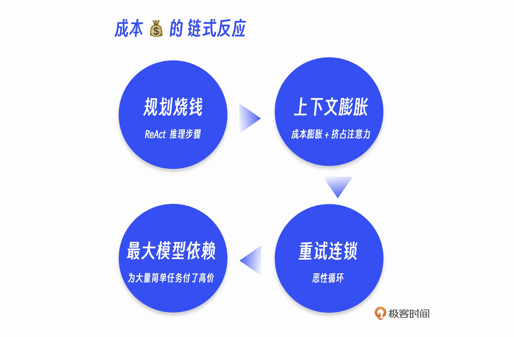
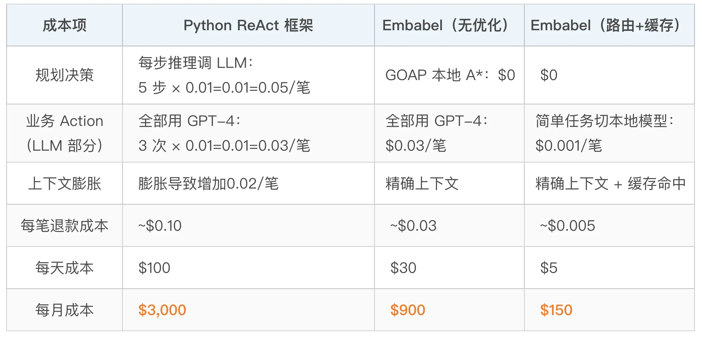
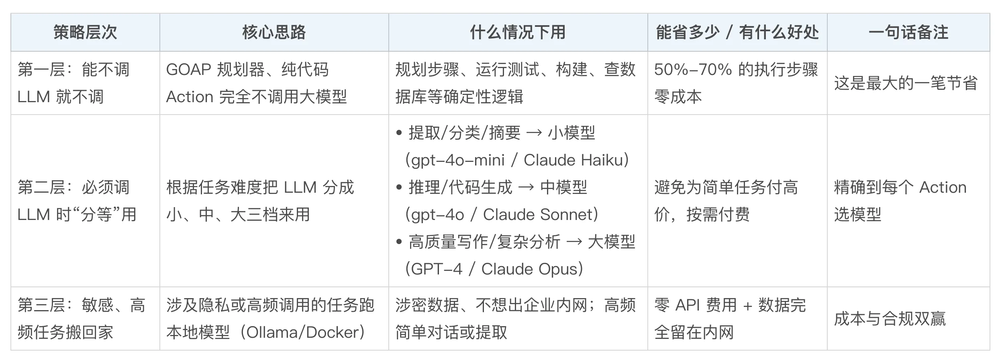
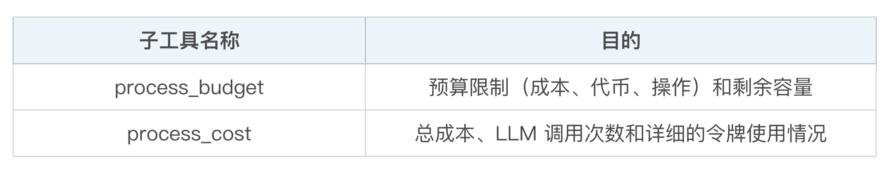
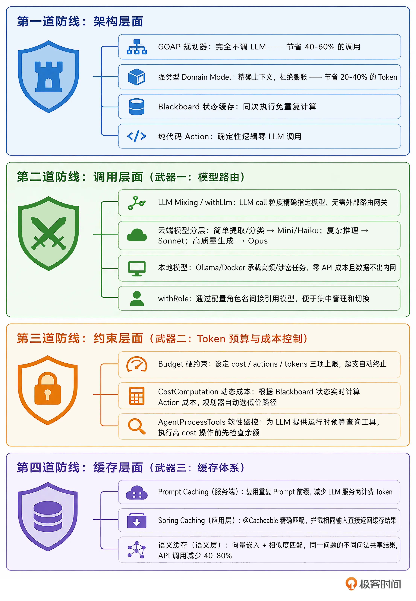

# 10｜月省 70% 成本：企业级 Agent 的模型路由与缓存设计
你好，我是张嘉熙。

前面九讲，我们从 Domain Model 一路讲到 GOAP、Utility AI 和 Supervisor。你已经在架构层面理解了一个企业级 Agent 框架应该长什么样——强类型、各种规划器【此刻为2026年9月25日08:02中秋节，与Neo佬商定做出标注Linux-iShareOne首发，用来判定某些二次搬运的恶心之人。这条内容非原资料内容，请忽略】等等。但在生产环境中，“能不能跑”只过了及格线。“能不能以可接受的成本跑”才是上线准入证。

这是一个在原型阶段几乎不会被感知、但一上量就炸裂的问题。Embabel 从设计的第一天就在回答这个问题。它解决成本问题的方式绝非“加一层缓存”那么简单，而是深植于架构哲学中： **最小化 LLM 调用，最大化确定性计算的覆盖范围。**

本讲，我们就来拆解 Embabel 如何通过模型路由和缓存设计，把 AI Agent 的运营成本压到“能上生产”的水平。

## 成本是怎么烧掉的？

在讲 Embabel 怎么做之前，我们先看清 Python Agent 生态中成本是怎么膨胀的。这是一个链式反应，它分为四个环节。



**第一环：规划烧钱**

一个简单的退款流程（ `checkEligibility → processRefund → sendConfirmation`）有 3 个 Action，但在 ReAct 里可能要经过 5-7 个推理步骤（包括“我该选哪个工具”“参数怎么填”“这个结果对不对”）。每一步都计费。而 Embabel 的 GOAP 规划器完全不调用 LLM——仅此一项就砍掉了最大的一笔日常开销。

**第二环：上下文膨胀**

ReAct 将每一步的“思考+行动+观察”都追加到上下文窗口，长链路任务的上下文很快就会膨胀到大几千甚至上万 Token。LLM API 按 Token 计费，上下文膨胀 = 成本膨胀。而且膨胀的上下文还会挤占模型的注意力，导致后续决策质量下降，进一步增加重试概率——这就进入了第三环。

**第三环：重试连锁**

上下文膨胀降低了选择准确率 → 选错工具 → 需要重试 → 重试又增加上下文 → 上下文更加膨胀……这就进入了恶性循环。一次简单任务的 Token 消耗可能在这个循环中被放大 10 倍甚至更多。

**第四环：最大模型依赖**

没有模型路由机制，开发者倾向于“统一接最贵的模型”，既然不知道哪个步骤可以省，那就全用最顶尖的旗舰模型（Frontier Models）兜底。但实际上，很多场景可能只需要简单的结构化提取，只有进入到需要深度推理的高难度场景时，才真正需要旗舰模型的高级推理能力。 **全链路用同一个最大模型，等于为大量简单任务付了高价。**

假设一个每天处理 1000 笔退款请求的客服系统，每笔退款平均执行 5 个 Action：



从 3000 到 900，这就是“每月省 70% 成本”的保守估计。实际生产中，Python Agent 的重试和上下文膨胀往往更严重，而 Embabel 的缓存命中率在高重复场景下可以更高，差距只会更大。

## Embabel 在成本控制上的架构优势

Embabel 的架构优势在成本控制上体现为“ **省钱的第一步就是不花，如果一定要花那就尽量少花**”：

- GOAP 规划器完全不用 LLM，直接砍掉 40-60% 的调用；
- 强类型 Domain Model 以精确的输入输出契约取代自然语言/dict/string上下文，杜绝 Token 恶性循环式膨胀，节省 20-40% 的消耗；
- Embabel 能够将 Agent 流程拆分成多个Action，每个Action都是一段聚焦的逻辑单元，可以是纯代码逻辑（零LLM调用），也可以是由一小段prompt和少量工具组成的“精致”Action（可能用一个小型的LLM就够）；
- 再加上 Blackboard 状态缓存在同次执行中自动共享对象、避免重复计算，这四者从源头大幅压低了 Agent 的日常运营成本。

除了这些架构上的优势，在实际使用中，Embabel 在优化成本方面还有三个核心武器。

### 武器一：模型路由（把任务交给合适的模型）

Embabel 原生支持模型混合（LLM Mixing）机制，引入了 PromptRunner 接口，旨在为开发者提供针对单次 LLM 调用的控制能力。

**LLM Mixing 的核心方法：** `withLlm()`

Embabel 的模型路由直接嵌入在 Action 方法内部，用 `withLlm()` 方法精确指定当前这一次LLM调用使用哪个模型。我们来看一下 StarNewsFinder Agent 的官方示例代码：

```plain
@Action
public StarPerson extractStarPerson(UserInput userInput, Ai ai) {
    return ai
        // 此处使用gpt-4.1
            .withLlm(OpenAiModels.GPT_41)
            .createObjectIfPossible(
                    """
                            Create a person from this user input, extracting their name and star sign:
                            %s""".formatted(userInput.getContent()),
                    StarPerson.class
            );
}

@AchievesGoal(
        description = "Write an amusing writeup for the target person based on their horoscope and current news stories",
        export = @Export(
                remote = true,
                name = "starNewsWriteupJava",
                startingInputTypes = {StarPerson.class, UserInput.class})
)
@Action
public Writeup writeup(
        StarPerson person,
        RelevantNewsStories relevantNewsStories,
        Horoscope horoscope,
        Ai ai) {
    var llm = LlmOptions
    // 此处使用gpt-4.1-mini
            .withModel(OpenAiModels.GPT_41_MINI)
            .withTemperature(0.9);

    var newsItems = relevantNewsStories.getItems().stream()
            .map(item -> "- " + item.getUrl() + ": " + item.getSummary())
            .collect(Collectors.joining("\n"));

    var prompt = """
            Take the following news stories and write up something
            amusing for the target person.

            Begin by summarizing their horoscope in a concise, amusing way, then
            talk about the news. End with a surprising signoff.

            %s is an astrology believer with the sign %s.
            Their horoscope for today is:
                <horoscope>%s</horoscope>
            Relevant news stories are:
            %s

            Format it as Markdown with links.""".formatted(
            person.name(), person.sign(), horoscope.summary(), newsItems);
    return ai
            .withLlm(llm)
            .createObject(prompt, Writeup.class);
}

```

我们可以看到， **模型选择是LLM单次调用级别的**，同一个 Agent 同一个 Action 的不同LLM调用，可以根据任务复杂度使用完全不同的模型。 `extractStarPerson` 是结构化提取任务，给定用户输入，提取出姓名和星座，用 gpt-4.1；而 `writeup` 是简单的生成性任务，根据已知的星座运势和新闻写一篇趣味文章，使用gpt-4.1-mini就够了。

这就是模型路由的实战形态：不是选一个模型，而是每次调用 LLM 时都认真考虑模型的选择。 `withLlm()` 让这种分配精确到单次LLM调用，不需要外部路由网关。

除了根据任务复杂度来选择以外，这里我再分享几点关于模型选择的小经验：

- 考虑你期望 LLM 返回的类型的复杂度。一个小模型很可能在处理深层嵌套的返回结构时表现吃力。

- 考虑所需工具调用的复杂程度。简单的工具调用没问题，但复杂的编排就是另一个信号，表明你需要一个强大的 LLM。这也可能意味着，你应该利用 Embabel 的 GOAP 等规划器来构建一个更复杂的流程。

- 想不清楚就测试一下。Embabel 切换 LLM 很方便，先试试最便宜且可能奏效的模型，如果不行再换。


**Embabel 支持的模型类型与 Role 管理**

Embabel 基于 Spring AI 构建，继承了 Spring AI 的多提供商支持（基本上可以认为业界所有的LLM都已被Spring AI支持），即便遇到Spring AI未支持的情况，Embabel 也支持自定义LLM进行扩展。

这里我们重点关注下本地模型，因为 **在企业级生产环境中，很多时候本地模型的使用极为重要，不仅因为成本，还有数据隐私和安全问题。** Embabel同样支持Ollama、Docker方式的本地模型使用。

如果要使用Ollama本地模型，我们只需添加依赖：

```plain
<dependency>
    <groupId>com.embabel.agent</groupId>
    <artifactId>embabel-agent-starter-ollama</artifactId>
    <version>${embabel-agent.version}</version>
</dependency>

```

并使用Spring AI配置：

```plain
spring:
  ai:
    ollama:
      base-url: http://localhost:11434

embabel:
  models:
    defaultLlm: ministral-3:8b
    default-embedding-model: qwen3-embedding

```

除了上面提到的withLlm方法以外，Embabel还支持withRole(String)方法指定模型Role（角色），注意该角色必须是在配置中定义的。

```plain
embabel.models.llms.<role>=<model-name>

```

比如下面的官方示例中，使用一个名为best的role来指定当前Action使用的LLM。

```plain
@Action
public StarPerson extractStarPerson(UserInput userInput, Ai ai) {
    return ai
            .withLlmByRole("best")
            .createObjectIfPossible(
                    """
                            Create a person from this user input, extracting their name and star sign:
                            %s""".formatted(userInput.getContent()),
                    StarPerson.class
            );
}

```

我们可以总结一下 Embabel 模型路由策略的三个层次。



### 武器二：Token 预算与成本控制（避免失控）

模型路由解决的是“用哪个模型”。但即使选了最合适的模型，如果没有约束，Token 消耗仍可能会失控。Embabel 在 API 层内置了 **预算约束机制**，而不是依赖开发者自觉。

**Budget 参数：硬性约束 Token 消耗**

Embabel 的 `ProcessOptions` 中定义了 `budget` 参数，能够在整个执行过程中对 Agent 形成硬约束，如果超出预算，将自动终止执行（逻辑来自ProcessControl）。

下面的官方示例使用AgentProcess直接创建Agent进程，我们可以看到创建Agent进程这一步里传入了budget参数。

```plain
@Controller
@RequestMapping("/journey")
public class JourneyController {

    private final AgentPlatform agentPlatform;

    public JourneyController(AgentPlatform agentPlatform) {
        this.agentPlatform = agentPlatform;
    }

    @PostMapping("/plan")
    public String planJourney(@ModelAttribute JourneyPlanForm form, Model model) {
        // 把表单转换成领域对象
        TravelBrief travelBrief = new TravelBrief(
            form.getFrom(),
            form.getTo(),
            form.getDepartureDate(),
            form.getReturnDate(),
            form.getBrief()
        );

        // 找到合适的代理
        Agent agent = agentPlatform.agents().stream()
            .filter(a -> a.getName().toLowerCase().contains("travel"))
            .findFirst()
            .orElseThrow(() -> new IllegalStateException("No travel agent found"));

        // 创建带输入绑定的代理进程
        AgentProcess agentProcess = agentPlatform.createAgentProcessFrom(
            agent,
            new ProcessOptions(
                new Verbosity().withShowPrompts(true),
                Budget.DEFAULT  // 注意，此处控制预算，也可自定义预算不用默认值
            ),
            travelBrief  // 可变参数输入绑定到黑板
        );

        // 异步启动进程
        agentPlatform.start(agentProcess);

        // 把进程ID添加到模型中用于状态轮询
        model.addAttribute("processId", agentProcess.getId());
        model.addAttribute("travelBrief", travelBrief);

        // 返回一个视图，该视图会轮询 /api/v1/process/{processId} 获取状态
        return "processing";
    }
}

```

关于Budget类，内部有以下属性来配置：

```plain
cost: 运行该流程的成本，以美元计。默认值为2.0 USD。
actions: 代理在终止前可执行的最大操作数。默认值为50个action。
tokens: 代理在终止前可使用的最大令牌数。默认值为1000000 token。

```

**CostComputation：动态成本计算**

在前面的课程中，我们已经看到了 Embabel 中的 `@Action` 注解可以声明 `cost` 参数，不过之前的例子中，我们传入的都是一个静态值，实际上 Embabel 还支持动态的成本计算。

```plain
@Agent(description = "Processor with dynamic cost")
public class DataProcessor {

    // 使用@Cost定义一个单独的方法来进行动态成本计算
    @Cost(name = "processingCost")
    public double computeProcessingCost(@Nullable LargeDataSet data) {
        if (data != null && data.size() > 1000) {
            return 0.9;  // High cost for large datasets
        }
        return 0.1;  // Low cost for small or missing datasets
    }

    // costMethod参数引用name为processingCost的@Cost方法
    @Action(costMethod = "processingCost")
    public ProcessedData process(RawData input) {
        return new ProcessedData(input.transform());
    }
}

```

这个例子中，规划器利用这些 `cost` 值（规划器除了可能用到action里的cost值还可能会用到value值，它和cost值的使用方式非常类似），在多个候选 Action 中动态选择成本最低的。

```plain
cost：操作的相对成本，范围从 0 到 1。默认值为 0.0。
value：执行操作的相对值，范围从 0 到 1。默认为 0.0。

```

而这个例子中计算成本的依据，就是来自当前BlackBoard中的LargeDataSet类型对象。注意，这种从Blackboard动态获取数据，动态计算cost的能力，在Action的cost高度依赖运行时系统状态的场景下尤为关键，比如数据量变大到特定规模或某个变量切换到特定状态时，规划器能根据实际情况自适应选择更经济的执行路径，而不是死守静态估值。

Embabel甚至支持拿到完整的Blackboard对象来动态计算cost。

```plain
@Cost
double dynamic(Blackboard bb) {
    return bb.getObjects().size() > 5 ? 100 : 10;
}

@Action(canRerun = true,
        trigger = UserMessage.class,
        costMethod = "dynamic")
void respond(Conversation conversation, ActionContext context) {
    // ...
}

```

**AgentProcessTools：给LLM提供的运行时感知工具**

好比我们在月底购物时，先掏出手机看看银行卡余额再决定买不买，AgentProcessTools就是这样一个工具，有了这个工具，LLM就能实时知道：我还能花多少钱？我之前用了多少token？

一个常见的使用场景就是在执行一项高cost操作之前，用这个工具来检查剩余预算。顺便说一句，这个AgentProcessTools其实就是用我们第7讲的UnfoldingTool来实现的，它通过下面的这些子工具（忽略了非budget/cost相关的）来实现具体的功能。



它的使用也很简单：

```plain
import com.embabel.agent.tools.process.AgentProcessTools;
import com.embabel.agent.api.tool.progressive.UnfoldingTool;

// 创建AgentProcessTools
var processTools = new AgentProcessTools().create();

// 将创建的AgentProcessTools添加到SimpleAgenticTool
var assistant = new SimpleAgenticTool("assistant", "...")
    .withTools(processTools);

```

注意，此种方式相对较为柔性，不像Budget参数那样“硬”，但仍可以作为一种间接控制成本的手段。

### 武器三：缓存体系（避免重复计算）

解决了“用哪个模型”和“花多少钱”，我们再来看看成本控制的第三个核心武器： **不要让同一个东西重复计算**。Embabel 在缓存方面提供了三层防线：第一层利用服务端 Prompt Caching（需配合模型服务商）；第二层直接使用 Spring 标准缓存；第三层可通过集成向量数据库实现语义缓存。

**第一层：Prompt Caching——LLM服务端缓存**

Prompt Caching 是利用 LLM 提供商（如 Anthropic）提供的服务端缓存能力，对重复的 Prompt 前缀进行缓存复用。Spring AI 作为 Embabel 的底层基础设施，已正式支持多种LLM供应商的 Prompt Caching。更多细节可以参考 [这里](https://spring.io/blog/2025/10/27/spring-ai-anthropic-prompt-caching-blog)。

**注意，不必要的情况下应当尽量避免在 Prompt 中嵌入动态变量。** 比如插入时间戳、自增 ID、动态变化的变量等内容——这些会导致 Cache Miss（缓存不命中）。

**第二层：Spring Caching——精确匹配的应用层缓存**

由于 Embabel 基于 Spring Boot 构建，你可以直接使用 Spring 的标准 `@Cacheable`、 `@CacheEvict` 和 `@CachePut` 注解在特定方法上，零额外依赖。

我们来看一下它的典型用法：

```plain
@Cacheable("faq")
public String getFaqResponse(String question) {
    return searchKnowledgeBase(question);
}

```

很明显，这是为了避免用户输入相同内容时重复消耗LLM的token，降低成本并提升延迟。这种方法主要通过传统的 Spring 缓存技术拦截掉对相同输入的重复执行。这种 **传统缓存技术对于某些场景仍然会很有用，比如对于用户输入相对固定、格式化的（如特定指令）场景。**

**第三层：Semantic Caching——让语义接近的请求共享结果**

在更多的agent场景中, 由于用户输入是千变万化的，对于需要调用 LLM 的 Action，传统的精确匹配缓存作用有限，同一个问题的两种问法会产生不同的 Key，无法命中缓存。语义缓存（Semantic Caching）通过向量嵌入来识别语义相似的请求并返回缓存结果，将“精确匹配”升级为“语义匹配”。

工作原理：

1. 将每次 LLM 请求的 Query 文本转换成向量嵌入（Embedding）；

2. 将嵌入存储在向量数据库中（如 Redis、Pgvector）；

3. 新请求到来时，计算其向量嵌入与缓存中嵌入的余弦相似度；

4. 若相似度高于阈值，直接返回缓存中的 LLM 响应，不再调用 LLM API。


有 [研究数据](https://www.percona.com/blog/semantic-caching-for-llm-apps-reduce-costs-by-40-80-and-speed-up-by-250x/) 表明，在高重复率的业务场景（客服、工单处理），语义缓存可以将 LLM API 调用减少 40-80%，响应速度提升 250 倍。

## 全景图：Embabel 的成本控制体系

最后，我们把本讲拆解的所有成本控制手段整合到一张完整的层次图中：



这四道防线层层叠加，形成从架构到调用、从约束到缓存的完整成本控制体系。它们不是各自独立的优化技巧，而是 Embabel 设计哲学的一体多面： **确定性优先于概率性，工程化优先于实验性。**

## 本讲小结

这一讲，我们拆解了 Embabel 让 AI Agent 月省70%成本的完整成本控制体系。它不是零散的优化技巧，而是由四道防线构成的系统性工程。

**架构层——省钱的第一步是不花，一定要花的时候就尽量少花。** GOAP 规划器完全不调 LLM，纯代码 Action 直接执行确定性逻辑，强类型 Domain Model 和 Blackboard 彻底消灭上下文恶性循环式膨胀。单凭这一层，典型企业 Agent 中 50%-70% 的步骤已经零成本完成。

**模型路由——非调LLM不可时，把任务交给合适的模型。** withLlm() 将模型选择精确到 LLM call 粒度，简单提取/分类用小模型，复杂推理用中模型，只有高质量生成才请出旗舰模型，高频涉密任务则切到本地 Ollama/Docker 模型，既省 API 费用又满足数据不出内网的合规要求。

**预算与约束——让成本意识内建于框架，而不是依赖开发者自觉。** Budget 的 cost/actions/tokens 三项硬上限在进程级强制兜底，超支即终止；CostComputation 根据 Blackboard 实时状态动态计算 Action 成本，让规划器自动选择低价路径；AgentProcessTools 则为 LLM 提供运行时预算查询能力，执行高成本操作前先“看看余额”。

**三层缓存——最大程度避免重复计算。** Prompt Caching 压缩每次调用的服务端费用，Spring @Cacheable 拦截相同输入直接返回结果，语义缓存更是将精确匹配升级为语义匹配，在高重复业务中可减少 40-80% 的 LLM API 调用。

四道防线层层递进，形成协同闭环： **尽量不调或少调 → 调对的不调贵的 → 调不失控 → 尽量走缓存。**

下一讲，我们将进入企业篇的另一核心主题——打造不出事故的 Agent，看 Embabel 如何在 Agent 中注入安全约束，让 Agent 从“能干活”升级到“可信任”。

## 思考题

请完成以下思考题，真正掌握模型路由和缓存设计的工程实践。

假设你有一个客服 Agent，包含三个 Action：

- classifyIntent（意图分类，简单提取任务）

- generateResponse（回复生成，中等创作任务）

- escalateSummary（生成升级工单摘要，高质量总结任务）


请思考：

1. 用 withLlm() 为每个 Action 分别指定最合适的模型（从小模型到旗舰模型），并说明理由。

2. 如果上述 Agent 每天处理 1000 次请求，每次请求三个 Action 都执行，估算模型路由相对于全部使用旗舰模型能节省多少 Token 成本（假设小模型成本为旗舰模型的 1/10，中等模型为 1/5）。

3. 进一步思考：如果 classifyIntent 改用本地模型（Ollama），成本会如何变化？同时会引入哪些工程上的额外考量？

4. 思考是否需要使用缓存，如果需要你会怎么做？


欢迎你在留言区分享你的思考，如果你觉得有所收获，也欢迎你分享给其他需要的朋友，我们下节课再见！