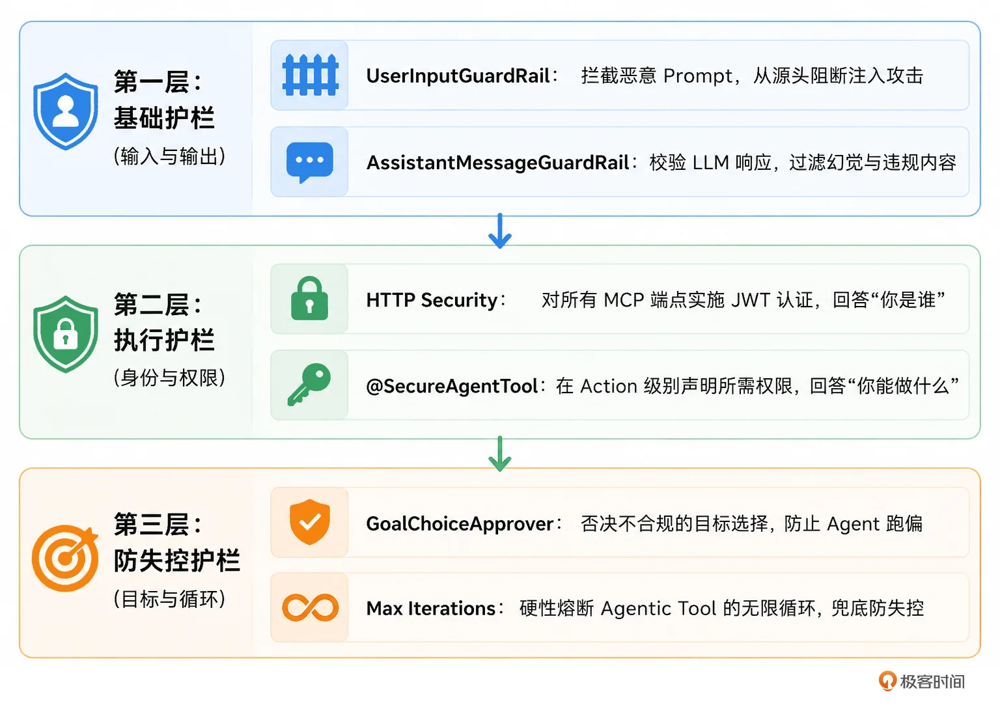

# 11｜不出事故的 Agent：三层安全护栏设计防注入，防越权，防失控
你好，我是张嘉熙。

上一讲我们解决了成本问题，模型路由、Token预算和缓存等技术让AI Agent从“能跑”升级到“能以可接受的成本跑”。但在企业生产环境中，还有 **一个必须要守住的底线，就是不出事故。**

Prompt注入、权限绕过、无限循环，任何一个事故都可能导致数据泄露、品牌崩坏、系统崩溃。这就是OWASP在2025年将LLM应用安全列为 [独立Top 10](https://genai.owasp.org/llm-top-10/)，也是各大云厂商和安全公司都在死磕AI护栏的原因。

Embabel 为此提供了一套开箱即用的护栏（Guardrails）框架，让开发者能自由地在Agent生命周期的各种关键节点插入自定义安全逻辑。

## Embabel 如何落地“护栏”？

答案藏在它的架构设计中：



其内建的 UserInputGuardRail 与 AssistantMessageGuardRail 分别守住了 LLM 交互的入口与出口，完成输入与输出的安全校验；第二层借 Spring Security 的声明式授权在 HTTP 与 Action 两级构建起“认证鉴权”的执行屏障；第三层则由 GoalChoiceApprover 把守目标选择关口，同时通过 Agentic Tools 的循环上限机制（MaxIterations）从执行次数维度兜住失控风险。

这三层并非孤立组件，而是一条环环相扣的防御链——第一层聚焦交互边界，第二层落实权限控制，第三层从目标选择与执行次数两个维度形成兜底，几者协同构成完整的纵深防御体系。

## 第一层：基础护栏——(UserInputGuardRail &AssistantMessageGuardRail）

Embabel 对护栏做了专门的抽象和封装，我们只需要根据自己的需求创建POJO/Spring Bean（需实现Embabel定义好的对应接口）并使用withGuardRailsAPI将这些Bean配置一下就可以了。

这里的逻辑并不复杂，我们先来看看这个官方示例。

```plain
/**
 * CRITICAL级别的用户输入护栏
 */
class CriticalUserInputGuardRail implements UserInputGuardRail {

    @Override
    public @NotNull String getName() {
        return "CriticalUserInputGuardRail";
    }

    @Override
    public @NotNull String getDescription() {
        return "Blocks execution when critical policy violations are detected";
    }

    @Override
    public @NotNull ValidationResult validate(@NotNull String input, @NotNull Blackboard blackboard) {
        // 添加自定义校验逻辑，注意此处我们可以轻易拿到所有blackboard对象
        // 返回 CRITICAL error 阻止LLM继续执行
        return new ValidationResult(true, List.of(
            new ValidationError("policy-violation", "Content violates safety policy", ValidationSeverity.CRITICAL)
        ));
    }
}

```

这个 `UserInputGuardRail` 接口，允许开发者对用户输入进行检测和拦截。

注意这个 `ErrorSeverity.CRITICAL`。在Embabel中，护栏验证返回的ValidationError可以包含不同严重级别的错误。如果其中包含 `CRITICAL` 级别的错误，护栏会直接抛出 `GuardRailViolationException`，阻断整个请求——不给攻击者任何机会。

同样地，Embabel对LLM的响应也提供了对应的护栏接口。顺便说一句，在 [05 讲](https://time.geekbang.org/column/article/979290) 我们已经提到过LLM通信的双向性，只是当时我们讲的校验主要针对数据的形式是否正确，如校验对象字段是否合法，本讲我们则更看重内容是否安全。我们继续看这个官方代码示例。

```plain
/**
 * 校验 LLM thinking blocks的护栏
 */
class ThinkingBlocksGuardRail implements AssistantMessageGuardRail {

    @Override
    public @NotNull String getName() {
        return "ThinkingBlocksGuardRail";
    }

    @Override
    public @NotNull String getDescription() {
        return "Validates LLM thinking blocks for compliance";
    }

    @Override
    public @NotNull ValidationResult validate(@NotNull ThinkingResponse<?> response, @NotNull Blackboard blackboard) {
        // 添加自定义校验逻辑，注意此处我们可以拿到ThinkingResponse类的对象和blackboard对象
        logger.info("Validating thinking blocks: {}", response.getThinkingBlocks());
        return new ValidationResult(true, Collections.emptyList());
    }

    @Override
    public @NotNull ValidationResult validate(@NotNull String input, @NotNull Blackboard blackboard) {
        return new ValidationResult(true, Collections.emptyList());
    }
}

```

这里的校验逻辑实现了AssistantMessageGuardRail接口，这里的代码仍然很简单，只是注意下它校验的是LLM的thinking blocks，就是说即使LLM无法成功构建对象也可以走到这里的校验逻辑。

最后一步，使用withGuardRailsAPI 配置我们上面创建好的两个护栏对象，就可以了。

```plain
PromptRunner runner = ai.withLlm("claude-sonnet-4-5")
        .withToolObject(Tooling.class)
        .withGenerateExamples(true)
        // 配置护栏对象到PromptRunner
        .withGuardRails(new CriticalUserInputGuardRail(), new ThinkingBlocksGuardRail());

String prompt = """
        What is the hottest month in Florida and provide its temperature.
        The name should be the month name, temperature should be in Fahrenheit.
        """;

try {
    // 用thinking方法尝试创建一个对象
    ThinkingResponse<MonthItem> response = runner
            .thinking()
            .createObject(prompt, MonthItem.class);
} catch (GuardRailViolationException ex) {
    // CRITICAL validation errors cause this exception to be thrown,
    // preventing the LLM operation from executing
    logger.error("Guardrail blocked execution: {}", ex.getMessage());
}

```

## 第二层：安全护栏——防越权（Authorization & Isolation）

入口防御只能挡住攻击者，但如果Agent自己获得了过大的权限，它自己就会成为事故源头。

首先是 **HTTP级别的安全控制（SecurityFilterChain）**，我们先来看一段代码。

```plain
@Configuration
@EnableWebSecurity
public class McpSecurityConfiguration {

    /**
     * 配置专门用于 MCP 端点的安全过滤链
     * 仅对 /sse、/mcp、/message 路径生效，要求所有请求认证，使用 JWT 令牌，
     * 禁用 CSRF，并将会话管理设为无状态
     *
     * @param http Spring Security 的 HttpSecurity 构建器
     * @return 构建好的 SecurityFilterChain 实例
     * @throws Exception 配置过程中可能抛出的异常
     */
    @Bean
    public SecurityFilterChain mcpFilterChain(HttpSecurity http) throws Exception {
        http
            // 设置此安全配置仅应用于特定路径
            .securityMatcher("/sse/**", "/mcp/**", "/message/**")
            // 要求所有匹配的请求都必须经过认证
            .authorizeHttpRequests(authz -> authz
                .anyRequest().authenticated()
            )
            // 配置会话管理为无状态，不创建 HTTP 会话
            .sessionManagement(session -> session
                .sessionCreationPolicy(SessionCreationPolicy.STATELESS)
            )
            // 配置 OAuth2 资源服务器，使用 JWT 进行认证
            .oauth2ResourceServer(oauth2 -> oauth2
                .jwt(jwt -> jwt
                    .jwtAuthenticationConverter(jwtAuthenticationConverter())
                )
            )
            // 对 MCP 端点禁用 CSRF 防护（因为是无状态 API）
            .csrf(csrf -> csrf.disable());

        return http.build();
    }

    /**
     * 创建自定义的 JWT 认证转换器
     * 从 JWT 的 "authorities" 声明中提取权限信息，并去掉默认的 "SCOPE_" 前缀
     *
     * @return 自定义的 JwtAuthenticationConverter 实例
     */
    @Bean
    public JwtAuthenticationConverter jwtAuthenticationConverter() {
        // 权限转换器，负责将 JWT 中的 claim 转换为 Spring Security 权限
        JwtGrantedAuthoritiesConverter authoritiesConverter = new JwtGrantedAuthoritiesConverter();
        // 指定 JWT 中存放权限的声明名称为 "authorities"
        authoritiesConverter.setAuthoritiesClaimName("authorities");
        // 设置权限前缀为空，不自动添加 "SCOPE_" 等前缀
        authoritiesConverter.setAuthorityPrefix("");

        // 创建 JWT 认证转换器并绑定自定义权限转换器
        JwtAuthenticationConverter jwtConverter = new JwtAuthenticationConverter();
        jwtConverter.setJwtGrantedAuthoritiesConverter(authoritiesConverter);

        return jwtConverter;
    }
}

```

这段代码也很容易理解，所有发往 MCP服务接口的请求，都必须带上一个有效的 JWT 身份令牌（放在 Authorization 头里，格式为 Bearer ），否则在进入业务逻辑之前就会被直接拒绝，返回 401 未授权错误， GOAP 等规划器都还没机会执行。

要实现这个要求，你需要在 Spring Security 配置里专门为这些路径定义一条安全过滤链，并配置好 JWT 资源服务器来校验令牌的有效性。

```plain
spring:
  security:
    oauth2:
      resourceserver:
        jwt:
          public-key-location: classpath:keys/public.pem  # local dev
          jws-algorithms: RS256
          # For production, use issuer-uri or jwk-set-uri instead

```

**接下来我们再看方法级别的安全控制（@SecureAgentTool）。**

上面的HTTP级别的过滤器链就是大楼前台——任何人进门都必须出示工牌，没有工牌的直接被拦在外面；而 @SecureAgentTool 则是每间办公室的门锁，即便你进了大楼，也只有工牌上明确标着“可进入该办公室”的人，才能拧开门把手。

两层机制一前一后，一个负责确认“你是谁”，另一个负责判断“你能进哪个办公室”，缺了任何一环，整个安全体系都会出现漏洞。基于@SecureAgentTool，我们可以对每个action的授权进行校验。这里的逻辑依旧不难，我们直接看代码。

```plain
// 标记该类为agent，描述为“市场情报智能体”
@Agent(description = "Market intelligence agent")
// 类级别安全控制：需要当前用户拥有 'market:read' 权限才能访问该智能体
@SecureAgentTool("hasAuthority('market:read')")
public class MarketIntelligenceAgent {

    // 标注为智能体的一个动作，用于收集原始情报
    @Action
    public String gatherIntelligence(
        AnalysisSubject subject,       // 分析对象
        OperationContext context) {    // 操作上下文
        // ... 方法实现
    }

    // 方法级别安全控制：要求当前用户拥有 'market:admin' 权限
    @SecureAgentTool("hasAuthority('market:admin')")
    // 标记此动作可达成一个目标，目标描述为“生成市场报告”
    @AchievesGoal(description = "Produce market report")
    // 标注为智能体的另一个动作
    @Action
    public MarketIntelligenceReport synthesiseReport(
            AnalysisSubject subject,       // 分析对象
            String rawIntelligence,        // 原始情报数据
            OperationContext context) {    // 操作上下文
        // ... 方法实现
    }
}

```

这里你要注意两点：

- 方法级注解的优先级高于类级表达式，就是说我们可以让方法级注解有比类级更高的权限要求。

- 所有Spring Security SpEL 表达式都是有效的，比如 hasAnyAuthority(‘finance:read’, ‘finance:admin’) 或 hasRole(‘ADMIN’)。


## 第三层：防失控护栏——（Goal Choice & Loop Control）

### 目标选择（GoalChoiceApprover）

在之前的 [06](https://time.geekbang.org/column/article/980824)、 [09](https://time.geekbang.org/column/article/981974) 讲我们已经讲过多种规划器的实现，对于GOAP这类需要明确目标的规划算法而言，在真正执行算法之前，其实我们还有一步要做，那就是找到目标。

Embabel会自动根据用户输入以及@AchievesGoal注解中的description字段，发起LLM调用，从而找到对应的目标。因为这个LLM交互比较简单，通常不会出错，但对于企业级应用来说，我们不怕一万就怕万一，所以Embabel专门提供了一个GoalChoiceApprover接口，允许我们对其进行自定义扩展，实现自己的判断逻辑来否决可疑的目标选择。

下面我们实现一个MyGoalChoiceApprover，它的核心逻辑是：在任何情况下，都禁止Agent选择“删除账户”这个危险目标。

```plain
public class MyGoalChoiceApprover implements GoalChoiceApprover {
    @NotNull
    @Override
    public GoalChoiceApprovalResponse approve(@NotNull GoalChoiceApprovalRequest goalChoiceApprovalRequest) {
        String goalName = goalChoiceApprovalRequest.getGoal().getName();
        // 校验目标名称是否是DeleteAccount
        if ("DeleteAccount".equalsIgnoreCase(goalName)) {
            return new GoalChoiceNotApproved(goalChoiceApprovalRequest, "name can not be DeleteAccount");
        }
        return new GoalChoiceApproved(goalChoiceApprovalRequest);
    }
}

```

### 循环控制（ `withMaxIterations`）

在 [07](https://time.geekbang.org/column/article/981115) 讲我们讲过Agentic Tools, 现在我们回过头来再看看这个接口的定义，重点看 `withMaxIterations` 方法。

```plain
public interface AgenticTool<THIS extends AgenticTool<THIS>> extends Tool {
    LlmOptions getLlm();
    int getMaxIterations(); // 最大tool loop迭代次数 (默认值: 20)

    THIS withLlm(LlmOptions llm);
    THIS withSystemPrompt(String prompt);
    THIS withSystemPrompt(AgenticSystemPromptCreator creator);
    THIS withMaxIterations(int maxIterations); // 配置最大tool loop迭代次数
    THIS withParameter(Tool.Parameter parameter);
    THIS withToolObject(Object toolObject);
}

```

这个 `withMaxIterations` 是整个Agentic Tools安全策略的兜底，即使LLM进入了死循环思维，框架也会在指定轮数后强制终止，不会无限消耗Token和成本。这个设计结合 [第 10 讲](https://time.geekbang.org/column/article/983310) 的 `Budget` 参数，形成了多层次的成本和安全闭环。

## 本讲小结

这一讲，我们为 AI Agent 筑起了一道三层安全防线，让“不出事故”从口号变成了可落地的工程实践。

**第一层：基础护栏——守住了 LLM 交互的两端**

`UserInputGuardRail` 在用户输入进入 Agent 之前就完成了检测和拦截，任何 CRITICAL 级别的违规都会直接抛出异常、阻断请求，不给攻击者任何试探的机会。

`AssistantMessageGuardRail` 则在 LLM 生成响应的第一时间介入，即便模型产生了幻觉或违规内容，也能在进入下游逻辑之前被精确拦截。两个 GuardRail 一前一后，把 LLM 这个最大的不确定性来源牢牢关进了笼子里。

**第二层：安全护栏——为每个 Action 添加门禁**

HTTP 层的 JWT 认证回答了“你是谁”， `@SecureAgentTool` 注解回答了“你能做什么”。两层叠加，就像大楼的前台接待加上每间办公室的门禁——光有工牌进不了核心区域，权限粒度精确到每一个 Action。方法级注解的优先级高于类级，SpEL 表达式灵活组合，让最小权限原则真正落地，Agent 的每一次动作调用都有据可查、有权限可依。

**第三层：防失控护栏——兜住了跑偏和死循环**

`GoalChoiceApprover` 在规划器选定目标后做最后一道审批，危险目标可以被直接否决，从根源上杜绝 Agent 跑偏的可能。 `withMaxIterations` 则为 Agentic Tool 设定了硬性熔断，即便 LLM 陷入思维死循环，框架也会在规定轮数后强制终止，不会无限燃烧 Token 和成本。

## 思考题

请完成以下思考题，真正掌握本讲的安全护栏设计。

1. 你正在开发一个面向客户的智能客服 Agent，它具备两个 Action：查询订单状态（普通用户可调用）和退款处理（仅客服主管可调用）。某天日志显示，一个普通用户通过精心设计的 Prompt，成功触发了退款处理流程。请结合本讲的三层防御体系分析：这个攻击穿过了哪几层护栏？在哪一层、用哪种机制可以最有效地堵住这个漏洞？

2. 你的 Agent 集成了一个可以调用外部 API 的 Agentic Tool，默认最大循环次数为 20 次。某次上线后，你发现它因 LLM 反复调用该 Tool 导致 Token 消耗激增，但在第 15 轮时就被框架强制终止了。这个强制终止是第三层防失控护栏中 MaxIterations 的作用。仅靠这个硬性熔断够不够？结合第 10 讲的 Budget 机制，分析两者各自的定位和互补关系。


欢迎你在留言区分享你的思考，如果你觉得有所收获，也欢迎你分享给其他需要的朋友，我们下节课再见！