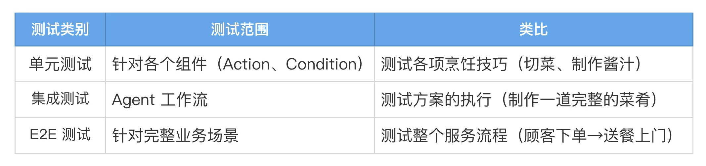
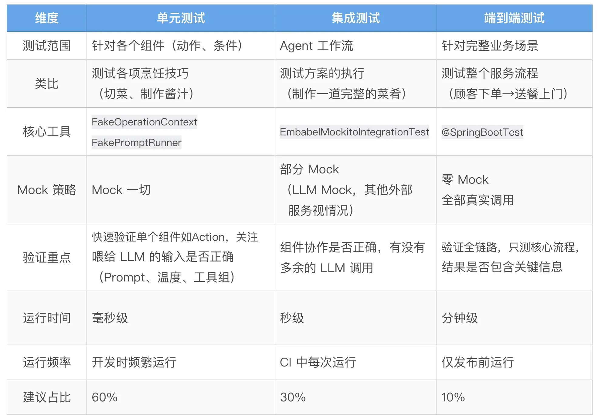

# 12｜测试策略：单元、集成、E2E 三层测试体系保证质量
你好，我是张嘉熙。

从 Domain Model 到规划器，从模型路由到安全护栏——前面十一讲，我们积累的是一种“构建能力”。但你我都知道，构建只是起点。没有测试护体，每一次迭代都像蒙眼走钢丝。这一讲，我们把所有能力放进测试的探照灯下，建立起 Agent 质量的工程防线。

测试是可靠 AI 系统的基石，在 Embabel 的设计哲学中，可测试性是框架的一等公民，在初始阶段就被视为最核心的特性之一，专门对此进行了精心设计。

本讲，我们就来拆解 Embabel 的三层测试体系：单元测试（Unit Test）、集成测试（Integration Test）和端到端测试（E2E Test），以及如何用体系化的测试策略保证 Agent 在生产环境的质量。

## GenAI 测试的独特挑战

传统软件的测试遵循一个清晰的公式：给定输入 X，断言输出 Y。输入确定，输出确定，测试用例就是一组输入输出对。

GenAI 应用打破了这条公式。LLM 是非确定性的，同一个 Prompt，两次调用可能返回不同结果。再加上 LLM API 调用本身有延迟和成本，很多时候直接在测试中调用真实 LLM 既不稳定也不经济。

## Embabel的应对之道

Embabel 的做法就像拍惊险动作片：危险镜头不用真人，上替身。但导演的调度、机位、灯光、台词——全部真实执行。唯一的区别只是：主演换成了一个完全听指挥的替身。

映射到测试中：Embabel 替你跳过 LLM 的实际调用（替身），但会完整验证 Prompt 内容、温度等超参数、工具组配置、调用次数——除了 LLM 调用本身不可预测，其他一切“导演指令”都能被全面验证。



不知道你是否还记得 [01 讲](https://time.geekbang.org/column/article/977830) 的天气查询Agent，下面我们会继续基于这个Agent来分别介绍在Embabel中如何进行单元测试、集成测试和E2E测试。

## 单元测试（Unit Test）

`FakeOperationContext` 以及它内部的 `FakePromptRunner` 是 Embabel 单元测试的核心工具。从名字的前缀部分我们能看出来，它们的实现是基于Fake（假对象）而非Mock（模拟对象）。

我们先理解一下这两个核心概念：

- Fake：有真实行为的“假对象”，它的行为通常是简化的。你验证的是它的状态（比如 Prompt 对不对）。

- Mock：纯粹为了行为验证而生的“模拟对象”，它不会执行任何真实逻辑。你验证的是交互行为（比如某个方法有没有被调用、调了几次）。


**Embabel走的是 Fake 路线**——你不仅可以验证返回值，还能事后检查它记录下的所有 LLM 调用细节。同时，Embabel 也兼容 Mockito 等 Mock 框架，当你更关注“是否调用”而非“调用了什么”时，也可以使用。

再看看它们名字的后缀部分，很明显前者 `FakeOperationContext` 着重于测试时的上下文相关逻辑，后者 `FakePromptRunner` 主要是针对与LLM的直接交互。下面我们直接通过实际的代码来看看如何使用它们。

### **使用Fake测试**

这里我们一步一步展示如何对天气查询Agent中的Action extractCity进行单元测试（省略部分领域对象的创建）。

步骤1：创建 FakeOperationContext 实例

```plain
var context = FakeOperationContext.create();

```

步骤2：Mock RestTemplate，从而隔离天气查询服务的依赖，这里我们使用经典的Mockito框架来完成Mock

```plain
RestTemplate mockRestTemplate = Mockito.mock(RestTemplate.class);

```

步骤3：设置 FakeOperationContext 的预期响应

```plain
context.expectResponse(city);

```

步骤4：创建代理实例并执行方法

```plain
var agent = new WeatherAgent(mockRestTemplate);
WeatherAgent.City extractedCity = agent.extractCity(userInput, context);

```

步骤5：验证返回结果

```plain
assertEquals(city, extractedCity);

```

步骤6：获取并验证 LLM 调用记录

```plain
// FakeOperationContext 会记录所有的 LLM 调用，我们可以查询并验证
List<LlmInvocation> llmInvocations = context.getLlmInvocations();
// 验证 LLM 调用次数为 1
assertEquals(1, llmInvocations.size());
// 获取第一次（也是唯一一次）LLM 调用记录
LlmInvocation invocation = llmInvocations.get(0);
// 验证提示词内容与预期一致
assertEquals(prompt, invocation.getPrompt());
// 验证温度参数为 2.0
assertEquals(2.0, invocation.getInteraction().getLlm().getTemperature());
// 验证工具组为空（这个任务不需要任何工具）
assertTrue(invocation.getInteraction().getToolGroups().isEmpty());
// 验证工具列表为空
assertTrue(invocation.getInteraction().getTools().isEmpty());

```

注意，通过FakeOperationContext，我们虽然没有真的执行LLM调用，但是验证了 LLM 调用前的几乎所有细节，比如Prompt、超参数（温度）、工具组、工具，这让我们能全面确保喂给LLM的内容是否正确，这是Embabel的单元测试最重要的一点。

我们还可以看到这个测试案例里其他部分其实都很简单，这正说明了Embabel做了良好的封装，我们不需要手动mock太多对象（这里只mock了RestTemplate），就能验证Action中除了LLM调用以外的所有逻辑，这种开发体验是非常好的。

### **使用Mock测试**

当然，Embabel也支持我们使用第三方测试框架（如Mockito）来运行单测，尤其是当你更关注行为验证 (检查方法是否被调用、调用了几次）时。下面我们直接通过代码来看看怎么做。

步骤1：创建所有需要的模拟对象

```plain
// OperationContext 是代理执行的上下文环境
OperationContext mockOperationContext = Mockito.mock(OperationContext.class);
// Ai 是 LLM 调用的核心接口
Ai mockAi = Mockito.mock(Ai.class);
// PromptRunner 用于执行具体的提示词任务
PromptRunner mockPromptRunner = Mockito.mock(PromptRunner.class);
// RestTemplate 用于调用天气 API，这里也需要模拟
RestTemplate mockRestTemplate = Mockito.mock(RestTemplate.class);

// 创建预期的城市对象（北京）
var city = new WeatherAgent.City("北京");
// 创建用户输入对象
UserInput userInput = new UserInput("北京天气怎么样");

// 构建预期的提示词格式
String prompt = """
    Extract the city name from this user input.
    - city name: the name of the city

    User input: %s""".formatted(userInput.getContent());

```

步骤2：设置模拟对象的行为

```plain
// 当调用 mockOperationContext.ai() 时，返回我们的 mockAi
when(mockOperationContext.ai()).thenReturn(mockAi);
// 构建 LLM 选项：使用自动选择模型，设置温度为 2.0
LlmOptions llmOptions = LlmOptions.fromCriteria(ModelSelectionCriteria.getAuto()).withTemperature(2.0);
// 当调用 withLlm(llmOptions) 时，返回 mockPromptRunner
when(mockAi.withLlm(llmOptions)).thenReturn(mockPromptRunner);
// 当调用 createObject 时，返回我们预设的 city 对象
when(mockPromptRunner.createObject(prompt, WeatherAgent.City.class)).thenReturn(city);

```

步骤3：创建待测试的 WeatherAgent 实例并执行方法

```plain
var agent = new WeatherAgent(mockRestTemplate);
// 执行待测试的方法
WeatherAgent.City extractedCity = agent.extractCity(userInput, mockOperationContext);

```

步骤4：验证结果是否正确

```plain
// 验证提取到的城市对象是否与预期一致
assertEquals(city, extractedCity);

```

步骤5：验证模拟对象的交互行为是否符合预期

```plain
// 验证 Ai.withLlm 方法被调用，且参数是我们预期的 llmOptions
Mockito.verify(mockAi).withLlm(llmOptions);
// 验证 PromptRunner.createObject 方法被调用，且参数是预期的 prompt 和类型
Mockito.verify(mockPromptRunner).createObject(prompt, WeatherAgent.City.class);

```

**最佳实践**

- 测试单个组件：每个用例只聚焦一个Action或Condition

- 100% Mock 外部依赖：不依赖外部服务（包括LLM调用）、不花钱、节约时间

- 验证LLM输入和结果：不仅看返回值，还要看是否给LLM调用提供了正确的输入

- 快速验证：开发时频繁运行单测来验证当前变更是否符合预期


## 集成测试（Integration Test）

Embabel 集成测试以 Spring 集成测试为根基（还可以根据需要使用真实数据库，参考 [Testcontainers](https://docs.spring.io/spring-boot/reference/testing/testcontainers.html)），做了三层封装：

**第一层：基类EmbabelMockitoIntegrationTest**

测试类继承后自动获得 Spring Boot 环境、LLM Mock、预配置的 agentPlatform 和 llmOperations，以及常用 helper 方法。

**第二层：桩方法（Stubbing）与验证方法（Verification）**

- whenCreateObject(prompt, outputClass)：模拟对象创建调用

- whenGenerateText(prompt)：模拟文本生成调用

- verifyCreateObjectMatching()：自定义匹配器验证 Prompt 和 LLM 配置

- verifyGenerateTextMatching()：验证文本生成调用

- verifyNoMoreInteractions()：确保没有意外的 LLM 调用


**第三层：LLM 配置验证**

可直接验证工具、工具组、温度等，例如 llm.getLlm().getTemperature() == 0.9。

### 核心用法： **EmbabelMockitoIntegrationTest**

这里我们一步一步展示如何对天气查询 Agent中完整工作流进行集成测试（依旧省略部分领域对象的创建）。

步骤1：在你的测试类上继承 EmbabelMockitoIntegrationTest

```plain
public class WeatherAgentIntegrationTest extends EmbabelMockitoIntegrationTest

```

步骤2：设置 LLM 调用的预期行为

```plain
// 当遇到包含 "Extract the city name from this user input." 的提示词时，
// 并且请求的类型是 WeatherAgent.City.class 时，返回我们的 city 对象
whenCreateObject(prompt -> prompt.contains("Extract the city name from this user input."), WeatherAgent.City.class)
    .thenReturn(city);

// 当遇到包含 "Generate a friendly weather response" 的提示词时，
// 返回预设的文本回答
whenGenerateText(prompt -> prompt.contains("Generate a friendly weather response for the user based on the following data")).thenReturn("北京天气晴，温度24度")

```

步骤3：创建代理调用实例

```plain
// AgentInvocation 是 Embabel 提供的用于测试代理调用的工具
var invocation = AgentInvocation.create(agentPlatform, String.class);

```

步骤4：执行代理调用

```plain
// 这会触发完整的代理工作流
String result = invocation.invoke(userInput);

```

步骤5：验证结果

```plain
// 验证结果不为 null
assertNotNull(result);
// 验证结果内容与预期一致
assertEquals("北京天气晴，温度24度", result);

```

步骤6：验证 LLM 调用的详细信息

```plain
// 验证 createObject 被调用，且参数匹配：
// - 提示词包含特定内容
// - 温度参数为 2.0
// - 工具组为空
verifyCreateObjectMatching(prompt -> prompt.contains("Extract the city name from this user input."), WeatherAgent.City.class,
   llm -> llm.getLlm().getTemperature() == 2.0 && llm.getToolGroups().isEmpty());

// 验证 generateText 被调用，且提示词包含特定内容
verifyGenerateTextMatching(prompt -> prompt.contains("Generate a friendly weather response for the user based on the following data"));

// 验证没有其他未预期的 LLM 调用
// 这是一个重要的验证，确保我们的代码没有产生意外的 LLM 调用
verifyNoMoreInteractions();

```

我们可以看到，Embabel 把集成测试中 90% 的重复工作（环境搭建、LLM Stubbing、调用验证等）都封装好了。你需要做的，只是继承一个基类并结合你的场景把参数传进这些封装好的方法而已——剩下的都交给框架。

**最佳实践**

- 测试组件间的协作：不能只是单个组件如单个Action

- 部分 Mock 外部依赖：建议Mock LLM调用，对于其他外部依赖，视情况而定来选择是否Mock

- 验证没有多余调用：verifyNoMoreInteractions这个方法很容易被忽略，它可以避免不小心添加了多余的 LLM 调用

- 可在 CI 中运行


## 端到端测试（E2E Test）

集成测试可以验证完整的 Agent 工作流，而 E2E 测试则更进一步， **验证从用户输入到最终输出的全链路**，包括Agent 路由、完整的 OODA 循环、外部系统调用及多 Agent 协作等。简单来说，端到端测试就像真实用户使用——启动整个应用，真实调用所有服务（不再使用Fake或Mock）。

注意，E2E 测试的背后是真实调用——每次调用都烧 Token，每次运行都等 API 响应。因此 E2E 的核心挑战不在“怎么写”，而在“跑哪些链路”和“什么时候跑”。

我的建议是： **E2E 测试只覆盖 1-2 个核心业务闭环，不在 CI 中每次运行，而是绑定到预发布流水线或手动触发**。这样既能保证关键路径的真实验证，又不会让 API 成本失控。

下面我们直接看看代码。

步骤1：在测试类上添加注解@SpringBootTest

```plain
@SpringBootTest
public class WeatherAgentE2ETest

```

步骤2：创建代理调用实例

```plain
// AgentInvocation.create() 方法需要传入：
// - agentPlatform：代理平台实例
// - 返回类型：String.class，表示代理返回字符串
var invocation =
    AgentInvocation.create(agentPlatform, String.class);

```

步骤3：执行代理调用

```plain
// 这会触发完整的端到端流程：
// 1. 解析用户输入
// 2. 识别要调用的代理
// 3. 执行代理的工作流（Action 方法）
// 4. 调用 LLM 和外部工具
// 5. 返回最终结果
String result = invocation.invoke(userInput);

```

步骤4：验证结果

```plain
// 验证结果不为 null
assertNotNull(result);
// 验证结果包含 "北京"，说明城市信息被正确处理
assertTrue(result.contains("北京"));
// 验证结果包含 "天气"，说明生成了相关的天气回答
assertTrue(result.contains("天气"));

```

这里我们看到，E2E测试似乎比前面的单元测试、集成测试更简单了，原因在于这里我们不再需要Mock外部依赖，无论是LLM调用还是天气API的调用，都是完全真实的，我们使用了 @SpringBootTest 注解启动完整的 Spring Boot 应用环境，大多数事情框架都帮我们做好了，所以我们自己需要做的事情就变得很简单。

**最佳实践**

- 核心场景：只测最重要的用户场景

- 宽松断言：LLM 输出是不确定的，不要过于严格

- 成本控制：不要每次 CI 都运行 E2E 测试，可只在发布前运行

- 配合使用：和单元测试、集成测试配合使用


## 本讲小结

这一讲，我们拿下了 Embabel 工程质量的核心防线——三层测试体系，并理解了它将可测试性作为一等公民的设计远见。



Embabel 用“替身哲学”将不可控的 LLM 调用锁进笼子。单元测试用 Fake 替身验证每一次“喂给模型的食材”——Prompt、温度、工具组——是否分毫不差。更妙的是：这一切发生在毫秒之间，且不花一分钱 API 费用。

集成测试借助 EmbabelMockitoIntegrationTest 基类一键拉起 Spring 环境，用各种工具方法辅助，最后用 verifyNoMoreInteractions 清剿意外调用。

E2E 测试以 @SpringBootTest 全副武装，真实上阵，只为核心链路压轴登场。6:3:1 的三层测试体系让你的 Agent 既有快速反馈的敏捷，又有上线前的从容。

可测试性为基，三层递进为径——这套体系让 Agent 的每一次迭代都胸有成竹。

在真实的企业级开发场景中，我们的Agent还必须融入真实的业务系统。下一讲，我们将拆解 Embabel 的系统集成方案，看它如何让 Agent 能力与现有系统无缝对接。

本讲 [GitHub 地址](https://github.com/zhangjessey/embabel-java-agent-tutorial/tree/ch12/testing)

## 思考题

请基于 Embabel 官方示例 [StarNewsFinder](https://github.com/embabel/embabel-agent#show-me-the-code)，思考并手动实现对应的单元测试，集成测试和E2E测试。

StarNewsFinder 的四个 Action 如下：

- extractStarPerson：调用 GPT\_41 从用户输入中提取姓名和星座。

- retrieveHoroscope：纯服务调用，获取星座运势，不涉及 LLM。

- findNewsStories：使用默认 LLM，并强制要求 Web 工具组（CoreToolGroups.WEB），根据运势生成搜索查询词并整合新闻摘要。

- writeup：使用 GPT\_41\_MINI，温度设为 0.9，将运势与新闻合并成一篇趣味推送。


欢迎你在留言区分享你的思考，如果你觉得有所收获，也欢迎你分享给其他需要的朋友，我们下节课再见！