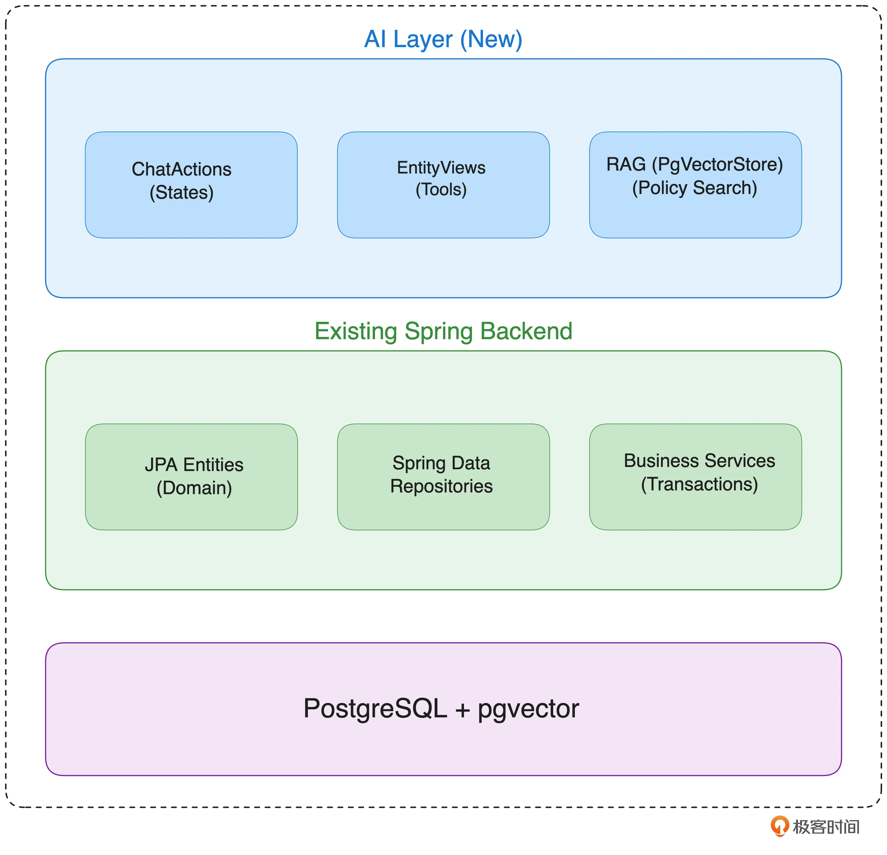
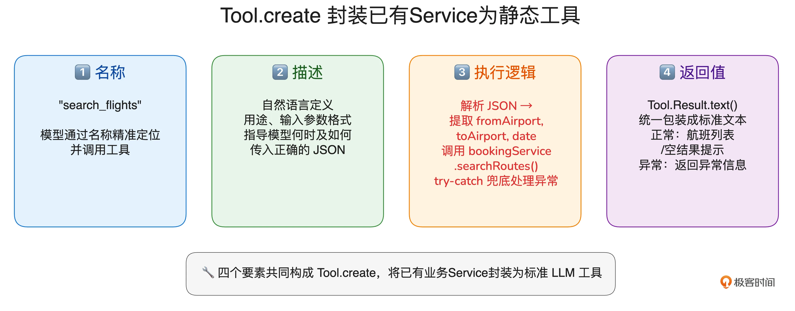
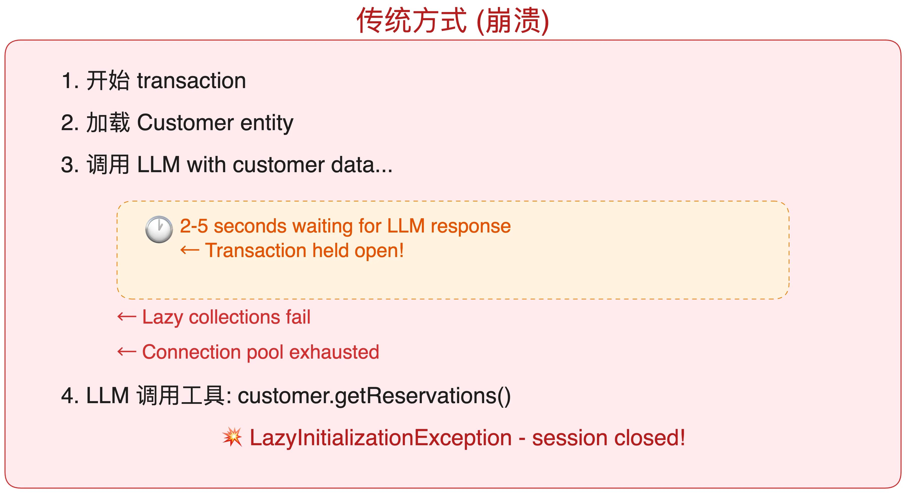
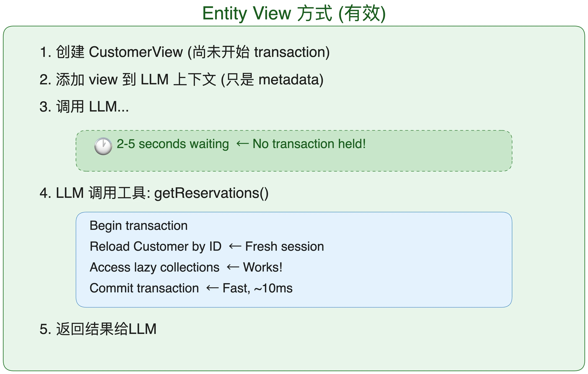
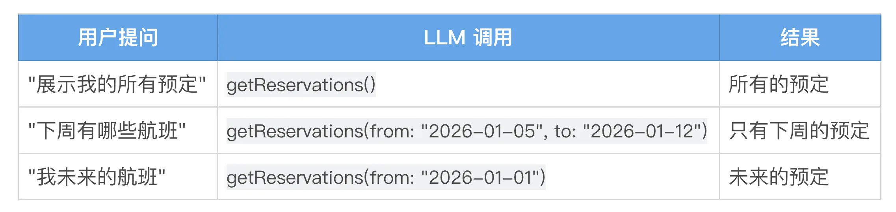

# 13｜系统集成：Agent 能力与现有系统无缝对接
你好，我是张嘉熙。

企业级 AI Agent 有一个绕不开的现实：Agent 不可能在真空中独立运行。它需要查数据库、调 REST API、发消息通知、读写文件系统——而这些能力，绝大多数都沉淀在企业已有的系统资产中。一个框架的集成能力，直接决定了 Agent 能否真正嵌入现有技术栈，而不是永远停留在原型阶段。

Embabel 作为 JVM 原生框架，构建于 Spring 和 Spring AI 之上，天然继承了 Spring 生态强大的集成能力。这节课，我们将用一个官方示例项目 [embabel-air](https://github.com/embabel/embabel-air)，一步步拆解如何在不修改现有代码的前提下，为已有的 Spring/Spring Data/JPA 后端安全地注入 Agent 能力。

## 核心思路：在现有系统上“加一层”，而非“改代码”

我们的策略非常明确：在现有系统之上构建一层极薄的 AI 适配层，让 Spring 后端原封不动，仅通过注解、接口定义、和少量代码就获得面向 LLM 的安全访问方式。



- 现有领域模型：JPA实体保持不变

- 现有持久化机制：Spring Data Repositories不变

- 现有业务逻辑：Service和事务不变

- 最上面添加AI层：以安全、事务性的访问方式，将已有能力暴露给 LLM


## 实践一：业务Service的工具化封装

现有系统的业务服务（如 BookingService）是为程序调用设计的，方法签名、返回值都是 Java 类型，LLM 无法直接使用。我们需要将它们包装成标准化的 Tool，让大模型能够方便地调用它们。



这一封装的核心在于四个要素：名称、描述、执行逻辑、返回值。下面以 [航班搜索工具](https://github.com/embabel/embabel-air/blob/146294683149a19914bd01468c0c6236f32fa185/src/main/java/com/embabel/air/ai/agent/ChatActions.java#L238) 为例展示完整的封装模式。

```plain
/**
 * 创建航班搜索工具
 *
 * @param bookingService 预订服务，用于查询航班路线
 * @return 返回一个 Tool 实例，供 LLM 调用
 */
private static Tool searchFlightsTool(BookingService bookingService) {
    // 工具的功能描述，会暴露给大模型，帮助模型理解何时以及如何调用该工具
    var description = """
            Search for available flights between two airports on a given date.
            Returns direct and one-stop connecting itineraries with prices.
            Input JSON: {"fromAirport": "JFK", "toAirport": "LAX", "date": "2026-03-15"}
            - fromAirport: 3-letter IATA airport code for departure
            - toAirport: 3-letter IATA airport code for arrival
            - date: departure date in YYYY-MM-DD format
            """;

    // 使用 Tool.create 静态方法构建工具，指定工具名称、描述以及执行逻辑
    return Tool.create("search_flights", description, input -> {
        try {
            // 将模型传入的 JSON 字符串解析为 JsonNode
            var node = objectMapper.readTree(input);

            // 从 JSON 中提取起飞机场代码
            var from = node.get("fromAirport").asText();
            // 从 JSON 中提取到达机场代码
            var to = node.get("toAirport").asText();
            // 从 JSON 中提取出发日期并转为 LocalDate
            var date = LocalDate.parse(node.get("date").asText());

            // 注意：此处调用预订服务查询航班路线，最后一个参数 1 代表一次中转
            var itineraries = bookingService.searchRoutes(from, to, date, 1);

            // 如果没有查到任何航班，返回明确的提示信息
            if (itineraries.isEmpty()) {
                return Tool.Result.text("No flights found from %s to %s on %s.".formatted(from, to, date));
            }

            // 构建结构化的返回文本，方便模型理解
            var sb = new StringBuilder();
            sb.append("Found %d itinerary(ies) from %s to %s on %s:\n\n".formatted(
                    itineraries.size(), from, to, date));

            // 遍历每条路线，生成带序号的摘要信息
            for (int i = 0; i < itineraries.size(); i++) {
                sb.append("Option %d: %s\n\n".formatted(i + 1, itineraries.get(i).summary()));
            }
            return Tool.Result.text(sb.toString());
        } catch (Exception e) {
            // 记录异常日志，并向前端返回友好的错误提示
            logger.error("search_flights error", e);
            return Tool.Result.text("Error searching flights: " + e.getMessage());
        }
    });
}

```

**封装要素分解**：

- **名称：** `"search_flights"`，模型通过名称精准定位工具

- **描述：** 用自然语言定义用途、输入 JSON 格式和字段含义，指导模型何时调用

- **执行逻辑：** 解析 JSON 参数，调用 bookingService.searchRoutes，try-catch 兜底

- **返回值：** 用 Tool.Result.text() 将航班列表、空结果或异常信息统一包装为标准文本，让 LLM 可靠解析


注意：这里工具方法不涉及任何有状态的 JPA 实体，输入是简单字符串和日期，返回的 Itinerary 也是从 Service 直接查出的纯数据。这种 “ **查询无状态实体**” 的工具是 AI 集成中最安全、最简单的模式。

## 实践二：JPA 实体与 AI 访问分离 —— EntityView 模式

一旦 Agent 需要访问数据库中的某个“活实体”（存在和其他实体的关联，需要开启事务等情况），实践一的方式就不再适用。

```plain
// JPA实体Customer
@Entity
@Table(indexes = {
        @Index(name = "idx_customer_username", columnList = "username", unique = true),
        @Index(name = "idx_customer_email", columnList = "email")
})
public class Customer implements User, NamedEntity {

    // 一对多关联到reservations
    @OneToMany(mappedBy = "customer", cascade = CascadeType.ALL, orphanRemoval = true, fetch = FetchType.LAZY)
    private final List<Reservation> reservations = new ArrayList<>();
    // getReservations方法
    public List<Reservation> getReservations() {
        return reservations;
    }
    // ...
}

```

比如需要查询当前登录的 Customer 及其关联reservations，传统方式就会崩溃：



- **事务超时**：LLM 思考很可能需要 2～5 秒，数据库事务不能开那么久。

- **懒加载失效**：Session 关闭后调用 customer.getReservations() 直接抛 LazyInitializationException。


为此，Rod Johnson 专门设计了 [EntityView](https://github.com/embabel/embabel-air/blob/main/src/main/java/com/embabel/springdata/README.md) 小框架（有兴趣的同学可以自己看看源码，只有五个代码文件）。其核心思想是： **调用 LLM 时不持有数据库连接，LLM 调用工具时才开启毫秒级短事务重新加载实体。**



下面我们具体看看如何使用这个EntityView。

```plain
@LlmView  // 将 Customer 实体包装为 LLM 可识别的视图（Entity View），视图内的方法可作为工具暴露给大模型
public interface CustomerView extends EntityView<Customer> {

    // ==================== 工具方法（Tools） ====================
    // 被 @LlmTool 标记的方法会自动注册为 LLM 可调用的工具，
    // 大模型会根据描述决定何时调用，并传入参数。

    /**
     * 获取航班预订记录，可选日期范围过滤。
     *
     * 实现逻辑：
     * 1. 通过 getEntity() 获取当前的 Customer 实体（由框架在合适的事务中加载）
     * 2. 从实体中取出所有预订（getReservations()）
     * 3. 如果提供了开始日期 from，则过滤掉日期早于 from 的预订
     * 4. 如果提供了结束日期 to，则过滤掉日期晚于 to 的预订
     * 5. 返回过滤后的不可变列表
     *
     * 注意：日期范围是可选的，当两个参数都为 null 时，返回全部预订。
     */
    @LlmTool(description = "Get flight reservations, optionally filtered by date")
    default List<Reservation> getReservations(
            @LlmTool.Param(description = "Start date", required = false) LocalDate from,
            @LlmTool.Param(description = "End date", required = false) LocalDate to
    ) {
        return getEntity().getReservations().stream()
                .filter(r -> from == null || !r.getDate().isBefore(from))
                .filter(r -> to == null || !r.getDate().isAfter(to))
                .toList();
    }

    /**
     * 获取客户的忠诚度状态信息。
     * 直接返回实体中的 LoyaltyStatus 对象，包含等级、积分、会员 ID 等。
     * 这是一个无参工具，LLM 可以随时调用以了解客户身份。
     */
    @LlmTool(description = "Get loyalty program status")
    default LoyaltyStatus getStatus() {
        return getEntity().getLoyaltyStatus();
    }

    // ==================== 自定义格式化（可选） ====================
    // 如果不重写，EntityView 有默认的实现。
    // 这里自定义目的是让 LLM 看到的摘要和详细文本更符合业务需求。

    /**
     * 生成一条简短摘要，用于在对话中快速标识该客户。
     * 例如："Customer: John Doe (Gold)"
     * 默认实现可能只返回类名，这里改为返回姓名和会员等级。
     */
    @Override
    default String summary() {
        var c = getEntity();
        return "Customer: %s (%s)".formatted(c.getName(), c.getLoyaltyStatus().getLevel());
    }

    /**
     * 生成完整的客户信息文本，提供给 LLM 作为上下文。
     * 包含姓名、邮箱、会员ID、等级、积分和预订数量。
     * 这些信息会在 LLM 需要了解客户全貌时被框架注入到提示词中。
     */
    @Override
    default String fullText() {
        var c = getEntity();
        return """
            Customer: %s
            Email: %s
            Member ID: %s
            Status: %s (%,d points)
            Reservations: %d
            """.formatted(
                c.getName(),
                c.getEmail(),
                c.getLoyaltyStatus().getMemberId(),
                c.getLoyaltyStatus().getLevel(),
                c.getLoyaltyStatus().getPoints(),
                c.getReservations().size()
            );
    }
}

```

EntityView 的使用流程归结为四步：

1. 定义接口继承 EntityView<实体类型>，加 @LlmView。

2. 用 @LlmTool 标记 LLM 可调用的方法，实现体内通过 getEntity() 获取实体。

3. 按需重写 summary() / fullText() 提供合适的上下文格式。

4. 剩下的就交给框架：自动发现EntityView、自动从@LlmTool方法创建工具、自动处理事务和延迟加载等。


这里我们注意一点，getReservations这个方法定义了两个required = false的参数，用于数据过滤，这是一个很有用的技巧。举个例子（假设今天是2026-01-01，下周第一天是2026-01-05）：



这能让 LLM 精确按需取数，避免把全部记录拉出来后自己在上下文中筛选，既省 Token，又提升准确性。

## 实践三：复用现有数据库集成 RAG

当前项目已经在用支持 pgvector 扩展的 PostgreSQL数据库（包含业务表：customers、reservations 等），那么构建 Agentic RAG 只需复用现有 DataSource，无需额外基础设施。这里我们省略了Ingestion等步骤，仅关注核心逻辑。

```plain
@Configuration
@EnableConfigurationProperties(AirProperties.class)
public class RagConfiguration {

    // 创建 PgVectorStore，复用现有 DataSource
    @Bean
    PgVectorStore pgVectorStore(
            Ai ai,
            DataSource dataSource,  // ← 复用已有的数据源！
            AirProperties properties) {
        var store = new PgVectorStoreBuilder()
                .withName("docs")                    // 存储名称
                .withDataSource(dataSource)          // 关键：使用应用已有的 DataSource
                .withEmbeddingService(ai.withDefaultEmbeddingService())
                .withChunkerConfig(properties.chunkerConfig())
                .withChunkTransformer(AddTitlesChunkTransformer.INSTANCE)
                .build();
        logger.info("Loaded {} chunks into PgVectorStore", store.info().getChunkCount());
        return store;
    }

    // 创建ToolishRag并用AirlinePolicies简单包装
    @Bean
    AirlinePolicies airlinePolicies(PgVectorStore searchOperations) {
        return new AirlinePolicies(
                // 此处使用了PgVectorStore
                new ToolishRag("policies", "Embabel Air policies", searchOperations)
                        .asMatryoshka()  // 转换为嵌套工具
        );
    }

    // 定义类型化包装类
    public record AirlinePolicies(LlmReference reference) {}
}

```

结合 [07](https://time.geekbang.org/column/article/981115) 讲的知识，你一定能明白这里的逻辑，ToolishRag 会自动将向量搜索能力包装成一个可被 LLM 调用的嵌套工具，配合 PgVectorStore 即可完成文档检索。

## 实践四：AI层的最终整合

现在我们把前三次实践的成果，工具列表、EntityView 引用、RAG 引用，汇聚到 Embabel 规划层的 @Action 中。首先，收集所有 Tool：

```plain
var tools = new LinkedList<>(commonTools());
// bookingTools 里包含了 searchFlightsTool 等静态工具
tools.addAll(bookingTools(bookingService, customer));
// 顺便可以看看这里，此处将部分 Spring Data Repository 也转化为tools，和我们的实践一很类似
tools.addAll(conversation.getAssetTracker().addAnyReturnedAssets(
        entityViewService.repositoryToolsFor(ReservationRepository.class)));
tools.addAll(conversation.getAssetTracker().addAnyReturnedAssets(
        List.of(entityViewService.finderFor(Reservation.class))));

```

然后，收集 LlmReference（此概念其实和tool类似，只是LlmReference通常有多个tool并带有系统提示而已）：

```plain
references.add(entityViewService.entityReferenceFor(customer)); // customer 对应的 reference
references.add(airlinePolicies.reference()); // RAG 对应的 reference

```

最后，这些资源会在 Agent 的Action方法中提供给LLM：

```plain
@Action(pre = "shouldRespond", canRerun = true)
AirState respond(
        Conversation conversation,
        Customer customer,
        ActionContext context,
        @Provided EntityViewService entityViewService,
        @Provided AirlinePolicies airlinePolicies,
        ...

// ...
// tools提供给LLM
.withTools(tools)
// ...
// references提供给LLM
.withReferences(references)

```

另外值得说明的是，在 @Action 之上，还有 @State 来定义状态机的流转。尽管状态机规划目前尚未展开讲解，但这其实已经把我们带到了 Agent 系统最顶层的规划层面。至此，整个 Agent 已经完成了与现有系统的集成，能够自主决定何时调用工具、何时查询有状态 JPA 实体、何时利用 RAG 知识——而这一切，都建立在对现有代码零侵入的基础之上。

## 本讲小结

这一讲，你攻克了 Embabel 企业级落地的核心关卡——系统集成，并看清了它“加一层而非改旧代码”的架构智慧。

我们不用再担心 JPA 懒加载异常和事务超时会把 Agent 拖垮，而是掌握了 **EntityView 模式** 的精髓：用 @LlmView 把实体包装成安全的“静态视图”，LLM 对话时不占连接，工具调用时才开启毫秒级短事务重新加载数据。原来那些让传统方案头疼的 LazyInitializationException，在 getEntity() 的桥接下一键化解，事务性安全与 AI 灵活性从此兼得。

我们学会了从 **无状态 Service 到有状态实体** 的双重工具化策略：一手用 Tool.create 将现有 BookingService 封装为标准工具，名称、描述、执行逻辑、返回值四要素一气呵成；另一手通过 @LlmTool 把实体上的过滤查询（如日期范围）直接暴露给 LLM，让模型精准按需取数，告别 Token 浪费。更惊喜的是，RAG 也能基于现有数据库丝滑接入——PgVectorStore 复用 DataSource，ToolishRag 包装后立即上岗，现有资产零浪费。

最后我们站上 AI 层，将Tool、LlmReference一并注入 Embabel 的规划层Action。Action 之下，旧系统的厚重与新 Agent 的灵动完美合流，现有代码零侵入，智能交互新体验立等可取。

**零侵入适配、事务安全、资源复用**——这套集成方案让企业存量系统瞬间获得 Agent 级的对话能力。下一讲，我们将深入了解 Embabel 的可观测性实现方式，看看如何处理 Embabel Agent 的日志、追踪和性能剖析。

## 思考题

在本讲中，我们为现有 Spring/JPA 系统添加 AI 层时，有两个看似矛盾的设计决策：

- **Service 工具化**：把 BookingService.searchRoutes 封装成 Tool.create(“search\_flights”, …)，工具内部直接调用现有 Service。

- **EntityView 模式**：定义 CustomerView extends EntityView，工具方法通过 getEntity() 访问数据，框架在每次调用时重新开启短事务。


请你思考并回答以下问题：

为什么不能直接在 Service 工具里操作 JPA 实体？

假设 searchFlightsTool 的实现中，除了调用 bookingService.searchRoutes，还需要访问当前登录的 Customer 实体（例如校验客户是否有权限搜索某些航线）。这时如果把 Customer 实体直接作为参数传入工具，会面临什么风险？EntityView 模式是通过什么机制化解这些风险的？

欢迎你在留言区分享你的思考，如果你觉得有所收获，也欢迎你分享给其他需要的朋友，我们下节课再见！