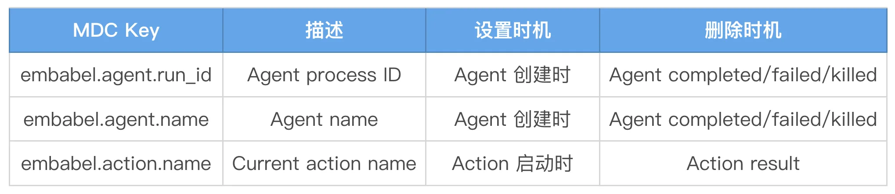
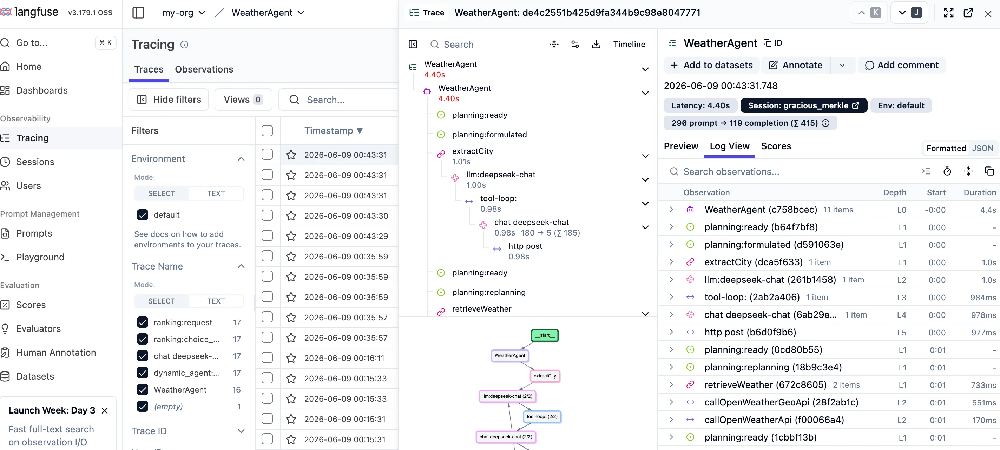
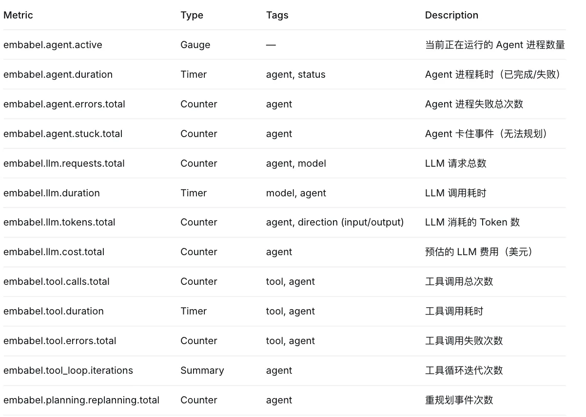

# 14｜Agent 可观测性：打开黑盒，日志、追踪、性能剖析
你好，我是张嘉熙。

通过前面十三讲的内容，我们掌握了如何构建一个能跑、能省钱、能防事故、能测试、能与现有系统无缝对接的企业级 AI Agent。但还有一个关键问题没有回答： **Agent 在运行时到底发生了什么？**

它选择了哪个 Action？为什么选这个而不是那个？LLM 调用花了多少钱、用了多少 Token？哪一步卡住了？哪个 Action 执行失败了？

而在 Embabel 中，可观测性是一等公民——Embabel 提供了 **专门的可观测性模块，无需任何代码更改** 即可自动跟踪agent的生命周期、Actions、LLM 调用、工具调用等。它可与任何兼容 OpenTelemetry 的后端（Zipkin、Langfuse、Jaeger、Prometheus 等）集成。

Embabel 提供的可观测性依赖：

```plain
<dependency>
    <groupId>com.embabel.agent</groupId>
    <artifactId>embabel-agent-starter-observability</artifactId>
    <version>${embabel-agent.version}</version>
</dependency>

```

本讲，我们就继续以天气查询agent为例，来拆解 Embabel 可观测性能力的三大支柱，让 Agent 从“黑盒”变成“透明体”。

## 第一根支柱：Logs（日志）

在 Agent 系统中，多个会话并发、Action 内部另起线程、异步调用 LLM 是常态。一旦日志混在一起，排查问题就像在一堆没有标签的快递里翻找自己的包裹。

SLF4J MDC（Mapped Diagnostic Context，映射诊断上下文）就是SLF4J（以及 Logback、Log4j 等底层日志框架）提供的给每条日志打上“标签”的机制。它允许你在同一个线程中将一些关键的上下文信息（如 traceId、userId、客户端IP等）绑定到日志系统中，在打印日志时自动输出这些信息。

这里最大的难点是多线程场景下的上下文传递和清理，设想一下如果框架没有提供这样的能力，我们自己开发的话一定挺麻烦。但我们作为 Embabel 用户完全不用担心，框架已经帮我们搞定了。在Embabel agent中， **代理上下文会自动传播到 SLF4J MDC 中**，我们无需显式打印日志就会自动完成对以下MDC Key的设置和删除。



举个例子，下面的日志片段中我们可以看到有两个线程（task-1和main），它们打印出了Agent process ID（gracious\_merkle）和 Current action name（extractCity），而我们没有做任何显式操作，一切都是自动完成的。如果你在本地运行过 01 讲的代码，应该已经见过这样的日志。

```plain
00:43:31.771 [task-1] INFO  Embabel - [gracious_merkle] (extractCity) starting tool loop [] max=20
00:43:32.760 [task-1] INFO  Embabel - [gracious_merkle] (extractCity) tool loop completed in 983ms iterations=1 replan=false
00:43:32.763 [main] INFO  Embabel - [gracious_merkle] (com.example.embabel.agent.WeatherAgent.extractCity-com.example.embabel.agent.WeatherAgent$City-1) received LLM response of type City from AutoModelSelectionCriteria in 0 seconds
00:43:32.763 [main] INFO  Embabel - [gracious_merkle] object bound it:City
00:43:32.764 [main] INFO  Embabel - [gracious_merkle] executed action com.example.embabel.agent.WeatherAgent.extractCity in PT1.008S
00:43:32.766 [main] INFO  Embabel - [gracious_merkle] ready to plan from:

```

我们简单分析下这段日志：

- 第 1 行告诉我们在agent 进程 gracious\_merkle，Action extractCity里，工具循环上限是 20 次，这是防御性设计，防止 LLM 在循环里卡死。

- 第 2 行同样在agent 进程 gracious\_merkle，Action extractCity里，iterations=1 说明 LLM 一次就成功了，如果出现 iterations=3 或 replan=true，你就要警惕 —— 可能是 Prompt 有歧义或工具返回不规范。

- 第 3 行的线程从 task-1 变为 main，却没有丢失 agent 进程gracious\_merkle，这验证了上下文传播在多线程执行中正常工作。

- 第 5 行总耗时 1.008 秒代表了agent 进程 gracious\_merkle的执行时间。


很明显，这样的日志对我们debug很有利，因为每一行日志都能告诉我们是”谁“在什么时间做了什么，我们只要搜索这个“谁”（特定的MDC Key）就好了。

顺便说一句如果你不想要这种自动集成，也可以通过配置文件（application.yml）关闭这种能力。

```plain
embabel:
  observability:
    mdc-propagation: false

```

## 第二根支柱：Traces（追踪）

其实 Agent 系统的追踪很多时候比传统微服务更难。微服务的调用链通常是线性的：A → B → C，Span 层级清晰。但 Agent 的一次 run 里，会经历“规划 → 执行 Action → 工具调用 → 再次规划”的循环，甚至内部还会触发子 Agent、多步 LLM 推理。如果不刻意设计 Span 模型，追踪数据要么变成一坨无法理解的巨型 Span，要么丢失关键的决策分支。

Embabel 的做法是： **为 Agent 的生命周期建立一套语义化的 Span 约定**。每个 Action 是一个 Span，内部的 LLM 调用、工具调用是子 Span，GOAP 规划步骤也是一个 Span。这样在追踪后端中，如Langfuse、Zipkin、OTLP (Jaeger, Tempo)，你看到的不是混乱的调用栈，而是一个有逻辑的故事线。

下面我们以Langfuse为例进行逐步讲解，上面我们已经提到embabel-agent-starter-observability这个依赖，在此基础上，只需添加对应Langfuse的exporter dependency即可。

第一步：添加依赖

```plain
<dependency>
    <groupId>com.quantpulsar</groupId>
    <artifactId>opentelemetry-exporter-langfuse</artifactId>
    <version>0.4.0</version>
</dependency>

```

第二步：配置 application.yml

```plain
embabel:
  observability:
    enabled: true
    service-name: my-agent-app

management:
  tracing:
    enabled: true
    sampling:
      probability: 1.0

  langfuse:
    enabled: true
    endpoint: https://cloud.langfuse.com/api/public/otel  # or self-hosted URL
    public-key: pk-lf-...
    secret-key: sk-lf-...

```

这里我们需要注意，在开发测试阶段，我们可以设置100%采样（probability: 1.0），但是 **在生产环境Traces采样率一定要调低到合适的程度**，也许0.01就够了。

第三步：启动应用并触发 Agent

不需要修改任何业务代码。启动我们的天气查询 Agent 后，调用 Agent，例如在shell输入x “北京天气”，追踪数据就会自动发送到 Langfuse。

第四步：在 Langfuse 中分析追踪



追踪数据到达后，你可以在 Langfuse Dashboard 中看到：

- Trace 列表：所有 Agent 执行记录，包含时间戳、延迟和 Token 数量

- Trace 时间线：深入单个 Trace，查看完整的 Span 层级结构——Agent Action、LLM 调用、工具调用和 GOAP 规划步骤

- 输入/输出详情：检查发送给模型的 Prompt 和收到的回复，以及模型名称和 Token 用量等元数据

- 分析仪表板：追踪成本、延迟和使用趋势


提醒一下，发送到Langfuse的数据可能需要做脱敏处理，避免将敏感信息直接暴露在Langfuse侧，我们可以考虑 [Masking](https://langfuse.com/docs/observability/features/masking) 等方式来处理。

再补充一个小点，Embabel也支持我们自定义追踪（使用@Tracked），比如我们可以为调用天气API专门定义一个追踪，如下所示：

```plain
@Tracked(
    value = "callOpenWeatherApi",
    type = TrackType.EXTERNAL_CALL,
    description = "weather call"
)
public WeatherAgent.OpenWeatherResponse getWeather(String weatherApiUrl){
    return restTemplate.getForObject(weatherApiUrl, WeatherAgent.OpenWeatherResponse.class);
}

```

这里注意，由于@Tracked使用 Spring AOP 代理，同一类内部的方法调用不会被拦截，请将跟踪的方法提取到一个单独的@Component bean 中。

## 第三根支柱：Metrics（指标）

日志和追踪都只能回答“某一次调用发生了什么”，却无法回答“过去一小时平均延迟是否在恶化”“Token 用量趋势如何”“P99 延迟是否已超过 SLO”。这正是 Metrics 的战场：聚合后的时间序列数据，让你发现趋势、计算容量、控制成本。

Embabel 基于 Micrometer 自动注册了一系列 Agent 专属指标，并暴露为 Prometheus 格式。未来 1.0 版本会提供预置 Grafana Dashboard，但在此之前，我们可以靠自己搭建Prometheus和Grafana环境，再加几行配置搞定。

第一步：仍是先添加依赖

```plain
<dependency>
    <groupId>io.micrometer</groupId>
    <artifactId>micrometer-registry-prometheus</artifactId>
</dependency>

```

第二步：配置 application.yml

```plain
management:
  endpoints:
    web:
      exposure:
        include: prometheus, health, metrics
  prometheus:
    metrics:
      export:
        enabled: true

```

第三步：验证Metrics是否有效

```plain
http://localhost:8080/actuator/prometheus

```

我们顺便看看所有已经自动注册好的业务Metrics。



我们能看出上面这些Metrics还是很精细的，将一些容易忽视但重要的点也纳入其中，比如Agent 卡住，重规划次数等。从更深层次的角度来看，这些Metrics放在一起，本质上是 **用数据还原 Agent 的思考质量与运行成本**。

第四步：本地启动Prometheus和Grafana

```plain
docker run -d -p 9090:9090 prom/prometheus
docker run -d -p 3000:3000 grafana/grafana

```

## 延伸：Profiling（性能剖析）与综合联动

日志、追踪、指标三者分别回答了“发生了什么”“在哪一步耗时多少”“趋势是否恶化”，但它们都属于行为观测，不能直接回答“是哪一行代码占用了最多 CPU”或“哪个对象分配导致 GC 压力”。这时我们就需要引入“潜在的第四根支柱Profiling”来帮忙。

Embabel 是基于 JVM 的 AI Agent 框架，支持大多数主流的 JVM Profiling 工具。需要时，可选用商业化工具YourKit、JProfiler，也可以用免费工具JFR、arthas等等。这一环在生产中无需常驻，但应在性能调优时纳入标准排查路径。具体的工具使用方式在网上很多，这里不再细讲。

最后，我们回过头来看，可观测性的真正威力，不在于 Logs、Traces、Metrics 各自为战，而在于三者联动时产生的“化学反应”—— **它们不再只是各自回答一个单一问题，而是互相印证、互补盲区、串成因果链。**

比如，Metrics 里发现 agent duration 飙升，这时你需要 Traces 下钻到那条慢 Span，看清是哪个 Action、哪次 LLM 调用拖了后腿；再顺着 Trace 里的 traceId 反查 Logs，还原出那次调用在工具循环里重试了几次、输出了什么异常内容。

反过来，一条日志里的微小异常也可以反向驱动你在 Metrics 里验证“这是偶发还是个趋势”，再用 Traces 去锁定问题路径。

三根支柱之间不是一次性的接力，而是一种 **双向的、可跳跃的排查网络**——你从一个线索切入，在不同数据源之间反复跳转、验证、深化，直到那个只有三者共同指向才能暴露的真相浮出水面。这种联动思维一旦形成，调试 Agent 就不再是猜谜，而是一场有据可循的推理。

## 本讲小结

这一讲，你亲手拆解了 Embabel 的可观测性体系，把 Agent 从“黑盒”变成了“透明体”。这不仅是加监控，更是为你赢得了一种掌控感——运行时发生的一切，不再靠猜。

- **让每一行日志都有“身份证”**：SLF4J MDC 的自动上下文注入，让你在多线程并发、异步调用的混乱里，能凭一个 processId 瞬间串联起 Agent 完整的思维脉络。你不用再担心日志变成无头苍蝇，因为每一条都清晰地告诉你“谁、在哪个 Action、做了什么”。

- **我们用追踪这把“手术刀”，深入 Agent 层层嵌套的调用链**。从 GOAP 规划到 Action 执行，再到 LLM 调用和工具请求，一条语义清晰的 Span 树让整个决策过程纤毫毕现。你学会了在 Langfuse 里审视每一次与模型对话的成本与耗时，知道为什么选了这个 Action 而不是那个，也能揪出“藏”在 Prompt 里的无用信息。

- **点亮指标的“仪表盘”。** 你明白日志和追踪只能回答个案，而 embabel.agent.stuck.total、embabel.llm.tokens.total 这些精心设计的 Metrics，能用聚合后的趋势回答“系统是否卡住”、“钱正用多快的速度燃烧”。Agent 的“卡住”和“重规划”不再是盲区，而是你 Dashboard 上两条一旦上扬就必须警惕的曲线。

- 最后，你补齐了 Profiling 这块性能拼图。当行为观测走到尽头，你知道如何将矛头从“哪个Action慢了”精准地指向“哪一行代码在消耗 CPU”。


从头到尾，零代码侵入。这份“开箱即用”的透明，让你把精力留在创造，而非排查。下一讲，我们会把这些全部整合为一份“生产就绪检查清单”，并通过一个综合实战案例，展示如何把我们学过的知识组合成一个完整的、可上线的企业级 AI Agent 项目。

本讲 [GitHub 地址](https://github.com/zhangjessey/embabel-java-agent-tutorial/tree/ch14/observability)

## 思考题

请动手完成以下练习，真正掌握 Embabel 可观测性体系的工程实践。

请你先“搞破坏”，再“找问题”。请你为天气查询 Agent 进行两个破坏实验，然后凭本讲学到的可观测性手段，从现象一路追到根因。

实验一：让工具“有问题”

修改天气查询工具，让它故意返回错误的数据。然后正常启动 Agent，连续查询几个城市的天气。你要做的：不看你刚才改的代码，只通过 Metrics、Traces、Logs 找出问题。

实验二：让 LLM 调用“出问题”

在 Prompt 中偷偷注入一大段无关的文本，但只针对某个特定城市触发。其他城市的查询保持正常。然后混着查几个城市，让系统运行一段时间。你要做的：假装你不知道“特定城市被下毒”，仍然是不看代码发现异常，并证明异常的根本原因是 Prompt 导致的。

欢迎你在留言区分享你的思考，如果你觉得有所收获，也欢迎你分享给其他需要的朋友，我们下节课再见！