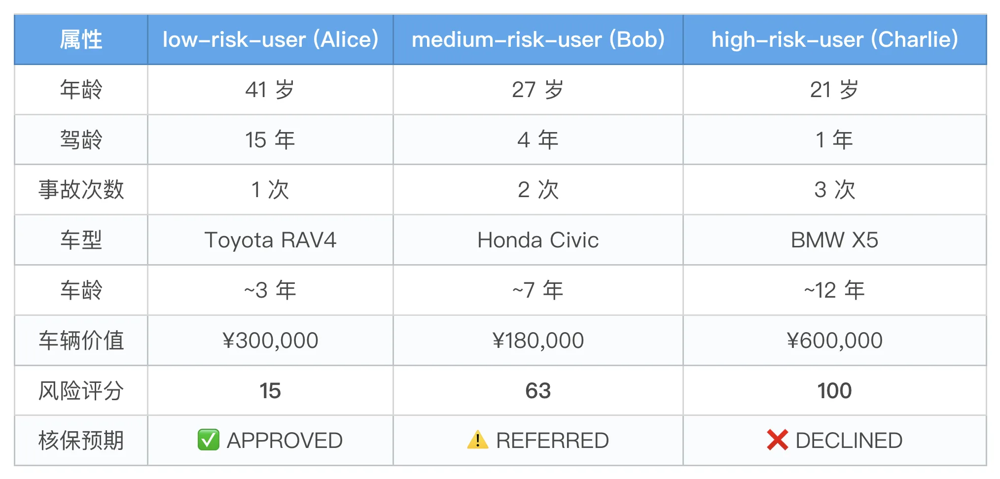
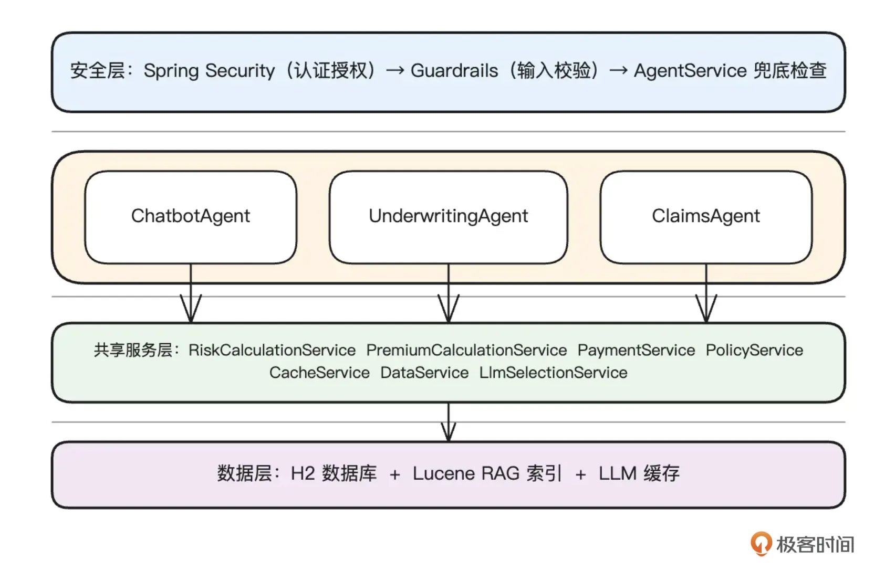
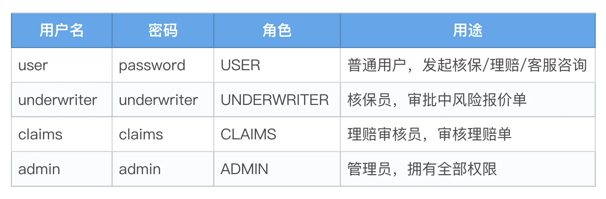
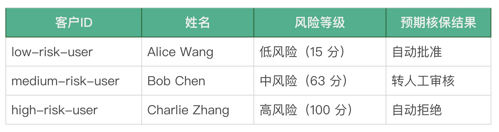
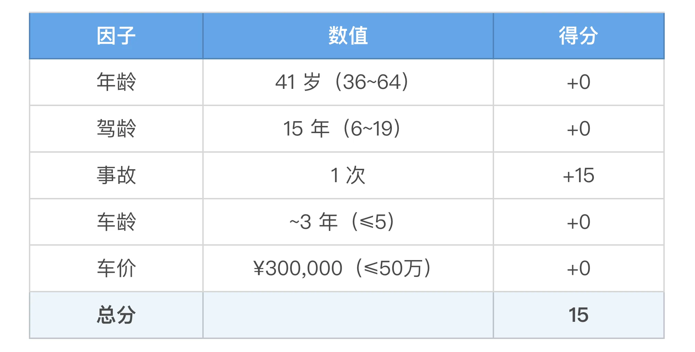
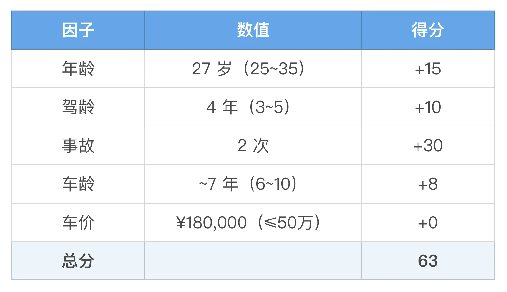
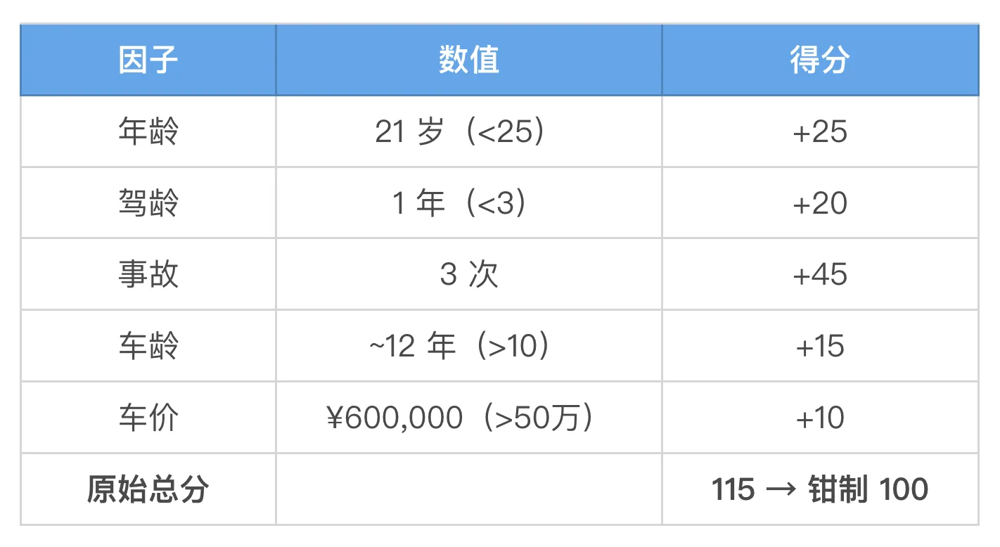
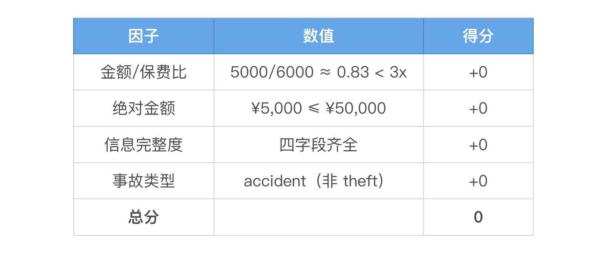
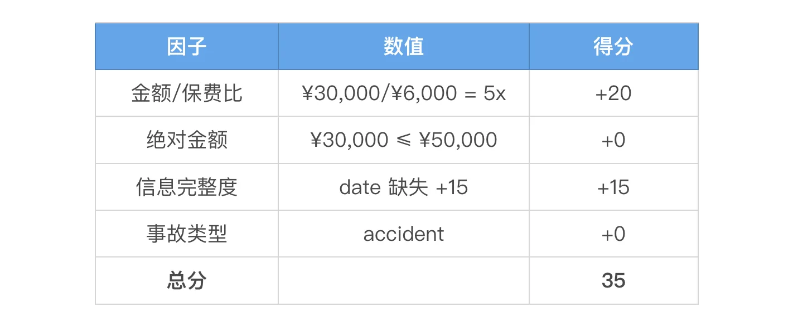
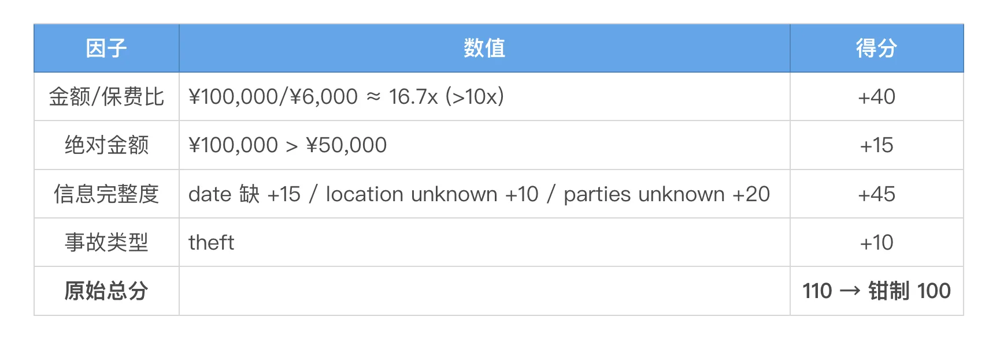

# 15｜从 0 到 1：构建一个企业级智能保险 Agent 平台
你好，我是张嘉熙。

在前面十四讲中，我们拆解了 Embabel Agent 的规划模式、RAG、缓存、安全、测试、可观测性等内容——每一讲都是一块独立的拼图。但你可能有个疑问：这些拼图拼在一起，到底能不能撑起一个真正的企业级业务？本讲直接选一个最难取巧的场景来回答——保险。它同时踩中了两个点： **容错率极低，规则极为明确**。

容错率低，是因为保险的决策链路是有序的，一步错全线歪。而且决策一旦执行就很难撤销——电商发错货了可以拦截召回，保险赔付错了，很可能要走法律诉讼，那已经超出系统能控制的范围。加上涉及资金和敏感数据，安全合规是硬门槛；同时保险的规则又很明确。风险低中高对应批、审、拒。分支可穷举，总共有哪些路都是确定的。

两个特征合在一起，逼我们必须要想清楚——哪些事让 LLM 做，哪些事不能让它碰。

我们的目标不是做一个看起来很酷的 Demo，而是认真探索 Agent 在真实落地中的能力边界：能做什么、不能做什么、优势在哪、局限在哪。同时，也检验 Embabel 框架在这种场景下到底能不能用、怎么用。

## 架构设计

### 核心链路

真实保险业务极其复杂（精算模型、监管合规……），我们不可能全做。我们的设计是：提炼核心链路，用最少的代码覆盖最核心的场景。

我设计了三个 Agent，覆盖保险业务的核心闭环：

```
用户咨询（ChatbotAgent）
    │
    ▼
核保（UnderwritingAgent）
    ├── LowRiskQuote        风险评分 ≤ 60 → 自动批准
    ├── MediumRiskReview    风险评分 61-79 → 转人工审核
    ├── HighRiskDecline     风险评分 ≥ 80 → 自动拒绝
    ├── CustomerNotFound    客户不存在 → 错误
    ├── VehicleLookupError  车辆查找失败 → 错误
    └── ExtractionFailed    LLM 提取失败 → 错误
    │
    ▼（仅 APPROVED 可支付）
支付（PaymentService）
    ├── 状态校验 → 只有 APPROVED 才能支付
    ├── 过期检查 → 报价单未过期
    └── 生成保单 → 一年期 ACTIVE 保单
    │
    ▼
理赔（ClaimsAgent）
    ├── AutoApproved         欺诈评分 < 30 → 自动赔付
    ├── PendingReview        欺诈评分 30-69 → 启动调查
    ├── AutoDenied           欺诈评分 ≥ 70 → 拒绝理赔
    ├── PolicyError          保单无效 → 错误
    ├── DuplicateClaimDetected  重复理赔 → 错误
    └── InputError           输入不合法 → 错误

```

为了覆盖所有分支，我们设计了三个测试用户，数据分布从“完美客户”到“高风险分子”：



### 整体架构图

在深入细节之前，我们先看全局：



三个 Agent 各司其职，但共享同一套安全层、服务层和数据层。

### 规划器选择：状态机（@State）

在前面章节的规划器对比中，我们说过状态机”太死板“。但在保险这种流程固定、分支可穷举的场景中，死板恰恰是优点。@State 就是 Embabel 为这类场景提供的状态机式路由——它帮你处理“评估后走哪条分支”。

Embabel支持将GOAP、Utility AI等规划器与@State结合在一起使用，比如：

- 在运行时将输入分类到不同的类别中

- 通过特定类别的处理程序进行路由处理

- 根据分类实现不同的目标


我们后面的实现中就用到了上面说的这种方式，现在我们只需要知道 @State 让我们用声明式、类型安全的方式表达了“多个互斥分支”这类业务逻辑就可以了。

### LLM 的角色定位

做 Agent 项目时一定要避免陷入一个误区：不分青红皂白，什么都让 LLM 做。评分让 LLM 做，计算让 LLM 做，路由让 LLM 做——结果就是贵、慢、不可靠。本项目中，我们对 LLM 的使用非常克制。让我们明确区分：

用 LLM 的地方：

- **自然语言提取**：用户说“我要给京A12345的Toyota RAV4投保”，LLM 从中提取车牌号、品牌、车型。这是 LLM 擅长的事，把非结构化文本变成结构化数据。

- **语义判断**：理赔时判断事故描述是否完整。欺诈者往往说车被撞了，但说不出具体时间、地点、涉及方，这种模糊性需要 LLM 来判断。

- **客服问答**：用户问“什么是综合险？理赔流程是怎样的？”——Agentic RAG 让 LLM 自主检索并回答。


不用 LLM 的地方：

- **风险评分**：年龄 +25、驾龄 +20、事故 +15……这些是纯数学公式，用 Java 算比 LLM 快 1000 倍、便宜 1000 倍、准确 100%。

- **保费计算**：车辆价值 × 2% × 风险系数 × 险种系数——公式，不是推理。

- **数据库查询**：查客户、查车辆、查保单——SQL就够了。

- **支付状态校验**：只有 APPROVED 才能支付、不能过期——这是确定性逻辑，不需要“智能”。


核心原则： **LLM 负责“理解”，业务规则负责“决策”**。

## 工程实现

### 用户角色与权限体系

认证用户（登录系统的人）：



业务数据（被核保/理赔的客户）：



我们使用 Spring Security 配置了 HTTP Basic 认证和角色授权。核保和理赔接口需要认证，/api/insurance/quotes/{id}/approve 需要 underwriting:approve 权限（UNDERWRITER 或 ADMIN），/api/insurance/claims/{claimNumber}/review 需要 claims:review 权限（CLAIMS 或 ADMIN）。

### 核保 Agent

整个核保流程分为四个阶段，规划器负责编排前四步的执行顺序：

```
extractVehicleInfo (LLM) → lookupCustomer (DB) → lookupVehicle (DB) → assessRisk (入口) → @State 路由

```

- extractVehicleInfo：LLM 从自然语言提取车牌、品牌、车型

- lookupCustomer / lookupVehicle：数据库查客户档案和车辆信息

- assessRisk：计算风险评分，根据分数创建对应的 @State 对象

- @State 路由：框架根据返回类型自动调用对应方法


路由结构如下：

```
                    assessRisk (入口)
                         │
          ┌──────────────┼──────────────┬──────────────┐
          ▼              ▼              ▼              ▼
     score ≤ 60      score < 80     score ≥ 80       前置出错
         │              │              │              │
         ▼              ▼              ▼              ▼
    ┌──────────┐  ┌───────────┐  ┌───────────┐  ┌──────────┐
    │LowRiskQuote│  │MediumRisk │  │HighRisk   │  │Error     │
    │  批准     │  │ Review    │  │ Decline   │  │ States   │
    │ APPROVED  │  │ REFERRED  │  │ DECLINED  │  │ ERROR    │
    └──────────┘  └───────────┘  └───────────┘  └──────────┘
                      │
                      ▼ 人工审核
               POST /quotes/{id}/approve
                      │
                      ▼
                   APPROVED

```

**批准分支：low-risk-user → LowRiskQuote**

以 Alice 为例，用户输入：“我要给京A12345的 Toyota RAV4 投保，userId=low-risk-user。”

步骤追踪：

- extractVehicleInfo（LLM） → 提取出车型 RAV4

- lookupCustomer（DB） → Alice：年龄 41、驾龄 15 年、事故 1 次

- lookupVehicle（DB） → RAV4：2022 年款、价值 ¥300000

- assessRisk（评分 + 分类） → 评分计算




评分 15 ≤ 60 → 返回 new LowRiskQuote(...) → 框架自动路由到 handleLowRisk()

签发报价单：保费 = ¥300000 × 2% × 0.8（低风险系数）× 1.0（综合险）= ¥4800

结果：状态 APPROVED，保费 ¥4800。下一步通过 /api/insurance/pay 完成支付。

**审核分支：medium-risk-user → MediumRiskReview**

以 Bob 为例，同样的流程走到 assessRisk 时：



评分 61～79 → 返回 new MediumRiskReview(...) → 路由到 handleMediumRisk()，签发状态为 REFERRED 的报价单。

Bob 收到的消息：“报价已转交核保员审核。系统计算保费：¥xxx。审批请调用 POST /api/insurance/quotes/{id}/approve”。

人工审批：核保员通过 POST /quotes/{id}/approve 审批后，报价单转为 APPROVED，用户即可支付。

**拒绝分支：high-risk-user → HighRiskDecline**

以 Charlie 为例，assessRisk 计算出评分 100（≥ 80），直接拒绝：



返回 new HighRiskDecline(...) → 路由到 handleHighRisk()，状态 DECLINED。

### 理赔 Agent

理赔 Agent 与核保其实颇有几分相似。

```
verifyPolicy (DB) → extractClaimInfo (LLM) → calculateFraudScore → classify (入口) → @State 路由

```

- verifyPolicy：校验保单存在、ACTIVE 且在有效期内

- extractClaimInfo：LLM 提取事故结构化信息（类型/地点/日期/涉及方）；LLM 失败时回退到关键词匹配

- calculateFraudScore：四因子欺诈评分

- classify：入口动作——先做重复检测和前置错误检查，再按评分路由


路由结构如下：

```
                    classify (入口)
                         │
          ┌──────────────┼──────────────┬──────────────┐
          ▼              ▼              ▼              ▼
     score < 30      score < 70    score ≥ 70       前置出错
         │              │              │              │
         ▼              ▼              ▼              ▼
    ┌───────────┐ ┌───────────┐  ┌───────────┐  ┌──────────┐
    │AutoApproved│ │Pending    │  │AutoDenied │  │Error     │
    │  自动赔付   │ │ Review    │  │  拒绝     │  │ States   │
    │ APPROVED   │ │ INVESTI-  │  │ DENIED    │  │ ERROR    │
    └───────────┘ │ GATING    │  └───────────┘  └──────────┘
                 └───────────┘
                      │
                      ▼ 人工审核
               POST /claims/{id}/review
                      │
                      ▼
                 APPROVED / DENIED

```

**批准分支：低欺诈风险 → AutoApproved**

用户输入：policy=POL-001 description=Rear-ended at intersection last Tuesday amount=5000

步骤追踪：

- verifyPolicy（DB） → 保单存在且有效 ✓

- extractClaimInfo（LLM） → 提取 {incidentType:"accident", location:"intersection", date:"last Tuesday", partiesInvolved:"driver, other party"}

- calculateFraudScore → 评分计算




- classify → 评分 0 < 30 → new AutoApproved(...)


AutoApproved.handleApproved()：生成编号 CLM-xxx，赔付金额 = min(¥5,000, 保费×5=¥30,000) = ¥5,000

结果：状态 APPROVED，赔付 ¥5,000，3 工作日到账。

**审核分支：中欺诈风险 → PendingReview**

典型场景：高速事故但缺少具体日期信息，索赔金额偏高。

步骤追踪（关键差异）：



评分 30～69 → new PendingReview(...) → 路由到 handlePending()，以 INVESTIGATING 状态持久化。

人工审核：审核员调 POST /claims/{claimNumber}/review，仅 INVESTIGATING 状态可审核。批准时赔付 cap = 保费 × 5，纯 Service 层逻辑，不再调用 Agent。

**拒绝分支：高欺诈风险 → AutoDenied**

典型场景：声称车辆被盗，信息极度残缺。

步骤追踪：



评分 ≥ 70 → new AutoDenied(...) → 路由到 handleDenied()，状态 DENIED，赔付 ¥0。

### 基于@State的异常处理

前面章节（如核保）还有一个出错分支我们没讲，这里我们把这套异常处理模式抽出来统一讲清楚。

Embabel 框架中 Action 抛出异常的后果是框架捕获并重试。网络超时、LLM 限流这类瞬时错误捕获重试是合理的；但客户不存在、保单已过期、参数缺失这类业务错误——捕获会导致异常被吃掉，重试只会浪费时间。

所以核心原则是： **业务错误不走异常，走 @State 错误路由**。返回一个错误 @State 对象，框架直接执行对应的 handleXxx() 方法，返回结果给调用方，不触发任何重试。

但这里有个技术障碍：Action 返回 null 时，Utility Planner 会认为 Blackboard 上缺少必要数据，无法编排下一步 → 触发 Stuck。

以核保为例，lookupCustomer 查不到客户时如果直接返回 null：

```
extractVehicleInfo → lookupCustomer(返回null) → ???
                                          ↓
                              框架：Blackboard 缺少 Customer
                              无法匹配下一步 → STUCK

```

这就是为什么我们用了哨兵对象（Sentinel）：

```
// Customer.java — 一个假的空对象，userId 标记为 "__sentinel__"
public static Customer lookupFailed() {
    Customer sentinel = new Customer();
    sentinel.setUserId("__sentinel__");
    return sentinel;
}

public static boolean isLookupFailed(Customer c) {
    return c == null || "__sentinel__".equals(c.getUserId());
}

```

哨兵对象在流水线中正常传递，不会被框架当作“缺少数据”。当它到达 assessRisk 入口动作时被识别，路由到错误 State：

```
extractVehicleInfo → lookupCustomer(返回哨兵) → lookupVehicle(传播哨兵) → assessRisk
                                                                    │
                                                    if (isLookupFailed(customer))
                                                        └─→ new CustomerNotFound(errorMsg)
                                                                     ▼
                                                           handleCustomerNotFound()
                                                                     ▼
                                                              UnderwritingResult(ERROR)

```

注意，框架在切换到新的 @State 时会清空 Blackboard（保证每个 State 数据隔离）。这意味着错误信息不会自动从上一个 State “带过来”，必须在错误 @State 中重新绑定：

```
// 错误 State 内部必须重新 bind — 否则 AgentService 读到的 blackboard 为空
@Action
public UnderwritingResult handleCustomerNotFound(OperationContext context) {
    context.bind("underwriting_error", message);  // ← 重新绑定
    return new UnderwritingResult(null, "ERROR", 0.0, 0.0, message, LocalDateTime.now());
}

```

这不是 bug，是设计——每个 State 的 Blackboard 独立，避免正常分支的数据污染错误分支。

另外还有一个细节：bindErrorIfAbsent() 方法确保不覆盖更有价值的原始错误：

```
// 只在黑板上没有已有 error 时才写入，保留上游根因
private void bindErrorIfAbsent(OperationContext context, String errorMsg) {
    String existing = (String) context.get("claims_error");
    if (existing == null || existing.isBlank()) {
        context.bind("claims_error", errorMsg);
    }
}

```

如果 verifyPolicy 已经记录了 Policy not found，后续 calculateFraudScore 因 policy 为 null 失败时不会覆盖为 Missing required parameter。排障时看到的是错误的根源而非表象。

### 规划卡住怎么办：StuckHandler

这里我们再讲一个用 Embabel 开发 Agent 的小技巧，记得让你的Agent实现接口StuckHandler。这样在Action被卡住时，我们可以进行针对性的处理，比如打印日志（本项目的做法），甚至可以向Blackboard添加数据，触发下次规划，让Agent继续跑下去。

```
@Agent(
        description = "核保 Agent，将投保申请按风险评分分级，自动路由到批准、转人工或拒绝",
        planner = PlannerType.UTILITY
)
@Component
public class UnderwritingAgent implements StuckHandler {
  // ...
}

```

Stuck时打印 error 日志：

```
@Override
public StuckHandlerResult handleStuck(AgentProcess agentProcess) {
    logger.error("============================================================");
    logger.error("=== UnderwritingAgent STUCK DIAGNOSTICS ===");
    logger.error("=== Process status: {} ===", agentProcess.getStatus());

    // 检查 LLM 相关步骤是否卡住 (extractVehicleInfo 是最可能的卡点)
    try {
        String blackboardError = (String) agentProcess.get(BLACKBOARD_KEY_ERROR);
        if (blackboardError != null && !blackboardError.isBlank()) {
            logger.error("=== Blackboard error: {} ===", blackboardError);
        } else {
            logger.error("=== Blackboard error: (none) ===");
        }
    } catch (Exception e) {
        logger.error("=== Failed to read Blackboard: {} ===", e.getMessage());
    }

    logger.error("=== Likely stuck in: extractVehicleInfo (LLM call) or assessRisk ===");
    logger.error("=== This agent needs VehicleInfo LLM extraction + RiskAssessment before routing ===");
    logger.error("============================================================");

    return new StuckHandlerResult(
            "UnderwritingAgent stuck — likely LLM timeout during extractVehicleInfo or assessRisk routing",
            this, StuckHandlingResultCode.NO_RESOLUTION, agentProcess);
}

```

### 其他实现

1. **支付服务**


核保通过后，用户需要支付才能生成正式保单。这里的逻辑很简单，我们只需关注下两个关键校验：

```
// 只有 APPROVED 状态才能支付
if (quote.getStatus() != Quote.QuoteStatus.APPROVED) { ... }

// 报价单不能过期
if (quote.getExpiresAt().isBefore(LocalDateTime.now())) { ... }

```

两个校验都是纯确定性逻辑——不需要 LLM，不需要"智能"。这就是我们反复强调的：LLM 负责理解，业务规则负责决策。

2. **客服 Agent**


ChatbotAgent 使用 Agentic RAG。基于Embabel提供的良好封装，实现核心就是一行 withReference：

```
return context.ai()
    .withReference(insuranceRag)  // LLM 可以调用 insurance_docs_textSearch
    .withOptions(llmSelectionService.forChat())
    .generateText(/* 用户输入 */);

```

预置的三份 Markdown 文档（保险条款、理赔指南、FAQ）在启动时通过 Lucene 自动摄入，生成 BM25 全文索引。

3. **安全纵深防御**


三层安全防线不是重复，是纵深防御：

- 第一层 Spring Security：管“谁能访问”

- 第二层 Embabel Guardrails：管“输入是否安全”——拦截注入攻击关键词（如 DROP、DELETE、INSERT、shutdown 等）

- 第三层 AgentService 兜底：containsUnauthorizedCommand() 做最后一次正则匹配—— Guardrail 被绕过，这一层仍然能拦住


4. **缓存策略**


**LLM 响应缓存**：同样的提取请求（比如京A12345的RAV4），第二次不再调 LLM

**RAG 搜索缓存**：同样的检索关键词（比如理赔流程），第二次不再查 Lucene

教程项目采用两级缓存：Spring Cache 层用 ConcurrentMapCacheManager（通过 @CacheEvict 手动清空），业务层用本地 ConcurrentHashMap（每条记录 5 分钟 TTL，@Scheduled 定时清理过期条目）。生产环境建议换 Redis + Caffeine，设 TTL 而非定时清空。如果语义相近但措辞不同的请求很多，还可以考虑引入语义缓存，结合向量数据库来处理缓存。

## 思考：Agent 的能力边界

看到这里，你可能会有一种感觉：LLM 在核保和理赔中做的事很有限——提取结构化信息、判断事故描述完整度。评分、计算、路由、校验，全是确定性代码。只有客服 Agent 的 Agentic RAG 让 LLM 发挥了一点自主性。

这不是 LLM 的能力上限，而是保险场景下它不应该越界。完全让 LLM 去算风险评分，等于把用户的保费押注在模型的幻觉概率上——这不叫智能，而是不负责任。

但问题也来了：除了客服场景，LLM 在核保和理赔里就只能当信息提取工具吗？

**四个潜在拓展方向**

- **方向一：用 Supervisor 串联三个 Agent。** 当前三个 Agent 各自独立调用。引入 Supervisor 之后，用户只需说“我要投保”，它自行判断先调核保、核保通过后触发支付、出险后触发理赔。调度不需要精确计算，但需要理解用户意图——这正是 LLM 擅长的。这一步不改变单个 Agent 内部的设计，只在它们之上加一层协调层。

- **方向二：让核保能处理“非标准信息”。** 当前 assessRisk 只看年龄、驾龄、事故次数这些硬指标。但现实中，用户可能会说“我平时只周末开车”“车一直停在地下车库”。这类描述里藏着风险信号——但纯规则抓不到。可以让 LLM 把这些非结构化描述提取为补充因子（比如“低频使用”“停放环境良好”），然后交给规则参与评分。LLM 负责读懂，规则负责算清。

- **方向三：让 LLM 在流程中做异常恢复。** 当前 extractVehicleInfo 如果提取失败，直接走 ExtractionFailed 错误路由，流程终止。但如果让 LLM 再试一次呢？不是简单的重试，而是让 LLM 根据失败原因调整策略——比如第一次提取字段不全，LLM 反过来追问用户“您说的车型是凯美瑞还是卡罗拉？”，拿到补充信息后再提取一次。

- **方向四：让 LLM 分析聚合数据。** 积累一段时间的核保和理赔数据后，可以让 LLM 做趋势分析——“哪些客户群体的通过率在下降？”“哪种事故类型的欺诈率最高？”。这不是替代数据分析系统，而是在数据之上加一层自然语言交互的分析层。


要想让LLM发挥更大的作用：就要 **把 LLM 从意图理解、信息提取、内容生成逐步推向参与决策**。但这不意味着彻底推翻当前项目中LLM 负责理解，业务规则负责决策的原则，而是看清它的弹性边界。

一个实用的判断标准： **决策后果越重、业务流程越固定，LLM 就应该离得越远；后果越轻、越依赖灵活性，LLM 就要离得越近。**

调度哪个 Agent？LLM 为主，规则兜底。核保批不批？规则定死，LLM 不碰。客服怎么回？LLM 自主发挥。无论是Agent层、规划层、Action层还是工具层，Embabel 框架都已经提供了足够大的自由度，如何权衡LLM的角色定位，取决于你对业务的理解和对技术的判断。

## 本讲小结

这一讲，你把前面十四讲的拼图完整拼在了一起。面对保险这个低容错且规则明确的硬核场景，我们没有绕着走。

我们厘清了 LLM 在企业级业务中的真正位置。核保和理赔的核心链路中，LLM 只做它最擅长的事——从自然语言里提取结构化信息、判断描述完整度。评分、计算、路由、校验，全部交给确定性代码。LLM 负责理解，业务规则负责决策，这条边界不是限制，是工程上的清醒。

我们用 @State 状态机驾驭了保险业务的复杂性，编译器帮你兜底，框架帮你路由。哨兵模式处理客户不存在，错误不抛异常走 @State 分流，避免了框架误捕获与重试。

我们还掌握了 StuckHandler 这个实用技巧，Agent 卡住时不至于盲人摸象，几行诊断日志就能把排查方向缩到最可能的那一个。安全纵深防御和两级缓存，也在这个项目中完成了生产级的组合落地。

最后，我们看到了 LLM 应用中的弹性边界：决策后果越严重、流程越固定，LLM 离得越远；后果越轻、越依赖灵活性，LLM 靠得越近。这不是非黑即白，而是一道需要你根据业务理解和技术知识来综合权衡的选择题。

这个项目不是玩具代码。它是可以拿来做技术方案参考的完整骨架——你可以替换业务场景、接入自己的数据库、配置自己的模型，快速搭建自己的企业级 Agent 平台。更重要的是，你不仅学会了怎么做，更学会了为什么这样做以及 Agent 的边界在哪里。

本讲 [GitHub 地址](https://github.com/zhangjessey/embabel-java-agent-tutorial/tree/ch15/insurance-platform "")

## 思考题

请动手完成以下练习，真正掌握 Embabel 企业级应用工程实践。

练习一：把 H2 换成 MySQL

当前项目用的是 H2 内存数据库，重启数据就没了。请将数据源切换为 MySQL，验证所有测试仍然通过。

练习二：给 RAG 加上向量检索，对比效果

当前客服 RAG 只用了 Lucene BM25 全文检索。请引入向量数据库，让 RAG 同时使用全文检索和向量相似度搜索。用一个复杂问题分别测试引入前后的效果差异。

练习三：让客服 Agent 支持业务全流程

当前客服只能回答 FAQ 等文档里有的内容，无法进行实际的操作。比如核保需要用户手动输入 Shell 命令或手动调用 API 。请拓展客服 Agent，让用户通过自然语言对话即可完成核保、支付、理赔的全流程。

欢迎你在留言区分享你的思考，如果你觉得有所收获，也欢迎你分享给其他需要的朋友，我们下节课再见！