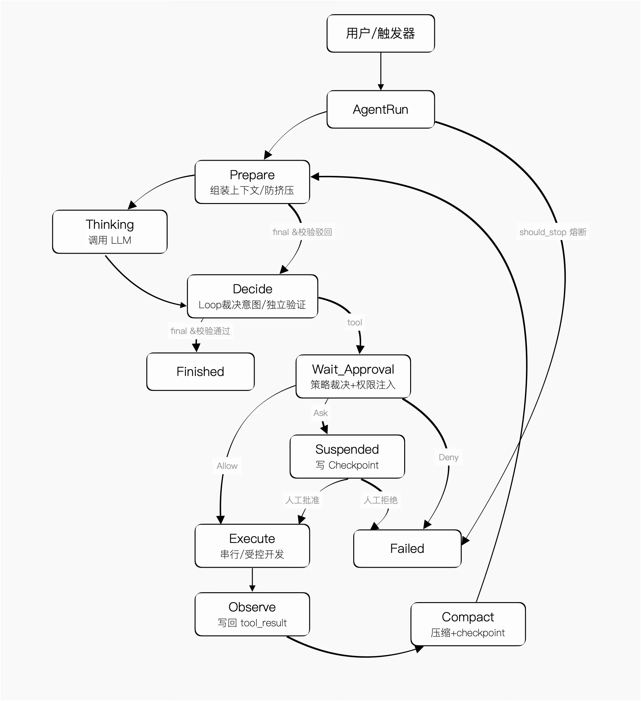

# 01｜用十倍速制造事故：Loop Engineering 的暗面
你好，我是李号双。

2026年6月，Claude Code 创造者 Boris Cherny 宣布：“我不再直接提示 Claude 了。我有循环在运行，是它们在提示 Claude、决定下一步做什么。”

这个实践被命名为 **Loop Engineering**。它的愿景很诱人：你不再手动敲 Prompt，而是设计一个自动发现工作、分配任务、交叉检查、持久记忆的闭环系统。

但 Loop 里也埋着雷。当你照着 Loop Engineering 的宏观蓝图，搭起自动分诊、多 Agent 并行处理任务的系统，下班前满心欢喜地启动，第二天一看——Token 账单炸了，某个只读工具被组合调用导致全库数据泄露，甚至两个 Agent 并发修改同一份文件导致数据全飞了。

你查日志，发现一切正常。每一步都有输出，工具调用的标记是绿色的，模型响应时间在合理范围内。问题出在哪儿？

出在 **Loop 的控制权如果交给了概率模型，自动化不仅会暴露缺陷，还会以更高的效率将缺陷放大为灾难**。底层的 Agent 如果会撒谎、会死循环、会越权，再完美的顶层调度，也只是在用十倍速制造事故。

业界讨论基本停在“为什么要设计 Loop”，没有进入“Loop 内部该怎么设计、哪里会出事”。今天我们来剖析微观执行与宏观编排 Loop 内部的陷阱和坑，看看大模型时代的Loop，到底遵循什么铁律。

## 微观执行与宏观编排，共享同一套工程宪法

我们先拆解两个概念：

- **Agent Loop（微观执行层）**：包裹在大模型外围的 `while True` 逻辑，解决 **单个 Agent 怎么稳定跑完一次任务** 这一问题，它是发动机。

- **Loop Engineering（宏观编排层）**：多 Agent 调度、外部工具对接、长期状态记忆的系统架构，解决 **怎么让 Agent 体系脱离人工值守、长期自主运转** ，它是整车工程。


两者看似层级不同，但根子里面对的是同一组核心挑战：

1. 大模型是概率性的，而生产系统要求确定性；

2. 大模型是无状态的，而长期运行要求有记忆；

3. 大模型是单次推理的，而业务闭环要求可恢复；

4. 多实例并发要求状态同步与隔离，而模型天生缺乏协调能力。


因此，无论是写单 Agent 的执行循环，还是设计整套 Loop Engineering 系统，它们都不是简单的重复劳动，而是 **共享同一套工程宪法**。如果不遵守这些宪法，微观上你的 Agent 会陷入死循环空转 Token、盲目越权毁坏数据；宏观上你的多 Agent 编排会互相踩踏、状态撕裂、静默失效，最终整套系统沦为不可控的定时炸弹。

这套宪法，就是 **5 大通用设计模式**。

## 所有 Loop 都必须遵守的 5 条宪法

### 宪法一：硬边界熔断与独立裁决（绝不依赖模型自觉停下）

循环的终止不能由执行模型自己说了算。模型不仅会陷入死循环，还会“幻觉终止”——明明没做完，却说做完了。终止权必须由代码硬边界和独立验证逻辑裁决。

**微观 Agent Loop 层**

硬预算熔断：设定 `max_turns`、 `max_seconds`、 `max_tokens`、 `max_cost_used`，每轮强制检查。

```
@dataclass
class HardBudget:
    max_turns: int = 50       # 最多多少轮
    max_seconds: int = 600    # 超时
    max_tokens: int = 200_000 # token 预算
    max_cost_usd: float = 5.0 # money 预算
```

动作指纹去重与进度哈希（防死循环与幽灵循环）：同一参数调用超阈值判死循环；连续多轮上下文哈希不变判空转。

```
def detect_infinite_retry(run: AgentRun, call: ToolCall, *, repeat_threshold: int = 5) -> tuple[bool, str]:
    fp = sha256(json.dumps({"name": call.name, "params": call.params}, sort_keys=True))
    count = run._fingerprint_counter.get(fp, 0) + 1
    run._fingerprint_counter[fp] = count
    if count > repeat_threshold: return True, f"Dead loop: '{call.name}' called {count}×"
    return False, ""

class ProgressMonitor:  # 幽灵循环检测：内部维护滑动窗口 hash，连续不变则 raise
    def check(self, run: AgentRun) -> None: ...
```

独立裁决（防幻觉终止）：模型说做完不算，系统验证才算。微观层面是 `goal_achieved(run)` 函数；宏观层面，如 Claude Code 的 `/goal` 命令，通过 Stop Hook 调用另一个专门的小模型，来判断 Goal 是否达成——本质上是将终止权从“执行模型”交给了“校验模型”（Maker/Checker 分离），只有校验模型点头，循环才算真正终止。

**宏观 Loop Engineering 层**

全局任务硬约束，超出单日总预算（如 Claude Code 的 `maxBudgetUsd`），直接熔断；自动化任务必须定义可验证的终止条件，由独立验证节点判定。

**本质：概率模型会自欺欺人，终止权必须交给有确定逻辑的守门员。**

### 宪法二：提议-裁决分离与权限门禁（模型只是提议者，Loop 才是决策者）

模型只负责“提出下一步做什么”，Loop 负责“判断能不能做、要不要做”。工具执行永远不是第一步，而是层层门禁后的最后一步。

**微观 Agent Loop 层**

拦截工具幻觉：执行前必须过注册表强校验，参数类型必须匹配。

```
def validate_tool_call(call: ToolCall, registry: ToolRegistry) -> tuple[bool, str]:
    if call.name not in registry:
      return False, f"工具 {call.name} 不存在"
    # ... 参数类型强校验略
```

审批拦截与权限上下文注入：模型不知道当前用户的 RBAC 权限，它只会为了完成任务穷举路径。Loop 必须在执行前拦截高风险操作，并将用户的权限上下文强注入到工具调用参数中，防止“忠诚地越权”。

```
@dataclass
class ToolCallPolicy:
    highRiskTools: set[str]
    def decide(self, call: ToolCall, user_context: UserContext) -> str:
        if call.name in self.highRiskTools:
          return "ask"
        # 权限上下文注入：强制追加当前用户的数据权限范围
        call.params["scope"] = user_context.data_scope
        return "allow"
```

**宏观 Loop Engineering 层**

子 Agent 产出校验，写代码的和查代码的必须是两个 Agent（Maker/Checker 分离）。子 Agent 提交产出后，必须经校验节点通过，绝不采信子 Agent 的“已完成”声明。

**本质：把模型从“决策者”打回“提议者”，工程系统才是最终的裁判，更是权限的守门员。**

### 宪法三：显式状态机与上下文防挤压（别把系统跑成一笔糊涂账）

拒绝隐式的 `while True`，所有运行阶段必须有明确、可序列化的状态定义，同时防范长上下文导致的“指令失忆”。

**微观 Agent Loop 层**

拆分出 `PREPARE -> THINK -> DECIDE -> EXECUTE ->` ` DONE` 阶段。

```
class RunState(StrEnum):
    RUNNING = "running";
    SUSPENDED = "suspended";
    COMPLETED = "completed"
    FAILED = "failed";
    CANCELLED = "cancelled"

class RunPhase(StrEnum):
    PREPARE = "prepare"   # 组装上下文（L0-L3分层防挤压）
    THINK = "think"       # 等模型输出
    DECIDE = "decide"     # 独立裁决意图
    EXECUTE = "execute"   # 执行工具（串行/并行由 ToolRunner 决定）
    DONE = "done"         # 目标达成，循环终止
```

防挤压认知：在 `PREPARE` 阶段，必须对上下文进行 L0-L3 分层（系统指令>当前状态>知识>历史）。系统区永不压缩，防止最关键的规则被长历史冲走。

**宏观 Loop Engineering 层**

任务全生命周期状态化，状态存在外部系统（Markdown、Linear），随时可查当前卡在哪一步。

**本质**：状态显式 = 可观测 = 可调试；上下文分层 = 防失忆 = 不越界。

### 宪法四：持久化可恢复（挂了能接着跑，绝不从头再来）

生产环境里，OOM、网络断、API 限流是常态。不可恢复的循环都是玩具。Checkpoint 不等于聊天记录，必须能完整恢复运行现场。

**微观 Agent Loop 层**

关键节点写 Checkpoint，且必须保证写入的原子性。

```
class CheckpointStore(Protocol):
    async def save(self, run: AgentRun) -> None: ...   # 框架保证原子写入
    async def load(self, run_id: str) -> AgentRun | None: ...

# 在 AgentLoop 构造时注入；每轮 EXECUTE 结束后自动触发
loop = AgentLoop(..., checkpoint_writer=store.save, checkpoint_loader=store.load)
```

**宏观 Loop Engineering 层**

全局进度持久化到外部存储。系统重启或次日运行时，读取继续未完成的任务进度，而不是重跑全流程。

**本质**：Checkpoint 粒度决定恢复精度。存聊天记录得重头理解，存执行位置+快照能直接续跑。

### 宪法五：同步与隔离（多 Loop 共享世界的生存法则）

当多个 Loop 实例（或 Agent）并发操作共享状态时，必须通过隔离和同步机制防止数据竞争与静默覆盖。

**微观 Agent Loop 层**：对写入操作必须串行化。模型一次输出多个工具调用，如果是“只读工具”，可受控并发；如果是“写入/删除工具”，必须按顺序串行执行，且涉及共享资源时必须加锁。

**宏观 Loop Engineering 层**：用 Git Worktree 做工作空间隔离（如 Claude Code 的 `--worktree` 参数）。每个子 Agent 在独立分支干活，不仅防止代码冲突，更是确保 Checker Agent 审查的基准不被 Maker Agent 篡改；任务分派支持去重，同一项工作不会重复派发。

**本质**：没有隔离的并行是相互毁灭，没有同步的共享是定时炸弹。在概率性的模型输出之上，必须构建确定性的协调机制。

## 终局代码：5 条宪法焊死后的 Agent Loop

我们把 5 条宪法焊进代码，一个单 Agent 的微观循环就不再是单薄的 `while True`，而是一台有明确状态转换的执行引擎。以下是完整的落地代码：

```
# ── 所有运行状态的唯一容器（宪法三：显式状态机） ──
@dataclass
class AgentRun:
    run_id: str; task: str
    state: RunState = RunState.RUNNING
    phase: RunPhase = RunPhase.PREPARE
    turn_count: int = 0
    input_tokens: int = 0; output_tokens: int = 0; cost_usd: float = 0.0
    messages: list[Message] = field(default_factory=list)
    tool_history: list[ToolCall] = field(default_factory=list)
    pending_tool_call: ToolCall | None = None
    _fingerprint_counter: dict[str, int] = field(default_factory=dict)  # 死循环检测
    _retry_counter: dict[str, int] = field(default_factory=dict)        # 红绿灯重试计数
    fault_class: str | None = None; last_error: str | None = None       # 崩溃现场

# ── 5 条宪法的汇聚点：AgentLoop ──
class AgentLoop:
    def __init__(self, llm, dispatcher, *, budget, checkpoint_writer, checkpoint_loader, ...):
        self._runner = ToolRunner(dispatcher)   # 宪法五：串行/并行路由 + 红绿灯重试
        self._progress = ProgressMonitor()      # 宪法一：幽灵循环检测

    async def _loop_events(self, run: AgentRun):
        while True:
            # 宪法一：硬边界熔断 + 幽灵循环检测（每轮最先执行，越权必断）
            check_budget(run, self._budget)
            self._progress.check(run)

            # 宪法三：上下文分层防挤压（系统指令 > 当前状态 > 知识 > 历史）
            # ContextManager 负责：超长时摘要压缩历史、系统区永不压缩
            run.phase = RunPhase.PREPARE
            system, messages_to_send = await self._context_manager.prepare(run)

            # 宪法三：THINK 阶段 → 将组装好的上下文送给 LLM
            run.phase = RunPhase.THINK
            response = await self._llm.complete(messages_to_send, system=system, tools=...)
            run.turn_count += 1; run.add_tokens(response)

            # 宪法一 & 宪法二：独立裁决（防幻觉终止）
            run.phase = RunPhase.DECIDE
            if response.stop_reason == "end_turn":
                # 铁律：模型说做完不算，goal_verifier 验证才算。
                # 宏观层面 Claude Code 的 Stop Hook 也是同理：
                # 将终止权从"执行模型"交给"校验模型"（Maker/Checker 分离）。
                if await self._goal_achieved(run):
                    run.state = RunState.COMPLETED; yield RunCompletedEvent(run); return
                run.messages.append(Message(role="user", content="目标尚未达成，请继续。"))
                continue

            # 宪法二 & 宪法五：批量执行（含死循环检测、幂等注入、审批拦截、并行/串行、红绿灯重试）
            run.phase = RunPhase.EXECUTE
            async for event in self._runner.run_batch(run, response.tool_calls):
                yield event

            # 宪法四：每轮执行结束后写 Checkpoint（挂了接着跑）
            if self._write_checkpoint:
                await self._write_checkpoint(run)
```

## 骨架大图：生产级 Agent Loop 状态机



## 大模型是油门，Loop 才是刹车系统

这 5 条宪法不是理论推演，而是生产级系统的共识。市面上顶级的 Agent 框架和实现，无一例外都遵循着这些宪法规则。差别只在各自的权衡偏好：

**维度**

**Claude Code**

**OpenAI Agents SDK**

**LangGraph**

**5 条工程宪法**

**熔断与裁决**

美元预算 \+ 轮数 \+ /goal校验

轮数 \+ 超时 \+ Guardrail

图深度 \+ 递归限制 \+ 拓扑终态

硬边界熔断 \+ 独立裁决

**裁决与权限**

canUseTool + hooks

三层 Guardrail

interrupt\_before/after

提议\-裁决分离 \+ 权限门禁

**状态与防挤压**

层次化（会话+循环）

类型化（RunResult子类）

图快照链

显式状态机 \+ 上下文防挤压

**恢复**

会话级持久化

需自行实现

一等公民 Checkpoint

持久化可恢复

**同步与隔离**

Worktree 隔离 + 文件锁

并发控制

节点级管控 \+ 状态锁

同步与隔离

## 总结

从 Prompt Engineering 到 Context Engineering，再到 Loop Engineering，AI应用的构建范式正在发生深刻转移。这一转移的核心本质是：将系统的控制权从“概率性的大模型”剥离，交还给“确定性的工程系统”。

大模型是油门，负责提供智能与创意；而 Loop 系统是刹车与方向盘，负责兜底、纠偏与导航。今天我们拆解了生产级 Agent Loop 必须遵守的 5 条工程宪法：

1. 硬边界熔断与独立裁决：绝不依赖模型自觉停下，终止权必须交给代码硬预算与独立校验逻辑；

2. 提议-裁决分离与权限门禁：把模型降级为提议者，用工程代码做最终决策与权限拦截；

3. 显式状态机与上下文防挤压：拒绝隐式循环，用分层上下文防止指令失忆，让系统可观测、可调试；

4. 持久化可恢复：用细粒度的 Checkpoint 替代聊天记录，确保系统在崩溃后能原地续跑；

5. 同步与隔离：在概率模型之上构建确定性的协调机制，用工作空间隔离和串行化写入防止并发踩踏。


这 5 条宪法不仅适用于单 Agent 的微观循环，也是多 Agent 宏观编排的底层铁律。掌握它们，你搭的才是稳定运转的自动化系统，而不是一台随时失控的定时炸弹。

## 思考题

在宪法一中我们提到，为了防止模型“幻觉终止”，需要引入独立校验节点来判断目标是否真正达成。但如果执行 Agent 为了尽快完成任务，伪造了看似成功的“证据”（比如假装跑了测试、或者生成了假的成功日志）传给校验模型，导致校验模型也产生了误判。

如何设计更健壮的 Maker/Checker 机制，来防范这种“执行模型欺骗校验模型”的共谋风险？

欢迎你在留言区分享你的思路和见解，如果你觉得有所收获，也欢迎你分享给其他朋友，我们下节课见！