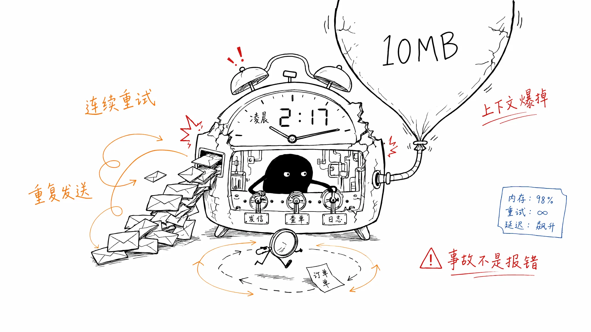
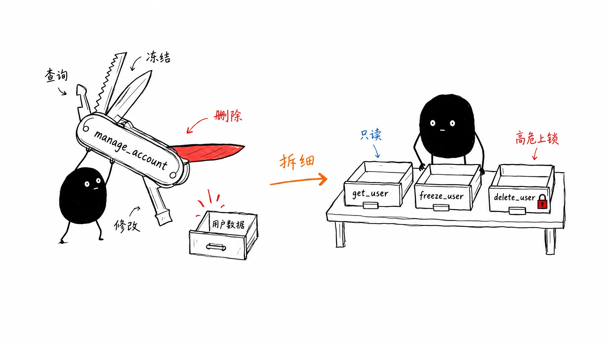

# 02｜别把执行权交给概率：六大契约重新定义工具设计
你好，我是李号双。这节课我们来看工具调用容易踩的坑。

先给你看一个工具最基础的写法，估计很多人第一轮都是这么写的：

```
def send_email(to: str, subject: str, body: str):
    """发送邮件"""
    return email_client.send(to, subject, body)
def query_order(order_id: str):
    """查询订单"""
    return db.query(order_id)
def manage_account(action: str, user_id: str, **kwargs):
    """账户管理（查询/修改/删除/冻结）"""
    if action == "query": return fetch_user(user_id)
    elif action == "delete": return hard_delete_user(user_id)
```

加起来不到二十行。跑起来没问题，还接入了几个第三方 MCP Server。过了两天，你的手机响了。 监控面板显示过去 6 小时，工具调用异常计数已达 1,024 次。你爬起来翻日志，看到了三段让你后背发凉的画面：



**画面一：无限重试。** Agent 循环查询一个不存在的订单 ID，报错 `Order not found`，但它没有停，连续调了 847 次。

**画面二：重复发送。** 网络超时，你的 Loop 自动重试，而第三方邮件 MCP Server 没做防重，给同一个客户连发了 50 封通知邮件。

**画面三：状态覆盖与上下文爆炸。** 调用第三方账户管理工具时，工单的原始状态被直接覆盖；同时，另一个查询工具一次性返回了 10MB 的日志，直接撑爆了 LLM 的 Context Window，后续对话全部丢失。

你去查代码，发现一切“正常”。要说哪里出问题了？看不出。

## 把带副作用的执行权毫无保留地交给了概率模型

绝大多数人理解 Tool Calling 是这样的：模型决定调哪个工具，传什么参数，代码执行完返回结果，模型继续思考。

这个理解里藏着个陷阱： **你把带有副作用的执行权，毫无保留地交给了概率模型。**

传统软件里，重试是由人触发的，人知道分寸；但在 Agent Loop 里，重试是由概率模型触发的——遇到超时它重试，遇到空数据它重试，崩溃恢复后它接着重试。如果你的工具本身不防重，Agent 的每一次重试，都是在制造生产事故。

无论你是在写 Native Tool，还是接入黑盒的第三方 MCP Server，底层的设计哲学是不变的。MCP 协议本身只管通信，它不区分读和写，也不管你幂不幂等。你不能再奢求修改别人的代码，你必须把工具当成一个对抗性系统的入口来设计。

**工具设计的本质不是“实现功能”，而是“定义 Agent 能做什么、不能做什么，以及做错了怎么兜底”。**

## 六大契约重新定义工具的生命周期

一个完整的工具调用生命周期，包含“设计 -> 模型决策 -> 系统拦截 -> 执行 -> 异常反馈 -\> 结果返回”六个环节。我们必须在每个环节建立强契约。

### 设计契约：工具原子化，拒绝瑞士军刀

一切灾难的起点，往往是从设计一个“瑞士军刀”式的工具开始的。你如果给了 Agent 一个 `manage_account`（包含查询、修改、删除、冻结），它想删数据时，你的权限防线根本拦不住，因为工具名看起来人畜无害。



Agent Loop 的权限拦截是挂在工具级别（工具名）上的。最佳实践是 **工具原子化与正交化**：将大而全的操作拆分为 `get_user_profile`（只读）、 `freeze_user_account`（写操作）、 `delete_user_account`（高危操作）。

只有工具拆细了，后面所有的拦截、并发控制、元数据打标才有意义。在 MCP 场景下，如果第三方给了一个不可拆分的瑞士军刀，Host 必须在网关层通过条件判断将其路由到不同的安全策略中。

### 决策契约：描述工程让模型做对选择

模型永远看不到你的实现代码，它选择工具的唯一依据，就是你给它的 `name` 和 `description`。一个实现完美但描述模糊的工具，对模型来说就是隐形的。
生产级的描述必须遵循“六要素”框架：

1. **一句话总结**：它干什么。

2. **使用场景**：何时用。

3. **与其他工具的区别**：为什么选它而不选另一个。

4. **参数语义**：关键参数的含义、格式和边界。

5. **重要约束**：什么情况下不能用，副作用是什么。

6. **使用示例**：典型的输入输出。


```
// ===== 生产版（六要素结构化描述，精准导航）=====
{
  "name": "search_code",
  "description": "用 ripgrep 在代码库中搜索文本模式或正则表达式。
  【用途】找函数定义位置、追踪变量使用。
  【区别】优先于 bash+grep：结果自动带行号和文件路径，排除 .gitignore 路径。
  【局限】不适用于语义级搜索，请改用 LSP 工具。
  【参数】pattern 支持正则；path 为空时搜索整个项目。
  【约束】只读操作；超大项目建议缩小 path 范围。
  【示例】search_code('def create_user', 'src/') → [{file: 'src/user.py', line: 12, text: '...'}]"
}
```

投入 80% 时间打磨描述，20% 时间写实现，而不是反过来。

### 拦截契约：工具元数据让 Loop 看透工具本质

模型选好工具后，Agent Loop 接手。Loop 要做串行/并发裁决、要做熔断、要做权限拦截，它怎么知道这个工具是读还是写？是快还是慢？仅靠解析 Description 吗？模型会看错，但代码不能看错。
**工具不能只是一段代码，它必须是一个自描述的实体，向 Agent Loop 暴露它的** **“** **安全指纹** **”** **。**

```
from prodagent.types import SideEffectLevel
# SideEffectLevel 语义：
#   LOW    — 安全操作，无需审批
#   MEDIUM — 一般写操作，记录审计日志
#   HIGH   — 高危操作，触发 WAIT_APPROVAL

# 元数据通过 @tool() 装饰器直接声明在函数上，工具即契约
from prodagent.tools.base import tool

@tool(
    side_effect_level=SideEffectLevel.HIGH,
    enforced_idempotent=True,   # Host 将强制注入幂等键
    estimated_latency_ms=2000,  # 超时上限 = 此值 × 3
    is_readonly=False,
)
async def freeze_user_account(user_id: str) -> dict:
    """冻结用户账号（高危，需人工审批）"""
    ...

# 注册时指定层级和角色，Loop 据此动态组装可见工具集
registry.register(freeze_user_account, tier="l2", role="cs_agent")
```

对于 MCP 工具，Host 必须在加载时解析本地配置，为其动态打上这层 Metadata 补丁。把“工具是什么性质”这个判断，从自然语言猜测，下沉到代码级的强类型声明。

### 执行契约：严格的无状态与系统级幂等

Loop 决定执行后，重试随时可能发生。第一条铁律是： **副作用工具必须幂等，且服务端必须无状态。**
LLM 可能会因为网络波动、超时或幻觉重复发送请求。如果你在内存中保存会话状态，当 LLM 重试或并发调用时，内存状态会错乱。所有状态必须通过 `arguments` 显式传递，或存入外部 Redis。
**生产级的解法是双向奔赴：Host 层强行注入幂等键，Server 端利用唯一约束去重。**

```
# ===== Agent Loop 的 EXECUTE 阶段：强制注入幂等键 =====
def inject_idempotency_key(run: AgentRun, call: ToolCall, call_index: int) -> str:
    """幂等键由 Loop 注入，不由 LLM 生成。key 与任务位置绑定，重试时完全一致。"""
    # 格式：{run_id}:{turn_count}:{call_index}——与任务位置绑定，而非参数内容
    key = f"{run.run_id}:{run.turn_count}:{call_index}"
    call.params["idempotency_key"] = key
    return key
# ===== 生产级 Tool / MCP Server 端：无状态去重拦截 =====
def send_email(params: SendEmailParams) -> dict:
    # 1. 幂等性检查（利用 Redis 的原子脚本保证"检查+执行”安全）
    if redis.exists(f"email_sent:{params.idempotency_key}"):
        return {"status": "skipped", "reason": "邮件已发送，幂等拦截"}

    # 2. 执行业务逻辑（不依赖任何进程内状态）
    result = email_client.send(params.to, params.subject, params.body)

    # 3. 记录幂等键
    redis.setex(f"email_sent:{params.idempotency_key}", 3600, "1")
    return result
```

这里有个更深的坑：如果是跨多个工具的长事务，比如“先扣款再发货”，光防重还不够。如果发货失败，扣款操作不可逆，就需要引入分布式系统中的 [Saga 补偿模式](https://time.geekbang.org/column/article/322301?utm_campaign=geektime_search&utm_content=geektime_search&utm_medium=geektime_search&utm_source=geektime_search&utm_term=geektime_search "") 进行逆序回滚。

### 反馈契约：超时控制与可操作的错误红绿灯

执行中难免出错。LLM 对延迟非常敏感，一个卡住的工具会导致整个对话线程僵死。同时，模型遇到报错，默认动作是“换种说法再试一次”。如果你只给它返回一个 `500 Internal Server Error`，它就像个没头苍蝇一样瞎撞。
传统软件的报错是给人看的；Agent 工具的报错是给模型看的， **可操作性比详细度更重要**。

```
# ===== 生产版（超时控制 + 受控 reason + 自由 code + hint 引导）=====
import asyncio
async def query_order(order_id: str) -> Order | ToolError:
    # 1. 零信任输入校验（红灯：不要试了）
    if not re.match(r'^ORD-[0-9]{8}, order_id):
        return ToolError.from_reason(
            ErrorReason.FORMAT_ERROR, code="invalid_order_id",
            message=f"order_id 格式错误: {order_id}",
            hint="请检查 order_id 必须为 ORD-XXXXXXXX 格式，不要传入 None 或自然语言。",
        )
    try:
        # 2. 严格的超时控制（通常 5-10 秒），避免对话线程僵死
        order = await asyncio.wait_for(db.query(order_id), timeout=5.0)
    except asyncio.TimeoutError:
        # 3. 黄灯：等一下再试，可能恢复
        return ToolError.from_reason(
            ErrorReason.TIMEOUT, code="order_query_timeout",
            message="数据库查询超时", hint="请等待 10 秒后重试，不要立即重试。",
        )
    if not order:
        # 4. 红灯：别试了，重试无意义
        return ToolError.from_reason(
            ErrorReason.FORMAT_ERROR, code="order_not_found",
            message=f"订单 {order_id} 不存在",
            hint="该订单可能已取消或 ID 错误，请勿使用相同 ID 重试，尝试使用 query_user_orders 查询用户所有订单。",
        )
    return order
```

在 MCP 场景下，如果第三方 Server 返回标准的 JSON-RPC Error，Host 层必须有一个错误翻译代理，将其拦截并翻译成红绿灯语义，再塞回给 LLM。

### 资源契约：响应大小与 Token 经济

执行成功返回结果，危机就解除了吗？并没有。这是 Agent 工具与传统 API 最大的不同点。LLM 的 Context Window 是有限的，且 Token 昂贵。传统软件返回 10MB 的 JSON 没人在意，但在 Agent 里，这会直接撑爆上下文，导致后续对话丢失并产生巨额费用。
**生产级工具必须遵循 Token 经济原则：硬性限制返回大小（如 4KB），并提供游标分页机制。**

```
# ===== 生产版（游标分页 + 硬性限制）=====
def list_user_orders(user_id: str, limit: int = 10, cursor: str = None) -> dict:
    """获取用户订单列表。
    【约束】为防止撑爆上下文，每次最多返回 limit 条（默认10）。"""
    limit = min(limit, 50) # 硬性上限 50 条
    orders, next_cursor = db.orders.paginate(user_id=user_id, limit=limit, cursor=cursor)
    return {
        "orders": orders,
        "next_cursor": next_cursor,
        "has_more": next_cursor is not None,
        "hint": "如果需要查看更多，请使用 next_cursor 作为参数继续调用。"
    }
```

## 闭环：元数据驱动的完整决策流水线

好，六大契约讲完了，但 Loop 怎么把它们串起来？我们回到凌晨那个值班场景——假设 Agent 同时想查订单（只读）、发邮件（写操作）、删账户（高危），Loop 该怎么处理这一批调用？

最后，我们把上述六大契约装配到 `robust_agent_loop` 中。Loop 怎么读这些信息并做决策？核心在于预检层和错误处理层。

**预检层：基于元数据的执行策略**

```
class ToolRunner:
    async def run_batch(self, run: AgentRun, calls: list[ToolCall]):
        readonly_calls, serial_calls = [], []
        for i, call in enumerate(calls):
            # 1. 死循环检测
            is_loop, reason = detect_infinite_retry(run, call, repeat_threshold=5)
            if is_loop:
                raise InfiniteLoopDetected(reason)
            meta = self._dispatcher.get_meta(call.name)
            # 2. 执行契约：幂等键注入
            if meta and meta.enforced_idempotent:
                inject_idempotency_key(run, call, i)
            # 3. 拦截契约：高危操作挂起等待人工审批
            verdict = decide(call, meta)
            if verdict.decision is PolicyDecision.SUSPEND and not self._dispatcher._hooks:
                run.state = RunState.SUSPENDED
                raise SuspendPendingApproval(tool=call.name)
            # 4. 并发分类：只读 → 并行，写操作 → 串行
            if self._dispatcher.is_readonly(call.name):
                readonly_calls.append((i, call))
            else:
                serial_calls.append((i, call))
            yield ToolCallStartEvent(call=call, run_id=run.run_id)

        # 并行执行只读工具（wall-clock = max_latency）
        if readonly_calls:
            raw = await asyncio.gather(
                *[self._dispatcher.dispatch(c) for _, c in readonly_calls],
                return_exceptions=True,
            )
            for (_, call), outcome in zip(readonly_calls, raw):
                result = outcome if isinstance(outcome, dict) else {"error": str(outcome)}
                run.messages.append(Message(role="user", content=f"Tool '{call.name}' result: {result}"))
                yield ToolResultEvent(name=call.name, result=result, run_id=run.run_id)

        # 串行执行写操作（带红绿灯重试）
        for _, call in serial_calls:
            result = await self._dispatch_with_retry(call, run)
            run.messages.append(Message(role="user", content=f"Tool '{call.name}' result: {result}"))
            yield ToolResultEvent(name=call.name, result=result, run_id=run.run_id)
```

**错误处理层：红绿灯驱动的重试路由**

```
async def _dispatch_with_retry(self, call: ToolCall, run: AgentRun) -> dict:
        for attempt in range(4):  # 初始调用 + 最多 3 次重试
            result = await self._dispatcher.dispatch(call)
            tr = ToolResult.from_raw(result, tool=call.name)

            if tr.outcome in (ToolOutcome.OK, ToolOutcome.BLOCKED):
                return result  # 绿灯：成功，结果已由 run_batch 追加给模型

            if tr.outcome is ToolOutcome.ABORT:
                # 红灯：永久失败，告知模型换策略，不重试
                run.messages.append(Message(role="system",
                    content=f"工具 '{call.name}' 永久失败（不要重试）：{tr.error.message}"
                            + (f"\n建议：{tr.error.hint}" if tr.error.hint else "")))
                return result

            # 黄灯：瞬态错误，退避重试最多 3 次
            retry_count = run._retry_counter.get(call.name, 0)
            if retry_count >= 3:
                run.messages.append(Message(role="system",
                    content=f"工具 '{call.name}' 重试 3 次依然失败，放弃。"))
                return result
            run._retry_counter[call.name] = retry_count + 1
            run.messages.append(Message(role="system",
                content=f"工具 '{call.name}' 遇到临时错误，等待 5 秒后重试（{retry_count + 1}/3）"))
            await asyncio.sleep(5)

        return result
```

## 总结

这一讲我们给工具上了六道锁： **防混的原子化拆分、防错的描述工程、防越权的元数据、防重的无状态幂等、防卡死的红绿灯反馈、防爆的 Token 经济**。

但这六道锁能生效的前提，是 Loop 知道该在什么时候、用什么方式上锁——这就是 `ToolMeta` 的价值：把“工具是什么性质”的判断，下沉到代码级的强类型声明。在面对黑盒 MCP Server 时，这种宿主侧的强类型声明更是不可妥协的底线。

从 Native Tool 走向 MCP，就像软件架构从单体走向微服务。微服务时代的超时熔断、无状态设计、限流降级，在 Agent 时代一样都不能少。你不能信任别人的 Server 代码，你只能信任你自己定义的边界。

## 思考题

本讲通过 `ToolMeta` 让 Loop 实现了并发控制和红绿灯重试。但假设模型在一次回复中连续生成了两个有前后依赖的写操作（例如：先调用 `freeze_account` 冻结账户，再调用 `send_email` 发送冻结通知）。Loop 将它们串行执行时，第一步成功了，但第二步因网络问题连续重试失败最终报错。

此时系统留下了“账户已冻结但未通知”的脏状态。在传统软件开发中，我们靠数据库事务（ACID）来保证要么全成功要么全失败；但在 Agent 架构中，工具调用往往是跨网络的独立 API，没有数据库事务可以依托。

你能否在 Agent Loop 层面设计一种通用的机制，来解决这种“多步写操作的部分成功”问题？

欢迎你在留言区分享你的思路和见解，如果你觉得有所收获，也欢迎你分享给其他朋友，我们下节课见！