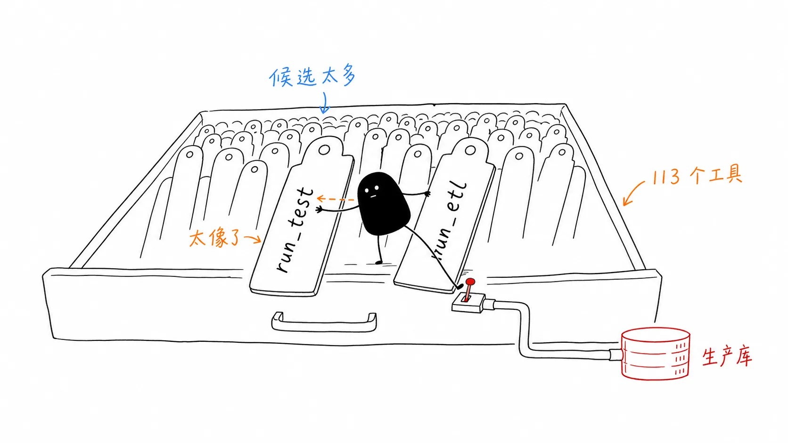
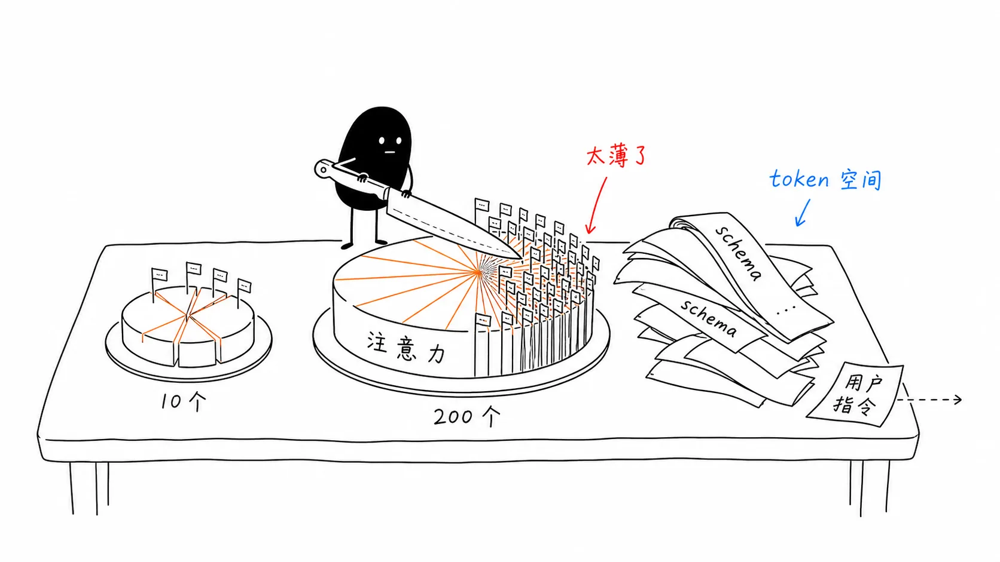
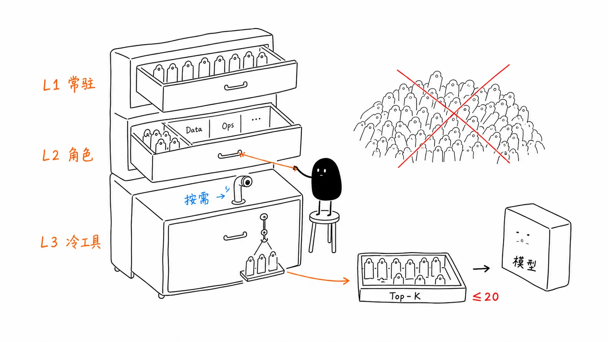
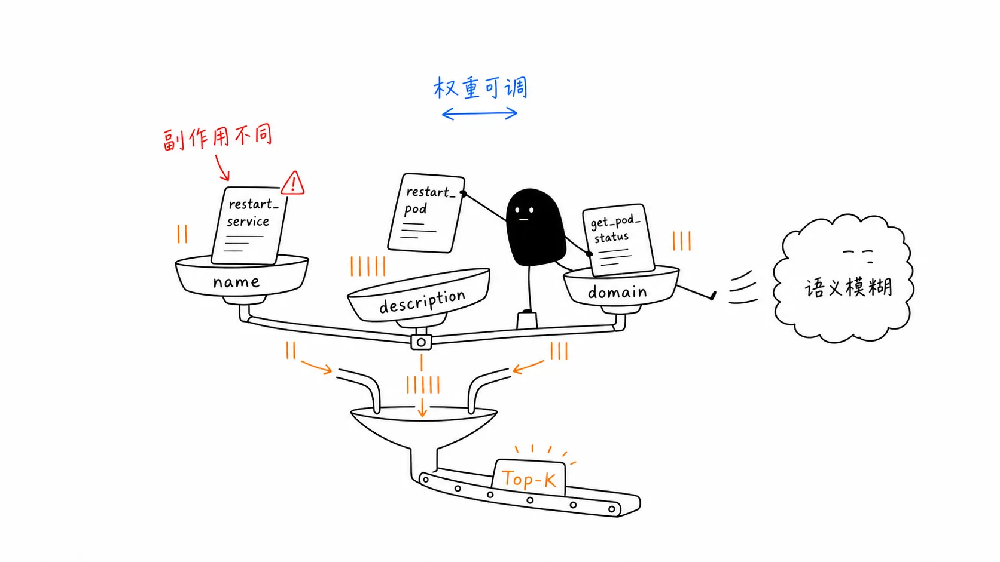
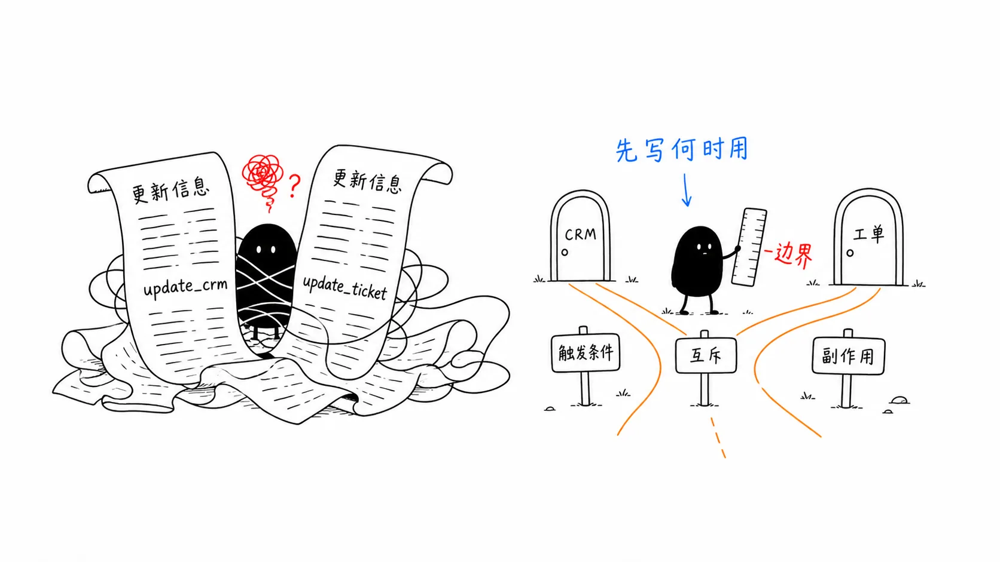
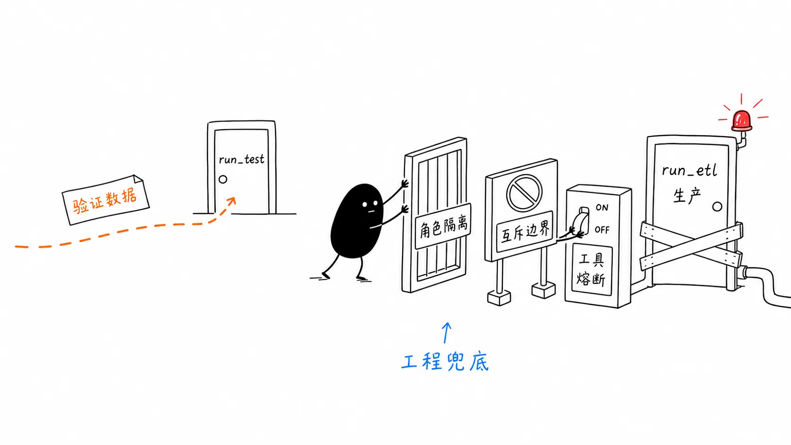

# 03｜注意力稀释：当 113 个工具让模型降智时，工程师该怎么做？
你好，我是李号双。

前两节课我们讲了 Loop 的架构铁律和工具的六大契约。如果你照着做了，单个 Agent 跑起来应该很稳。但工程里有个规律：能跑的东西，就一定会被要求跑更多。

一个数据质量审核 Agent，上线时 22 个工具，跑得很顺。三个月后业务需求堆上来，工具涨到了 113 个。

某天值班工程师发现，Agent 在生产环境连续调用了 `run_etl`——那个会真实迁移数据的工具——而不是只做验证的 `run_test`。



它调了 7 次，把 340 万条记录从预发布库迁进了生产库。查日志，工具调用记录完好，参数格式正确。查 Prompt，也没问题。

问题出在：113 个工具里， `run_test` 和 `run_etl` 的描述长得像双胞胎。

```
run_test：执行数据处理操作
run_etl：执行数据处理操作
```

113 个工具，没人有心思打磨每一个描述。模型在约 0.9%（1/113）的注意力预算里，没能区分这两行字。

**这不是模型变蠢了，而是工具给得太多，注意力被稀释掉了。**

## 注意力稀释：一道让模型“降智”的数学题

Transformer 的自注意力机制本质上是个分蛋糕的过程：它会计算上下文中所有词的相关性，然后把注意力得分归一化到 \[0, 1\] 区间，总和为 1。这意味着，候选词越多，分到每个词的平均权重就越低。



工具选择也是一样。当上下文里有 10 个工具时，每个工具能分到 10% 的注意力预算；当工具数量达到 200 个时，每个工具只剩 0.5%。

除了注意力被稀释，更严重的问题还有 **token 预算被物理吞噬。**

一个中等复杂度的工具 schema（name + description + parameters）约消耗 200–600 token，按每工具 350 token 估算：

```
113 个工具 × 350 token ≈ 39,550 token（仅工具 schema）
200 个工具 × 350 token ≈ 70,000 token（超过 128K 窗口的一半）
```

70000 token 的工具描述塞进去，用户指令还有多少空间？

## L1/L2/L3 三层懒加载

计算机体系结构里解决 CPU 缓存问题，用的是 L1/L2/L3 Cache —— 背后是局部性原理：常用数据放近处，冷数据放远处。Agent 的工具加载也可以用同一套逻辑。



经验值：

- 一次推理，模型能看到的工具上限是 **20 个**

- 超过 20 个：按层懒加载

- 超过 50 个：必须上检索


```
用户请求 → Tool Router（代码逻辑，不是 LLM）
L1 核心层（System Prompt 常驻）
    5–8 个基础只读工具：read_file, search_code, get_user
    跨任务通用，绝对缓存
L2 领域层（按角色注入）
    ops-tools: 10–15 个运维工具
    data-tools: 10–15 个数据工具
    qa-tools: 10–15 个测试工具
L3 专用层（按需检索，用完即焚）
    50–200+ 冷门工具 → 检索索引，Top-K 注入
```

这套架构落地到代码里，核心是一个 `ToolRegistry`，负责注册、分层、按角色路由：

```
_MAX_VISIBLE_TOOLS = 20
_L3_MAX_CONTRIBUTION = 3
_L3_TRIGGER_THRESHOLD = 15

@dataclass
class _ToolLayer:
    l1_core: list[Tool] = field(default_factory=list)
    l2_domain: dict[str, list[Tool]] = field(default_factory=dict)
    l3_cold: list[Tool] = field(default_factory=list)

class ToolRegistry:
    def get_active_tools(self, role: str = "general", intent: str = "") -> list[Tool]:
        """L1 全量 + L2 角色匹配 + L3 按需检索，中间过滤熔断工具。"""
        # L1：核心常驻（过滤熔断中的）
        active = [t for t in self._layer.l1_core if self._breaker.is_available(t.name)]
        active_names = {t.name for t in active}
        # L2：角色匹配
        for t in self._layer.l2_domain.get(role, []):
            if t.name not in active_names and self._breaker.is_available(t.name):
                active.append(t); active_names.add(t.name)
        # L3：仅当 L1+L2 还有余量时才触发检索
        if intent and len(active) < _L3_TRIGGER_THRESHOLD and self._layer.l3_cold:
            for t in self._l3_index.search(intent, max_results=_L3_MAX_CONTRIBUTION):
                if t.name not in active_names and self._breaker.is_available(t.name):
                    active.append(t); active_names.add(t.name)
        # 硬上限：无论如何不能超过 20
        if len(active) > _MAX_VISIBLE_TOOLS:
            active = active[:_MAX_VISIBLE_TOOLS]
        return active
```

用这套 registry 注册前面出事的两个工具：

```
registry = ToolRegistry()
# L1：全局常驻
registry.register(read_file, tier="l1")
# L2：QA 角色专属
registry.register(run_test, tier="l2", role="qa")
# L2：Data 角色专属
registry.register(run_etl, tier="l2", role="data")
# 取活跃工具
qa_tools = registry.get_active_tools(role="qa", intent="验证数据格式")
print([t.name for t in qa_tools])
# ['read_file', 'run_test']
```

注意最后的效果：QA Agent 的候选集里根本看不到 `run_etl`。 **安全边界在代码里，不在 Prompt 里。**

上一节课我们讲工具原子化拆分，目的是让权限拦截有挂载点；这一节课的分层加载，则是让拆分后的工具只出现在该出现的上下文里。两节课配合，才能把“工具混淆”这个问题从根上堵死。

## L3 检索的武器选择：让候选工具在多维上竞争，而不是预判意图

L1 + L2 解决了常用工具的加载。但 50–200 个冷门工具怎么办？很多团队到这一步，条件反射地上向量数据库——毕竟“语义检索”听起来更先进。

这里有一个反直觉的结论： **对于绝大多数工具，不** **需** **要用向量检索。** 为什么？

工具名（比如 `run_etl`、 `restart_pod`）本身就是形式化地址，就像函数名或 API 路径，不存在语义模糊。你搜 `restart_pod`，就是想找重启容器的工具。用向量做模糊匹配，反而会引入噪声： `restart_pod`（重启容器）和 `restart_service`（重启系统服务）在向量空间里可能靠得很近，但它们的副作用完全不同。

真正的解法是： **放弃二分法，让每个候选工具在多个维度上同时竞争。**

直接对所有 L3 工具算一个多维加权分数：

- **工具名维度（最强信号）**：工具名被解析为标准化的词组集合。查询词命中工具名里的精确词，给最高分；命中词内的子串，给次高分；命中归一化后的全名，给兜底分。

- **描述维度（次强信号）**：查询词在工具描述里以独立单词形式出现，给匹配分。

- **领域维度（交叉信号）**：查询词精确等于工具的领域标签（如 `db_`、 `ops_`、 `crm_`），给附加分。




最后总分排序，取 Top-K。 **没有“if…else…”的分支判断，所有候选在所有维度上一起跑，让数据自己说话。**

```
def search(self, query: str, max_results: int = 3) -> list[Tool]:
    query_terms = self._tokenize(query)
    scored = []
    for tool in self._tools.values():
        # 1. 工具名维度：精确命中 > 子串命中 > 全名归一化兜底
        name_score = self._score_name(tool, query_terms)
        # 2. 描述维度：词边界匹配
        desc_score = self._score_description(tool, query_terms)
        # 3. 领域维度：精确标签匹配
        domain_score = self._score_domain(tool, query_terms)
        # 多维加权，让分数自己说话
        total = name_score + desc_score + domain_score
        if total > 0:
            scored.append((tool, total))
    # 按总分降序，取 Top-K
    return [t for t, _ in sorted(scored, key=lambda x: x[1], reverse=True)[:top_k]]
```

具体实现时，有几个设计考量至关重要。首先是工具名的解析。真实世界里的工具名千奇百怪：snake\_case、CamelCase、Mixed 风格，甚至还有 domain-prefixed（如 `db_query`）或 special-prefixed（如 `mcp__server__action`）。

如果解析不到位，把 `restart_pod` 当成一个不可分割的整体，那么当用户查询“重启 pod”时，工具名维度就无法命中。系统必须能将各种命名约定准确切分成最小语义单元，这样工具名维度的强信号才能发挥作用。

这套多维加权框架最大的优势在于其适应性： **不同 Agent 域，权重应该不同。** 运维 / DBA 这种 procedural agent，工具名几乎就是查询内容本身，name 维度权重要拉满；客服 / 销售这种 natural language agent，用户输入更口语化，描述维度权重要抬高。

注意，这种调节不是“开关式”地选 A 还是 B，而是同一套评分框架下权重的连续滑动。这让 A/B 测试和域适配都变成了“调几个浮点数”的工程问题，而不是“重新设计一条检索路径”的架构问题。
从“先分类后选路径”升级成了“多维度加权竞争”，把不确定性彻底消解掉了。

## description 是召回锚点，不是功能手册

第二讲我们在讲工具的“决策契约”时，提到过 description 的"六要素"写法，那是站在模型决策的角度，告诉模型“这个工具是干什么的”。

当工具池子变大、引入 L3 检索后，description 就承担了第二个角色： **它是检索系统多维度评分里的关键输入。**

如果进了候选集的工具，description 写得烂，描述维度的得分就是 0，工具依然会被埋没。这里有一个极度反直觉的结论：description 不是工具说明书，而是召回锚点和推理互斥路标。先写“何时用”，再写“是什么”；先写“和谁互斥”，再写“怎么用”。



我们来看一则反例：

```
# ===== 反模式：功能堆砌，召回失败 =====
@tool(description="更新 CRM 系统中的客户信息。支持更新客户等级、标签、联系方式等字段。")
async def update_crm(user_id: str, field: str, value: str) -> dict:
    ...

@tool(description="更新工单信息，包括状态、负责人、优先级等字段。")
async def update_ticket(ticket_id: str, status: str, assignee: str) -> dict:
    ...
```

在 200 个工具里，“更新某系统中的某信息”是最高频的描述模式，没有区分度。多维度评分时，这两个工具的描述维度得分完全一样，只能靠 name 维度硬撑，稍微一点查询噪声就会把它们混在一起，模型无法区分。

```
# ===== 生产版：触发条件优先，互斥边界清晰 =====
@tool(
    domain="crm",
    side_effect_level=SideEffectLevel.MEDIUM,
    description="""
        修改 CRM 系统中的客户主数据。
        【触发条件】当用户要求修改客户等级（如升级为 VIP）、
        调整客户标签、更新联系人信息时使用。
        【互斥】修改工单状态或工单负责人，请使用 update_ticket，不要使用本工具。
        update_crm 只操作客户维度的数据，不操作工单维度的数据。
        【副作用】修改会同步至下游 CDP 系统，不可撤销。
    """.strip()
)
async def update_crm(user_id: str, field: str, value: str) -> dict:
    ...

@tool(
    domain="cs",
    side_effect_level=SideEffectLevel.MEDIUM,
    description="""
        变更服务工单的流转状态或负责人。
        【触发条件】当用户要求关闭工单、转派工单、标记工单为处理中时使用。
        【互斥】修改客户档案信息（等级 / 标签 / 联系方式），请使用 update_crm，
        不要使用本工具。update_ticket 只操作工单维度，不操作客户维度。
        【约束】ticket_id 格式为 TKT-XXXXXXXX，不接受工单标题。
    """.strip()
)
async def update_ticket(ticket_id: str, status: str, assignee: str) -> dict:
    ...
```

为什么有效？

**检索阶段**：查询“把客户升级 VIP”——“客户” “等级” “升级”这几个词在 `update_crm` 的描述搜索命中，描述维度得分高；同时 `update_crm` 的 domain 标签是 `crm`，如果查询里也带 `crm` 关键词，领域维度再加一分。两个维度的得分叠加， `update_crm` 的总分远高于 `update_ticket`。精确召回，不靠运气。

**推理阶段**：模型看到“当……时使用”，不需要自己推理何时该调；看到“互斥”，能在两个相似工具之间做出确定性选择，而不是靠感觉猜。

description 工程的完整模板：

```
【一句话】核心功能，动词 + 对象
【触发条件】当用户说 / 要求 / 提到……时使用（关键词为描述维度的召回锚点）
【互斥】和哪个相似工具形成排他关系，边界词是什么
【约束】参数格式、权限、副作用
【不适用】什么场景不该用（负面示例比正面示例更有区分度）
```

**好的 description 做两件事：告诉检索系统** **“** **我应该在什么时候被找到** **”** **，告诉推理模型** **“** **我和邻居的边界在哪里** **”** **。** 如果只写一半描述，就只能解决一半的问题。

## per-tool 熔断器：一个工具挂了，不该拖垮整个 Agent

还有一个生产痛点容易被忽略。我们来看一个场景。

`legacy_billing_api` 工具故障，第三方支付接口挂了。这个工具每次调用都返回 500。正常情况下，模型会重试，重试会失败，失败会再重试……形成死循环，浪费 token，撑爆对话上下文。更麻烦的是：就算其他 113 个工具都正常工作，只要这个工具一直失败，整个 Agent Loop 就会像被一块砖一样卡住。

第一节课讲的 Loop 层熔断器挂起的是整个 `AgentRun`，粒度太粗了。这里我们需要一个更精细的机制—— **per-tool 熔断器**：一个工具故障只影响这一个工具，其他工具继续工作，Agent Loop 照常运行。

```
@dataclass
class _ToolBreakerState:
    failures: int = 0
    last_failure_at: float = 0.0
    state: str = "closed"  # closed | open | half_open

class ToolCircuitBreaker:

    def is_available(self, name: str) -> bool:
        with self._lock:
            s = self._state(name)
            if s.state == "open":
                # 超过恢复期则放行一次探测，否则拒绝
                if time.monotonic() - s.last_failure_at >= self._recovery:
                    s.state = "half_open"
                    return True
                return False
            return True  # closed 或 half_open 均允许调用

    def record_failure(self, name: str):
        with self._lock:
            s = self._state(name)
            s.failures += 1
            s.last_failure_at = time.monotonic()
            # 探测失败 → 立即重新熔断
            if s.state == "half_open":
                s.state = "open"; return
            # 连续失败达阈值 → 熔断
            if s.failures >= self._threshold and s.state == "closed":
                s.state = "open"
```

状态机很简单：

```
CLOSED → OPEN（连续失败达到阈值）
OPEN → HALF_OPEN（超过恢复等待时间）
HALF_OPEN → CLOSED（探测调用成功）
HALF_OPEN → OPEN（探测调用仍然失败）
```

把它挂进 `ToolRegistry`：

```
class ToolRegistry:
    def __init__(self, failure_threshold=3, recovery_timeout=60.0, ...):
        # ...
        self._breaker = ToolCircuitBreaker(failure_threshold, recovery_timeout)
    def get_active_tools(self, role, intent=""):
        active = []
        for tool in self._layer.l1_core:
            if self._breaker.is_available(tool.name):
                active.append(tool)
        # ... L2 / L3 同样过滤
        return active
    def record_failure(self, name):
        self._breaker.record_failure(name)
    def record_success(self, name):
        self._breaker.record_success(name)
    def tool_health(self, name=None):
        """单个工具或全部工具的熔断状态，接到可观测性栈里。"""
        ...
```

效果显而易见：模型永远不会看到一个“已知故障”的工具，也就不会对着它反复重试空转 token。同时运维通过 `tool_health()` 能第一时间看到哪个工具在 flapping，而不是等用户投诉才发现。

## 如何修复文章开头那 340 万条记录被误迁的问题？

现在我们回过头看开头那个把 340 万条记录迁进生产库的灾难。如果用上这套机制，它根本不会发生。



首先， `run_test` 属于 QA 角色， `run_etl` 属于 Data 角色。执行审核任务的 Agent 只能拿到 QA 角色的工具集，它的眼里根本没有 `run_etl` 这个选项，安全边界在代码层就锁死了。

其次，退一万步讲，即便系统因为某种路由失误把这两个工具都塞给了模型，由于我们在 description 里写死了互斥条件，模型在推理时也能明确分辨该用哪个，而不是掷骰子。

最后，再退一万步，就算模型抽风调用了 `run_etl` 并且因为网络问题报错，在连续失败 3 次后，per-tool 熔断器会立刻把它踢出候选集，Loop 里的模型再也看不到它，绝不会有第 2 次到第 7 次的疯狂重试。

**三层防线，把概率模型的不可靠性，死死按在工程容错的范围内。**

## 总结

从第一节课的 Loop 架构铁律，到第二节课的工具六大契约，再到这一节课的工具规模治理，一条主线贯穿始终： **把确定性交给工程，把概率性留给模型。**

模型擅长在有限选项里做选择，不擅长在海量选项里做搜索。我们的工程职责，就是确保递到模型面前的选项集，永远小而精准。
具体到这一讲，有几条铁律需要记住：

**第一，任何一次推理，模型可见工具数必须 ≤ 20。** 超过这个边界，注意力稀释 \+ token 吞噬 + 位置衰减三重效应叠加，准确率断崖式下跌。这不是调 Prompt 能解决的，是数学约束。

**第二，候选集控制是架构问题，不是 Prompt 问题。** L1/L2/L3 三层懒加载的核心是：用代码逻辑（角色路由、工具分层）在模型看到工具之前就把候选集降维。QA Agent 看不到 `run_etl`，不是因为模型自觉，而是架构上就没给它。

**第三，工具检索，让所有候选工具在工具名、描述、领域多个维度上同时竞争，加权求和取 Top-K。** 不同 Agent 域用不同的权重预设，让形式化信号永远占据最高优先级。

**第四，description 是召回锚点，先写何时用，再写是什么。** 触发条件关键词是描述维度评分的精准召回依据；互斥边界声明是模型推理时的确定性路标。要写全、写完整，才能更好地解决问题。

**最后，工具级熔断器与 Loop 熔断器分别解决不同粒度的问题。** Loop 熔断器挂起整个 AgentRun，是粗粒度的保护；工具级熔断器精确隔离单个故障工具，其余工具照常运行，这是细粒度的韧性。两者都要线程安全，HALF\_OPEN 只允许一次探测，否则熔断器形同虚设。

## 思考题

这节课我们通过 `ToolRegistry` 实现了 L1/L2/L3 三层架构，用角色隔离解决了工具混淆问题。但现实中有一种更麻烦的场景：同一个 Agent 在一次对话中，需要跨越多个角色边界——比如一个“超级客服 Agent”，在同一轮对话里既需要查客户 CRM 数据（crm 角色工具），又需要处理工单（cs 角色工具），还要偶尔查账单（billing 角色工具）。

如果把所有角色的工具都加载进来，候选集就超过了 20 个上限；如果每次只加载一个角色，又无法在对话中灵活切换。你能设计一种机制，让超级 Agent在对话过程中根据当前对话轮的意图，动态切换活跃角色，同时保证候选集始终不超过 20 个吗？

提示：可以想想，这节课第三部分那套多维度评分的思路，能不能反过来用——不是从工具库里检索工具，而是从角色库里检索“该激活哪个角色”？

希望你可以触类旁通、举一反三，把这节课学习的要点迁移到其他场景中，欢迎你把自己的思考分享到留言区，和我一起交流，如果你有朋友对这节课的内容感兴趣，也欢迎你邀请TA一起学习，我们下节课再继续！