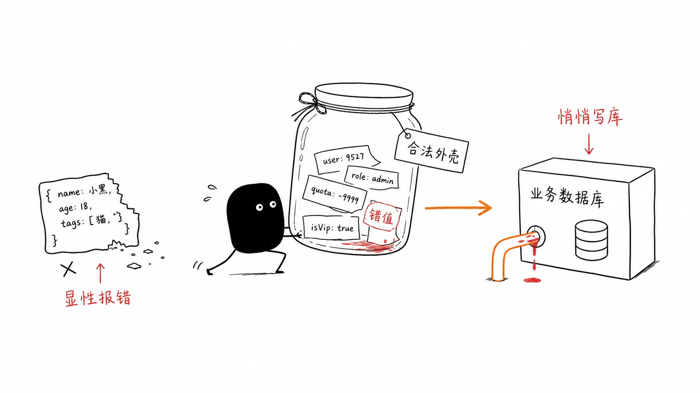
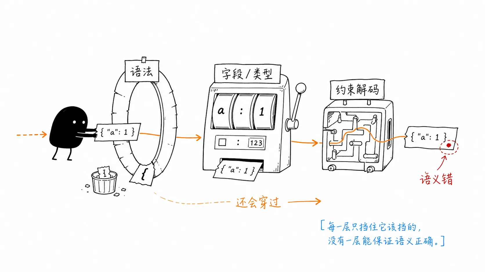
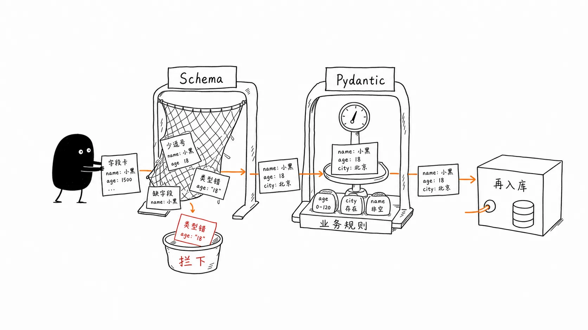
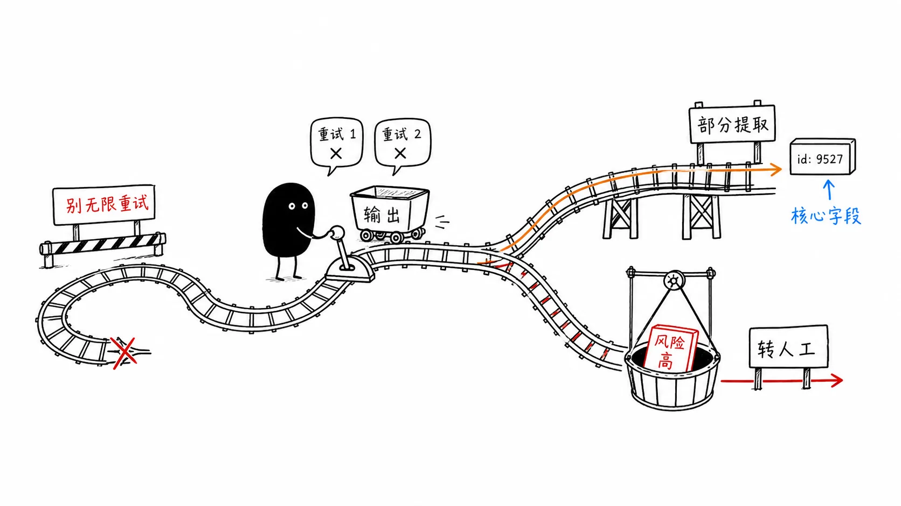

# 04｜格式幻觉：为什么 JSON 完美合规却还能毒杀下游？
你好，我是李号双，这一节课我们聊聊解析 Agent 输出可能会遇到的坑。

先给你看个下游系统解析 Agent 输出的常见写法，估计很多人第一轮都是这么写的：

```
import json
def handle_agent_response(response_str: str):
    data = json.loads(response_str)
    order_status = data["order_status"]
    tracking_id  = data["tracking_id"]
    downstream_system.update(status=order_status, tracking=tracking_id)
```

跑起来没问题，但随着调用量上来，你会发现下游系统偶尔会抛异常，或者数据悄悄写错了。你翻看日志，通常会看到下面三种情况：



1. **JSON 语法错误。**


模型确实调了 `query_order` 工具，工具也返回了正确的数据库记录。但模型在把这些记录总结成 JSON 时，忘了闭合括号，直接抛 `JSONDecodeError`。

2. **字段名错误。**


有时返回 `{"status": "shipped"}`，有时返回 `{"order_status": "已发货", "tracking": null}`—— 字段名不一样，解析代码直接抛出 `KeyError`（或者拿到一堆 `None`），下游系统以为物流单号丢了，触发跨系统告警。

3. **语义层失效。**


要求返回 `int` 类型的 `tracking_id`，它给你字符串 `"TN123"`；要求枚举值 `["shipped", "pending"]`，它给你 `"in_transit"`。JSON 合法，但语义错了，下游直接把错误数据写入数据库。

绝大多数人理解的结构化输出是：加个开关，加行 Prompt，就以为万事大吉。要弄清问题出在哪，得先搞清楚市面上约束模型输出的三档机制，防线到底建在哪。

### 认清防线：三档机制的本质差异

市面上约束模型输出的机制，严谨来说分为三档，它们的防线建在不同的层级。搞清楚这三档，你才知道你的代码到底防住了什么，漏了什么。

**第一档：Prompt 约束（包含普通 Function Calling）—— 靠概率遵守**

无论是你在 Prompt 里加上“请以 JSON 格式返回”，还是普通的 Function Calling（把 JSON Schema 塞给模型），本质上都只是给模型发了一份“答题卡”。模型理解了你的要求，会在统计意义上尽量照做，但它依然有物理上的自由度去乱写。Schema 定义 `age: integer`，它可能填 `-5`；定义 `status: enum`，它可能填 `"shipped "`（多了个空格）。

- **这一档防线其实没建起来**，全凭模型“自觉”，最开始的那种糟糕情况随时都会发生。


**第二档：JSON Mode (** `json_object` **) —— 语法层强制**

像 OpenAI 等大模型厂商在 API 接口里提供了一个名叫 `response_format` 的参数，专门用来控制输出格式。当你把 `response_format` 设为 `{"type": "json_object"}` 时，就相当于给模型下了一道死命令：“我不管你写啥，但最后吐出来的必须是个合法的 JSON 字符串”。所以，大括号肯定闭合了，引号也配对了， `json.loads()` 绝不报错。但是， **它只管语法，不管结构**。里面装什么、字段叫什么，引擎依然不管。你要 `tracking_id`，它可能给你 `{"trackingID": "TN123"}`，字段名差一个大小写，解析代码拿到的是 `None`。

- **这一档防线建在语法层**。第一种情况不见了，但第二种情况和第三种情况依然如故。


**第三档：Structured Outputs（约束解码）—— 结构层强制**

这是目前最高级别的保证。注意看参数，这里 `response_format` 变成了 `{"type": "json_schema"}`。 `json_object` 和 `json_schema` 一字之差，到底差在哪？差在引擎不仅要管语法，还要把你的 Schema 编译成一个有限状态机（FSM）。

引擎会通过 Logits Masking 把不符合 FSM 当前状态的 token 概率设为负无穷。这就意味着，模型物理上根本无法生成你 Schema 之外的字段名或类型。只要 Schema 没 bug，字段名和数据类型永远合法。

但这一档防线依然有代价：

- **代价一：FSM 故障是生产失效，不是软错误。** 某些复杂 Schema 下会触发 FSM stall（状态机无法推进），此时引擎直接 abort 请求。线上告警跳出 `StructuredOutputAbortError`，你找半天才发现根因是 Schema 里某个嵌套对象的 `anyOf` 触发了 FSM 边界条件。

- **代价二：格式正确 ≠ 内容正确。** 当模型被强制在 FSM 允许的 token 集合里生成时，它会优先保证“格式合规”，有时会牺牲“内容质量”。业界把这个现象称为“Structured Outputs 创造了虚假安全感”：模型可能为了填满 Schema 要求的字段，在自己不确定的情况下“瞎填”了一个在格式上合法、在语义上完全错误的值。




所以你看，这第三档防线虽然建在了结构层，能保证物理上不出格，但“语义失效”不仅还在，反而被完美的格式掩盖了。

这意味着什么？意味着结构化输出根本不是加几行 Prompt 或者拨一个 API 开关就能搞定的事，它本质上是个工程问题。

既然厂商的开关防不住“瞎填”的语义错误，我们就必须在工程侧自己架设防线，绝不让模型裸写的 JSON 直接灌进业务系统。

网络协议设计里有个著名的 Postel 定律：“发送时保守，接收时宽容”。但在处理大模型输出时，这条铁律得反过来用： **接收时必须严格，执行时必须保守。** 为什么？因为对模型输出宽容，后果是脏数据污染数据库；对工具执行宽容，后果就是直接引发生产事故。

为了把“瞎填”这条路彻底堵死，生产系统必须架起双层防线。

### 架起双层防线



**第一层防线：JSON Schema / Structured Outputs（结构约束）**

通过开启 Structured Outputs，把 JSON Schema 塞给模型，限制字段名和类型。这是“大网”，利用约束解码拦掉结构性错误。

**第二层防线：Pydantic（语义与业务约束）**

模型填完空之后，必须通过 Pydantic 模型的校验。Pydantic 管的是值的业务含义：

```
from pydantic import BaseModel, Field, field_validator
from typing import Optional
from enum import Enum
class OrderStatus(str, Enum):
    shipped = "shipped"
    pending = "pending"
    cancelled = "cancelled"
class OrderResult(BaseModel):
    order_status: OrderStatus                     # 枚举：只允许这三个值
    tracking_id: int = Field(..., gt=0)           # 必须大于 0 的正整数
    estimated_days: Optional[int] = Field(        # 可选，但如果存在必须合理
        None, ge=0, le=30
    )
    # 针对"情况三"的防御：虽然 Schema 强制了 int，但如果模型通过某种方式
    # 传入了带空格的字符串或格式不对的数字，这里做最后一道兜底
    @field_validator("tracking_id", mode="before")
    @classmethod
    def parse_tracking_id(cls, v):
        if isinstance(v, str):
            v = v.strip() # 清理可能的首尾空格
            if not v.isdigit():
                raise ValueError(f"tracking_id 必须是纯数字，实际值：{v}")
            v = int(v)
        if not str(v).startswith("1"):
            raise ValueError(f"业务规则：tracking_id 必须以 1 开头，实际值：{v}")
        return v
    @field_validator("order_status", mode="before")
    @classmethod
    def normalize_status(cls, v: str) -> str:
        # 宽容地处理大小写和首尾空格，防止 "shipped " 这类细微偏差
        return v.strip().lower() if isinstance(v, str) else v
```

只有通过了 Pydantic 校验的数据，才能进入下游系统。模型只管填空，代码拍板才算数。

### 自纠错循环：给模型一次改过自新的机会

双层防线架起来了，但紧接着就会遇到下一个问题：Pydantic 校验失败怎么办？最差的做法是直接抛异常让 Agent 停摆；好一点的做法是盲目重试；而最好的做法是把精确的错误信息喂回给模型，让它自纠错。模型对具体的结构化报错极其敏感，你告诉它“字段 `tracking_id` 必须大于 0，但你输入了 `'TN123'`”，它下一轮大概率能改对。

校验失败不是终点，而是带上下文的重试起点。但自纠错循环是个危险的游戏，极易陷入死循环和上下文爆炸。要玩得转，必须遵循三个设计细节：


1. **硬性限制最大自纠错次数（≤ 2）**


模型犯一次错可以改，犯三次错就是能力边界，不是可以无限重试的软错误。超过 2 次，强制打断，走降级策略。

2. **只注入前一次错误的核心摘要**


Pydantic 抛出的 `ValidationError` 包含完整的校验链路，原始字符串可能有几百字。把整个报错塞回上下文，不仅浪费 token，还会干扰模型注意力。必须提取核心摘要：哪个字段错了、什么规则、实际输入了什么。

3. **让模型想清楚再写答案**


这是个被严重忽视的反直觉洞见。我们在设计 JSON Schema 时，通常会定义一个字段来放结论（比如叫 `answer` 或 `recommendation`），再定义一个字段来放推导过程（比如叫 `reasoning`）。

大模型是从左到右逐字生成的。如果你的 Schema 里 `answer` 字段在 `reasoning` 字段之前，模型在还没“想清楚”的时候，就先输出了结论，推理质量会系统性下降。业界研究证实了这一点：对调字段顺序，让模型先写 `reasoning` 再写 `answer`，推理准确率可提升 10–15%。

**把** `reasoning` **放在** `answer` **之前，不是代码风格问题，是架构问题。**

### Schema 设计的四个工程陷阱

刚才在讲“想清楚再写答案”时，我们提到了 Schema 字段顺序的问题。其实，如果 Schema 本身设计有问题，前面架设的双层防线和自纠错循环都会大打折扣。

除了 `reasoning` 必须在 `answer` 之前，还有四个常见的工程陷阱：

**陷阱一：嵌套深度超过 3 层**

嵌套越深，FSM 状态机越复杂，模型生成正确 token 序列的难度指数级上升。超过 3 层嵌套，结构化输出错误率显著上升。设计 Schema 时，优先“扁平化”，必要时用 ID 引用替代深层嵌套。

**陷阱二：字段描述缺失**

你定义了 `eta: int`，模型不知道这是秒、毫秒还是天。它会猜——猜错了 Pydantic 还通过了（因为类型是对的），下游拿到的是错误数量级的数据。每个非显而易见的字段都必须有 `description`。

```
class OrderResult(BaseModel):
    eta: int = Field(
        ...,
        description="预计送达天数（自然日），范围 1-30",
        ge=1, le=30
    )
```

**陷阱三：枚举值空间过大**

枚举值超过 10 个，模型选择准确率开始下降，原因和上一节课讲的工具数量过多一样——注意力被稀释。超过 20 个枚举值，考虑改为层级化枚举（先选大类，再选小类）。

**陷阱四：Schema 字段总数超过 50**

Strict Mode 对 Schema 复杂度有实际限制，超过 50 个字段质量会显著下降。即使在其他平台，字段越多，模型越容易漏填或填错。拆分成多个小 Schema，分步提取。

### 系统韧性的最后防线：当模型死活填不对

前面的自纠错循环，给了模型 2 次改过自新的机会。但如果遇到长尾情况，比如模型碰到了从未见过的奇葩输入，或者服务器过载导致模型行为变异——重试 2 次还是不对，这时候该怎么办？

自纠错重试一定会耗尽，你必须有降级方案。Agent Loop 此时绝不能卡死，必须往下走。我们有两种降级策略：



1. **部分提取（宽松模式）。** 如果核心字段（如 `order_status`）提取成功，非核心字段（如 `estimated_days`）失败，丢弃非核心字段，用安全默认值填充，保底返回。宁可少拿一个字段，也不要让整个流程阻塞。

2. **挂起转人工。** 核心字段校验失败，部分提取也行不通——将任务状态转为 `SUSPENDED`（呼应第 1 节课），把原始文本和错误信息推入人工处理队列。


### 回到开头：那些“花式”脏数据是怎么被消灭的？

现在我们回过头看开头那三种让后背发凉的画面。如果用上这套机制，它在 Agent 和下游系统之间架起了一座防御工事。

```
# ===== 生产版：双层防线 + 自纠错 + 优雅降级 =====
from pydantic import BaseModel, Field, ValidationError
from typing import Optional
import json

# 1. 定义带语义约束的 Schema（注意 reasoning 在前，确保先推理）
class OrderSummary(BaseModel):
    reasoning: str  # ← 架构保证：先推理再给结论
    order_status: str
    tracking_id: int = Field(..., gt=0)  # ← 语义约束：必须大于 0
    estimated_days: Optional[int] = Field(None, ge=0, le=30)

# 2. 带降级链的校验主流程
async def validate_with_robust_fallback(llm, schema_cls, messages, core_fields, human_queue):
    current_msgs = list(messages)

    # --- 自纠错循环（细节一：硬性限制最多 2 次）---
    for attempt in range(3):
        # 第一层防线：底层引擎结构约束（传给 LLM 的 response_format）
        resp = await llm.complete(
            current_msgs,
            response_format={"type": "json_schema", "schema": schema_cls.model_json_schema()}
        )
        data = _extract_json_object(resp.content) # 清洗并提取 JSON

        try:
            # 第二层防线：Pydantic 语义校验（拦截瞎填的值）
            return schema_cls.model_validate(data)
        except ValidationError as exc:
            # 细节二：只注入前一次错误的核心摘要，不要全量堆砌
            error_summary = extract_core_error(exc)
            current_msgs.append({"role": "user", "content": f"校验失败: {error_summary}，请修正并返回合法 JSON。"})

    # --- 降级策略链（重试耗尽后触发）---
    try:
        # 策略一：部分提取（只校验核心字段，非核心字段丢弃）
        partial_data = {k: v for k, v in data.items() if k in core_fields}
        if all(partial_data.get(f) is not None for f in core_fields):
            return schema_cls.model_construct(**partial_data) # 跳过完整校验，强转返回
    except Exception:
        pass

    # 策略二：挂起转人工（核心字段也缺失，推入人工队列）
    if human_queue:
        await human_queue.push({"raw": resp.content, "error": error_summary})
        raise TaskSuspended("重试耗尽且核心字段缺失，已转人工处理")

    raise StructuredOutputFailed("彻底失败")

# 3. 在 Agent Loop 中优雅调用
result = await validate_with_robust_fallback(
    llm=agent.llm,
    schema_cls=OrderSummary,
    messages=messages,
    core_fields=["order_status", "tracking_id"], # 指定哪些是必须保住的核心字段
    human_queue=human_review_queue,
)
```

第一层用 Schema 约束模型生成的结构。第二层用 Pydantic 拦截语义错误的值。如果模型没写对，不是直接崩溃，而是给它最多两次的自纠错机会。如果还是不对，就走降级链，能提取核心字段的就部分提取，实在不行就挂起转人工，绝不让系统冷停。

### 总结

从第一节课的 Loop 架构，到第二节课的工具契约，再到这一节课的结构化输出，我们一直在做同一件事：在概率模型和确定性业务系统之间，修筑工程级的防火墙。

具体到结构化输出，有几条铁律需要记住：

1. **绝不让模型裸写 JSON 直接进业务系统。**


第一层用 Schema 约束结构，第二层用 Pydantic 校验语义，两层缺一不可。开了 Structured Outputs 就关 Pydantic，是把前门换成钢门、后门拆掉的操作。

2. **自纠错循环最多 2 次，超出即降级，不是继续重试。**


模型犯三次同样的错，是能力边界，不是需要更多重试的信号。重试预算用完，走部分提取或人工队列，不要在死局里烧 token。

3. **错误摘要要精确，不是全量 ValidationError 字符串。**


只取第一条最关键的错误，用“字段 X 的规则 Y 失败，实际输入 Z”的格式回喂模型。全量堆砌反而淹没了重点。

4. **reasoning 字段永远放在 answer 字段之前。**


这不是代码风格，是推理质量的架构保证。模型从左到右生成，先给答案再找理由，推理质量会系统性下降。

5. **约束解码解决的是语法，不是语义。**


FSM 保证输出合法 JSON，不保证 JSON 里的值有意义。格式完美的幻觉值是语义层失效，比 `json.loads()` 崩溃更危险——因为它不报错，直接污染下游数据。

结构化输出的本质不是“格式化”，而是“数据契约的工程实现”。你定义的不是一个 JSON 形状，而是一个生产系统必须遵守的法律。模型会犯错，但契约（工程代码）不会。

### 思考题

本节课通过实现了字段的部分提取降级：当核心字段（如 `order_status`、 `tracking_id`）提取成功而非核心字段失败时，系统接收部分结果继续运行。

但在某些业务场景下，“部分正确”比“全部失败”更危险。比如：订单状态从 `pending` 错误地更改为 `shipped`，但物流单号为 `null`——这会导致下游物流系统订单号缺失，比直接拒绝更难排查。

你能否设计一种机制，让 Agent Loop 能够区分“可安全降级的场景”和“必须严格校验的场景”？例如：通过在 Schema 上添加元数据标记，或者在 Loop 层维护一个“严格模式白名单”。欢迎你把想法分享到留言区，如果你有收获，也欢迎你分享给需要的朋友，我们下节课再见！