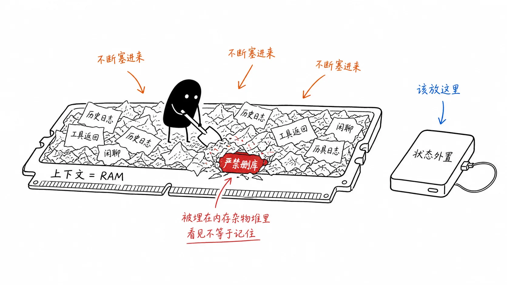
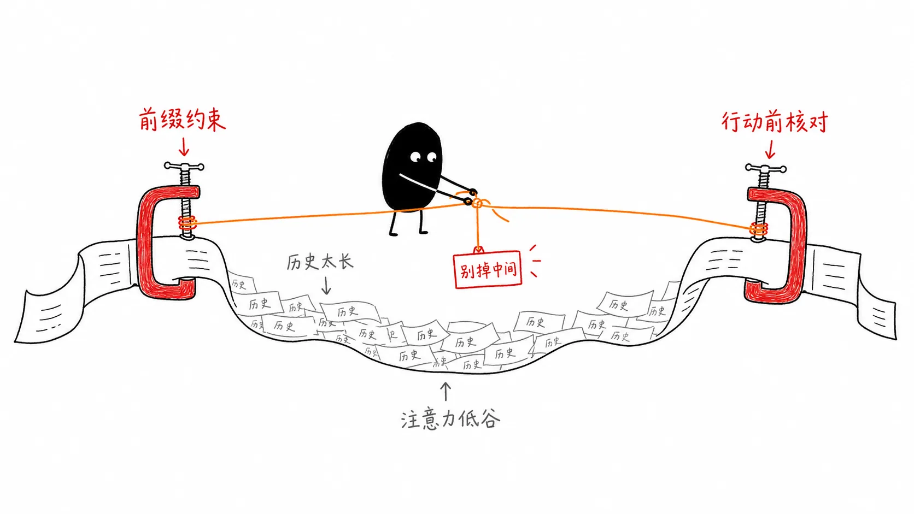
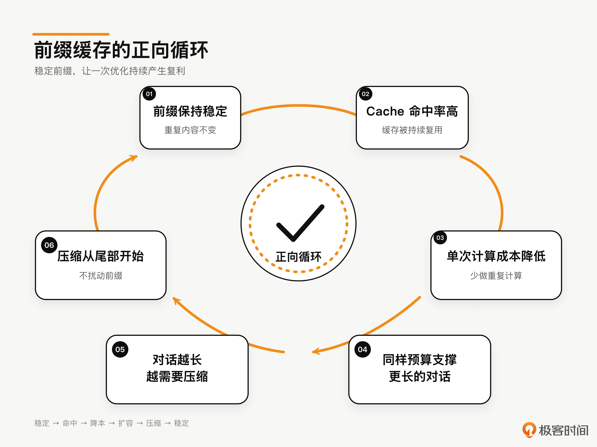
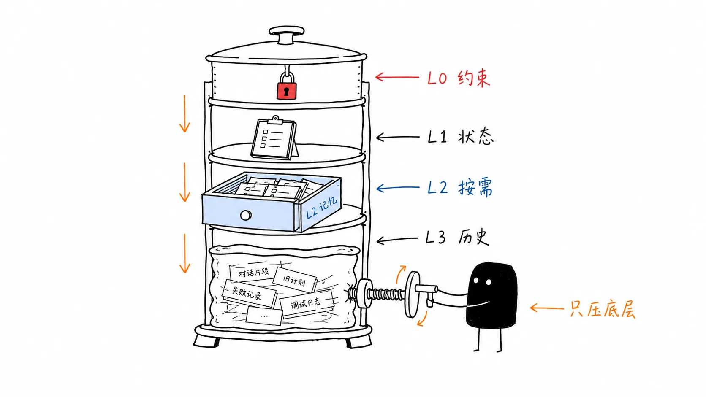

# 05｜为什么窗口越大，Agent 越容易忽略最重要的指令？
你好，我是李号双。

我们先来看一段代码。是不是有点熟悉？很多人写出的人生第一段 Agent 代码，大概率就长这样。我自己最早也是这么写的：

```
async def simple_agent_loop(user_input: str, tools: list[Tool]) -> str:
    messages = [{"role": "system", "content": "你是一个严谨的运维助手，严禁执行删库操作..."}]
    messages.append({"role": "user", "content": user_input})
    while True:
        response = await llm.invoke(messages=messages, tools=tools)
        if response.stop_reason == "end_turn":
            return response.content
        for call in response.tool_calls:
            result = await execute_tool(call.name, call.params)
            messages.append({"role": "assistant", "content": response.content})
            messages.append({"role": "user", "content": result})
```

这段代码没什么花哨的。一个 messages 列表，System Prompt 写好约束，用户输入塞进去，然后循环调用模型、执行工具、把结果 append 回去。教程里这么教，开源项目里这么写，逻辑上挑不出毛病。

但是它隐含了一个所有人都会有的直觉假设： **只要信息在上下文里，模型就会看到，就会遵守。** System Prompt 写了“严禁删库”，它就永远有效；历史对话 append 进去了，模型就永远记得。

这个假设，是所有 Agent 灾难的起点。

跑短任务的时候，这个假设一般不会出问题。前几轮，非常完美，工具调用顺滑，回答精准，你甚至觉得这就够了，可以上线了。

但当你把它丢到生产环境，让它跑一个长一点的任务，20轮、30轮工具调用之后，诡异的事情就开始了。不是报错崩掉那种，是更隐蔽的：

- **Agent 突然调了一条** `DROP TABLE users;`，你翻到上下文最顶端，System Prompt 里“严禁执行删库操作”那行字明明还在，没被截断，没被覆盖，就在那里——但模型就像没看见一样。

- 或者， **一个** `list_all_logs` **工具返回了 8 MB 的 JSON。** 之后每一轮，模型都拖着这 8 MB上下文继续推理。token 消耗涨了 40 倍，任务进度纹丝不动——模型陷在海量日志里来回翻找，出不来。你盯着日志，明明所有信息都还在上下文里，为什么模型就是“不看”？


你说，问题出在哪儿呢？

## 上下文窗口不是硬盘，它是内存

显而易见，问题出在 **你把上下文窗口当成了硬盘，但它其实是内存（RAM）**，这是很多程序员都会掉入的陷阱。



硬盘的特点是：容量大、持久化、随机访问成本均匀——你存进去的 1GB 文件，第 1 个字节和第 999 MB 处的字节，读取速度一样快。

内存完全不同：容量有限，断电即失，而且访问不同位置的代价天差地别——CPU 缓存命中和缓存未命中的性能差距可以达到两个数量级。

这就好比你开了三小时的会，记住了第一个发言的人说了什么，也记住了最后谁做的总结。中间两小时所有人说了啥，全糊了。这不是你偷懒——这是人脑的物理限制。

Transformer 的注意力机制，一模一样。虽然数学上允许每个 token “看到”所有其他 token，但 **注意力权重不是均匀分配的**。2024 年，斯坦福大学那篇论文 [_Lost in the Middle: How Language Models Use Long Contexts_](https://arxiv.org/abs/2307.03172 "") 揭示了一个事实：

> 模型对上下文首尾两端的信息注意力权重最高，对中间段的信息注意力权重显著衰减——无论中间段写了什么。

这意味着你在 System Prompt 里写的“严禁删库”，一旦被 10 万 token 的工具返回和历史对话推到了上下文的“中间位置”，它在模型的注意力分布里就等于不存在。

模型不是“忘记”了这条指令，而是注意力的物理机制让它“看不见”。“在” 和 “被看见”，是两码事。

而且随着上下文越来越长，这个问题会指数级恶化。你以为窗口越大越安全，实际上窗口越大，核心约束被淹没的概率越高。 **这就是为什么窗口越大，Agent 越容易忽略最重要的指令。** 这不是 bug，是物理。

所以，上下文管理不是“无脑附加（append）历史对话”那么简单。接下来我们一层一层拆：先做预算分层，再讲 L0-L3具体如何划分。

## 注意力预算分层：上下文不是一锅汤

计算机体系结构几十年前就解决了一个本质相同的问题：CPU 和主存之间速度差了几个数量级，怎么填平这个鸿沟？

答案是 **多级缓存**——L1/L2/L3，越靠近 CPU 的层级容量越小、速度越快、优先级越高，越远的层级容量越大、速度越慢、可被换出。

上下文管理面对的是一模一样的问题：窗口有限（容量约束），注意力不均匀（访问代价不均），核心约束不能丢（一致性要求）。解法也一样—— **分层预算制**。

我们给上下文划分 L0–L3 四个层级，每个层级有不同的优先级、生命周期和预算占比，你可以参考我整理的表格：

层级

优先级

承载内容

生命周期

预算占比

是否可压缩

**L0**

最高

系统指令 / 核心约束 / 宪法

永久常驻

8%

**永不**

**L1**

高

当前状态 / 执行计划

任务期内

15%

否

**L2**

中

RAG / 记忆 / 相关资源片段

按需注入

35%

是

**L3**

低

历史对话 / 工具返回日志

可压缩轮转

42%

是

注意这个L0-L3分层是预算优先级，不是物理摆放顺序。底层逻辑只有一句话： **系统指令永远比历史日志重要，当前状态永远比过往闲聊重要。** 你比模型更清楚什么不能丢，所以这件事必须写进代码，不能指望模型自己判断。

## L0：刹车片不能丢

L0 是你的刹车片。占整个上下文预算的 8%，不大，但 **绝对不能被挤掉**。它装的是系统指令、核心约束、项目宪法——那些“丢了就会出事”的东西。L0 一旦被挤出上下文，刹车就失灵，Agent 就会越权、删库、跑飞。不是可能，是迟早。那怎么保证它不被挤掉呢？

### 宪法层独立成文件

Claude Code 的 `CLAUDE.md` 就是这么干的——核心约束不写在代码字符串里，而是放在一个独立文件里。开发者随时改，不用动代码不用重新部署。Agent 启动时读这个文件，注入 L0。

我第一次看到这个设计的时候愣了一下——这不就是把宪法和代码解耦吗？但仔细想想，这帮人是真的想清楚了：宪法是人机共治的接口，它本来就该人来管，不该焊死在代码里。

这里有一个关键设计决策：宪法层永远在上下文的最前缀位置，且内容极少变动。这不是随意的选择，是为了 **Prompt Cache 的缓存命中率**——前缀越稳定，缓存命中率越高，推理成本越低。这个后面会闭环讲到。

### 首尾三明治：对抗 Lost in the Middle

即使有了分层，Agent 在超长任务中依然会“忘事”。因为 Transformer 的注意力机制存在 Lost in the Middle 效应——L0 约束一旦被 L2/L3 的海量信息推到“中间位置”，它就等于不存在。
答案是： **让约束始终处于模型注意力的绝对高位（首部或尾部）。**

L0 本身已经保证系统指令永不压缩、永远待在上下文最前缀——这是头部高地。但光有头部还不够，随着 L3 历史不断膨胀，头部约束离当前生成位置越来越远。解法是在上下文末尾再追加一份约束提醒（constraint reminder），形成 **首尾三明治防御** **。**

这个设计的精妙之处在于：无论中间的业务区怎么膨胀、怎么压缩，首尾两个“高地”永远钉在注意力的最高权重区域。模型在生成下一个 token 之前，注意力一定会扫过尾部——就像考试前老师最后说一句“记得写名字”。你前面可能走神了，但最后这句话你一定可以听到。



## L1：别把状态塞在上下文里

L1 承载当前执行状态、进度计划、轮次计数等动态但高频访问的信息。优先级仅次于 L0，生命周期是“任务期内常驻”，预算占比 15%， **同样不可压缩**。

这里有一个容易踩的坑：把执行状态塞在上下文里。

Agent 的执行状态——跑了多少轮、花了多少 token、当前卡在哪一步，绝对不能只存在 messages 列表里。上下文是 RAM，前面说过，断电即失。进程崩了、OOM 了、API 限流了，上下文里的状态全没了。

还记得 [第 1 讲](https://time.geekbang.org/column/article/1002770 "xxx") 宪法四“持久化可恢复”吗？它的落地形态就是 `AgentRun` 对象，所有关键状态集中在外部存储里，上下文只是它在当前 token 窗口的一张快照。 **快照可以丢，源头不会丢。**

L1 层的核心逻辑是：每轮推理前，从外部的 `AgentRun` 对象或数据库中读取最新的执行状态，组装成一个状态块；然后在组装上下文时，找到 L1 的位置，用这个最新的状态块 **替换** 原有内容，而不是盲目追加。这样即使上下文被压缩，L1 也不会丢失。

一句话记住 L1： **每轮重新组装，从外部存储读取，而不是让模型“记住”当前状态。**

## L2：缺页了就去 SSD 取

L2 承载长尾知识、用户历史偏好、相关文档片段等按需注入的信息。优先级中等，预算占比 35%——但注意，这是“预算上限”，不是“常驻预算”。

生产环境中，L2 是按需检索注入的片段，单次注入的 Token 量通常只有 2K-5K。留 35% 的空间，是为了应对复杂任务中可能需要同时注入多个相关文档片段（比如代码审查时同时引用多个文件），而不是让你填满它。

### RAG 就是缺页中断

操作系统几十年前就用同样的方式解决了同样的问题：虚拟内存的 **缺页中断机制**（Page Fault）。程序以为自己独占全部内存，实际上只有正在用的那一页才真正在物理内存里——用到时调入，不用时换出。

**把知识库当 SSD，把上下文当 RAM，缺页了就去 SSD 取。**

长尾知识、用户历史偏好，不该预先塞进 System Prompt。用 RAG 在每轮推理前，根据当前意图检索最相关的 Top-K 片段，注入 L2 层，用完即焚，下一轮重新检索。

### 副车道检索：不污染主对话前缀

这里有一个容易被忽视的工程细节。当一个 Agent 需要检索记忆时，它不应该在主对话流里做 RAG，而应该启动一个独立的、用便宜模型完成的检索调用——这被称为 **副车道**（sidecar）机制：

维度

主车道（主对话）

副车道（记忆检索）

模型

旗舰模型

便宜模型

上下文

完整对话历史

只有检索 query + 记忆元数据

对前缀的影响

决定了 Prompt Cache 的前缀

**不进入主对话前缀**

独立召回的核心价值不是“省钱”，而是 **不污染主对话的 Prompt Cache 前缀**。如果在主对话里做 RAG，每次检索的结果都会改变上下文结构，导致 Prompt Cache 失效。把检索结果放在前缀之后（或通过副车道独立获取），前缀结构保持稳定，Cache 才能持续命中。
这一点后面讲压缩时会形成闭环。

## L3：五级渐进压缩，从保真到保命

L3 承载历史对话、工具返回日志等可压缩轮转的信息。优先级最低，预算占比高达 42-60%，是整个上下文的“预算黑洞”。

为什么 L3 是黑洞？一次数据库查询可能返回 5000 token 的 JSON，但 Agent 真正需要的可能只是其中一行。不做压缩，几轮工具调用下来，上下文就爆了。

### 分区隔离：系统指令与历史日志分治

系统指令（L0）和工具返回（L3）混在同一个 `messages` 列表里，是架构上的问题。生产级 Agent 必须做分区管理，在代码层级隔离，不让历史日志有机会挤掉系统指令。

### 搬家式的断舍离：五级渐进压缩

随着会话轮次不断增加和工具反复调用，L3 层会像滚雪球一样越积越大，逼近甚至撑爆分配的 token 预算。简单的截断会丢失关键决策线索，一刀切的摘要可能把重要约束抹平。我们需要一种更精细的压缩机制来动态挤出“水分”。
生产级 Agent 的压缩不是一刀切，而是五个逐级升级的层级。每一级对应不同的上下文压力，从“尽量保真”到“只保命”：

压缩级别

触发条件

策略

信息损失

**Level 1：无压缩**

< 50%

最近 N 轮保持原文

0%

**Level 2：工具结果压缩**

50-70%

过长的 tool result 只保留首 500 + 末 200 字符 + 中间摘要

~40%

**Level 3：历史摘要**

70-85%

更早的对话轮次压缩为结构化摘要，保留关键决策和工具调用

~70%

**Level 4：主题级摘要**

85-92%

按主题聚合多轮对话，只保留结论和约束引用

~85%

**Level 5：紧急模式**

\> 92%

只留宪法层 \+ 当前状态 \+ 最近 1 轮，其他全部丢弃

~95%

为什么是五级而不是三级？因为三级压缩的粒度太粗——从“最近 N 轮原文”直接跳到“全部摘要”，中间没有过渡。五级压缩让每一级只做最小的必要牺牲，最大限度保留有用信息。

这里最容易被忽视的是 **Level 2 的工具结果压缩**。我个人觉得这是五级里最被低估的一级。很多人一上来就 Level 3 做摘要，其实 Level 2 砍一刀能省 40% 的 token，信息损失几乎可以忽略。一次数据库查询返回 5000 token 的 JSON，生产级做法是：保留结果的结构（首部字段名 + 尾部状态码），中间部分用 LLM 生成一句话摘要。5000 token 压缩到 700 token，关键信息一个没丢。这个级别的压缩性价比高得离谱。

另外一个做法是工具返回的结果如果超过阈值（比如 2000 字符）就写盘，上下文中只留一个约 800 字符的 placeholder 和文件路径。模型需要看全文时用 `read_tool_result` 工具按需读回。这样大块内容根本不进压缩管线，L3 的体量天然就小。

### 压缩的黄金法则

**永远从 L3 开始压缩，L0 和 L1 是禁区。**

如果压缩把“严禁删库”给摘要没了，那压缩就是灾难。这也决定了压缩的方向，从 L3 最老的历史开始压缩，保留最近的对话原文。最老的系统指令（L0）和最近几轮的决策（L3 尾部）都不能动，动的只有中间那堆“过去式”的工具日志。

这就引出了一个正反馈循环：

> 前缀稳定 → Cache 命中率高 → 每次请求的计算成本降低 → 同样的预算支撑更长的对话 → 对话越长越需要压缩 → 压缩从尾部开始 → 前缀保持稳定。



## 把所有东西焊进代码

把上面说的四层分层、五级压缩、首尾三明治焊进代码，一个生产级上下文管理器长这样。先是两个枚举——层级和压缩级别：

```
class CompressionLevel(Enum):
    """五级渐进压缩：0-4 从保真到保命"""
    NONE = 0            # < 50%：无压缩
    TOOL_COMPRESS = 1   # 50-70%：工具结果压缩（首500+尾200+摘要）
    HISTORY_SUMMARY = 2 # 70-85%：历史摘要（关键决策+工具调用）
    TOPIC_SUMMARY = 3   # 85-92%：主题级摘要
    EMERGENCY = 4       # > 92%：紧急模式（只留最近1轮）
```

然后是上下文管理器本身。核心是 `prepare()`——每轮 LLM 调用前执行一次，组装出完整的消息列表：

```
class ContextManager:
    """生产级上下文管理器：预算制 + 分层 + 外置状态 + 五级压缩 + 首尾三明治"""
    def __init__(self, system_prompt: str, constraint_reminder: str,
                 cfg: ContextConfig, spill_store=None, llm=None):
        self._system = system_prompt              # L0：永不压缩，独立传给 API（保 prompt cache）
        self._reminder = constraint_reminder      # 尾部三明治：约束重放
        self._cfg = cfg
        self._max = cfg.max_tokens
        self._counter = TokenCounter()            # tiktoken 计数
        self._spill_store = spill_store           # 大 tool result 写盘
        self._pipeline = HistoryCompressor([...])  # 五级压缩 stage 列表，下面展开

    async def prepare(self, run: AgentRun) -> tuple[str, list[dict]]:
        """每轮重建上下文：先算各层 token → 算 ratio → 压缩历史 → 组装三明治。"""
        # 1. 算 L1/L2 的 token（先不组装，压缩决策需要这些数）
        state_block = format_state(run)                         # 从 AgentRun 读状态
        state_tokens = self._counter.count(state_block)
        memory_block = "\n".join(await self._collect_memory(run))  # RAG 副车道检索
        memory_tokens = self._counter.count(memory_block)

        # 2. 压缩历史：ratio 把原始历史算进分子（不压会多大），history_budget 是压完后的预算
        history, level = await self._compress_history(
            run, state_tokens, memory_tokens
        )

        # 3. 组装三明治：[STATE] + [MEMORY] + history + constraint_reminder
        messages = self._assemble_sandwich(state_block, memory_block, history)
        return self._system, messages

    async def _compress_history(self, run, state_tokens, memory_tokens):
        """算 ratio → stage 列表按阈值匹配第一个命中的 → 执行压缩。"""
        current_usage = (
            self._counter.count(self._system)      # L0
            + state_tokens                          # L1
            + memory_tokens                         # L2
            + sum(self._counter.count_message(m) for m in run.messages)  # L3 原始
        )
        ratio = current_usage / self._max
        history_budget = (                         # 压完后的预算 = 总量扣掉 L0/L1/L2/reminder/安全余量
            self._max - self._counter.count(self._system)
            - state_tokens - memory_tokens
            - self._counter.count(self._reminder) - self._cfg.safety_margin
        )
        return await self._pipeline.run(run.messages, history_budget, ratio)

    def _assemble_sandwich(self, state_block, memory_block, history):
        """[STATE] + [MEMORY] + history + constraint_reminder。"""
        messages = []
        if state_block:
            messages.append({"role": "user", "content": f"[STATE]\n{state_block}"})
        if memory_block:
            messages.append({"role": "user", "content": f"[MEMORY]\n{memory_block}"})
        messages.extend(history)                   # L3 压缩后的历史
        if self._reminder:
            messages.append({"role": "user", "content": self._reminder})  # 尾部高地
        return messages
```

看到 `_assemble_sandwich` 最后那个 `self._reminder` 了吗？这就是尾部三明治。不管前面 L3 的历史被压成什么样，这一行永远在上下文最末尾——模型生成下一个 token 之前，注意力一定会扫过它。

压缩管线是五个 stage 组成的列表，每个 stage 自己判断该不该出手，第一个命中的生效：

```
class HistoryCompressor:
    """stage 列表按 ratio 升序匹配——第一个 should_run 命中的 stage 执行压缩。"""
    def __init__(self, stages: list[ContextStrategy]):
        self._stages = stages

    async def run(self, messages, budget, ratio):
        for stage in self._stages:
            if not stage.should_run(ratio, self._cfg):
                continue
            # 每个 stage 自带压缩策略，但都受 budget 约束：
            # NONE 原文塞预算、TOOL_COMPRESS 截 tool result、SUMMARY 摘要旧轮次、
            # EMERGENCY 砍到最后 2 条。砍完都再过一遍 fit_budget 按预算兜底。
            # 命中一个就返回——压缩级别只升不降，不会叠加。
            return await stage.apply(messages, budget, ctx)
        # 所有 stage 都没命中（理论上不会走到这里，EmergencyStage 的 should_run 恒 True）
        # 兜底：从最新消息往回塞满预算为止，更老的直接丢——保最近的决策，丢最老的日志
        return fit_budget(messages, budget), CompressionLevel.NONE

# 五个 stage，每个带自己的阈值判断和压缩策略
class NoCompressionStage:       # ratio < 0.50：原文塞进预算
    def should_run(self, ratio, cfg): return ratio < cfg.tool_compress_at

class ToolCompressStage:        # 50-70%：截断过大的 tool result（首500+尾200+中间摘要）
    def should_run(self, ratio, cfg): return ratio < cfg.history_summary_at

class SummarizeStage:           # 70-85% / 85-92%：旧轮次压缩成摘要，保留最近 N 轮原文
    def should_run(self, ratio, cfg):
        if self.level == CompressionLevel.HISTORY_SUMMARY:
            return ratio < cfg.topic_summary_at
        return ratio < cfg.emergency_at

class EmergencyStage:           # > 92%：只留最后 2 条
    def should_run(self, ratio, cfg): return True  # 兜底
```

## 总结

回到开头那个场景：System Prompt 里“严禁删库”那行字明明还在，模型却像没看见一样调了 `DROP TABLE`。

现在你能回答为什么窗口越大，Agent越容易忽略最重要的指令了吧？大模型的注意力不是均匀的，窗口越大，核心约束被历史推到中间位置的概率越高，Lost in the Middle 让它“在”却不“被看见”。你以为信息都在窗口里，但注意力的物理机制不这么认为。

这节课给的解法是一套组合拳：L0-L3 分层把“什么不能丢”写进预算、首尾三明治把约束钉在注意力高地、L1 状态外置让快照可丢源头不丢、L3 五级压缩从尾部动手绝不碰禁区、副车道检索保住 Cache 前缀。



这几件事不是各自为战，它们拼在一起形成了一个正反馈——前缀稳定 → Cache 命中 → 成本下降 → 同样预算撑更长对话 → 越长越要压缩 → 从尾部压 → 前缀继续稳定。

你要记住： **上下文是 RAM 不是硬盘，RAM 的管理从来不能交给概率。**

## 思考题

这节课我们讲了 L0-L3 四层分层架构和五级渐进压缩。假设你的 Agent 面临这样一个场景：

用户要求 Agent 执行一个需要 50 轮工具调用的复杂任务，比如“审查整个代码仓库并修复所有安全问题”。在第 30 轮时，上下文已经达到 85%（触发 Level 4 主题级摘要）。但此时用户突然说了一句话：

> “对了，第 5 轮查到的那条 SQL 注入漏洞，修复时不要用参数化查询，用 ORM 的查询构建器替代。”

这是一个跨 25 轮的临时性约束。在 Level 4 压缩下，第 5 轮的工具返回早已被压缩成主题摘要，具体的 SQL 注入漏洞细节可能已经丢失。

你如何在 Agent Loop 层面设计一种机制，确保这类“用户临时性约束”不会被渐进压缩吞掉？提示：考虑约束的“生命周期管理”——临时约束从哪里来、存在哪里、何时注入、何时销毁。

欢迎你把你的想法分享到留言区，如果你觉得这节课的内容对你有所帮助，欢迎你分享给需要的朋友，我们下节课再见！

* * *

## 附录：用 ProdAgent 验证本讲机制

课程中的 `ContextManager` 是为了讲清原理而简化的教学实现。它展示了 L0-L3 分层、首尾约束、状态外置和渐进压缩的核心结构，但没有展开一套完整框架还需要处理的记忆管理、运行预算、多 Agent 协作、事件观测和持久化等工程问题。

如果你想继续验证这些机制，而不是只停留在示例代码层面，可以使用我们提供的开源框架 [ProdAgent](https://github.com/limenagent/prodagent "")。它把本讲涉及的上下文分层、记忆召回、工具结果压缩和运行时观测实现成了可运行模块。

下面两个案例不是性能基准，而是可重复运行的验证场景。你可以直接运行代码，观察记忆是否召回、上下文如何组装，以及压缩级别何时切换。

### 案例一：Agent 相亲——验证机械截断与框架化管理的差别

这个案例让两个 Agent 在同一个共享对话中自主交流。

角色：相亲男-大牛、相亲女-小美

大牛代表常见的简单实现：自己维护一个 `messages` 列表，超过阈值后执行 `del messages[:-4]`，直接删除较早的消息。因此，小美在第一轮说过的“海鲜过敏”等信息，会随着对话增长从大牛的上下文中彻底消失。

小美则运行在 ProdAgent 框架上：

- `MemoryManager` 管理需要持续保留和召回的信息；

- 上下文按照不同优先级分层组装；

- 历史对话与工具结果进入压缩管线；

- `MEMORY_RECALL`、 `CONTEXT_BUILD` 等 Hook 会输出运行时信号；

- 多 Agent 通过共享对话空间进行轮次驱动，并受到预算和终止条件约束。


运行案例时，不要只看最终对话。真正需要观察的是气泡下方的 **“命中记忆”“触发压缩”和“压缩后仍保留”** 等信号。这些才是框架机制真实执行的证据。

[https://github.com/limenagent/prodagent/blob/main/examples/deep\_research.py](https://github.com/limenagent/prodagent/blob/main/examples/deep_research.py "xxx")

### 案例二：深度研究——验证长任务中的上下文压缩

深度研究是验证上下文管理的典型任务：Agent 需要连续抓取多个来源，每轮工具返回都可能包含几千字内容。如果简单保留全部历史，L3 很快会被工具结果填满；如果只保留最近几轮，又可能丢失研究早期查到的关键数字和来源。

ProdAgent 的 `deep_research` 示例采用 REACTIVE 模式，每轮根据上一次搜索结果决定下一步，而不是预先写死整条执行路径。

为了让压缩机制更容易被观察，示例主动缩小上下文窗口并调低触发阈值。运行过程中可以看到：

- `TOOL_COMPRESS` 先压缩过长的工具返回；

- `HISTORY_SUMMARY` 再汇总较早的研究历史；

- 最终报告仍然能够使用前面轮次保存下来的关键 claim 和来源；

- 控制台会显示上下文压力与压缩级别的变化。


这个案例验证的重点不是“报告写得有多好”，而是 **一个长任务在不断产生工具结果时，框架能否按照预定策略管理上下文，并保留最终输出真正需要的信息**。

[https://github.com/limenagent/prodagent/blob/main/examples/deep\_research.py](https://github.com/limenagent/prodagent/blob/main/examples/deep_research.py "xxx")