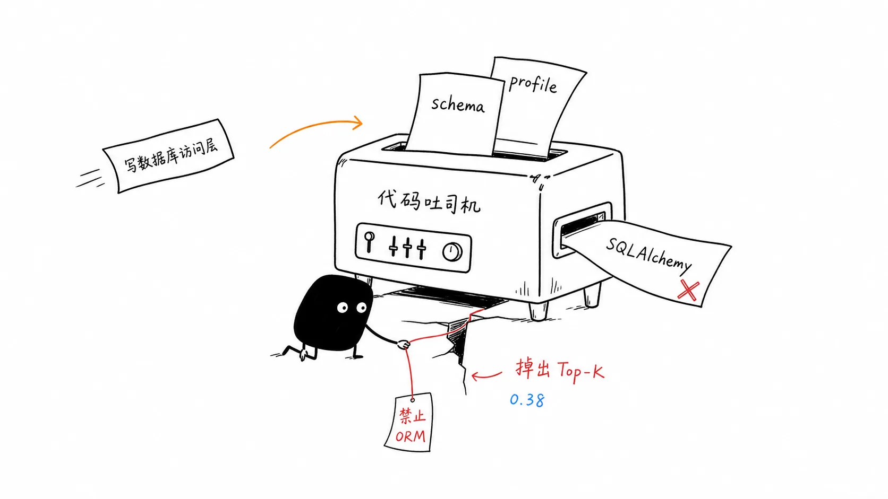
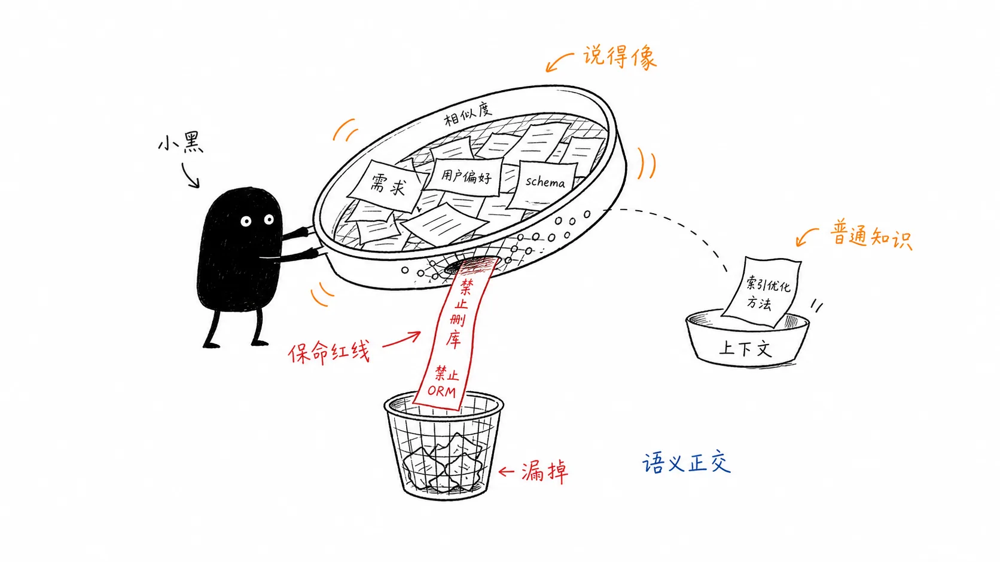
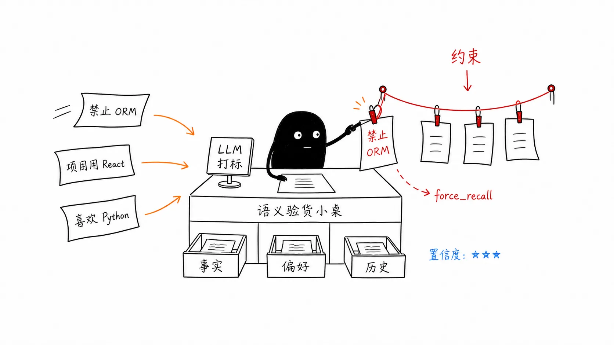
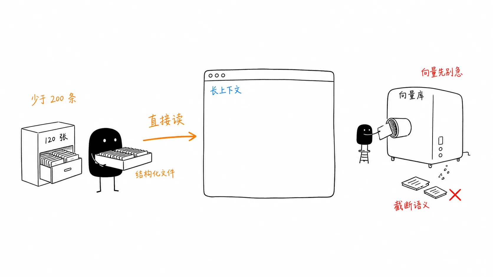

# 06｜分路召回架构：如何避免安全红线被向量检索“漏掉”？
你好，我是李号双。

在这节课正式开始之前，你先来想象一个场景：周三下午，你正喝着咖啡审查代码。六周前，你在代码审查会上拍着桌子定下的铁律：“ **禁止使用 ORM，所有数据库操作必须用原生 SQL**”。当时，你特意把这条规范整理成一条 `Memory`，描述得清清楚楚，存进了 Agent 的向量库。你以为这件事彻底解决了。
今天，你让 Agent：“给报表模块写一个数据库访问层”。

它爽快地输出了代码。你扫了一眼，看到了 `SQLAlchemy` 的导入语句。手里的咖啡差点没端稳。

这不可能。你打开召回日志，看到了这样的逻辑：

```
[召回日志]
查询："给报表模块写数据库访问层"
───────────────────────────────────────
✓ 已召回: user_profile.md
    理由: 向量相似度 0.71 > 阈值 0.45
✓ 已召回: database_schema.md
    理由: 向量相似度 0.63
✗ 未召回: feedback_db_orm_policy.md
    描述: 禁止使用任何ORM框架，所有查询必须使用原生SQL
    理由: 向量相似度 0.38 < 阈值 0.45
───────────────────────────────────────
```

你盯着那个 **0.38** 陷入了沉思。

在向量空间里，“禁止使用 ORM”和“写数据库代码”的相似度只有 0.38——达不到 0.45 的召回阈值。Agent 没有报错，没有犹豫，它只是按它看到的上下文在干活，它根本不知道有这条禁令存在。对它来说，用 SQLAlchemy 和用原生 SQL 没有区别，都是“写数据库代码”。



那条保命的红线，就这样悄无声息地被概率淹没了。

## 0.38 这个数，到底是怎么算出来的

要真正理解为什么 0.38 是个要命的数字，得把向量相似度的计算过程拆开看。

向量检索的第一步，是把文本变成向量。embedding 模型读入一句话，输出一个高维向量（比如 1536 维）。这个向量编码的是 **这句话里所有词的语义信号的叠加**。

把“禁止使用 ORM”和“给报表模块写数据库访问层”这两句话分别编码，它们各自的向量里都装了什么？

- “禁止使用 ORM”（ORM 即对象关系映射，一种将数据库表转为编程对象的工具）：核心语义信号是“禁止”“ORM”。其中“ORM”是一个专有名词，它的语义向量会跟“数据库”“SQL”“映射”这些词有一定重叠——因为 embedding 模型在训练语料里见过它们一起出现。

- “给报表模块写数据库访问层”：核心信号是“报表”“模块”“写”“数据库”“访问”“层”。


现在算余弦相似度。两个向量要做点积，本质上是 **找它们有多少语义信号是重叠的**。

这两句话真正共享的强语义信号，其实只有一个：“数据库”（通过 ORM 间接关联）。其他词——“禁止”“报表”“模块”“访问”“层”——彼此都是独立的语义信号，不重叠。

**两句话只共享一个强信号，余弦相似度自然停在 0.38 这种不高不低的尴尬值。**

打个更直白的比方：向量模型像一个只看关键词的实习生。你给他一份“禁止使用 ORM”的规范，他记住了“ORM”“禁止”两个词。然后你问“我要写数据库代码，该注意什么？”——他翻了翻笔记，发现“数据库”和“ORM”好像有点关系，但又不太确定，于是给了个 0.38 的置信度，觉得“大概相关吧，但没到必须提醒的程度”。而真正的人类工程师会立刻意识到：“写数据库代码”这个动作直接命中了“禁止 ORM”这条禁令——因为人懂因果，懂这个动作会触发那条规则。

你可能还存着一线希望：既然 0.38 卡在阈值 0.45 下面，那我把阈值调低一点，调到 0.3，问题不就解决了？

没那么简单。阈值是向量检索的第二个坑。定高了（比如 0.6），很多相关记忆被挡在门外——0.38 的约束进不来，0.5 的偏好也进不来，Agent 丢掉的不只是红线，还有干活需要的事实。定低了（比如 0.3），无关记忆涌进来——“数据库连接池配置”和“数据库备份策略”都会被召回，上下文被噪声淹没，Agent 反而更难聚焦。

**阈值没有理论最优值，只能靠 eval 调。** 而且不同领域、不同 embedding 模型的阈值都不一样——支付领域的 0.45 换到运维领域可能得调到 0.5，text-embedding-3 和 BGE 的阈值也不能通用。你的系统每换一次模型、每加一个领域，都得重新跑一轮评估。

这就是纯向量检索的死结： **分数不靠谱，阈值也不靠谱。** 你把“保命的红线”和“干活的知识”放进了同一个概率性的筛子里，而这个筛子的网眼大小（阈值）你自己都定不准。大模型的能力下限由预训练决定，但上限由你喂给它的上下文决定——把安全约束和闲聊记录混在一个向量库里，等于把系统的生死交给了概率。



约束类记忆的召回不能依赖概率，这根本不是相似度问题，而是 **在场性** 问题。要解决这个问题，我们必须放弃对纯向量检索的幻想，从“一锅炖”的粗放模式，升级为“分类存、分路召”的确定性架构。

这需要两道防线：写入时的 **分类打标**，和读取时的 **混合召回**。

## 防线一：写入时加固——别把红线当普通文本存

人脑的记忆不是一锅炖的。你听到一句话，大脑会本能地分门别类——这是规矩、那是事实、那是偏好、那是往事，然后存进不同的地方，各用各的 recall 方式。这就是 **记忆分类**。

但 Agent 系统普遍跳过了这一步，写入即堆放，所有记忆往同一个向量库里一扔了事。生产级架构必须补上这一环：一个 `MemoryClassifier` 组件，在写入的瞬间完成分类和打标。

怎么识别约束性语言？如果你还在用正则表达式去匹配“禁止/必须”这类词，那你就是在用二战时的雷达去拦截隐身导弹。正则既不懂语义，也跨不了语言。

**正确的做法是：** **把语言理解交给 LLM。**

用一个轻量级的模型（如 Haiku），配合 `temperature=0` 的确定性配置，在写入时就把记忆分为四类：



1. **CONSTRAINT（约束/规范）**：否定句为主，语义与任务正交。例如：“禁止在生产环境执行 DROP TABLE”，不管你在做什么数据库操作，这条都必须在场。

2. **FACT（事实/状态）**：描述“现在是什么”，会被覆写。例如：“当前数据库版本是 PostgreSQL 16”，下次升级到 17，这条会被新事实覆盖。

3. **PREFERENCE（偏好/习惯）**：描述倾向，软性指导。例如：“日志格式偏好 JSON，字段名用 snake\_case”，不是硬约束，但最好遵守。

4. **EPISODIC（情节/历史）**：描述“发生了什么”，只追加。例如：“上周二支付服务挂了 20 分钟，原因是连接池耗尽”，历史事件，有时效性。


```
class MemoryClassifier:
    """写入时用 LLM 分类打标，替代脆弱的正则匹配"""
    _SYSTEM_PROMPT = """You are a context classification assistant for an AI agent system.

Classify incoming text into one of four context types and extract metadata.

Memory types:
1. CONSTRAINT — Hard rules, prohibitions, boundary limits.  Always injected; use
   force_recall=true and add trigger_conditions.
2. FACT — Current-state facts ("now", "using", "current version is").  These overwrite
   previous facts via entity upsert.  Provide a stable entity_id.
3. PREFERENCE — Soft guidance (user habits, style preferences, defaults).  No TTL.
4. EPISODIC — Historical events ("last week", "yesterday", "the outage on Tuesday").
   Set a ttl_days (e.g. 7) so stale events decay.

Return a JSON object with exactly these fields (no prose, no markdown fences):
...
"""

    async def classify(self, raw: str) -> MemoryRecord:
        # 调用轻量模型，temperature=0 确保确定性
        response = await self._llm.complete(
            messages=[{"role": "user", "content": self._build_prompt(raw)}],
            system=self._SYSTEM_PROMPT,
            config=LLMConfig(temperature=0.0, max_tokens=2048),
        )
        parsed = json.loads(response.text)
        return MemoryRecord(
            content=raw,
            memory_type=parsed["memory_type"], # 关键：类型标签
            domain=parsed["domain"],
            force_recall=parsed.get("force_recall", False),
            # ...
        )
```

这就好比快递分拣中心，把易碎品挑出来贴上红色醒目标签，而不是和衣服、书本一股脑扔进同一个编织袋里。

**写入时多花几百毫秒做分类，召回时就能省下无数次的无效检索和巨大的 Token 浪费。**

## 防线二：读取时硬召回——规则保底线，语义补细节

做好了分类，每条记忆都有了类型标签。现在我们可以设计召回管线了。

分类解决了“写入时打标”的问题。但读取时呢？怎么把对的记忆在对的时机召回？这本质是一个信息检索问题。

传统信息检索（IR）领域几十年前就想明白了： **单一算法不可靠。** 你去看 Google 或者 Elasticsearch 的底层，它们从来都不是只算向量距离，而是“规则 + 关键词匹配 (BM25) + 语义理解”的多路召回混合排序。

Agent 圈如果还只靠向量相似度，等于把前人踩过的坑重新踩一遍。正确的做法是分阶段处理，各司其职。我们设计一个 **四阶段并行召回管线**：

阶段

召回方式

目标

适用记忆类型

**Stage 1**

**规则硬召回**

约束必须在场，不靠概率

**约束/规范**

**Stage 2**

**BM25 精确召回**

API名、表名、错误码必须命中

偏好/情节

**Stage 3**

**向量语义召回**

嵌入相似度 \+ 重排序

偏好/情节

**Stage 4**

**实体图谱**

知识图谱查询，返回最新状态

事实/状态

在这套架构里，一个关键的设计是： **查询是并行的，但合并是串行的。**

四个通道同时查，但在合并时，严格按照优先级逐阶段填充 Token 预算。这意味着，约束类记忆拥有最高优先级，它们会先抢占上下文窗口，剩下的预算才轮给偏好和细节。

```
async def recall(self, query: str, domain: str | None = None, budget: int = 4000):
    """四阶段并行混合召回管线"""
    # ── 四通道并行查询 ──
    rule_items, exact_items, semantic_items, entity_items = await asyncio.gather(
        RuleChannel().search(query, domain, budget, ctx),
        ExactChannel().search(query, domain, budget, ctx),
        SemanticChannel().search(query, domain, budget, ctx),
        EntityChannel().search(query, domain, budget, ctx),
    )

    recalled, budget_left = [], budget

    # ── 按优先级串行合并，先占先得 ──
    for stage_items in (rule_items, entity_items, exact_items, semantic_items):
        for item in stage_items:
            if budget_left - item.token_count < 0:
                continue  # 放不下就跳过，留给后面更小的条目
            recalled.append(item)
            budget_left -= item.token_count

    return recalled
```

在这个管线里，第一阶段是灵魂，也是对纯向量检索傲慢的纠偏。规则硬召回阶段，系统根本不计算余弦相似度，不卡阈值—— **这不是概率检索，这是硬召回。** 只要触发条件匹配，约束就无条件进入上下文。

但“无条件进入”不等于“无脑全塞”。约束在写入时可以带 `触发条件`，比如“禁止使用 ORM”，这条约束的触发条件是 `{"type": "domain", "value": "database"}`，只有当前任务的 domain 是 database 时才注入。当你让 Agent 写前端代码时，数据库相关的约束不会占用上下文预算。约束是“必须在场”，但“在场”的前提是“该它出场”。

不过约束即使该它出场，也不能让它吃掉所有预算。一个大型项目可能有几十条数据库约束，全塞进去可能占满 4000 token 的预算，Stage 2-4 全被挤掉，Agent 只有约束，没有事实和偏好，照样干不好活。实际工程里会给约束也设一个上限（比如不超过预算的 40%），剩下的留给事实和语义。要记住，“宁可多占点 Token”不等于“独占全部 Token”。

## 向量库不是银弹

还有一个颇具讽刺意味的行业数据。在 LoCoMo（Long-Conversation Memory）基准测试里，有人把各种 Memory 方案跑了一遍对比： **简单的文件系统方案准确率 74.0%，而复杂的 Mem0 向量方案只有 66.9%。**

文件系统赢了向量库。

直觉上说不通，但仔细想完全合理：在 Context Window 动辄 20 万 token 的今天，当记忆条目少于 200 条时，直接把结构化文件塞进上下文让 LLM 自己读，反而比向量截断语义更准。LLM 知道“禁止 ORM”和“数据库操作”在逻辑上相关，即使向量距离很远，它也能理解。向量库不会。
**我建议你** **先用最简单的方案。规模撞墙了再上复杂基建。不要为了显得专业而向量化。**



从“一锅炖”到“分类存、分路召”，你不是在给 Agent 换一个更聪明的检索算法，而是在把你自己知道的约束边界，变成系统的确定性保证，不再丢给概率去猜。

## 终局代码：手刃那个 0.38 的幽灵

现在，让我们重新跑一遍开篇那个查询：“给报表模块写数据库访问层”。

在四阶段并行管线的加持下，日志变成了这样：

```
[四阶段并行召回日志]
查询："给报表模块写数据库访问层"
───────────────────────────────────────
Stage 1（规则硬召回）：
  ✓ 强制召回: feedback_db_orm_policy.md
    理由: domain=database 匹配，force_recall=True（不经过相似度计算）
    → "禁止使用任何ORM框架，所有查询必须使用原生SQL"
Stage 2（BM25 精确）：
  ✓ 召回: database_schema.md
    理由: 关键词"数据库""报表"命中
Stage 3（向量语义）：
  ✓ 召回: user_profile.md
    理由: 向量相似度 0.71（从剩余预算进场，不再是主角）
───────────────────────────────────────
```

那个 0.38 的幽灵被击碎了。 当第一阶段执行完毕时，“禁止使用 ORM”的红线就已经稳稳地躺在了上下文的最顶端。Agent 在生成代码之前，第一眼看到的就是这条铁律。这样，它至少不会再因为没看见规则，而在不知情的情况下生成 \`SQLAlchemy\` 代码。 这不是模型变聪明了，而是你换了记忆架构：从“在一个乱七八糟的抽屉里碰运气”变成“红线贴墙上，工具挂腰上”。

从“一锅炖”到“分类存、分路召”，换的不是更聪明的检索算法，而是把你自己知道的约束边界，写进系统里——不再丢给概率去猜。

## 总结

这节课表面在讲向量检索的坑，底下其实是一个认知问题： **Agent 系统里的信息，有些属于概率域，有些属于确定域，而大多数架构把它们混在了一起。**

事实、偏好、情节——这些是概率域的。用户喜欢什么、上周发生了什么、数据库当前版本是多少，这些信息靠语义相似度去召回是合理的，因为它们本来就是“大概相关就够”的软信息。

约束、规则、红线——这些是确定域的。“禁止使用 ORM”“严禁执行 DROP TABLE”“支付必须走双签”，这些不是“大概相关就够”，而是“只要任务沾边就必须在场”。把确定域的东西扔进概率域去检索，再抱怨相似度算不准、阈值定不对，是把问题放错了坐标系——相似度永远算不准该不该在场，就像用尺子量不出温度。

分类打标是在写入时划清边界，四阶段并行召回是在读取时分路处理，confidence 和事后审计是给边界上的模糊地带兜底。这几件事合在一起，干的就是同一件事： **让概率的归概率，确定的归确定。**

所以别再把“该在场的东西”交给余弦相似度去猜了。你比模型更清楚哪些规矩不能丢，那就把它写进分类标签、写进硬召回通道、写进审计管线。

## 思考题

这节课的四路召回管线里，规则硬召回依赖一个关键参数： `domain`。约束在写入时带了 `触发条件`（比如 `{"type": "domain", "value": "database"}`），召回时只有在当前任务的 domain 匹配时，约束才会被注入。

但这里有个问题被我们跳过了： `recall(query, domain)` 里的 domain 是哪来的？用户说的是“给报表模块写数据库访问层”，你怎么知道这个任务的 domain 是 database 而不是报表？

直觉的做法是在召回前先调一次 LLM 提取 domain。但这又引入了一个新的失效点：如果 domain 提取错了——比如把“给报表模块写数据库访问层”的 domain 判成“报表”——那所有 `触发条件` 标着 `{"type": "domain", "value": "database"}` 的约束就全被跳过了，规则硬召回形同虚设。

这节课我们花大力气解决“向量相似度不靠谱”，但如果 domain 提取这环节挂了，整个四路召回管线的第一道防线就废了。你能否设计一种机制，让 domain 提取失误时，规则召回不至于完全失效？

欢迎你把你的设计分享到留言区，和我一起交流讨论，如果这节课的内容对你有帮助，也欢迎你分享给需要的朋友，我们下节课再见！

* * *

## 附录：用 ProdAgent 搭一个奶茶订购助手

为了把本讲的思路落到代码里，我们来看一个奶茶订购助手。完整示例见： [https://github.com/limenagent/prodagent/blob/main/examples/orchestrator.py](https://github.com/limenagent/prodagent/blob/main/examples/orchestrator.py "xxx")。

这个 Agent 需要同时处理三类信息：

- 预算不超过 200 元、至少 5 杯起送，这是硬约束；

- 半糖、少冰等要求，这是用户偏好；

- 提方案、接受反驳、修改方案，这是多轮会话状态。


### 让硬约束优先在场

示例在创建 Memory 时预置了两条约束：

```
_CONSTRAINTS = [
    "预算上限 200 元，任何订单总价不得超过 200 元。",
    "起送 5 杯，任何订单杯数不得少于 5 杯。",
]

return build_memory_manager(
    framework_config=fw,
    constraints=list(_CONSTRAINTS),
)
```

这些约束不需要依赖向量相似度碰运气，而是通过规则通道优先进入上下文。甜度、冰度等偏好则可以在多轮协商中持续影响后续方案。

不过，硬召回只保证规则被 Agent 看见，不保证模型一定遵守。预算、起送数量如果是不可突破的业务边界，还应在工具层增加确定性校验。

### 把下单挡在人工审批之前

Agent 使用 `REACTIVE` 模式完成“提方案—用户反驳—调整方案—确认下单”的多轮协商。真正扣款的 `place_order` 被标记为高副作用工具：

```
ToolMeta(
    name="place_order",
    side_effect_level=SideEffectLevel.HIGH,
    reversibility=0.1,
    enforced_idempotent=True,
)
```

当 Agent 请求下单时，ProdAgent 会先暂停执行并等待人工审批。审批通过后才执行；审批被拒绝，工具调用会被阻断，不会进入实际下单阶段。

这个案例展示了两层不同的生产保障：

> Memory 负责让规则和偏好进入决策上下文；工具校验与人工审批负责阻止不可接受的动作真正发生。