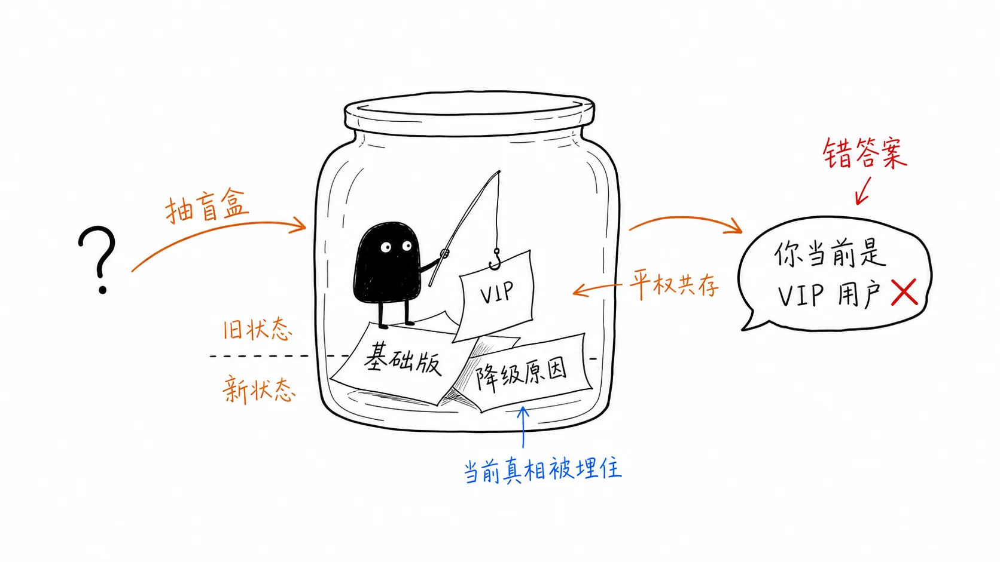
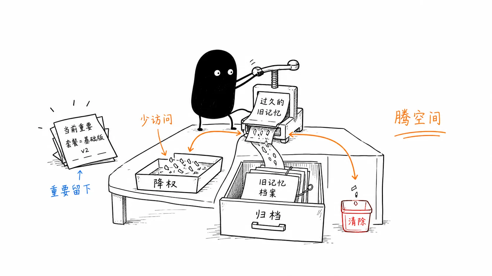
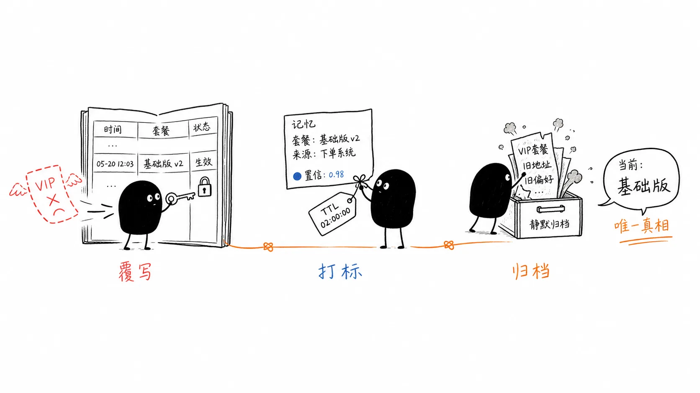

# 07｜当 Agent 的记忆开始“精神错乱”，敢遗忘才是解药
你好，我是李号双。

上一节课，我们用四通道架构解决了“保命红线被概率淹没”的问题——约束强制在场，事实进图谱覆写，偏好和情节走 BM25 + 向量双写。召回不到的病，治好了。

但 Agent 活得久了，新的危机就越会浮出水面。我们一起来看一下这节课我们要解决哪个危机。

我先来带你看一个真实的例子：有一天我的一个重要客户在群里发了一串问号。我打开对话日志，看到了这样一幕：

```
> 用户：把我的套餐降级为基础版
> Agent：好的，已为您降级为基础版
> （三个月后）
> 用户：我现在的套餐是什么？
> Agent：您当前是尊享VIP套餐，享受无限额度
> 用户：？？？我三个月前才降级的！
```

你赶紧去翻记忆库，真相这才大白。关于这位用户的套餐，系统里安静地躺着两条记忆：

- `“用户A的套餐是尊享VIP”`（6 个月前写入，FACT，在图谱里版本 v1）

- `“用户A因成本控制将套餐降级为基础版”`（3 个月前写入，情景记忆，在向量库里）




图谱里的 FACT 其实更新了——降级那天，系统抽出了新的事实（FACT）， `user_plan` 从 v1 升到 v2，“基础版”覆写了“VIP”。按理说 Agent 该回答“基础版”。

但它偏偏回答了“VIP”。为什么？

我去查召回日志，四通道都正常工作：图谱通道确实返回了 v2 的“基础版”，可向量通道同时返回了那条三个月前的情景记忆：“因成本控制降级为基础版”——这条情节记忆本身没错，麻烦在于它在语义上和一条更老的偏好“用户喜欢 VIP 免费洗车权益”挨得很近，连带把“VIP”这个信号也一起拽进了上下文。新旧状态在上下文里平权共存，Agent 最后靠概率猜了一个“VIP”。
你看出来了吗？问题根本不在召回——四通道都召回到了，该回来的都回来了。真正的问题在于： **记忆只进不出，旧的从不退场。**

上一课我们虽然把记忆分成了四类，FACT 走图谱能靠 upsert 覆写，CONSTRAINT 是强制在场，可向量库里的 PREFERENCE 和 EPISODIC 呢？由于缺乏类似实体图谱的状态覆写机制，它们在底层只是独立的向量记录，新写入的记忆不会覆写旧的，系统也不会自动让语义矛盾的旧记忆失效。

三个月前“喜欢 VIP 权益”的偏好，用户早就不喜欢了；两年前“用 PostgreSQL 14”的事实，早就升级到 17 了——可它们还像一等公民一样躺在库里，等着某次召回把它们错误地拽出来。

所以问题不在代码层面，而在底层的架构认知上： **你以为记忆系统只需要“写入”和“召回”这两个动作，却忘了记忆还有第三个动作——遗忘。**

## 遗忘不是删除，是记忆的第三种动作

在工程上，大多数开发者的第一反应是：加个 TTL，到期硬删除。但这会误杀正在用的记忆——一条三个月前的偏好，如果用户每天都在用，凭什么该被忘？

更严重的是还会漏掉已经冲突的——一条昨天刚写入的情节，如果和今天的新事实直接冲突，难道还要等它 TTL 到期才失效？

时间不是遗忘的唯一触发器。遗忘必须是一套 **有层次的生命周期管理**，它要回答三个问题：什么时候该忘？忘到什么程度？忘了之后还能不能找回来？

这三个问题，对应着两种互补的遗忘机制。一种在召回时实时算，管的是“老不老”和“活不活”；另一种在写入时增量整合，管的是“对不对”。我们一个一个看。



## 机制一：召回时实时算激活值——时间衰减加检索强化

最直觉的遗忘触发器是时间。认知科学早在 1885 年就给了答案——艾宾浩斯遗忘曲线。记忆保持量随时间呈指数衰减： `R = e^(-t/S)`。

但纯时间驱动有个硬伤：它只看“老不老”，不看“活不活”。一条三年前的情节记忆，如果用户每天都在引用它，按时间衰减它早该消失了——可它明明还活着，还在被用，凭什么忘掉？

认知科学里的经典模型 ACT-R 补上了这个盲区：

```
激活值 = 基础衰减（时间）+ 频率增益（访问次数）+ 近期增益（上次访问距今）
```

意思是：一条记忆能不能被想起来，不只看它多老，还看它被回忆过多少次、最近一次回忆是什么时候。 **你天天用的密码，十年不忘；十年没用过的旧手机号，早忘光了。**

我们把时间衰减和检索强化合并成一个机制，这个函数叫 `activation()`，在召回时实时算：

```
# forgetting.py
class ActivationPolicy(Protocol):
    """召回时实时算的激活值。纯函数——不写、不缓存。"""
    def activation(self, mem: StoredMemory, now: datetime) -> float: ...

class _DefaultActivation:
    """ACT-R 三因子：base_decay + frequency_gain + recency_gain。"""
    _FREQ_WEIGHT = 0.2           # log(1 + n) * 0.2，对数递减收益
    _RECENCY_WINDOW_DAYS = 7     # 7 天内被召回过，额外续命
    _RECENCY_BOOST = 0.3

    def activation(self, mem: StoredMemory, now: datetime) -> float:
        # 约束强制在场，事实由图谱覆写，都不进衰减流水线
        if mem.memory_type in ("constraint", "fact"):
            return 1.0

        # 偏好无 TTL：时间不衰减，永远 1.0 上场
        # 偏好的遗忘只走冲突路径，不走 activation
        if mem.ttl_days is None:
            return 1.0

        # 情节：完整三因子
        age_days = max((now - datetime.fromisoformat(mem.created_at)).days, 0)
        base = math.exp(-age_days / max(int(mem.ttl_days), 1))   # 时间衰减
        frequency = self._frequency(mem.access_count)             # 频率增益
        recency = self._recency(mem, now)                         # 近期增益
        return min(1.0, base + frequency + recency)
```

为什么不在写入时算好激活值缓存起来？因为激活值会随访问频次动态变化，缓存会带来一致性与刷新负担。纯函数现算，简单、正确、无状态，用一点点 CPU 换来了极大的架构简化。

这里还有一个关键的设计决策： **PREFERENCE 永远返回 1.0，不走时间衰减。** 偏好没有 TTL，它描述的是“用户喜欢什么”这种长期倾向——“喜欢 JSON 格式的日志”不会因为三个月没被引用就过期。偏好的遗忘只走第二条路（冲突检测），时间管不了它。只有 EPISODIC 才有 TTL，才走完整的三因子衰减。

理解了这些，你也就明白了： **时间衰减不该离线跑，它在召回时实时算。** 低于阈值的，当场跳过。

```
# manager.py — recall 里的激活值过滤
for stage in self._merge_order:
    for item in by_stage.get(stage, []):
        stored = item.source_mem
        if stored is not None:
            if stored.superseded:
                continue  # 冲突驱动的离散维度——无条件跳过
            activation = self._activation.activation(stored, now)
            if activation < RECALL_FLOOR:
                continue  # 时间衰减到地板以下——跳过
            if activation < 1.0:
                item = RecalledItem(
                    content=f"{item.content} [conf={activation:.1f}]",
                    ...
                )
```

好，机制一看起来很美。但它有一个管不了的东西——“对不对”。

一条昨天才写入的偏好，如果今天的新事实和它直接冲突了，按时间衰减它还年轻、激活值接近 1.0、该全权重上场。可它语义上已经过时了啊。 **时间衰减管得了“老不老”，管不了“对不对”。** 这就需要第二个机制补上盲区。

## 机制二：写入时增量整合，让矛盾的旧记忆退场

人脑还有另一种遗忘。你学到“地球绕太阳转”之后，“太阳绕地球转”这个旧认知会立刻被抑制——从“当前信念”里摘出去，不再影响你的判断。你不会把两个矛盾的认知同时摆在脑子里，然后靠“概率”猜一个。

这就是冲突驱动的遗忘。回到我们的四类记忆，看看它们各自怎么处理“旧记忆退场”：

- **FACT** 靠图谱的 `upsert` 天然覆写，版本号 +1，旧状态自动退场。

- **CONSTRAINT** 永恒生效，不参与遗忘。

- **PREFERENCE / EPISODIC** 存在向量库，没有版本号，不会覆写—— **这才是重灾区。**


问题就出在最后一类。开篇那个“喜欢 VIP 权益”的偏好，和“降级为基础版”的情节，语义上明明冲突了，可它们在向量库里各过各的，谁也不管谁。新记忆写进去了，旧记忆还像一等公民一样躺着，等着某次召回把它错误地拽出来。

那怎么让旧记忆退场？

### 找冲突：用检索，别全库扫描

第一反应是定期跑个任务，把库里所有记忆两两比对，发现冲突就删。思路没错，但算一笔账就知道这不行：1000 条记忆两两组合是 $\\binom{1000}{2} \\approx 50$ 万对，每对喂给 LLM 判一次、按 200 毫秒算，一轮要跑 28 小时；更致命的是浪费——99.9% 都是无效比对：“数据库配置”的偏好和“前端样式”的情节风马牛不相及，根本不可能冲突，却每次都要过一遍 LLM。你在用最贵的算力做最没意义的穷举。

**语义冲突只可能发生在高度相似的记忆之间。**“喜欢 VIP 权益”和“降级为基础版”会冲突，因为都在说套餐取向；但它和“数据库连接池配置”永远不会冲突——语义空间压根不沾边。

既然冲突是局部的，找冲突就不该全局遍历，而该用 **检索**：拿新记忆当 query，去向量库找 Top-K（比如 K=10）最相似的旧记忆，只在这 K 条里找冲突，库再大也不怕。

### 整理时机：不是离线打扫，是写入时的内联步骤

既然用检索找冲突候选，时机也就清楚了——当有新的记忆需要写入时，顺便做记忆整理。记忆系统只有两个动作： `recall`（每轮召回）和 `classify`（SESSION\_END 写回）。冲突检测 **内联在** `classify` **的写入路径里**——每写一条软记忆，先跑冲突检测，根据裁决结果决定写不写、写之前先处理谁。整理和写入在同一个步骤里完成：

```
# manager.py
async def _write_memory(self, record: MemoryRecord) -> None:
    """持久化一条记忆。软记忆在落盘前先跑增量冲突检测。"""
    if record.memory_type is MemoryType.FACT:
        self._facts.upsert_fact(record)   # 事实走图谱 upsert，版本号自增
        return
    # 软记忆：先查冲突，再决定写不写
    discarded = await self._incremental_consolidate(record)
    if not discarded:
        self._documents.append_soft(record)
```

找到相似向量后，交给 LLM 裁决，结果无非两种。

1. **新记忆取胜，旧记忆是败者（覆写）。** 新信息取代了旧信息，旧记忆退场、新记忆落盘。比如用户从“喜欢 VIP 权益”变成“降级为基础版”，旧偏好退场，新情节上场。

2. **旧记忆取胜，新记忆是败者（去重）。** 新记忆和已有记忆语义等价、没带来新东西，直接丢弃不落盘。LLM 判断新消息和已有记忆语义等价时就不提取。


## 闭环：两个机制联手，手刃套餐灾难

```
[会话结束 — 分类写入 + 内联冲突检测]
事件：“把我的套餐降级为基础版”
─────────────────────────────────────────
1. 状态覆写（事实 → 图谱）：
分类管线识别出事实：用户套餐变更为基础版 → 图谱覆写。
图谱内部：user_plan v1→v2 旧状态 “VIP” 被覆写，不再平权共存。

2. 软记忆写入前内联冲突检测（机制二）：
新情节“因成本控制降级为基础版”准备写入向量库，
落盘前先跑冲突检测——写入和整理在同一个步骤里完成：
- 检索 Top-K：以新情节为 query，命中最相似的旧偏好“喜欢 VIP 免费洗车权益”。
- LLM 裁决：判定冲突成立，新情节赢、旧偏好输。
- 动作：旧偏好标记为已废弃（superseded=True），新情节安全落盘。
─────────────────────────────────────────
[三个月后，召回日志]
用户问：“我现在的套餐是什么？”
Stage 1 [规则硬召回] ：无相关约束匹配。
Stage 2 [图谱实体] ：命中 user_plan (v2) → “[事实] 套餐已降级为基础版” 置信度 1.0
Stage 3 [BM25精确] ：命中情节“因成本控制降级为基础版”。
  → 实时算激活值：若 < 0.05 跳过，否则上场。
  → 命中后异步写回：访问次数 +1，最近访问时间刷新。
Stage 4 [向量语义] ：旧偏好“喜欢 VIP 免费洗车权益”
  → 已被标记 superseded，召回路径闸门直接跳过，不上场。
返回：“基础版”（事实 + 情节上场，矛盾的旧偏好被挡在闸门外）
─────────────────────────────────────────
```

## 总结

回到这一讲的核心命题—— **为什么 Agent 活得越久，越容易“精神错乱”？**



因为大多数开发者把记忆系统当成了“只进不出”的语义日志：写入和召回两个动作齐备，唯独缺了第三个动作——遗忘。旧的偏好和情节像一等公民一样永远躺在向量库里，新旧状态在上下文里平权共存，Agent 最后只能靠概率猜一个答案。

这节课我们补上了记忆的第三种动作，它由两个互补的机制构成：

- **机制一：召回时实时算激活值。** 时间衰减管“老不老”，频率和近期增益管“活不活”。纯函数现算、无状态，低于阈值当场跳过。PREFERENCE 不走时间衰减——偏好没有 TTL，它的遗忘只走第二条路。

- **机制二：写入时增量整合。** 冲突是局部的，只可能发生在高度相似的记忆之间，所以用检索找 Top-K 候选、不做全库扫描。冲突检测内联在 `classify` 的写入路径里，每写一条软记忆先跑裁决：新胜旧退场（覆写），旧胜新丢弃（去重）。


两个机制联手，开篇的套餐灾难就闭环了：事实走图谱 upsert 覆写旧状态，情节走激活值决定上不上场，矛盾的旧偏好被 `superseded` 闸门挡在召回路径外。Agent 不再在两个矛盾的认知之间靠概率猜，而是让该退场的记忆退场。

**记忆系统的完整性，不在于它记得多少，而在于它敢忘多少。** 敢忘，Agent 才不会精神错乱。

## 思考题

这节课的机制二里，冲突检测的败者会被标记为 `superseded=True`，从召回路径里剔除。这个标记是可逆的——理论上翻回 `False` 就能复活。

但问题来了：谁来判断“该翻回来”？LLM 的冲突判断不是 100% 准的。如果在增量整合时，LLM 误判新记忆与某条旧记忆冲突，旧记忆就被静默地标记为已废弃。用户只会觉得“Agent 好像忘了我之前说过的事”，却查不出原因——召回日志里那条记忆根本不会出现，因为它在 `superseded` 闸门那里就被跳过了。误判发生后，没有任何信号会触发复活，那条被冤枉的旧记忆就永远戴着“已废弃”的帽子躺在库里。

在无法让 LLM 冲突判断 100% 准确的前提下，你能否设计一种机制，既能及时清理真冲突的旧记忆，又能让被误判的记忆有路可退？提示你一个方向：如果给被标记的记忆加一个“软删除窗口”，标记待删除，保留 N 天，期间如果被召回命中就自动复活，这个窗口期内的记忆，还参与激活值计算吗？

欢迎你打开脑洞，把你的思考分享到留言区，我们一起交流讨论，也欢迎你把这节课分享给需要的朋友，我们下节课再见！