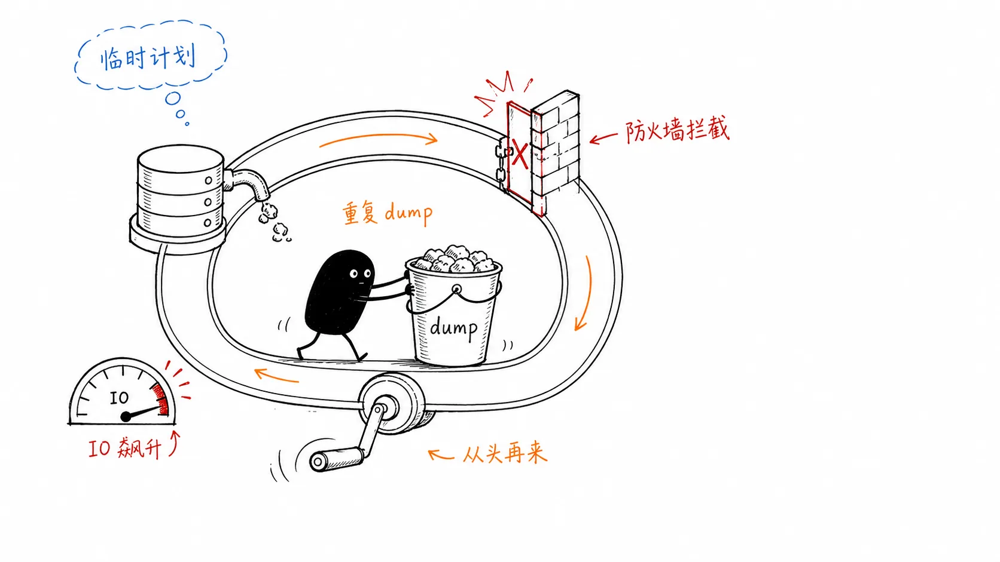
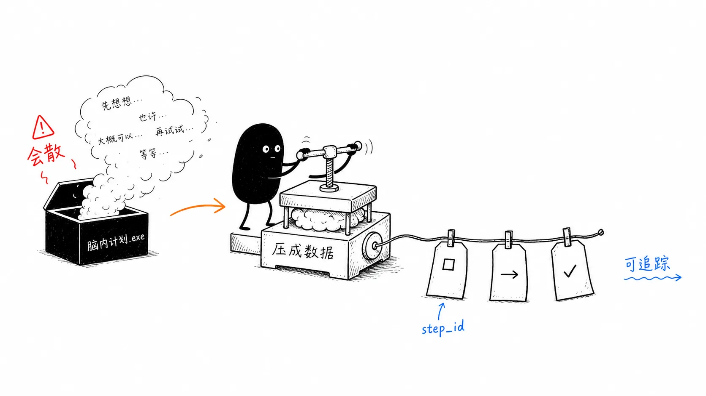
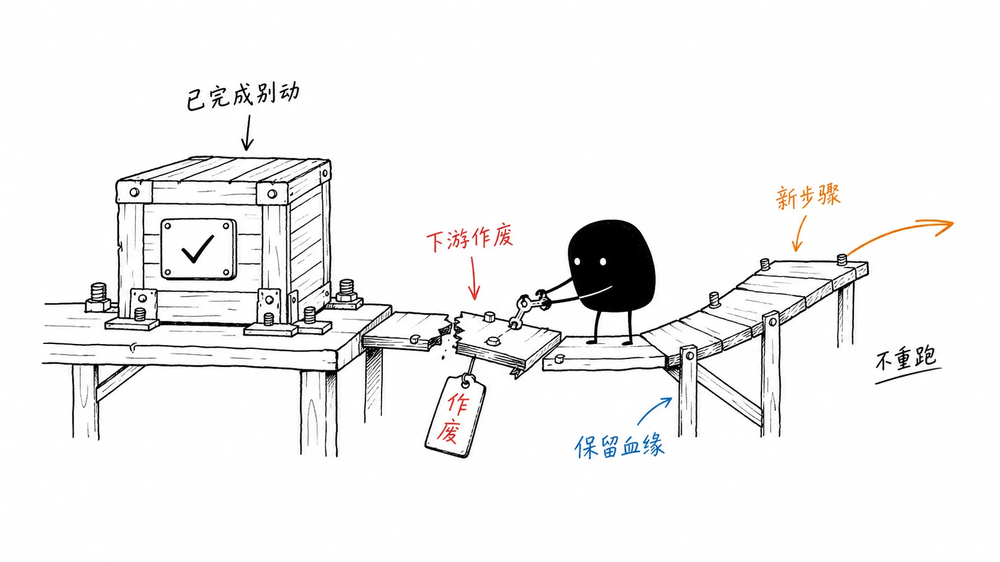
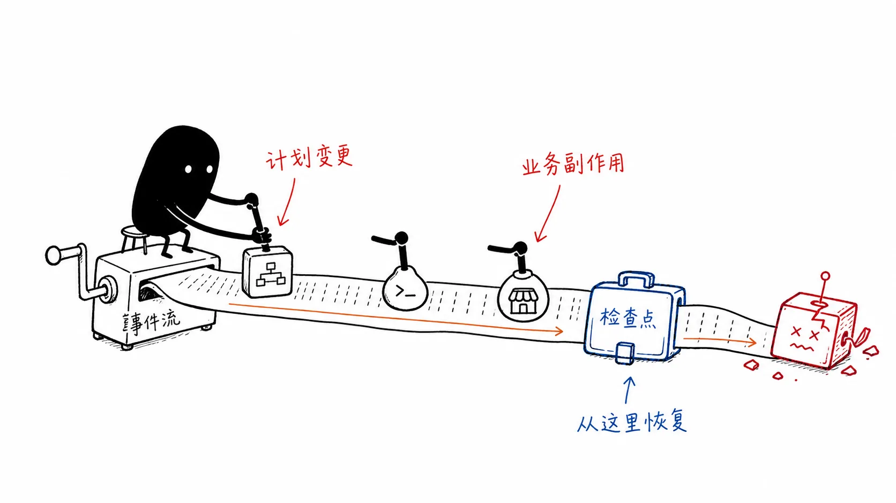
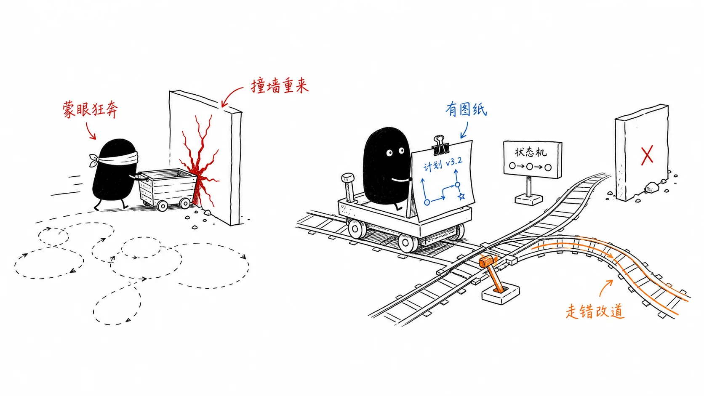
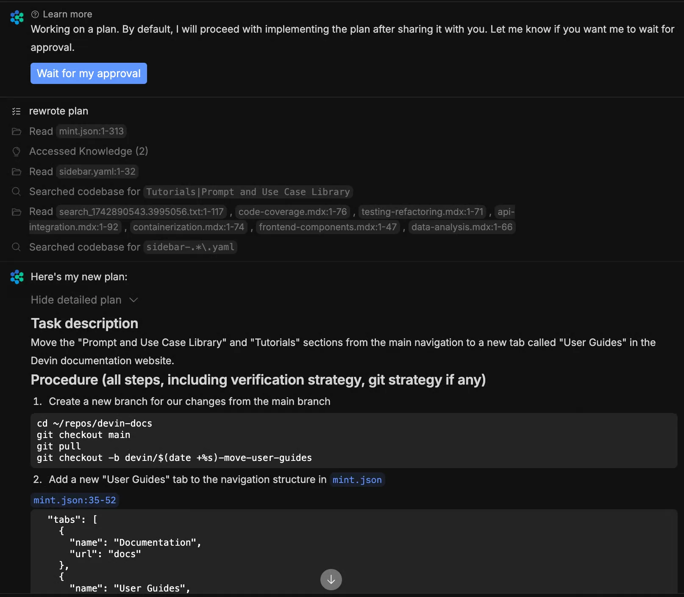

# 08｜蒙眼狂奔的 ReAct：为什么执行前看不到计划的 Agent 最危险？
你好，我是李号双。

在 Agent 的架构演进中，有一个极其经典的范式：ReAct。2022 年 Princeton 和 Google DeepMind 联合发表这项研究时，核心思想是让大模型交替输出“推理”和“行动”，走一步看一步，做完一步再想下一步。

在当时的模型能力下，ReAct 是一次突破。它第一次让 LLM 具备了“先想后做”的能力。在 6 步以内的多跳问答（如 HotpotQA）中，ReAct 表现优异。很多团队初做生产级 Agent 时，自然而然地拿起了这套范式。但当我们把它推上生产环境，去执行真实的复杂工程任务时，认知需要重构： **ReAct 在复杂多步任务下是不工作的。**

我们来看一个真实的场景。有这样一个需求：“给所有测试环境的数据库做灾备迁移”。这是一个涉及连接、导出、传输、验证的跨系统任务。你看着 Agent 开始干活，第一步连接测试库，绿色通过；第二步执行全量 Dump，耗时 30 分钟，绿色通过；第三步，尝试将 dump 文件传到新的灾备中心，突然报错： `Connection timeout: Firewall blocked`。
然后，恐怖的事情发生了。监控面板突然显示 Agent “重新开始执行”——它回到了第一步，再次执行全量 Dump。你眼睁睁看着它陷入了循环，磁盘 IO 飙升到 95%，触发了主从同步延迟告警。

为什么一个超时错误，会导致 Agent 推倒重来？

核心逻辑在于： **在 ReAct 模式下，计划是隐藏在模型临时思维（CoT）里的，系统根本看不见。** 当第三步失败时，系统没有“第二步”这个概念，它无法做到“回滚到第二步换个传输协议继续走”。模型在临时上下文里胡乱推断，得出了“重试所有步骤”的概率性结论。因为系统没有拦截机制，只能任由模型操控带副作用的工具（重新 Dump），最终把缺陷放大成生产事故。



**计划的本质不是模型的一段自言自语，而是一份必须被系统掌控和追溯的执行契约。**

Anthropic 在 2024 年发布的 “Building Effective Agents” 中给出了一个公式：

> Agent System = Probabilistic Model + Deterministic Loop + Durable State + Recovery
>
> 智能体系统 = 概率模型 \+ 确定性循环 \+ 持久化状态 \+ 故障恢复

ReAct 模式有前两项（概率模型 + 循环），但完全缺失后两项。没有持久化状态，计划是一缕烟；没有恢复机制，失败是一场要么瞎试、要么重来的赌博。要让 Agent 脱离蒙眼狂奔，我们必须在系统层面筑起三道防线。

## 第一道防线：计划数据化——从 CoT 到结构化 DAG

CoT 像是人脑中的思考过程，Plan 是给“系统”看的执行蓝图。用个生活中的类比：CoT 像你脑子里想“今天先去超市买白菜，再去银行办卡”——想完就没了，别人根本不知道你在想什么。Plan 像是你把“1. 去超市买白菜；2. 去银行办卡”写在纸上，打了勾，标了序号——纸上的内容可以被别人读到、修改、追踪。



Plan 虽然是 LLM 生成的，但一旦生成，它就不再是 LLM 的临时口水话，而是系统的核心数据。系统拿到它后，会解析成结构化对象，加上版本号、状态标记。从此 LLM 只能“建议修改”，不能“直接改写”。

下面我们结合代码来看，一点点拆解这个过程。一个 `PlanStep` 其实就是给任务里的每一步发了一张身份证：

```
@dataclass
class PlanStep:
    """结构化的计划步骤：可寻址、可追溯、可查询"""
    step_id: str               # 身份证号，比如 "S1"
    action: str                # 要干嘛，比如 "dump_database"
    params: dict[str, Any]     # 怎么干，比如 {"db": "test_db"}
    depends_on: list[str]      # 必须等谁做完才能开始，比如 ["S1"]

    # 运行时状态（系统填写，非 LLM）
    status: StepStatus = StepStatus.PENDING  # 排队中/跑完了/挂了
    output_ref: Any = None     # 这一步跑完的产物，比如文件路径 "a.sql"
    error: str | None = None

    # 审计与重规划
    version_created: int = 1
    replaces_step_id: str | None = None  # 如果这是重规划的新步骤，它替代的是谁？
```

为什么要有 `step_id` 和 `depends_on`？因为系统需要知道谁先谁后。为什么要有 `output_ref`？因为第二步传输需要引用第一步 dump 出来的文件，有了引用，就不必重新跑第一步。这就把执行逻辑从 ReAct 的“死循环”变成了一个由数据结构驱动的 **状态机**：

```
class Plan:
    """版本化的 DAG 执行计划"""
    def get_parallel_ready(self) -> list[PlanStep]:
        """获取所有依赖已完成的 PENDING 步骤，支持并行"""
        return [s for s in self._steps.values()
                if s.status == StepStatus.PENDING and self._all_deps_completed(s)]
```

关键区别就在这里： **ReAct 里“下一步做什么”由模型临时决定，状态机里“下一步做什么”由数据结构驱动**。系统按拓扑序找下一个可执行步骤，模型退化为只负责生成蓝图和填充参数。执行过程完全由系统控制。

## 第二道防线：增量重规划——局部作废，绝不推倒重来

状态机解决了正常执行的问题，但执行总会失败。失败时怎么修补？全盘重试会重复执行已完成的副作用，直接导致生产事故。正确的做法是增量重规划。

具体怎么做？这里我们必须明确框架和 LLM 的分工。

当第二步传输失败时， **框架本身不懂业务**，它不知道怎么修。它只做两件事：第一，把坏步骤及下游标记为“作废”；第二，把失败原因（如“Firewall blocked”）和当前计划状态打包，喊醒 LLM：“老铁，第二步挂了，原因是防火墙拦截，你看看能不能换个走法？”



LLM 思考后，可能会建议：“既然 22 端口被防火墙拦了，那就生成一个新步骤 S2'，用 SCP 协议走 22 端口绕过”。 **重点是，LLM 返回的 JSON 里会明确自带一个声明：“我这个新步骤 S2'，是用来替代那个失败的 S2 的。” 这个声明的 ID，就是代码里的** `replaces_step_id` **。**
系统收到 LLM 提出的新步骤后，会执行 `merge` 合并操作。在此之前，系统必须先清理旧计划，这就是 `mark_downstream_obsolete` 的作用：

```
class Plan:
    def mark_downstream_obsolete(self, failed_step_id: str) -> list[str]:
        """标记失败步骤的所有下游为 OBSOLETE（失败步骤本身保持 FAILED）"""
        obsolete: list[str] = []
        queue: deque[str] = deque(self._dependents.get(failed_step_id, ()))
        seen: set[str] = set(queue)

        while queue:
            sid = queue.popleft()
            step = self._steps.get(sid)
            if step is None:
                continue
            # 1. 已完成步骤不标记 OBSOLETE，但遍历继续——它的下游可能还是 PENDING
            if step.status != StepStatus.COMPLETED:
                step.status = StepStatus.OBSOLETE
                obsolete.append(sid)
            # 2. 通过反向邻接索引找下游，继续作废
            for child_id in self._dependents.get(sid, ()):
                if child_id not in seen:
                    seen.add(child_id)
                    queue.append(child_id)
        return obsolete
```

这段代码的核心逻辑是：像消防员拉警戒线一样，顺藤摸瓜把坏掉的步骤（S2）后面的步骤（S3 验证）统统贴上“作废（OBSOLETE）”标签。但是，已经跑完的步骤（S1 Dump）绝对不能贴，因为那是我们的工程资产（a.sql 文件还在），重规划时可以直接复用。
清理完废墟，系统开始合并 LLM 给出的新步骤：

```
def merge(self, new_steps: list[PlanStep]) -> None:
        """合并 LLM 提出的替代步骤"""
        new_ids = {s.step_id for s in new_steps}
        # 依赖校验：新步骤不能依赖不存在的步骤，也不能依赖已作废的步骤
        for ns in new_steps:
            for dep_id in ns.depends_on:
                dep = self._steps.get(dep_id)
                if dep is None:
                    if dep_id not in new_ids:
                        raise ValueError(
                            f"Step {ns.step_id!r}: dependency {dep_id!r} not found"
                        )
                elif dep.status is StepStatus.OBSOLETE and dep_id not in new_ids:
                    raise ValueError(
                        f"Step {ns.step_id!r}: dependency {dep_id!r} is OBSOLETE "
                        f"(and not replaced in this merge)"
                    )
        # 环检测：防止 LLM 生成循环依赖（S1 依赖 S2，S2 又依赖 S1）
        self._assert_acyclic(new_steps)
        # 替代旧步骤：只标记 OBSOLETE，不物理删除
        self.version += 1
        for ns in new_steps:
            if ns.replaces_step_id:
                old = self._steps.get(ns.replaces_step_id)
                if old:
                    old.status = StepStatus.OBSOLETE
            ns.version_created = self.version
            self._steps[ns.step_id] = ns
            self._index_deps(ns)
```

看到这段代码你可能会疑惑：前面 `mark_downstream_obsolete` 不是已经把没完成的 S2 标记为 OBSOLETE 了吗？为什么 `merge` 里还要再标记一遍？

**这是一种防御性编程（双重保险）**。LLM 是概率模型，它完全有可能不按套路出牌。假设 S2 失败了，但 LLM 给出的新方案是：“我觉得 S1 也有问题，我要用 S1' 替换 S1”。这个时候 S1 是 COMPLETED 状态，前面的 `mark_downstream_obsolete` 并没有标记它。如果没有 `merge` 里的这段代码，系统里就会同时存在 S1（COMPLETED）和 S1'（PENDING），系统就精神错乱了。所以这段代码的意思是： **只要 LLM 明确说要替换某个老步骤，不管那个老步骤现在是啥状态，统统强制打成 OBSOLETE。**

## 第三道防线：事件溯源与检查点——让黑盒执行可回溯且可恢复

增量重规划解决了“走错路不用回到起点”的问题，但也带来了新挑战： **计划的版本在频繁变迁（V1 变 V2，V2 变 V3），如果 Agent 进程在第 50 分钟突然崩溃了，怎么恢复？难道要重新执行一次 30 分钟的 Dump** **吗** **？**
不要慌，这里我们可以引入“事件溯源”与“检查点”。



不要只存储当前状态，而是记录所有导致状态变更的事件。就像银行账户，你不只是记“余额 100 块”，你要记“存 50，取 20，存 70”。每一次计划的创建、步骤的开始、成功或失败，都作为一个不可变的事件追加写入日志。

```
@dataclass
class Event:
    seq: int  # 全局单调递增序列号
    event_type: str  # PlanCreated | StepStarted | StepCompleted | StepFailed | PlanReplanned
    plan_id: str
    version: int
    data: dict[str, Any]
class EventLog:
    """追加写的事件日志：完整历史，支持回放"""
    def replay_to_version(self, plan_id: str, target_version: int) -> dict[str, Any]:
        """重放事件到指定版本，重建状态"""
        state: dict[str, Any] = {"steps": {}, "version": 0}
        for event in self.get_events(plan_id):
            if event.version > target_version:
                break
            _apply_event(state, event)  # 逐条应用事件
        return state
```

有了事件流，系统就不再是个黑盒。如果迁移失败了，你可以回放整个执行过程，看清楚到底是哪一次重规划引入了错误逻辑。

但回放长事件流太慢了。为了实现快速崩溃恢复，我们需要定期拍快照——也就是检查点。把当前的最新状态存下来，崩溃后先加载检查点，再重放之后的少量增量事件，就像打游戏存档一样：

```
class CheckpointStore:
    """最新状态快照：快速崩溃恢复"""
    async def save(self, run: AgentRun) -> None:
        self._store[run.run_id] = run.to_dict()

    async def load(self, run_id: str) -> AgentRun | None:
        entry = self._store.get(run_id)
        return AgentRun.from_dict(entry) if entry else None
```

这和数据库的 WAL（Write-Ahead Log）+ Checkpoint 机制如出一辙。两者配合，Agent 崩溃后可以从最近的检查点恢复，跳过已完成的工具调用，直接从断点续跑。

## 闭环：手刃开篇的灾备迁移灾难

把三道防线装配起来，我们重新跑一遍开篇的灾难场景。
在新的架构下，日志变成了这样：

```
任务：“迁移测试环境数据库”
─────────────────────────────────────────
Plan V1: S1(dump) → S2(transfer) → S3(verify)
Event 1: PlanCreated → V1, steps=[S1, S2, S3]
Event 2: StepStarted → S1 running
Event 3: StepCompleted → S1=completed, output_ref="a.sql"
Event 4: StepStarted → S2 running
Event 5: StepFailed → S2=failed, error="Firewall blocked"
触发第二道防线（增量重规划）：
1. mark_downstream_obsolete("S2") → S3 marked OBSOLETE
   S2 保持 failed（审计信号），S1(completed) 被保留——输出文件 a.sql 仍然可用
2. LLM 收到失败原因，建议新步骤：
   S2'(SCP传输, depends_on=["S1"]) → S3'(验证, depends_on=["S2'"])
3. merge(new_steps) → 环检测通过、版本递增
Event 6: PlanReplanned → V2, S3=obsolete, S2'/S3' added
执行 S2': SCP 传输成功 (复用 S1 的 a.sql，无需重新 Dump)
Event 7: StepCompleted → S2'=completed
执行 S3': 验证通过
Event 8: StepCompleted → S3'=completed
─────────────────────────────────────────
```

死循环治好了。

S1 的副作用没有被重复执行，Agent 在 S2 失败后精确地换了传输协议继续走。如果未来复盘，你可以通过事件流完整回放这次迁移：8 个事件，从 V1 到 V2，每一步都清清楚楚。

如果 Agent 在执行 S2' 时进程崩溃了，也不用怕，检查点里存着 V2 的状态，重启后加载检查点，从 S2' 开始继续执行，不需要重新 Dump。

**这不是模型变稳重了，而是你换了执行引擎：从“蒙眼狂奔、撞墙重来”变成“按图索骥、走错改道”。**



## 架构的限制比模型的能力更致命

在这个领域，业界顶尖的方案都在向“计划数据化”靠拢：

- **LangGraph：图即计划，状态即内存。** 它是“声明式 Plan”的典型代表，开发者用代码定义的 DAG 图就是执行计划。它的局限在于计划是编码时写死的。做通用 Agent 必须走 LLM 动态生成 Plan 的路线，但 LangGraph 的“状态驱动 + 断点续传”思想必须吸收。

- **Devin：计划可视化、支持交互式调整**。Cognition Labs 的 Devin 界面内置结构化「Plan 面板」，面板并非只读思维链（CoT），底层以结构化数据存储计划（Plan-as-Data）。用户可通过聊天对话下发指令，完成步骤增删、调整顺序、跳过指定环节，实现对执行计划的灵活干预，是 Plan-as-Data 理念的落地体现。




- **AutoGPT 的教训：不可回滚的 CoT 是无底洞。** 早期 AutoGPT 为什么经常陷入死循环？很多人认为是“模型不够智能”。但 AutoGPT 的真正问题不是模型不智能，而是架构不支持计划的可视化和可控化。


## 总结

从 Prompt Engineering 到 Context Engineering，再到 Loop Engineering，我们反复强调一个共识：大模型是概率性的，生产系统要求确定性。

大模型是油门，Loop 是刹车系统。而在复杂任务执行中， **Plan-as-Data 就是底盘和导航**。

这一讲我们给 Agent 执行上了三道防线：防黑盒的计划数据化、防重试的增量重规划、防扯皮的事件溯源。这三道线能生效的前提，是你认清了 CoT 是会过期的文本，不是持久化的状态。把计划变成可版本化的 DAG，当单步执行异常时可局部增量重规划，保障任务在反复试错过程中稳定落地。

回到 Anthropic 那个公式：智能体系统 = 概率模型 + 确定性循环 + 持久化状态 + 故障恢复。ReAct 只有前两项，所以它会蒙眼狂奔。Plan-as-Data 补上了后两项——Durable State 是版本化的 DAG 和事件流，Recovery 是检查点恢复和增量重规划。不信任模型脑子里的临时起意，只信任系统里带版本号和状态机的执行蓝图，这就是确定性的来源和底气。

## 思考题

本节课我们通过 Plan-as-Data 解决了单 Agent 的死循环问题。但在实际生产中，一个包含 20 个步骤的数据库迁移计划，或者涉及前端、后端、测试三个领域的发布计划，单个 Agent 的认知边界往往不够用。

假设你把 Plan 中的步骤拆分给不同 Agent 并行执行：A 负责修改配置文件，B 负责重启服务。A 刚把配置文件改好，B 读取了旧配置并重启，导致 A 的修改被覆盖。

在多个 Agent 同时操作同一个世界时，你能否在 Plan 数据结构或执行引擎中设计一种机制，确保并发执行时不打架、不互相覆盖？欢迎你把你的思考分享到留言区，我们一起交流讨论，也欢迎你把这节课分享给需要的朋友，我们下节课再见！

* * *

## 附录：用 ProdAgent 跑一次金融合规审计

前面讲的是如何把计划从模型的临时思考，变成系统可管理的数据。ProdAgent 的 [金融合规案例](https://github.com/limenagent/prodagent/blob/main/examples/compliance_audit.py "xxx")，把这套机制落到了一个具体场景中。

用户只需要提出“审计今天的交易”，Agent 就会生成一份结构化 Plan：

```
抽取交易
    ↓
可疑标注 ‖ 实体关联
    ↓
提交 SAR
```

标注和关联都只依赖交易抽取，因此可以并行执行；提交 SAR 必须等待两项分析完成。执行顺序由 DAG 的依赖关系驱动，而不是由模型走一步猜一步。

提交监管是不可逆的外部写操作，因此 `submit_to_regulator` 被标记为 `HIGH`：

```
ToolMeta(
    name="submit_to_regulator",
    side_effect_level=SideEffectLevel.HIGH,
    reversibility=0.0,
    enforced_idempotent=True,
)
```

执行到这一步时，框架会暂停任务并等待人工审批。审批通过后继续提交；审批被拒绝后，原提交步骤进入失败状态，触发增量重规划。示例会用 `draft_sar_for_review` 替换提交步骤，改为生成报告草稿、转交合规人员复核。此前已经完成的交易抽取、可疑标注和实体关联保持完成状态，不会重新执行。

如果执行过程中进程崩溃，在启用持久化事件日志和检查点的情况下，框架可以恢复计划状态，跳过已完成步骤，从中断位置继续运行。

需要注意， `enforced_idempotent=True` 只负责携带幂等标识。要真正保证同一份 SAR 不会重复提交，监管接口仍需根据 `idempotency_key` 做原子去重。

这个案例展示了 Plan-as-Data 的实际价值：

> 计划先变成系统数据，执行才能暂停、改道、恢复和审计；模型负责提出方案，框架负责守住执行边界。