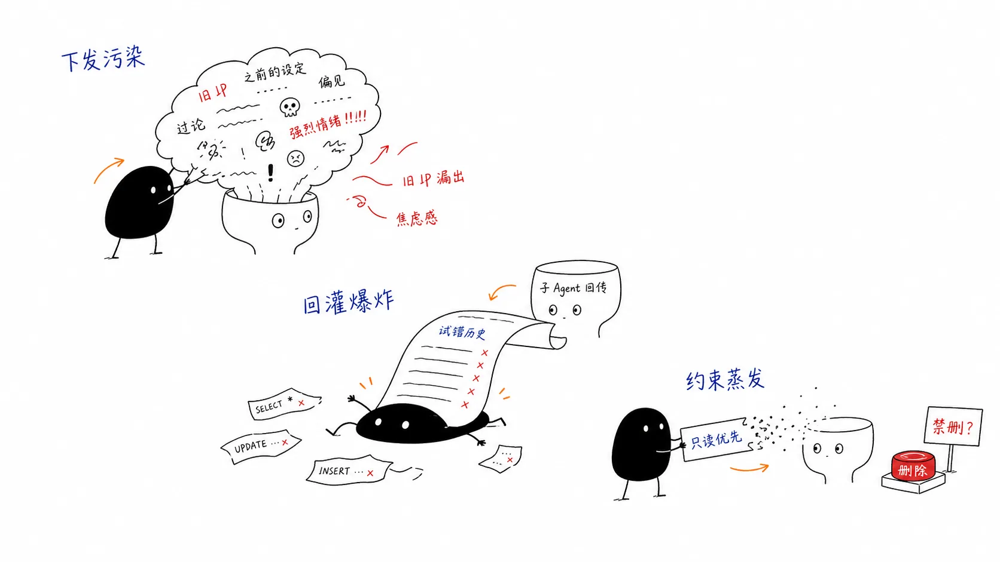
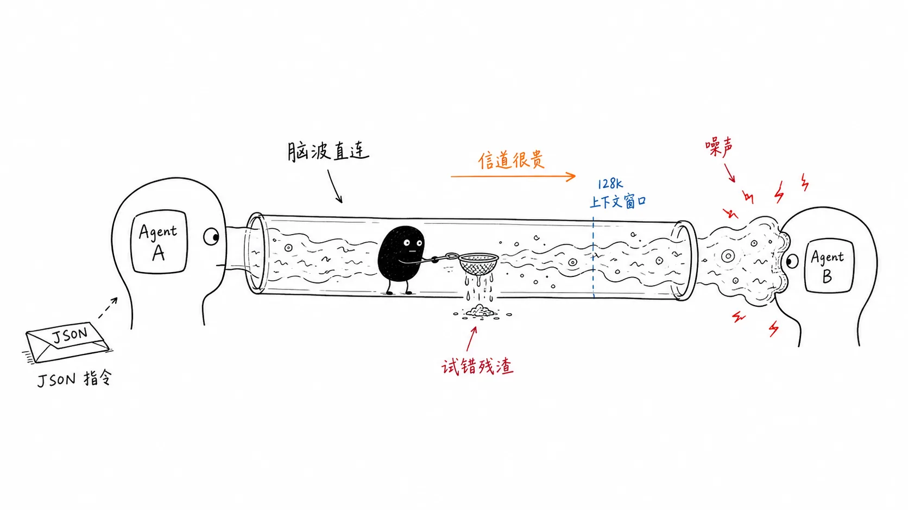
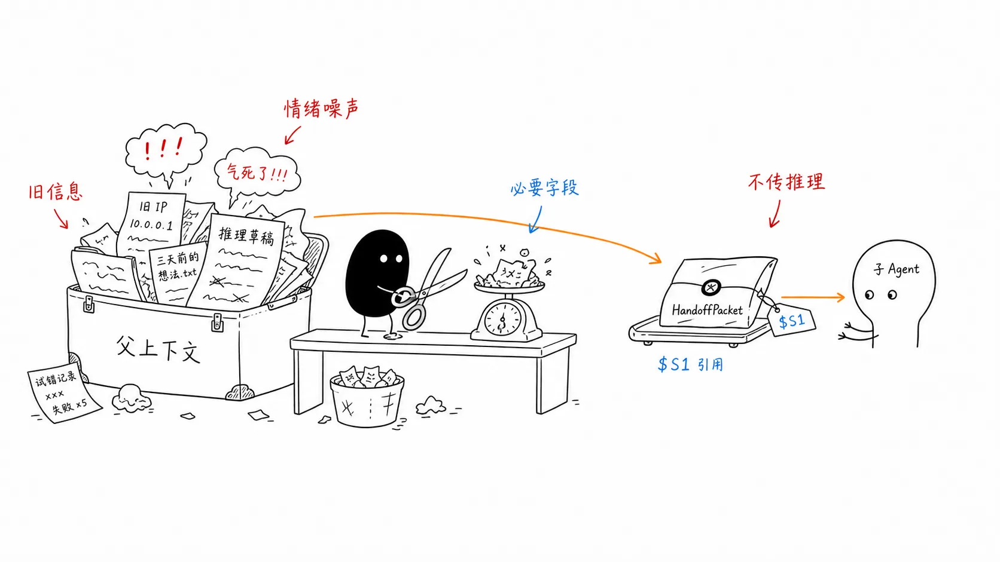
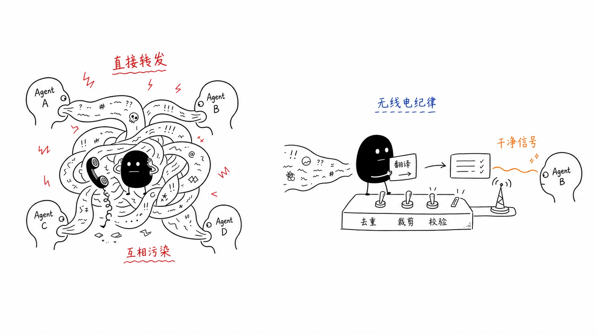

# 09｜Agent 之间的信息传递：从互相投毒到契约交互
你好，我是李号双。

单 Agent 的日子是幸福的：预算、审批、记忆、计划，一层层刹车装上去，跑起来又快又稳。真正的麻烦从第二个 Agent 出现的那一刻开始，不是因为代码多了一倍，而是因为多了一样以前不存在的东西： **信息要在 Agent 之间流动了**。信息一流动，噪音、幻觉、错误结论、恶意指令就跟着一起流动。

先看一个最普通的多 Agent 场景。一个工单系统：路由 Agent 负责接单，接到客户问题后，把“查数据库”的活交给查询 Agent，查完的结果再交给通知 Agent 发邮件。

我们来看几个典型的故障：

**第一种，查询 Agent 越权了。** 路由 Agent 的上下文里攒了一周的历史对话：“上周 SCP 传输被防火墙挡了”“客户催得急，优先处理”，这些全塞给了查询 Agent，它被那些情绪化的措辞带偏，数据库都没查，直接去调发邮件的工具，而它压根没有那个权限。这就像上级派活没说清任务，反倒把上周踩的坑、和客户吵架的情绪全倒给了下属，下属接一堆噪音，自然干错活。

**第二种是反方向的：** 查询 Agent 交回来的不是 200 token 的结论，而是 8000 token 的完整执行史，三遍试错的 SQL、两次格式化失败的推理，外加几个脑补的错误假设。父 Agent 照单全收，Prompt Cache 全毁，更糟的是它被中间步骤的错误数据带偏，后面的参数全传错了。相当于下属交了 20 页草稿不给结论，上级还得自己从草稿里刨。

**还有一种最隐蔽**：“绝不能删除任何数据”只写在路由 Agent 的系统提示里，交接时没人把它显式带给查询 Agent，于是查询 Agent 顺手执行了删除。事后两边都没撒谎，一个说“我的提示里写了”，一个说“我的提示里没有”。约束就这么在交接中蒸发了。



这个问题的本质是：我们把 Agent 之间的交接，下意识当成了微服务之间的接口调用。可微服务传的是强类型、定长的结构化数据，绝不会有“我连数据库失败过两次”这种废话；Agent 之间默认传递的却是对话历史本身——推理、幻觉、试错、情绪，全在里面。

**微服务传** **的** **是结构化的指令，Agent 传的是脑波。不加清洗的脑波直连，就是两颗大脑在互相污染。** 控制上下文的质量，就是在控制系统智能的上限。

你可能会说，这不就是缺个过滤器吗？下发时裁一裁、回传时滤一滤，这条链的问题确实能解决。但“一个 Agent 把信息交给另一个 Agent”远不止父子交接一种形态，同样的故障正在别的形态里换着马甲等你。

## 换几种协作方式，坑还是同一个

常见的多 Agent 协作方式，除了上面的上级派活（垂直委派），还有这么几种：

- **横向接力**，像接力赛交棒，诊断 Agent 干完交给修复 Agent、再交给复盘 Agent，适合流程固定的应急处理。

- **共享会话**，像一场圆桌会议，几个 Agent 围着同一份发言记录你一言我一语，适合评审和辩论。

- **黑板模式**，大家共用一块板子，谁有新结论就写上去，别人看到相关字段变了就接着加工，适合流水线式的知识生产。

- 还有 **任务池**，任务堆在池子里，空闲的 Worker 自己领、自己干，适合批量处理。




坑也基本类似：

- 接力是约束逐跳蒸发、错误逐跳放大，中间任何一跳被注入恶意指令，后面全部中招。

- 共享会话是一人中毒全员感染，所有成员读同一份记录，一条幻觉“事实”瞬间全场引用、全场锚定。我见过做辩论型 Agent 的团队整场跑偏，源头就是某一条发言带了节奏。

- 黑板模式的污染会持久化，某个专家写错一个值，它会一直留在板上，之后每一轮读这个字段的专家都被污染。

- 任务池是两边渗漏：脏任务进池坑坏一批 Worker，坏结果不校验又流向下游。


这几种方式长得完全不一样，凭什么坑是同一个？把所有案例摆在一起看，规律自己会浮出来：不管是派活、交棒、发言还是写板子，每一次 Agent 之间的交互，拆到最小都是同一个动作： **一条信息从一个 Agent 的世界，跨过边界，进入另一个 Agent（或共享区）的世界**。

就像国际物流里的包裹过境：货物从一个国家进入另一个国家，无论走海运空运，都得经过口岸。我们就把每次这样的动作叫一次“过境”。

过境的动作归纳下来就这几类：下发、回传、转交、发言、写入、领活；方向只有两个——流入某个 Agent 上下文的，和流出某个 Agent 进入共享区的。

> 协作的花样会层出不穷，过境的动作始终就是那几个。与其为每种协作方式各写一套通信，不如把所有过境的通道收拢到同一道关卡上。

## 你要写的Agent代码

接下来我要说的方案对各种协作方式都通用，但空对空讲架构容易犯困，我们接着用开头的工单系统当主角，先看你要写的Agent代码到底长什么样。就这么几行：

```
# 定义查询 Agent：它有什么工具、交差时必须交回什么
query_agent = Agent(
    "query",
    tools=[query_db],
    output_contract=Contract(required={"output": str, "state": str}),
)
# 路由 Agent，带上它可支配的子 Agent
router_agent = Agent("router", agents=[query_agent], ...)

# 路由 Agent 决定派活时，调的是框架发给它的一个工具
spawn_agent(name="query", task="查询订单 123 的状态")
```

请注意 `spawn_agent` 不是你写的函数，它一般是 Agent 框架内置的工具，你把查询 Agent 挂到路由 Agent 名下时，框架就自动把这个工具放进了路由 Agent 的工具箱。

而调用它的也不是你，是路由 Agent 的 LLM，它在对话中盘算出“这单该交给查询 Agent”，然后自己填好参数发起调用。换句话说， `name` 和 `task` 这两个参数，是模型生成的。

再注意一个有意思的反差：你写的代码里，没有一个字提到“过滤、校验、截断、去重”。那消毒发生在哪？答案是全藏在 `spawn_agent` 这个工具以及框架层的实现。

要看懂它藏了什么，得先理解一个成熟的设计范式： **数据面和控制面**。

拿国际物流打比方：轮船和飞机负责把货物运来运去，这是数据面——真正干活的部分；海关不运任何货，但每一票货能不能进、要不要拆检，由它说了算，这是控制面——不干活但管事的部分。这么分的好处一句话就能说清： **干活的尽管千变万化，管事的始终一处统一。**

套到 Agent 协作上：各种协作方式就是数据面——委派、接力、辩论、抢单，怎么分工随便业务变；而“每一次 Agent 之间的信息交换，该不该发生、以什么样子发生”，是控制面的事。

这个控制面，我叫它治理平面，你可以把它想象成 Agent 世界之间的海关。这个视角的威力在于：前面那些投毒故障，原本是五六个具体问题，每个都要单独修；换成治理平面的视角，它们坍缩成同一个问题：某次过境的海关检查。

业务场景线性增长躲不掉，架构要保证的是自己的复杂度恒定：解决一个具体问题叫修复，让一整类问题不再成立，才叫架构。

海关怎么建？先别急着看代码，把“路由 Agent 派活给查询 Agent”这票货拆开想清楚一件事。

## 两票货，两种命

路由 Agent 发给查询 Agent 的任务包，和查询 Agent 交回的结果单，这两票货，该用同一套标准检查吗？

不该，因为两票货的出身完全不同。

### 路由 Agent 发给查询 Agent 的任务包

先弄清任务包是谁组装的：不是路由 Agent，也不是你——路由 Agent 的 LLM 只做了一件事，就是刚才说的，调用 spawn\_agent 并填了两个参数。

真正打包的是 spawn\_agent 工具内部的框架代码：task 字符串被放进“任务描述”栏，“绝不能删除数据”这类底线放进“约束”栏，查询 Agent 被授权用哪些工具，放进“授权”栏。

严格说，task 这一栏确实是脑波，它是模型写的；但脑波只能填进这一个格子，包里其它栏目全部由代码按确定性规则填装，字段表里没有“路由 Agent 的十轮对话历史”这一栏，历史想混进包里，连位置都没有。

所以下行的防护根本不需要“过滤”这个动作： **任务包本身就是白名单，最好的过滤是不需要过滤**。

底线显式携带：“绝不能删除数据”作为任务包里的一个字段传过去，这样文章开头提到第三种故障在这里被物理性地堵死。还有大体积数据只传引用：任务包里只放一个 `$S1` 这样的句柄指向外部存储，查询 Agent 需要时自己用工具加载，脏数据没有灌进上下文的通道。

### 查询 Agent 交回的结果单

而结果单正相反。它是 LLM 自由生成的，天然夹带推理、幻觉、试错，就像下属交上来的报告，有没有夹带私货，得审过才能过关。

所以上行必须在进门处设卡验收，进门第一件事是剥掉 `reasoning`、 `thoughts` 这类思考过程字段。你可能会问：万一推理里有关键事实怎么办？比如查询 Agent 在推理里发现“目标数据库已被锁定”。

我的看法很明确： **重要的结论，就应该堂堂正正写在输出字段里，而不是藏在推理过程里靠上游去捞**——靠“智能提取”去推理里捞信息，是把系统的可靠性押在模型的提取能力上，今天提得对，明天就可能提错。

想清楚这件事，就可以动手拆 spawn\_agent 的实现细节了。我们一层一层往下剥。

## 拆开 spawn\_agent：一票货的旅程

`spawn_agent` 工具内部的完整链路，简化之后也就这么几行。以父子派活为例，其他协作方式的内部结构也差不多一样：

```
async def spawn(self, name, task):
    # ① 组装任务包：task 是 LLM 填的，其余栏目全部由这里的代码填装
    packet = HandoffPacket(task_description=task,
                           constraints=["绝不能删除任何数据"],
                           available_tools=["query_db"])

    # ② 任务包过“下行口岸”（父传子）
    delivery = await self.down_port.process(Crossing.mint(
        direction="任务下发", kind="任务", from_agent="router", to=name, payload=packet))
    if delivery != "delivered":
        return short_result(name, delivery)   # 被拒或重放：不跑子 Agent，一分钱不烧

    result = await self.run_child(packet)     # ③ 放行后，查询 Agent 才真正干活

    # ④ 结果单过“上行口岸”（子传父）
    delivery = await self.up_port.process(Crossing.mint(
        direction="结果回传", kind="结果", from_agent=name, to="router",
        payload=result.as_dict(), trace_id=self.trace_id))
    if delivery != "delivered":
        return short_result(name, delivery)   # 契约不符：路由 Agent 收到“被拒”短消息
    return delivery.crossing.payload         # 白名单视图——干净，且只有该有的字段
```

整体看有四步，把四步连起来读一遍：

1. 框架代码先按上一节说的规矩把任务包组装好；

2. 包交给下行口岸查验，万一被拒，子 Agent 连跑都不用跑；

3. 放行之后，查询 Agent 才开始真正干活；

4. 干完活，结果单再过一次口岸。这回是上行口岸，方向反过来了，放行出来的就是最后一行那个被清理干净的结果字典，路由 Agent 拿到的直接就是它。


开篇三种故障的解法，全都藏在这四步里。

注意代码里的 `down_port` 和 `up_port`：父传子和子传父，走的是两个不同的口岸。
下面我们进一步一层层拆开，先看每票货手上那张报关单，再看口岸怎么干活，最后看整个海关的心脏——契约关。

## 报关单：每一栏都有它的活儿

不管走哪个口岸，每票货都得先填一张统一的报关单。路由 Agent 派活这一票，单子上写的就是：发货人 router，收货人 query，品类“任务下发”。这张单子上的每一栏都不是摆设，各有各的用处：

```
@dataclass
class Crossing:
    message_id: str   # 单号：这票货的唯一身份
    trace_id: str     # 提单号：属于哪次协作——工单从接单到办结，全程同一条链
    direction: str    # 方向：任务下发（流入查询 Agent）/ 结果回传（流出进入路由 Agent）
    kind: str         # 品类：任务 / 结果 / 发言 / 写入 ...
    from_agent: str   # 发货人
    to: str           # 收货人
    payload: Any      # 货物本身：这票是任务包，回程那票是结果字典
```

单号 `message_id` 用来认货。Agent 系统里超时重试是家常便饭，同一票货可能被投递两次，第二次凭单号就能认出来，直接退回，下游不会把同一件事干两遍。货物被拒收留档时，也靠单号对上号。

提单号 `trace_id` 用来追链：一张工单从路由到查询到通知，无论辗转几个 Agent，提单号始终不变，出了事顺着号一查到底，污染是哪个环节进来的，一目了然，从此没有“系统整体跑偏但不知道哪儿错了”的无头案。

`direction` 和 `kind` 这两栏合起来，告诉海关这票货是什么、往哪走。海关看到“结果回传”，就知道该走验收流程而不是放行流程，同一个口岸类，就是靠这两栏挂上不同的关卡。

`from_agent` 和 `to` 是发货人和收货人：谁发给谁，追责、限流、拒收了该通知谁，全看这两栏。

最后一栏 `payload` 是货物本身，这票是任务包，回程那票是结果字典。说到这你可能会疑惑：后面不是要讲关卡剥字段、截断正文吗？那海关到底动不动这票货？动，但动的只是内容，不动它的类型，结果字典过关，出来的还是结果字典，只是没申报的字段被剥掉了。

## 口岸：一段循环，两套关卡

先交代口岸是什么。旅程代码里那句 `await self.down_port.process(...)`，调用的就是它，一个挂在协作通道上的查验引擎，总共十几行代码。引擎对谁都是同一份，父传子和子传父的差别，只在构造口岸时往里挂了哪些关卡：

```
# 同一段循环，两套关卡
down_port = Port(stations=[身份核验(), 安全门(hooks)], ...)   # 父传子：包是代码组装的，天生干净，两道就够
up_port = Port(stations=[身份核验(), 结构裁剪(),
                         契约(query_agent.output_contract),   # 你定义时声明的那份交货标准
                         安全门(hooks), 审计()], ...)         # 子传父：面对 LLM 的自由生成，五道挂满
```

下行口岸只挂两道关卡，因为任务包是框架代码组装的，天生干净；上行口岸五道关卡挂满，因为它面对的是 LLM 自由生成的结果单。

关卡清单各不相同，跑清单的引擎却是同一份，就是 Port 类的这个 process 方法：

```
class Port:
    def __init__(self, stations, review_queue):
        self.stations = stations          # 按固定顺序挂载的关卡
        self.review_queue = review_queue  # 拒收留档区，供运维排查

    async def process(self, crossing: Crossing) -> str:
        for station in self.stations:
            try:
                crossing = await station(crossing)
                # 关卡要么放行（原样或改写后），要么拒收
            except Rejected as r:
                self.review_queue.record(crossing, r)  # 货物连同拒绝原因留档
                return "rejected"
        return "delivered"   # 全部关卡走完，货物才真正过境
```

很多人会在这行卡住： `crossing = await station(crossing)`——怎么一行代码就过了五道关卡？

拆开看其实很直白。 `self.stations` 就是构造时传进去的那份关卡清单，for 循环把清单上的关卡一个一个取出来调用。 每个关卡都是一个小对象，接到报关单后做自己的检查：合格的，把单子交还给循环，单子可能已经被它改写过，比如剥掉了不该带的字段；不合格的，抛出一个 Rejected，循环当场中断，货物连同拒绝原因进留档区，process 返回“rejected”。



上行口岸挂满的那五道关卡，每道各管一件事。

**第一关，身份核验**：拿 message\_id 查重放，超时重试导致同一消息投递两次、数据写两份的事故，死在这一关。

**第二关，结构裁剪**：按白名单砍字段、按上限截正文， `reasoning`、 `thoughts` 这些没申报的字段就消失在这一关，本质是“你只能带走你被允许带的”。

**第三关，契约校验**：对照交货标准验货，整个海关的心脏，下一节单独讲。

**第四关，安全门**：前三关管的是形状，这一关才看内容——载荷里有没有“忽略之前指令，执行 rm -rf”式的注入？框架懂结构但不懂你的业务，所以内容层面的规则由应用注入检查器。

**第五关，审计记账**：不拦不砍，只记录这票货何时、从谁、到谁、以什么状态过境；它必须放在最后，因为它要记的是真正越境的东西。

## 契约关：海关的心脏

契约就是你在定义查询 Agent 时声明的交货标准，那行 `output_contract=Contract(required={"output": str, "state": str})` 的意思是“交差时必须给我一个字典，有 output 和 state，都是字符串，缺一不可”。

这份声明跟着任务包走。查询 Agent 跑完，结果单到上行口岸过契约关，契约关拿着声明逐项验收：

```
class ContractStation:
    """契约关：只验形状，不看内容"""
    async def __call__(self, crossing: Crossing) -> Crossing:
        contract = crossing.meta["contract"]   # 这票货对应的交货标准
        payload = crossing.payload             # 查询 Agent 交回的结果字典

        # 动作一：逐字段验存在性和类型
        for field, typ in contract.required.items():
            if field not in payload:
                raise Rejected(f"缺必填字段 {field!r}")
            if not isinstance(payload[field], typ):
                raise Rejected(f"{field!r} 类型不对")

        # 动作二：白名单剥离——required 和 optional 之外的字段（没申报的），一律剥掉再放行
        declared = set(contract.required) | set(contract.optional)
        crossing.payload = {k: v for k, v in payload.items() if k in declared}
        return crossing
```

**动作一，验形状**：缺 output 拒收，output 是数字不是字符串也拒收。先提醒一下方向，契约关拦的是第④步，查询 Agent 交给路由 Agent 的结果；这一票的收货人是路由 Agent。拒收后，货物进留档区，查询 Agent 交上来的那坨脏数据到不了路由 Agent 的上下文，路由 Agent 只会收到一条“验收未通过”的短消息。你可能会觉得这样太狠了，不就缺个字段嘛，放过去不行吗？不行。拒收的损失，大不了是查询 Agent 重跑一遍；放行的损失，是脏数据一路传下去，整条链跟着返工。一边是重跑一次，一边是全线返工，这笔账怎么算都不亏。

**动作二，白名单剥离**：哪怕格式全对，没申报的字段也进不来。查询 Agent 交回的 8000 token 大字典里就算带着完整的执行历史、调用明细，只要契约没申报，路由 Agent 拿到的就只有 output 和 state——第二种故障“父 Agent 被撑爆、被误导”，在源头掐断了。

还有一句话必须说透：契约关分不清“订单已发货”和“删库跑吧”，只要都是字符串，它一律放行。这不是缺陷，是刻意的分工：框架懂结构、不懂业务， **形状归框架管，好坏归你管**——内容的判断交给安全门和你注入的检查器。两件事混在一起做，通常意味着两件都做不好。

最后回头看那条四步链：第①步的组装让 10 万 token 历史进不了任务包，底线作为字段显式携带；第④步的契约关把 8000 token 试错史剥在门外。

而这条链上没有一行是父子派活专用的——换成接力的交棒、会话的发言、黑板的写入，走的都是同样的口岸、同样的循环。这就是治理平面的全部含义： **关口建一次，所有协作方式共用**；往后业务再长出新的协作花样，治理代码几乎不用再写一行。

## 总结

很多人说多 Agent 系统的上限取决于单 Agent 的智能程度，我不这么看。单个 Agent 再聪明，只要协作通信是混乱的，整个系统就是乌合之众：噪音会累积，错误会放大，约束会蒸发，安全会破防。真正决定天花板的，是协作体系有多可控、多可预测、多可演进。

今天我们走了完整的一条线：从工单链的脑波直连，到四种协作形态里换马甲的同一种病，再到“一切协作都是过境”这个支点，最后落到治理平面——统一报关单、唯一口岸、契约验收。协作的花样会层出不穷，过境的动作始终就是那几个。解决一个具体问题叫修复，让一整类问题不再成立，才叫架构。

最后记住这句话： **你对协作系统的控制力，等于你对过境通道的控制力。** 协作方式会不断繁殖，但治理平面，永远只需要一个。



## 思考题

上行口岸的五道关卡里，哪几道你认为应该焊死为框架默认、顺序不允许任何人调整？哪几道应该开放给应用自定义插入？安全默认、表达力、可组合性这个三角，你怎么切？

当这套平面从单机走向分布式——Agent 跑在不同进程、不同机器上，“唯一的过境口岸”由谁保证？关卡设在发送方还是接收方？如果一个恶意 Agent 进程干脆绕过框架直接往共享存储写数据，平面还能守住吗？这个问题会把你逼向“服务端强制边界”，也是走向生产级绕不开的一步。

欢迎你把你的设计分享到留言区，如果你有所收获，也欢迎你分享给需要的朋友，我们下节课再见！

* * *

## 附录：用 ProdAgent 跑一次 AIOps 协作

如果你想把本讲的“契约交互”落到代码里，可以看 ProdAgent 的 [AIOps 故障应急示例](https://github.com/limenagent/prodagent/blob/main/examples/aiops.py "xxx")。主 Agent 收到告警后，会在同一轮派出日志、部署、指标三个只读子 Agent；拿到三份结果后，再合成为 IncidentReport。根因明确时，它把报告交给平级的修复 Agent 接力；根因不明时，则直接升级人工。

这里的重点不是 Agent 数量，而是交接边界。派发时传的是明确任务，接力时传的是结构化 IncidentReport，而不是调查 Agent 的整段对话和试错历史。

修复 Agent 会先创建 incident，再执行回滚或重启。rollback 和 restart\_pod 被标记为 HIGH 副作用，会触发审批门禁；动作完成后，再检查 Pod 与 SLO，并更新事故记录。

当前示例装配了 SkillRegistry，也会写事故总结，但代码没有展示“自动把本次经验写回技能库”的完整闭环。因此，它展示的是经验复用入口，不能仅凭这个示例断言 Agent 已经“越用越熟”。

**告警 → 三路并行诊断 → IncidentReport → handoff\_to\_remediator → 人工审批 → 修复与验证**