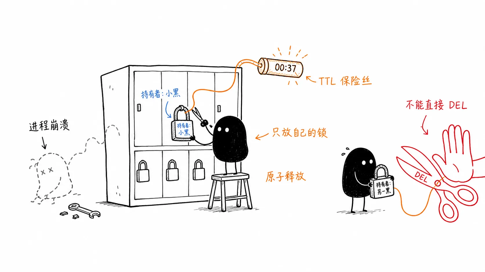

# 10｜多个 Agent 并发操作同一个世界：隔离优于共享
你好，我是李号双。

前两节课我们分别解决了单 Agent 的循环控制和多 Agent 间的通信规范。接下来进入一个更常见的场景：多个 Agent 真正并行执行任务时，如何安全地访问共享数据。

考虑这样一个任务：5 个数据库并发迁移到新灾备中心，5 个 Agent 同时开工。有三样资源需要共享：

- **进度要共享**：哪几个库迁完了、还剩哪些没动，得记在同一份进度文件里，5 个 Agent 人人要读、也要改。

- **配置要共用**：源库和目标库的地址、限流规则、切换开关，全局只有一份，要改就得先拿锁，免得别人读到改了一半的配置；

- **数据库连接要抢**：连接不是无限的，池子里就那么几个，5 个 Agent 干活都得从里面拿，拿不到就得等。


三种故障，就一幕一幕埋在这三样东西里。

**场景一：竞态覆盖——数据静默丢失。**

真实系统里，共享的进度多半落在文件里，每个 Agent 更新它的写法长这样：

```
done = json.load(open("progress.json"))      # ① 读：整份进度读进来
done["completed"].append(my_task)            # ② 改：加上自己刚完成的一条
json.dump(done, open("progress.json", "w"))  # ③ 写：整份进度覆盖写回去
```

三步之间没有任何保护，灾难就藏在这道缝里。Agent-1 费劲把 `test_a` 的 dump 做完了，正要写回进度；毫秒之间，Agent-2 也在写回，但它手里那份，是读进来的旧值，那时 Agent-1 还没来得及写，Agent-2 这一笔覆盖写下去，Agent-1 的记录就像从来没存在过一样。

```
t1  Agent-1 读文件：completed=[]
t2  Agent-2 读文件：completed=[]      ← 读到的还是旧值
t3  Agent-1 写回：completed=[test_a]
t4  Agent-2 写回：completed=[test_b]  ← 整份覆盖，test_a 的记录消失
```

**场景二：孤儿锁——持有者已经死了，锁还活着。**

解决场景一的问题，是加锁：进度文件要加锁，全局配置更要加锁。可 Agent 程序非正常退出，释放锁的代码永远不会执行，这把锁就成了没人认领的“孤儿锁”。剩下的 4 个 Agent 全部卡在“获取锁”这一步，谁也动不了。整个迁移任务直接进度归零。

```
lock = acquire("config.lock")   # Agent-2 拿到全局配置的写锁
run_migration(step=3)           # 跑到一半，进程被 OOM Kill——
release(lock)                   # ← 这一行永远执行不到了
```

**场景三：死锁——互相持有，互相等待。**

锁加多了，还会加出新的病：各自拿着一把锁，同时又在等别人手里的锁。

```
Agent-1 持有【配置文件锁】，等待【数据库连接】
Agent-2 持有【数据库连接】，等待【配置文件锁】
```

等待链闭成一个环，谁也不肯撒手，谁也拿不齐。此时进程处于“阻塞等待”状态， **CPU 占用率往往很低**，但系统吞吐量归零。

这时候你可能会纳闷：这不就是最基础的多线程并发问题吗？为什么在 Agent 系统里，这些看似基础的问题会演变得如此难以收拾？

### 为什么主流框架都“不敢”管锁？

面对这些乱象，很多开发者的第一反应是找“组织”：我的 Agent 框架能不能管管这事？

我去翻了翻目前业界最火的几个框架，像 LangGraph 和 Claude Code，你会发现一个很有意思的现象：它们在并发控制上，都极其“克制”。LangGraph 搞了状态合并，Claude Code 搞了任务隔离，但唯独没有提供一个内置的、声明式的“工具锁”机制。

它们是没想到吗？当然不是。它们是不敢，也是不愿。把锁机制硬塞进框架层，是个巨大的坑，原因远比表面看到的要深。

首先， **框架搞不懂业务语义**。它不知道“数据库 A”和“文件 B”冲不冲突，也不知道“读”和“写”能不能共存。框架强行管，要么锁得太粗（性能烂），要么锁得太细（管理成本爆炸）。

其次， **Agent 通常是分布式的**。框架要管锁，就得内置 Redis 或者 etcd，这瞬间把框架搞得又重又复杂，引入了外部状态依赖。

所以，主流框架的哲学很一致：我负责“怎么干活”（编排），你负责“活儿细不细”（实现）。它们的选择是：通过架构设计，尽量从源头消灭冲突，而不是靠加锁来容忍冲突。

### 上策：不战而屈人之兵

在工程领域，最高级的并发控制，就是你根本感觉不到它的存在。这就是“隔离”的艺术。

1. **空间隔离：Claude Code 的“平行宇宙”**


以 Anthropic 的 Claude Code 为例，当它需要并发重构三个模块时，它不会让三个 Agent 在同一个工作目录里抢文件改，而是通过 Git Worktree 技术，给每个 Agent 分配一个独立的“平行宇宙”（沙盒）。

Agent A 在 `worktree_1` 里折腾 `module_a`，Agent B 在 `worktree_2` 里折腾 `module_b`。它们互不干扰，直到最后才通过主 Agent 进行合并。

这里有个很深刻的点：物理隔离隔开的不仅是磁盘文件，更是 Agent 的认知空间。如果两个 Agent 在同一个目录下协作，即使文件锁正常工作，它们各自读到的代码库可能处于语义上不完整的中间状态，推理逻辑很容易跑偏。

举个例子。Agent A 的任务是“把全项目日志从 print 迁移到 logging”，它一个文件一个文件地改；Agent B 的任务是给支付模块加一个退款接口，B 恰好在 A 改到一半时进场——payment.py 已经换成了新风格 `logger.info` `()`，但周围的文件还是满屏的 print。B 扫了一眼，得出结论：本项目两种日志风格并存，我跟着当前文件的风格走。于是新接口里全是 print。注意：这整个过程里，文件锁都在正常工作，B 读到的每一个文件，字节上都是完整的，只是整个代码库处于语义上不完整的中间状态。

2. **状态合并（LangGraph 的思路）**


LangGraph 的核心思路是 **状态合并优于状态加锁**。它通过图结构让多个节点（Agent）并发执行，但不允许节点直接覆盖共享的 State。开发者需要提供 Reducer 函数（比如 `operator.add`），当多个节点并发返回结果时，底层运行时自动调用 Reducer 对 State 进行确定性合并。
比如两个 Agent 同时往 `messages` 列表里追加消息，系统不会让后写者覆盖先写者，而是用 Reducer 把两个结果拼起来。这就从架构层面规避了“丢失更新”问题。

### 中策：Tool 层的自卫法则

当然，理想很丰满，现实很骨感。企业级业务里，总有那么几个“烫手山芋”——比如全局配置、核心业务表——是所有 Agent 都必须争抢的。既然框架不管，谁来管？ **只能靠 Tool 实现者自己。**

Tool 是 Agent 手里唯一的武器，这个武器必须是“防弹”的。这里有几条在 Tool 层实现并发控制时需要注意的地方。

#### 哪怕再麻烦，也要拥抱原子性

千万别在 Agent 层面做“读-改-写”。那是并发万恶之源。

**错误示范：**

```
# Agent 先读，判断完了再调用写
current_status = tool.read_status(id=123)
if current_status == 'pending':
    tool.update_status(id=123, status='processing')
```

这在并发下必挂。Agent A 和 Agent B 同时读到 `pending`，同时通过 `if` 判断，同时发起更新——同一个任务就被处理了两次。中间那个"读完了、还没写"的缝隙，就是并发事故的温床。

正确的做法是，把这些逻辑全部封装进 Tool 内部，利用数据库的原子操作，比如 `UPDATE ... WHERE`。让“检查”和“写入”在一条语句里完成：

**正确示范：**

```
# Tool 内部：判断与写入合并为一条原子 SQL，Agent 一次调用定胜负
def claim_task(task_id: int) -> dict:
    with db.transaction() as conn:
        cursor = conn.execute(
            "UPDATE tasks SET status = 'processing', owner = ? "
            "WHERE id = ? AND status = 'pending'",
            (agent_id, task_id),
        )
        if cursor.rowcount == 0:
            # 没抢到：任务已被其他 Agent 领走，或状态早已不是 pending
            return {"status": "skipped",
                    "reason": "任务不在 pending 状态，可能已被其他 Agent 领取"}
        return {"status": "claimed", "task_id": task_id}
```

Agent 侧的调用只剩一行： `tool.claim_task(task_id=123)`。谁抢到了、谁没抢到，数据库用 `rowcount` 给出唯一正确的答案，不存在“两个 Agent 都以为自己抢到了”的窗口。

#### 警惕 LLM 带来的“时间错配”陷阱

这是 Agent 系统与传统软件最大的不同点，也是最容易让人困惑的地方。

在传统后端开发中，我们偏爱乐观锁（CAS），因为重试成本低，不过是毫秒级的事。但在 Agent 系统里，如果 Tool 的逻辑链条中间夹了一次 LLM 调用，情况就变得微妙了。

有些同学会担心：“如果 LLM 推理过程中数据被别人改了，乐观锁岂不是要重试？重试就要再调一次 LLM，而且 LLM 是概率模型，第二次推理的结果可能完全不同。”

出于这种顾虑，很多人会构想一个“万无一失”的方案：既然怕变，那我干脆加上悲观锁，把资源锁死，让 LLM 在一个“绝对隔离”的环境里推理，不就稳了吗？

这听起来顺理成章，但却忽略了工程上的一个基本事实：数据库锁（悲观锁）是为毫秒级事务设计的，而 LLM 的推理往往是秒级甚至分钟级操作。如果你在持有数据库连接或悲观锁的情况下去调用 LLM，一旦 LLM 响应稍慢，长时间的阻塞会迅速耗尽连接池资源。这时候，不仅仅是单个 Agent 受阻，整个系统的吞吐能力都会受到严重牵连。

正确的做法依然是拥抱乐观锁（CAS），但判断它用得对不对，标准只有一条： **冲突发生时，重试的范围里有没有 LLM 调用。** 先看一个“重试的范围内有 LLM 调用”的例子：

```
while True:
    data = read_doc(doc_id)                     # 读：记下当前版本号
    draft = llm.generate(data)                  # 推理：秒级到分钟级
    if cas_write(doc_id, data.version, draft):  # 检查 + 写入
        break                                   # 版本没变，提交成功
    # 版本被人改了 → 回到循环开头，LLM 白跑一遍
```

看这个代码结构：读在 LLM 之前，检查在 LLM 之后——LLM 被夹在“读”和“检”之间，整个圈进了重试的范围。冲突一发生，循环里最贵的一环就得陪着重来。

修法简单得出奇：把 `while True` 删掉，让代码变成一条直线。冲突了就干脆地失败，把重试权往上抛：

```
base = read_doc(doc_id)
draft = llm.generate(base)                  # 只跑一遍，失败不重来
if not cas_write(doc_id, base.version, draft):
    return TaskFailed("文档已被他人修改")    # 不重试、不循环，就此返回
```

那冲突了，这活儿还干不干？干，但不在这儿干。重试不放在业务执行层，而是交给调度层：由 Agent 进程内的调度器、或者分布式消息队列，按照预设的退避策略重新派发这个任务，新一轮执行自然会读到最新数据（消息队列处理消费失败就是这个套路：绝不在 handler 里死循环，失败了重新投递）。

对于纯只读的 LLM 推理场景，比如读取文档生成摘要，由于不涉及状态变更，直接无锁并发即可。

#### 别忘了给锁装个“保险丝”（TTL）与“安全续约”

既然要在 Tool 层处理并发，就不可避免地要面对分布式锁的实现问题。

Agent 进程的一大特点是“脆弱”，进程一崩，锁就变成了没人认领的“孤儿锁”，后面的 Agent 全部堵死。 **如果进程持有分布式锁，** **最好加上** **TTL**。

但 TTL 的设置是个技术活。设短了，Tool 还没跑完锁就过期了，安全机制失效；设长了，进程崩溃后资源要很久才能释放。

更成熟的工程实践是引入“心跳续约”机制，但实现方式至关重要。在 Python（尤其是 asyncio）的 Agent 运行时里，我建议你不要在 Tool 内部裸开一个后台线程去续约。

这很容易写出 Bug：如果 Tool 的主逻辑卡死了，后台线程可能还在不断地给锁续命，形成一把“僵尸锁”——明明进程已经假死，锁却永远不释放。

更优雅的方案是依赖 **进程级锁管理器**。我们将锁的生命周期管理上升到 Agent 进程的基础设施层：

- Tool 的职责：只负责声明锁的意图，专注于业务逻辑。

- 进程级锁管理器的职责：作为 Agent 运行时的一部分，统一管理所有锁的获取、释放和续约。


```
# 进程级锁管理器（基础设施层）：class ProcessLevelLockManager
    def __init__(self, backend):
        self.backend = backend

        # 自动处理续约，与 Agent 主循环心跳绑定：async def acquire(self, resource_id, ttl):
        await self.backend.acquire(resource_id, ttl)
        # 启动由事件循环驱动的续约任务：self._start_renew_watcher(resource_id, ttl)
```

这种设计的一个巧妙之处在于，续约任务的调度是与 Agent 的主事件循环绑定的。如果 Agent 主循环卡死，事件循环停滞，续约任务自然也就失去了调度权，锁会随着 TTL 到期而自动释放。但需注意，这个机制仅防护主线程阻塞场景，覆盖不到线程池 / 进程池内的业务阻塞。



### 下策：Agent 的“修养”

锁加好了，如果拿不到锁怎么办？这就回到了 Agent 框架该干的事—— **推理与决策**。

Agent 不应该像个傻傻的微服务那样死循环重试，它应该具备“动态让步”的智慧。

当 Tool 返回 `{"error": "RESOURCE_BUSY", "message": "Database A is busy", "hint": "Try Database B"}` 时，Agent 应该能读懂这个 hint，然后说：“哦，A 忙，那我先去处理 B 吧。”

这种 **理解冲突，主动避让** 的能力，才是 Agent 系统区别于传统并发程序的灵魂所在。

### 总结

我们在构建多 Agent 系统时，脑子里一定要有一张清晰的 **防御地图**：

1. **第一层（框架层）：隔离。** 能拆任务就拆任务，能分目录就分目录。像 Claude Code 那样用 Worktree，让 Agent 们老死不相往来，这是最干净的方案。

2. **第二层（Tool 层）：原子与精准锁。** 既然要争抢资源，就在 Tool 里把锁加死。核心原则是： **涉及状态修改的 LLM Tool 应优先使用乐观锁（CAS）**，避免长事务阻塞资源；仅在非 LLM 交互的极短临界区才考虑悲观锁。纯只读场景天然无锁，无需额外处理。记得用 TTL 防住进程崩溃的孤儿锁，并通过进程级管理器实现安全的锁续约。

3. **第三层（Agent 层）：智慧。** 遇到锁冲突不硬刚，读懂错误信息，换个任务干，实现系统层面的异步让步。


把这张地图再压缩一步，就是一张决策表。左边2-4列是你观察到的特征，右边5-6列是该采取的行动，从上往下对号入座，第一行命中的就是你的方案：

**场景**

**资源可分区？**

**有状态变更？**

**冲突概率**

**失败恢复**

**正确性机制**

**只读推理（生成摘要）**

—

否，只读

无冲突

直接重跑

无锁并发

**并行代码重构**

是，各改各的模块

是，但各在各的沙盒里

极低，互不见面

丢弃沙盒重跑

空间隔离，主 Agent 合并

**任务队列领任务**

是，各领各的任务

是，改任务状态

低，一次抢占定胜负

租约（TTL）到期自动回收重派

原子 `UPDATE ... WHERE` 抢占

**修订共享文档**

否，大家改同一份

是，写共享存储

中，读写窗口长达秒级

冲突即失败，任务级重派

乐观锁（CAS）直线执行

**非 LLM 毫秒临界区（如扣库存）**

否，改同一条数据

是，写数据库

高，但临界区极短

事务回滚

悲观锁 / 数据库事务

表的顺序就是优先级： **无锁 → 隔离 → 抢占 → 乐观锁 → 悲观锁**，一行比一行重。设计时从第一行问起，尽量让冲突不发生，而不是发生后补救。不要试图在框架里造一个大一统的锁管理器，那是反模式。真正的工程智慧，是在清晰的边界上，用最轻量的手段解决问题。

### 思考题

下面这个“给文章点赞”的 Tool，单 Agent 跑的时候一直正常；某天并发跑了两个 Agent，运营发现点赞总数总是比实际点击数少。

```
def like_article(article_id: int):
    likes = db.query("SELECT likes FROM articles WHERE id = ?", article_id)
    db.execute("UPDATE articles SET likes = ? WHERE id = ?", likes + 1, article_id)
```

问题出在哪儿？试着用这一讲的方法，把它改成一条 SQL 解决。欢迎你在留言区分享自己的解决思路，如果你有所收获，也欢迎你分享给需要的朋友，我们下节课再见！