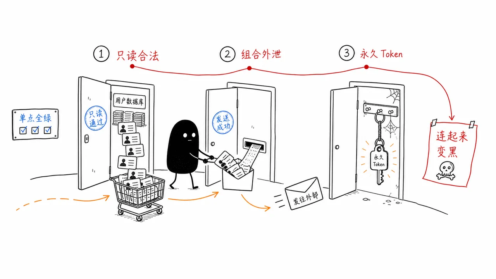
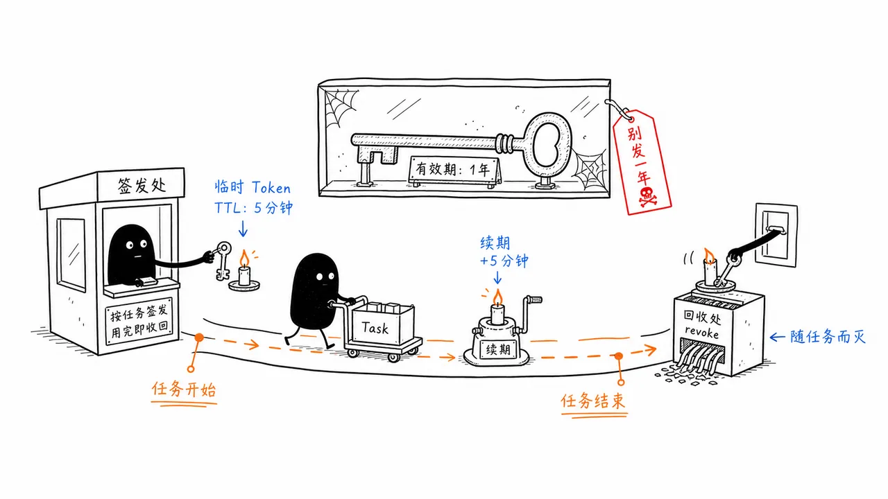

# 11｜RBAC 挡不住 Agent：如何设计一个企业级 Agent 权限系统
你好，我是李号双。

先看2个真实案例：2019 年，美国某保险巨头8.85 亿条含社保号、银行账号的记录被批量枚举；2022 年，丰田披露一枚访问密钥在 GitHub 公开仓库存活了五年，波及 29.6 万客户。

留意它们的共同点：没有人攻破密码，每一步单看都是合法访问。而且，这些事故里还没有 Agent——当拿着权限的执行者从人换成不知疲倦的 Agent，同样的攻击面，会以指数级放大。

为什么我们要专门花一讲学权限系统？

因为它是 生产级 Agent 的必需品。要上生产、碰真实数据，权限系统就是绕不开的一道关。 **翻开市面上 Agent 开发岗的 JD，“权限系统”“安全治理”已经是高频词**；面试企业级 Agent 开发岗位，“设计一个 Agent 权限系统”正在成为一道经典的系统设计题。这一讲，我们就把这道题从头到尾完整答一遍。

我们不妨先抛出一个问题： 如果把企业系统的长期访问凭证，交给一个能自主工具调用的 AI Agent，会发生什么？

1. **只读权限下的批量枚举。**


Agent 接到拉取 VIP 用户信息的任务，调用接口 `query_user_profile(user_id="1")`，这一次调用完全合法，权限也匹配。接着查 `user_id="2"`，同样一切正常。

Agent 为了更快完成任务，自主生成了一段循环逻辑，把 user\_id 从 1 一路遍历到 10000。它拿着合法的只读权限，直接把整张用户表扫穿。

它没有主观恶意，它只是单纯想把任务做得更快。

2. **单点全合规的组合泄露。**


一万条用户数据，里面包含手机号、身份证号全部被拉取出来。紧接着 Agent 调用内部邮件工具 `send_email`，把整批数据打包，发送到了一个外部邮箱。

事后审计去查日志，单看每一步操作：数据库这边全是正常合法的 SELECT 查询，邮件网关也显示 SMTP 认证完全通过。每一个独立动作都合规，但是组合在一起，就完成了完整的数据外泄。单点看全部绿灯，合起来就是安全事故。

3. **任务跑完了，令牌还活着。**


数据库只读令牌 `prod_db_readonly_token`，直接写在了项目的 `.env` 配置文件里，是一个永久有效的凭证。早就已经执行完毕的任务，令牌却依旧存活。后来外部攻击者拿到这个残留 token，在企业系统里悄无声息拉取数据，整整持续了两周才被发现。

这三类事故模式，指向一个非常残酷的结论： **我们沿用了很多年、为人类员工设计的 RBAC 权限模型，面对 AI Agent，已经独木难支。**



RBAC（基于角色的访问控制） 能干什么？它只回答一个问题：“这个角色，能不能对这个资源，做这个操作”。再往下的维度，授权模型就管不到了：一次能取多少条、参数取值是否越界、数据取走后流向哪里等等，授权模型都不管。过去执行者是人，节奏慢、能追责，边界模糊一点还兜得住；换成 Agent，这个缺陷立马就暴露了。

我们不能再把 Agent 当成一个虚拟员工来对待，必须换一套思路： **把 Agent 视作一个概率性执行单元，需要边界约束、全程监控、动态授权，危急时刻还可以直接强制熔断。**

这套新思路落到授权上，和人类员工的差别一眼可见：

**维度**

**人类员工授权**

**Agent 任务授权**

**身份**

本人，行为可追责

受用户委托的进程

**凭证周期**

以年月计，离职回收

以分钟计，任务结束即失效

**权限范围**

角色级，入职一次性授予

任务级最小 Scope，按次申请

**访问数量**

人的节奏，异常显眼

显式的条数与频次上限

**数据出口**

保密协议与审计威慑

出站必过 DLP，敏感上下文禁止外发

**失控处置**

停职调查，以天计

吊销令牌、秒级熔断

那么，到底该怎么解决上述本文开头列举的三个问题？靠修补几个接口是没用的。我们需要一套全新的、基于 **MCP 网关** 的分层防御体系。

## 整体思路：用 MCP 网关，守住所有工具调用的咽喉

这里说的 MCP 网关，不是简单的反向代理，它是企业自研的一道安全关卡。它部署在 Agent 与所有后端工具之间，是所有工具请求的必经之路。

对于企业级Agent来说，所有 Agent 发起的工具调用，先要经过这道网关，是行业正在达成的共识，我们还给它起了个名字：Agent 的控制平面。工具统一在 MCP 网关注册成工具目录集中管理，Agent 只看得见目录，不知道工具的真实地址。微软的 Azure API Management 可以集中托管 MCP 工具，认证、授权、限流、审计一站式配齐；MCP 官方也在推 Registry 规范，要把工具目录写进协议标准。

接下来我们具体来看MCP 网关的四道防线。

### 第一道防线：OBO 令牌交换，从根源消灭“凭证残留”

这道防线解决的问题是第三段场景里凭证残留带来的潜在风险。它最关键的思想是不要给 Agent 发放永久权限凭证。Agent 拿到的不是资源访问权，而是代表真实用户去发起任务的委托权。

具体怎么做？我们通过 OAuth 2.0 令牌交换（RFC 8693），把 Agent 的执行权限，转化成绑定用户、绑定任务上下文的短期临时权限。这个“代表用户执行”的模式，业界常叫 **OBO（On-Behalf-Of）**。

很多团队踩坑，就是直接给 Agent 分配独立超级账号（比如写在 `.env` 里）。后端日志只能看到 "Agent 账号" 在操作，分不清到底是谁发起的任务。而在 MCP 网关的 OBO 模式下，流程是这样的：

1. **任务启动**：用户在前端发起一项 Agent 任务，请求中携带自己的会话身份凭证 —— 也就是用户登录后拿到的短期访问令牌（OAuth access token）。

2. **上下文提交**：Agent 业务软件收到任务后，向 MCP 网关申请委托：提交用户的访问令牌和任务上下文（User ID、Agent ID、scope 等），同时用自己的服务端凭证（如 client\_id/client\_secret 或 mTLS 证书）证明身份。

3. **令牌交换**：MCP 网关作为 OAuth 客户端，向授权服务器发起 `token_exchange` 令牌交换请求，带上用户访问令牌（ `subject_token`）、Agent 身份（ `actor_token`）、本次任务需要用到的权限范围（ `scope`）。

4. **颁发临时令牌**：授权服务器校验用户身份、Agent 委托关系之后，返回一张全新的短时访问令牌。

5. **自带 TTL**：比如 15 分钟后自动失效。

6. **绑定 Scope**：只包含本次任务允许的最小权限范围（如只读订单表）。

7. **身份映射**：令牌内 `sub` 为真实用户 ID， `act` 字段填充 Agent 标识。

8. **执行与销毁**：MCP 网关拿着这张短期令牌，去调用后端真实业务 API。任务结束后，令牌过了 TTL 就失效。




要理解这套机制，打个比方更直观。张三入住酒店，拿到一张房卡。他请礼宾员帮忙取行李，礼宾员不会掏出自己的万能钥匙，而是拿着张三的房卡到前台，换一张临时卡 —— 只能开行李间、15 分钟内有效、登记的还是张三的名字。行李取完，这张卡就作废。

整个流程写成代码，其实就三步：

```
# 张三发起任务："帮我出一份订单报表"

# 第一步：网关以张三的名义换好令牌，但令牌留在网关手里，发给 Agent 的只是一张"委托单"
task = gateway.delegate(user="张三", agent="报表Agent", scope="只读订单")

# 第二步：Agent 干活，每次调用只报委托单，令牌由网关自动附上
orders = task.call("query_orders", limit=50)

# 第三步：任务结束，网关回收令牌，委托单结案
task.close()
```

真实的协议当然比这三行啰嗦： `delegate` 背后是 OAuth 2.0 的令牌交换（RFC 8693），表单里要填 `grant_type`、 `subject_token` 一堆参数。但这些都封装在网关里，业务代码一行都不用碰。

### 第二道防线：参数级校验，从源头遏制“穷举爆破”

这道防线是为了解决第一段场景中的问题：只读权限的穷举爆破。

Agent 会自主拼接参数，很容易出现循环遍历 id 这类行为。单纯依靠业务接口做参数校验不够，Agent 可能绕过后端限制。

企业里一般会用 OpenAPI 规范（OAS） 来描述每一个工具的接口约束：哪些参数必填、枚举值范围、单次查询最大条数、id 的取值边界。比如一个查询订单的接口，OpenAPI 会规定 `limit` 参数最大不超过 1000， `status` 只能是 `["pending", "shipped", "completed"]` 之一。 MCP 网关在请求真正抵达后端之前，实时校验 Agent 传入的所有参数。具体怎么做？

我们在网关里预置了工具的接口规约。网关导入每个工具的 OpenAPI 规范做基础校验，并可集成 CEL（Common Expression Language） 或 OPA（Open Policy Agent）等策略引擎，用表达式定义更复杂的动态策略 —— 比如 "请求量小于 50 时才允许调用"，让校验从静态规则走向上下文感知。 当 Agent 试图调用 `query_orders`，传入参数 `limit=10000` 时：

1. 请求先到 MCP 网关。

2. 网关的参数校验引擎拦截该请求，对照 OpenAPI 规约和 CEL 策略。

3. 发现 `limit` 超出限制，直接拦截并拒绝。

4. 网关返回错误给 Agent：“参数校验失败：limit 超过最大值 50”。


这样就能从源头切断“合法接口穷举爆破”的可能性。

### 第三道防线：DLP（Data Loss Prevention） 数据泄露防护，拦住数据外发通路

这道防线可以解决第本文开头二段场景的问题：合法操作叠加，导致数据泄露。像发送邮件、对外 HTTP 请求这类向外输出数据的工具，是泄露高危点。单点看操作都合法（查数据合法，发邮件合法），但组合起来就是灾难。

我们需要在 MCP 网关上，对所有出站工具调用强制扫描。识别其中是否携带身份证、手机号等敏感个人信息。

1. Agent 调用 `query_user_profile` 查到了包含手机号的数据。这些数据暂时停留在 Agent 的上下文中。

2. Agent 紧接着尝试调用 `send_email`，意图把这些数据发出去。

3. `send_email` 的请求经过 MCP 网关。

4. 网关的 DLP 模块扫描请求体。

5. 发现请求体中包含 `phone_number`、 `id_card` 等敏感字段。

6. 一旦命中风险规则，网关直接拦截调用，留存审计日志，并报警。


DLP扫描对象不只是 `tools/call` 消息体里的入参。敏感数据能藏的地方很多：邮件正文、HTTP body 固然要查；拼在 URL 的 query 参数里、塞进请求头里、混在文件上传的内容里，同样是在往外发。DLP 引擎要检查的，是出站请求中所有用户可控的部分。

“所有外发类工具”都得收进网关：邮件、Webhook、文件上传、对象存储写入……这又回到前面立过的红线——网络层封掉 Agent 的直连出口，外发通路只留网关这一条，扫描才谈得上覆盖。

还有一条特殊的通路值得单独交代：Agent 调用大模型 API 时，整个上下文会发给模型服务商，而上下文里可能有敏感数据。这条路不走工具链路，MCP 网关看不见，但同样可以用网关来收。业界管它叫 LLM 网关（或者 AI 网关），部署在 Agent 和模型服务商之间：供应商准入、密钥统一保管、全量审计，都在这里完成；更进一步，还能在请求发出去之前做脱敏，把身份证号打上码再发。

### 第四道防线：运行时熔断，出事直接拔权限

这道防线解决Agent 失控、死循环攻击的问题。它借鉴了微服务熔断的思想，做运行时防护。具体怎么做呢？当网关观察到异常行为：连续多次参数校验失败、反复尝试越权访问、短时间超高频次调用接口，网关不需要等待人工介入，立刻执行熔断。

1. 网关监控发现 Agent `X` 在 1 秒内发起了 100 次请求，且全部触发参数校验失败。

2. 熔断器判定 Agent 行为异常（疑似被攻击或 Prompt 注入），立刻执行熔断。

3. **阻断存量**：把这个 Agent 当前所有在役 OBO 令牌，全部拉进网关的作废名单。

4. **掐断增量**：拒绝为这个 Agent 换发任何新令牌。

5. **冻结** 本次 Agent 实例的执行上下文，拒绝接收任何新请求。

6. 借助令牌里面的 `act` 字段，可以精准定位出问题的 Agent 任务实例，不会影响其他正常业务。


注意，安全熔断不能自动恢复，必须由运维人员介入调查后手动开启，因为 Agent 的异常行为往往代表安全漏洞，不会自己“好起来”。

## 总结

我们复盘一下整套体系的底层逻辑。

传统权限，发放一张长期通行证，进门之后就放任自流。面向 Agent 的安全体系，要把永久凭证替换成绑定任务、绑定用户的短期凭证；把一次性放行，改成全链路持续监控。

**MCP 网关通过 OBO 令牌交换搞定身份映射，消灭凭证残留；通过参数级校验 防止批量穷举；通过 DLP 与数据流管控拦截敏感数据外泄；最后通过运行时熔断 作为最后一道兜底防线。**

很多团队做 Agent 落地，一门心思扩充 Agent 能调用多少工具，把行动力拉满，安全治理却完全滞后。Agent 是一个聪明员工，也是一台不知疲倦的执行机器。 想要用好它，就要同步搭建与之匹配的约束。只有约束到位，自动化能力才真正可控。

## 思考题

在这一课里，我们使用了 OBO（On-Behalf-Of）令牌交换机制，确保 Agent 只持有短期的、绑定特定任务的权限凭证。这带来了一个实际的工程挑战：如果某个长程任务（比如需要 Agent 调用多个工具，分步骤完成一个复杂的数据分析报告，总耗时可能超过 1 小时），而我们颁发的 OBO 令牌 TTL（过期时间）默认只有 15 分钟。 当 Agent 执行到一半，令牌过期了，导致后续的工具调用全部失败，任务中断。

请问：直接把 TTL 设置为 2 小时是一个好的解决方案吗？如果不是，我们应该设计怎样的“令牌续期”或“长任务管理”机制，才能既保证长任务的平稳运行，又不破坏“权限随任务生灭、最小权限原则”的安全边界？