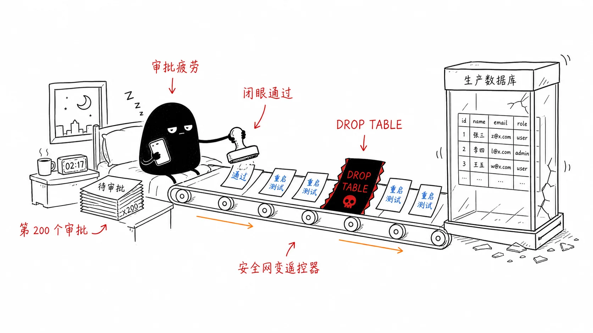
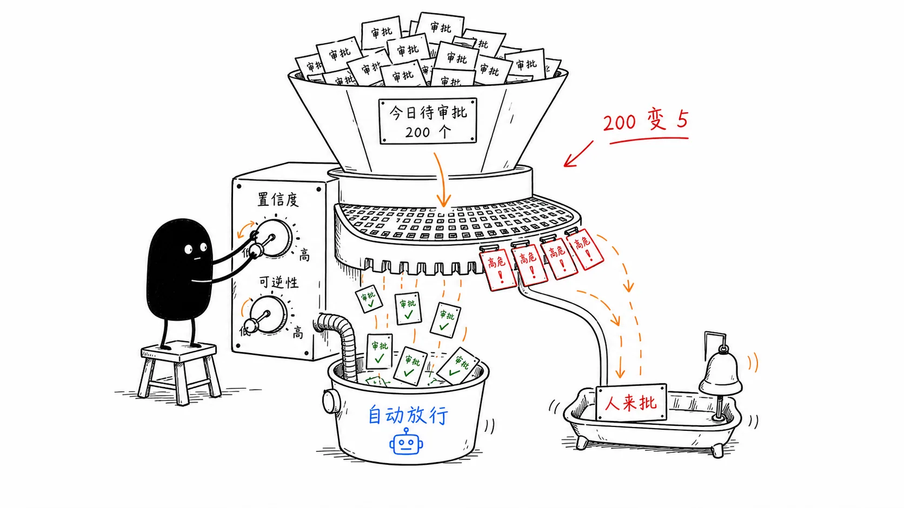
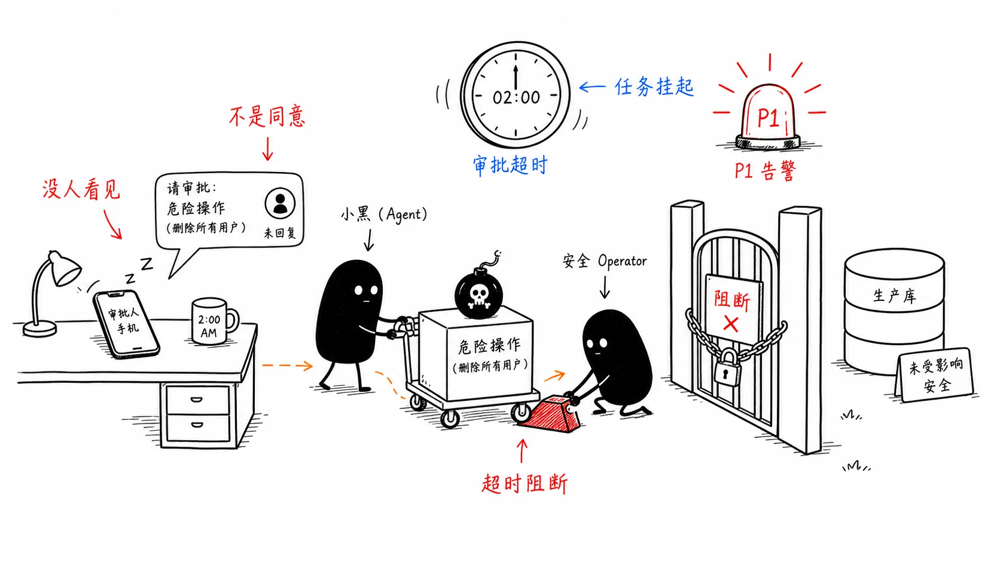

# 12｜人审批后事故反而更大：正确设计 HITL 审批系统
你好，我是李号双。

前面几节课，我们讲了怎么给 Agent 踩刹车、怎么定通信规矩，还有权限的四道锁。做到这一步，很多团队才敢让 Agent 去碰生产环境。但还是不放心，又加了一道—— **人工审批**。可偏偏就是这道审批，最容易出事。

我们先从一个真实场景开始。某公司生产环境的数据库，在一次自动化任务中被意外删除。事后查日志，发现那条致命的 `DROP TABLE` 请求，确实通过了“人工审批”环节。审批人在手机上收到了一条 Slack 消息：“Agent 请求执行 SQL，参数：\[超长 JSON\]”，他可能根本没看清内容，就点了个“通过”。

为什么加了人这道“安全网”，事故反而更大了？

很多团队上线人工审批后，起初还认真看，但节奏很快就被打破了：Agent 发起的审批请求一条接一条，白天在弹、周末也在弹，全压在值班的同几个人身上。一周之后，“看都不看就点通过”成了肌肉记忆。还有更糟的：审批请求被扔进值班群 @ 所有人，谁都以为别人看过了——责任一分散，更没人真的看。本应是安全阀的审批，就这样变成了没用的“摆设”。



根本原因在于，我们延续了传统软件中“人作为兜底者”的思维，简单地把“高风险操作”标记后，就推给人来拍板。但 Agent 系统的特点完全不同：它是高频、自主、概率性执行的实体。人的处理能力是有限、异步、会疲劳的。如果不加筛选地同步阻塞等待人的审批，系统不仅会效率低下，更会因为“审批疲劳”导致人失效。

今天，我们就来系统探讨如何为 Agent 系统构建一套真正可靠、不让人失效的治理架构。

## 为什么“同步阻塞审批”必败？

所谓同步阻塞审批，就是 Agent 发出请求后原地停下来，等人点了“通过”或“拒绝”才继续。我们来看最常见的实现，这几乎成了所有新手团队的标配：

```
def execute_with_approval(tool_name: str, params: dict):
    if is_high_risk(tool_name):
        send_slack_message(f"Agent 请求执行 {tool_name}，参数：{params}")
        approval = wait_for_human_click()  # 致命：线程阻塞等待
        if approval:
            return execute_tool(tool_name, params)
    return execute_tool(tool_name, params)
```

这段代码在工程上和认知上都埋下了隐患。

### 工程上的不可靠：同步阻塞的泥潭

`wait_for_human_click()` 是一个极其危险的信号。它让 Agent 进程陷入无尽的等待。

- 如果审批人睡着了呢？线程池会被耗尽，系统资源空转。

- 如果服务重启了呢？所有等待中的审批状态全部丢失，Agent 变成了“僵尸”。


这种设计无法支撑生产环境所需的可靠性和稳定性。

### 认知上的不可靠：审批疲劳的陷阱

当审批请求量远超人脑能有效评估的数量时，会发生什么？认知心理学告诉我们，人会进入“低能耗模式”——凭借直觉快速判断，甚至“闭眼瞎点”。这在航空业被称为“警告疲劳”：如果驾驶舱警报每分钟响一次，飞行员最终会想方设法关掉它。

在我们的系统中，如果每天有 200 个审批请求，第 201 个真正致命的请求，被点“通过”的概率极大增加。不加筛选的审批不是增加安全，而是推迟并引爆了风险。

## 从“单点拦截”到“分层治理”

要根治这个问题，我们不能在业务代码里堆砌 `if-else`，必须构建一个分层、解耦的治理架构。这个架构的核心，是让每个角色扮演好自己最擅长的部分。在生产级的系统中，我们需要五个角色各司其职：

角色

职责

类比

**Agent 框架**

**执行者**：负责执行任务，遇到审批节点时，负责“挂起”和“恢复”自己的执行状态。

货车司机

**MCP Gateway**

**拦截者**：作为所有工具调用的必经关口，负责拦截请求，并执行策略引擎的决策。

收费站关卡

**策略引擎**

**决策者**：根据预设的策略规则，对当前操作做出放行、拒绝或升级的决策。

智能调度中心

**审批服务**

**管理者**：管理审批单的创建、状态更新、证据包生成、通知发送和审计日志记录。

稽查大队

**人**

**终极判断者**：在必要时异步介入，利用人类判断力做最终决策。

稽查员

当 Agent 尝试调用一个高风险工具时，信息会在这些角色间流转，形成一个清晰的治理闭环。你可以看一下这个流程图，它展示了从请求到执行的完整异步旅程：

这个架构将“等人”变成了一个持久化、可恢复的事件，将决策集中化、规则化，将通知清晰化、证据化。它为人机协同建立了一个可靠的异步协议。

## 如何系统解决“审批疲劳”？

架构搭好了，我们才能对症下药，解决人的“失效”问题，不能靠一两个维度，而是一套组合拳。

### 重建稀缺性：从“高风险标签”到“基于规则的精准分级”

审批的“红灯”必须稀缺，才能代表真正的危险。很多团队问我：“能不能搞一个 AI 模型来自动计算风险分？”我的建议是：不要引入黑盒模型。在安全领域，我们需要的是清晰、可控、可审计的规则，而不是一个连你自己都解释不清的评分。

策略引擎（如 OPA、Cerbos）正是为此而生。所谓的“风险分级框架”，本质上就是 **一组由你（通过 Git）编写和维护的、清晰可读的判断逻辑**。

这听上去很原始，但它是目前最科学、最工程化的方案。你可以根据业界的最佳实践（如 AARM 规范），定义一个多维度的决策矩阵，并把它写成代码（Policy as Code）。

策略引擎会忠实地执行你的逻辑。 一个典型的策略规则可能是这样的（伪代码）：

```
# 这是一个由开发团队维护的策略规则
def decide_action(tool, env, data_sensitivity, impact_scope):
    # 规则1：生产环境删除操作，无论影响大小，必须双人审批
    if env == "prod" and tool.name == "delete_table":
        return "REQUIRE_DUAL_APPROVAL"
    # 规则2：非生产环境，低敏感度数据，读操作，自动放行
    if env != "prod" and data_sensitivity == "public" and tool.is_read_only:
        return "ALLOW"
    # 规则3：涉及核心机密数据的修改，需要单人审批
    if data_sensitivity == "confidential" and tool.is_write:
        return "REQUIRE_APPROVAL"

    # 默认拒绝，保证安全
    return "DENY"
```

你看，它会听谁的？听规则的，而规则听你的 **。** 你通过 Git 提交代码来修改规则，代码审查过程保证了规则的质量。策略引擎只是一个高效的执行者。这不仅消除了“模型幻觉”的风险，也让每一次决策都有据可查，完全可控。

通过这种精准分级，我们将海量的 Agent 请求进行了过滤：

- **低风险**：自动放行，只做日志。

- **中风险**：异步通知，事后审计。

- **高风险**：同步审批，阻塞执行。


审批请求的量级可以从每天数百次降至个位数。 **当审批变得稀缺，它才会被认真对待。**



### 生成高信噪比的“证据包”

当审批请求最终到达人时，系统不能把“决策权”甩给用户，而应该把“决策依据”清晰地呈现出来。审批服务必须生成一份“证据包”，替人完成信息解析和风险提炼。

一份糟糕的审批消息是这样的：

```
> Agent 请求执行 `execute_sql`，参数：`{"sql": "DROP TABLE production.users; ..."}`（JSON 横向滚动三屏）
```

而一份高信噪比的证据包是这样的，你可以对比一下。

```
> **【高危操作预警】**
> **操作**：删除数据表
> **目标**：生产环境 `users` 表（含 1,200,000 行数据）
> **影响**：不可逆，将导致核心服务不可用。
> **触发者**：Agent-007（任务：清理测试数据）
> **异常推断**：该 Agent 当前任务置信度为 0.6，低于安全阈值。
> **请审批人确认**：此操作是否确属本次任务必需？[批准] [拒绝]
证据包将冰冷的技术参数转化为了具体的业务风险，让人在手机上一眼就能看清核心风险，极大降低了判断成本。这可以通过结构化解析（针对 SQL/JSON）和 LLM 辅助摘要（针对自然语言意图）来共同实现。
```

### 超时阻断、紧急通道与分布式高可用

最后，必须设立兜底原则，并考虑系统的健壮性。

- **超时阻断（Fail-Close）**：如果审批请求超时（如 15 分钟未响应），系统应默认阻断操作。这是安全系统的铁律。

- **紧急授权通道**：但在生产故障等极端情况下，铁律可能会阻碍救灾。因此，系统必须为超时的高风险操作提供一条“紧急通道”。例如，超时后自动向更高级别的值班人员发送“紧急授权请求”，并记录完整的授权链路。这是在安全性和可用性之间做权衡的必要设计。

- **分布式高可用**：整个审批流程必须构建在消息队列（如 Kafka）之上，实现完全的异步解耦。Gateway、审批服务、Agent 之间不直接依赖，即使某个服务重启，审批请求也不会丢失。同时，所有关键操作都必须携带唯一的 `TraceID`，贯穿日志，确保事后可追溯、可复盘。




## 总结

今天，我们剖析了“加了人审批后事故反而更大”的根因，并重构了治理架构。

1. 问题本质：是“同步阻塞等待”与“人异步、有限认知”的错配。不加筛选的审批是甩锅，让人无法判断风险的审批是谋杀。

2. 架构核心：建立分层治理体系。Agent 框架负责状态挂起恢复，MCP Gateway 负责拦截执行，策略引擎负责基于你定义的规则进行风险决策，审批服务负责交互管理。让人成为“异步介入的终极判断者”。

3. 解决之道：通过基于代码的精准规则分级重建审批稀缺性，通过证据包提升决策清晰度，通过超时阻断、紧急通道和分布式设计保障系统可靠性。


最终，我们希望构建的人机协同，不是简单地把人作为最后一道防线，而是通过一套精心设计的架构，让人只在真正需要其判断力的时候，以最清晰、最有效的方式介入。这样，审批才能从“橡皮图章”变为真正的“安全阀”。

## 思考题

在本课中，我们建立了针对单个工具调用（如 `execute_sql`）的审批机制。然而，高级的风险往往隐藏在一系列看似“安全”的操作序列中。

例如，Agent 先调用 `read_customer_data`（读操作，低风险，自动放行），紧接着调用 `send_email`（发送操作，低风险，自动放行）。单独看每一步都合规，但组合起来却是严重的“数据泄露”。

既然我们的 MCP Gateway 和策略引擎主要拦截单次调用，架构应如何演进以识别和治理这种“复合风险”？欢迎你在留言区分享你的思路和见解，如果你觉得有所收获，也欢迎你分享给其他朋友，我们下节课见！