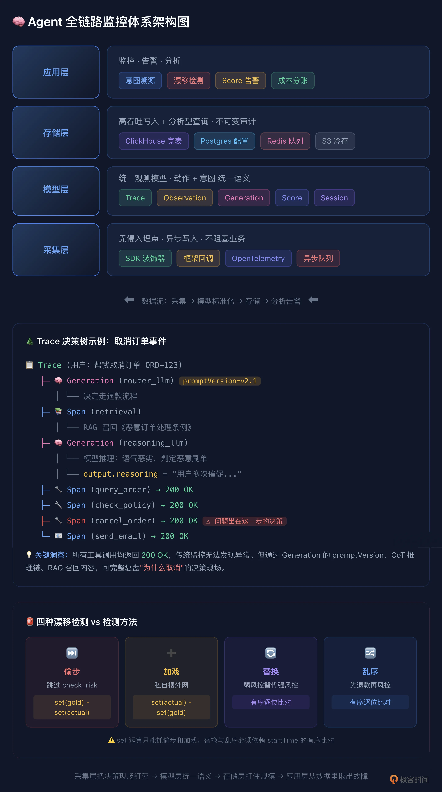

# 16｜传统监控对 Agent 几乎无效： 搭建 Agent 全链路监控体系
你好，我是李号双。
今天咱们聊聊故障排查这件事。做过传统后端开发的同学，估计都有过类似的经历：好不容易周末可以好好休息一下，但服务突然挂了。你打开电脑，ssh 登上服务器，敲下 `tail -f error.log`。

几秒钟后，你看到了那行熟悉的 StackTrace——可能是空指针异常，或者数据库连接超时， 但这时你也松了口气，因为只要看到了 StackTrace，这事儿就基本定性了：要么是代码逻辑有坑，要么是基础设施不稳定。剩下的就是顺着调用栈，一步步找根源，改代码，发版，搞定。
这是我们熟悉的确定性世界。 **代码怎么写，程序就怎么跑；出了错，一定是某个地方违背了既定的规则。**

但当你开始负责 Agent 系统时，一切都变了。

有个用户投诉说，Agent 没经他同意就把订单取消了，还发了一封措辞强硬的通知邮件。你习惯性地冲进日志系统，想找“报错”。结果你看到了下面这几行日志：

```
[INFO] Agent invoked tool: query_order -> Success (200)
[INFO] Agent invoked tool: check_policy -> Success (200)
[INFO] Agent invoked tool: cancel_order -> Success (200)
[INFO] Agent invoked tool: send_email -> Success (200)
```

没有 500，没有超时，没有异常堆栈。每一行日志都在告诉你：“系统运行完美，Agent 很听话，任务顺利完成了”。
可现实是：任务确实完成了，但做错了。用户没有授权，Agent 却自作主张取消了订单。

**Agent 的故障，往往是“认知故障”，而不是“运行故障”。**

传统的 Log/Metrics/Trace 三件套，就像拿体温计去测脑电波——完全不对症。你需要的是一套能记录“心理活动”的脑电图。

这一课我们聊聊如何设计一个企业级 Agent 监控的总体方案。这套方案的设计思想在业界有成熟的开源参考实现（比如 Langfuse），但核心是理解架构本身——理解了，你用任何编程语言都能搭出来。

## 企业级 Agent 监控总体方案

传统监控的根本问题是：它只记录“系统做了什么”，而 Agent 的故障出在“为什么这么做”。所以企业级方案必须在传统三件套之上加一个 **Audit（审计）维度**，并且让这个维度的数据能驱动实时告警，而不是只存着事后查。

整个体系分四层，从下到上：

层级

职责

核心组件

解决的问题

**采集层**

无侵入埋点

SDK 装饰器 / 框架回调 / OpenTelemetry

不阻塞业务链路，自动捕获全生命周期

**模型层**

统一观测模型

Trace / Observation（Span·Generation）/ Session / Score

把动作和意图统一到一套数据结构里

**存储层**

高吞吐写入 \+ 分析型查询

ClickHouse（观测数据）+ Postgres（配置）+ Redis（队列）+ S3（大载荷）

每秒数万条写入，秒级查询，不可变审计

**应用层**

监控 \+ 告警 \+ 分析

意图溯源 / 漂移检测 / Score 告警 / 成本分账

**200 OK 的静默漂移也能分钟级发现**

这条主线很清晰： **采集层把决策现场钉死，模型层给数据统一语义，存储层扛住规模，应用层从数据里揪出故障。** 下面我们从模型层开始讲，因为数据模型决定了上层能做什么，这是整个体系的基石。

## 统一观测模型：Trace、Observation 与 Score

在传统微服务里，Trace 记录调用链 A→B→C 就够了，因为逻辑是硬编码的。但 Agent 调用 `cancel_order` 不是因为代码写了 `if`，而是模型推理后觉得“应该取消”。如果不把推理瞬间的上下文记下来，事后根本没法复盘。所以我们需要一套能同时承载“动作”和“意图”的数据模型。五个核心对象：

对象

是什么

关键字段

类比传统监控

**Trace**

一次端到端请求，从用户输入到最终输出

id, input, output, userId, sessionId, tags, release

一条请求的根 Span

**Span**

Trace 内有持续时间的工作单元

name, startTime, endTime, input, output, parentId

传统 Span

**Generation**

一次 LLM 调用（Span 的特化）

model, promptName, promptVersion, usage, cost, modelParameters

**传统监控没有这个**

**Session**

多轮对话的逻辑分组

sessionId, 关联的 Trace 列表

会话级聚合

**Score**

挂在 Trace/Observation 上的质量信号

name, value, dataType, comment, source

**传统监控没有这个**

这里有两个传统监控完全没有的概念，是整个方案的关键：

**第一，Generation 不是普通 Span。** 它额外记录了 `promptName` 和 `promptVersion`——这次 LLM 调用受哪版指令控制。这意味着你可以直接回答：“取消订单的决策是 v2.1 版 Prompt 下做出的”，而不需要自己维护版本映射。当你把 Prompt 从代码里抽出来做中心化管理时，每次 `get_prompt()` 拿到的版本号自动写入 Generation，这是意图溯源的基础。

**第二，Score 是通用质量货币。** 它可以是 boolean（漂移检测 pass/fail）、numeric（LLM Judge 打的 0-1 分）、categorical（人工标注的 good/bad）。监控告警、测试断言、评估评分，本质上都是在写 Score——这让三个领域共享同一套数据语义，而不是各搞各的。

Span、Generation 统称为 **Observation**，它们都挂在 Trace 下面，形成一棵树。一个典型的客服 Agent Trace 长这样：

```
Trace（用户：帮我取消订单 ORD-123）
├── Generation（router_llm）        ← 决定走退款流程
│   └── promptVersion=v2.1
├── Span（retrieval）               ← RAG 召回《恶意订单处理条例》
├── Generation（reasoning_llm）     ← 模型推理：语气恶劣，判定恶意刷单
│   └── output.reasoning="用户多次催促..."
├── Span（query_order）             ← 查订单，200
├── Span（check_policy）            ← 查策略，200
├── Span（cancel_order）            ← 取消订单，200  ← 问题出在这一步的决策
└── Span（send_email）              ← 发邮件，200
```

有了这棵树，取消订单的决策现场就完整了：哪版 Prompt、召回了什么文档、模型怎么推理的、依次调了什么工具——全部可查。

## 意图溯源：把决策现场钉死

模型定义好了，接下来是怎么把数据填进去。核心原则只有一条： **意图字段必须实时富集，不能事后补录。**

为什么？因为 `promptVersion`、CoT 推理、RAG 召回内容这些线索，散落在 LLM 请求、模型思考、检索这些瞬时事件里。如果等到工具调用结束才去捞，上下文窗口可能已经滚过去了——决策现场就丢了。

所以采集层的设计是：在 Agent 运行的每个生命周期节点，由 SDK 自动创建或富集对应的 Observation。

生命周期事件

触发时机

SDK 自动做什么

写入的关键字段

**SESSION\_START**

会话开启

创建 Trace

trace\_id / session\_id / user\_id

**llm.request**

模型推理前

创建 Generation

model / promptName / promptVersion / input

**llm.think**

模型产出 CoT

富集 Generation.output

reasoning\_content（完整推理链）

**memory.recall**

RAG 检索

创建 Span(name=retrieval)

input=查询 / output=召回文档

**TOOL\_CALL**

工具调用前

创建 Span

name=工具名 / input / startTime

**TOOL\_RESULT**

工具返回后

闭合 Span

output / endTime / latency / error

接入方式很轻量。以 Python 为例，在 Agent 入口加一个装饰器，内部用自动埋点的 OpenAI 客户端：

```
from langfuse import observe
from langfuse.openai import openai

@observe()  # 自动创建 Trace
def agent_invoke(user_input: str):
    # openai 调用自动创建 Generation，promptVersion 自动关联
    response = openai.chat.completions.create(model="gpt-4o", messages=[...])
    return response

@observe(name="retrieval")  # 标记为一个 Span
def retrieve_docs(query: str):
    return vector_db.search(query)  # 返回值自动作为 Span.output
```

如果用了 LangChain、LlamaIndex 这些框架，有现成的回调处理器一键集成，连装饰器都不用写。异构技术栈走 OpenTelemetry 标准协议，避免厂商锁定。

采集层还有一个架构要点： **异步写入，不阻塞业务**。SDK 把 Observation 写进本地队列（内存或 Redis），后台 Worker 批量刷到服务端。Agent 的响应延迟不会因为埋点而增加，这在高并发场景下是硬性要求。

## 漂移检测：防住 200 OK 的静默跑偏

有了完整的 Trace 树，能事后复盘了。但企业级监控不能只做事后复盘，要能在 Agent 跑偏时实时发现。

这就是漂移检测要解决的问题。Agent 表面上工具都调用成功、返回 200，但行为逻辑已经悄悄变了。比如标准退款流程是 `query_order → check_risk → calculate_refund → refund`，但某次执行变成了 `query_order → refund`，跳过了风控，直接退钱。日志全绿，但钱已经退了。

### 黄金轨迹：Dataset 中的标准流程

检测漂移需要一个“标准答案”，也就是黄金轨迹。它不应该是散落在代码里的常量，而应该是结构化的测试数据，每条包含：

- `expected_tool_sequence`：标准动作序列，子序列匹配（中间允许插别的合法动作）

- `forbidden_tools`：红线工具，出现即 fail

- `constraints`：业务约束，自然语言描述

- `tags`：分类标签，用于筛选和聚合


这些数据存在 Dataset 里，整体有内容哈希版本锁，任何一道题改了一个字段，版本号就变。比对时校验版本一致，防止出现“卷子换了还以为是学生退步了”这种情况。

### 四种漂移，set 运算只能抓两种

把实际 Trace 的工具序列提出来，和黄金轨迹比对。有四种漂移：

1. **偷步**：该调的没调，比如跳过 `check_risk`。 `set(gold) - set(actual)` 能抓到。

2. **加戏**：多调了不该调的，比如私自搜外网 `search_public_web`。 `set(actual) - set(gold)` 能抓到。

3. **替换**：该调 `check_risk` 却调了功能更弱的 `check_basic_risk`。工具集对了，风控没做实。 `set` 运算抓不到，因为集合相同。必须逐位有序比对： `for i, (cur, gold) in enumerate(zip(actual, gold)): if cur != gold: alert()`。

4. **乱序**：工具都调了，但顺序错了，先 `refund` 再 `check_risk`。钱已经退了，风控形同虚设。同样靠有序比对抓。


所以 Observation 里必须同时记 `name` 和 `startTime`—— `name` 比对工具名， `startTime` 还原顺序。少一个字段，就有一种漂移从网眼里溜走。

### 在线 Evaluator + Score：从离线比对到实时告警

漂移检测的逻辑不复杂，关键是 **什么时候跑、结果怎么用**。

朴素方案是离线跑：定时从存储读回 Trace，提取序列，比对，写报告。这太慢了——等报告出来，事故已经发生几小时了。

企业级方案是 **在线 Evaluator**：每条 Trace 落盘后，异步 Worker 自动触发漂移检测，结果以 Score 的形式写回 Trace。

```
def drift_evaluator(trace_id: str, expected: list[str]) -> dict:
    trace = langfuse.get_trace(trace_id)
    spans = [o for o in trace.observations if o.type == "SPAN"]
    actual = [s.name for s in sorted(spans, key=lambda s: s.start_time)]

    missing = set(expected) - set(actual)       # 偷步
    extra = set(actual) - set(expected)          # 加戏
    replacement, reorder = _ordered_diff(expected, actual)  # 替换 & 乱序

    return {
        "name": "trajectory_drift",
        "value": 0.0 if any([missing, extra, replacement, reorder]) else 1.0,
        "dataType": "boolean",
        "comment": f"missing={missing}, extra={extra}, ..."
    }
```

当 `trajectory_drift` Score 为 0 时，告警规则自动触发，推送到飞书或 PagerDuty。从 Agent 跑偏到运维收到告警，延迟从小时级降到分钟级。而且 Score 是结构化的，你可以在仪表盘上看“漂移率”“偷步发生率”“乱序发生率”的趋势，不是出了事故才去查，而是平时就能看到漂移率在慢慢上升，提前介入。

## 存储架构与实时监控

这套体系的数据量很大：一条 Trace 可能几十个 Observation，每个 Generation 的 input/output 几千 token。企业级部署，存储和查询必须扛得住。

### 分层存储：各司其职

组件

存什么

设计考量

**ClickHouse**

Observation 数据（Trace/Span/Generation/Score）

列存格式匹配分析查询；按模型、工具名、成本过滤时只读相关列；大载荷 input/output 仅在查询时读取；批量写入 + 后台 Merge，支持每秒数万条

**Postgres**

用户、项目、Prompt 定义、Dataset 内容

事务性数据需要 ACID；Prompt 版本变更、Dataset 修改不能丢，和分析型负载分离

**Redis**

事件队列 \+ 缓存

SDK 写队列，Worker 消费落盘，不阻塞业务；Prompt 缓存降低 get\_prompt 延迟

**S3**

大载荷冷存储

超长 Prompt、完整对话历史归档到对象存储，降低 ClickHouse 成本

### 两个关键架构决策

**决策一：observations-centric 宽表。** 早期方案是 trace、span、generation 多张表，查询时 JOIN。但一个 Trace 可以包含数千个 Observation，JOIN 性能很差。改进后是每一次 LLM 调用、工具执行、Agent 步骤都写入一张宽不可变的 observations 表，trace 级属性（user、session、tags、release）直接冗余在每一行上。消除 JOIN 后，仪表盘初始加载从秒级降到几十毫秒。

**决策二：不可变（immutable）。** Observation 一旦写入就不修改。这是审计的基础——如果你能改历史 Trace，事故复盘就没有可信度。需要补充信息时（比如 Evaluator 的 Score），是写入一条新记录关联到 Trace，而不是改原 Observation。

### 多团队隔离与成本分账

企业里有多个 Agent，数据不能混，成本要分清。通过 **Project** 维度隔离：每个业务线独立 Project，数据、Prompt、Dataset、Score 完全隔离。RBAC 控制权限，客服团队只看客服 Project，平台团队看全局做治理。企业版接 SSO，和企业身份系统打通。

成本方面，每次 Generation 自动记录 `usage` 和 `cost`，可以按 Project、userId、sessionId、promptVersion、tags 任意维度聚合。你能直接回答：

- 客服 Agent 这个月花了多少钱？

- v2.2 Prompt 比 v2.1 省了还是费了？

- 哪次 RAG 检索召回文档过多导致 Token 暴增？


这些数据对接内部计费系统做分账，也可以设成本告警——某 Project 超预算或单次 Trace 成本异常时自动通知。

## 一条链路串起来

把四层串起来，跟踪一个决策从诞生到被告警的全过程：

```
会话开启 → 推理 → 工具调用 → 在线评估 → 告警
    │
    ① 采集层：@observe 创建 Trace，SDK 在每个生命周期节点自动富集
    │   Generation 记 promptVersion + CoT，Span 记工具调用，retrieval 记召回
    │
    ② 模型层：所有数据统一为 Observation，挂在 Trace 树下
    │   决策现场完整钉死——哪版 Prompt、召回什么、怎么推理、调了什么
    │
    ③ 存储层：异步队列 → Worker 批量刷入 ClickHouse 宽表，不可变
    │
    ④ 应用层：Trace 落盘触发漂移 Evaluator，提取 action 序列 vs 黄金轨迹
       偷步/加戏/替换/乱序 → trajectory_drift Score=0 → 告警推送
       同时仪表盘持续监控漂移率趋势、成本趋势、各 Prompt 版本表现
```

采集层负责把现场钉死，应用层负责从现场揪出故障。前者是证据，后者是法庭——没有证据，法庭无案可审；没有法庭，证据只是沉睡的日志。

## 总结

传统监控只能看到 Agent 活着，企业级 Agent 监控要能看到 Agent 在想什么。

这套方案的核心是四件事：

1. **统一观测模型**：Trace / Observation（Span·Generation）/ Session / Score。Generation 记录 Prompt 版本和推理过程，Score 作为通用质量货币连接监控与评估——这是传统三件套完全没有的维度。

2. **意图实时富集**：SDK 在生命周期节点自动创建 Observation，Prompt 版本、CoT、RAG 召回必须在事件流经时写入，不能事后补录。异步队列保证不阻塞业务。

3. **漂移检测在线化**：黄金轨迹存在 Dataset，漂移检测作为在线 Evaluator 运行，结果以 Score 写回 Trace 驱动告警。四种漂移中 set 运算只能抓偷步和加戏，替换和乱序必须靠有序比对。

4. **存储扛规模**：ClickHouse 列存 + observations-centric 宽表 + 不可变设计，Postgres 存配置，Redis 做队列，S3 冷存大载荷。Project 维度做多团队隔离和成本分账。


过不了这一关，Agent 就只能在 Demo 里转圈。 **不仅要能干活，还得能交代。**



## 思考题

漂移检测的前提是拥有一批人工标注的黄金轨迹。但当 Prompt 从 v2.1 升级到 v2.2、改变了退款策略判定逻辑时，新 Trace 必然与旧黄金轨迹大面积偏离，Evaluator 会误报并阻断灰度发布。

你该如何设计黄金轨迹的版本化隔离或自动迭代更新机制？在人工标注成本高和自动学习可能引入脏数据之间，如何设计一个半自动的更新管线？

提示：可以从 Dataset 版本管理、Prompt 版本与 Dataset 的关联、人工审核 + 自动候选的标注流程这几个角度思考。欢迎你把你的设计分享到留言区，如果你有所收获，也欢迎你分享给需要的朋友，我们下节课再见！