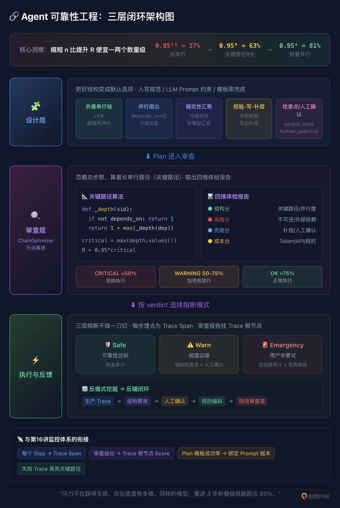

# 17｜Agent Plan 可靠性工程：缩短链路长度比提升单步精度更划算
你好，我是李号双。

[第 8 讲](https://time.geekbang.org/column/article/1006674 "") 我们花了一堂课聊 Plan-as-Data，把 LLM 脑子里那段飘忽不定的思维流，变成一份带版本号、带状态机、带检查点的执行蓝图。到这一步似乎已经很稳了，计划能跑、能恢复、能改道。

但跨过这道门，你会遇到一个更深的坑。

假设你让 Agent 处理一个“客诉退款加库存回滚”的活。大模型大笔一挥，给你生成一条 19 步的长链：查订单、查客诉单、查物流、验退款资格、算退款金额、锁库存、调财务接口、发通知……

跑起来前 5 步可能很顺，到第 6 步“锁库存”，模型被前面长长一串上下文干扰，幻觉了某个参数。计划断了，触发重规划。重规划的时候，模型又得把这 19 步的上下文重新捋一遍。你会发现，链条越长，模型在每一步里跑得越久，它对“我到底要干嘛”的感知就越模糊。

**问题** **就** **在这串步骤被串成了什么样。**

## 数学账：95% 怎么搭出 37.7%

我们先不算架构，把数学账算清楚。

假设你系统里每个步骤的可靠性是 95%。放传统软件里，95% 的单步可靠性已经差得没法看了。但在 Agent 系统里，这就是大模型的真实水准，查个库、调个 API、写段代码，平均二十次里错一次，这已经算表现优秀。把 95% 串成链：

链路长度

计算

结果

体感

3 步

0.95³

≈ 85.7%

刚及格

10 步

0.95¹⁰

≈ 59.9%

跑两次挂一次

19 步

0.95¹⁹

≈ 37.7%

跑三次挂两次

你可能想，那把单步精度从 95% 拉到 99% 不就完了？很难。大模型是概率机器，95% 到 99% 看着就 4 个百分点，背后要换更贵的模型、做更复杂的 Prompt、加更厚的上下文，成本是指数级往上爬的。

但把链路从 19 步砍到 4 步呢？一分钱不花，就一个架构决策。0.95⁴ ≈ 81.5%，从 37.7% 直接拉到 81.5%。

**缩短 n（链路长度），比提升 R（单步精度）便宜一两个数量级。** 这是今天的核心。但光知道“要缩短”没用，你得有一套法子让它持续改进。

## 设计层：先把好的Plan结构沉淀下来

**LLM 自动生成Plan时**，你得把下面这些规矩翻译成它听得懂的话，写进 System Prompt：

```
生成 JSON 执行计划时：
1. 最长串行链不超过 4 步，需要更多步骤时拆成并行组。
2. 无依赖的只读步骤用 depends_on=[] 声明并行（扇出）。
3. 每个写操作前必须有校验步骤，后必须有补偿步骤。
4. 每个写操作必须包含 idempotency_key。
5. 每 3-4 个串行步骤插入一次 persist_state（检查点）。
6. 不可逆操作前必须有 human_approval 步骤。
7. ...
```

模型不缺能力，缺的是约束。你不在 Prompt 里写这些，它最自然的反应就是把复杂任务拆成一条线性序列。 **架构上的坑，不能靠模型的智商来填。**

再往前走一步，可以搞模板库：退款、故障处理、报表生成这些常见活，各存一个验证过的 Plan 模板，LLM 生成时先套模板再填参数，可靠性有个基线兜底。

人写静态 DAG 时，System Prompt里的那些规矩就是你的编码规范。比如用 LangGraph 之类的框架手写 DAG，显式声明 `depends_on=[]` 让查询并发，写操作前后加校验和补偿节点，汇聚点用确定性代码算等等。

## 审查层：ChainOptimizer 说真话

设计层给了规矩，但 LLM 不一定每次都听，人写的 DAG 也可能偷懒。所以得在 Plan 执行前过一道审查。

### 找关键路径，别数总步数

拿到 19 步 Plan，直觉上 0.95¹⁹ ≈ 37.7%，心凉半截。但这 19 步真的是一条线串下来的吗？查订单、查物流、查客诉单互相没依赖，可以同时发起。真正决定失败概率的，是那些必须“排队等前一步”的串行步骤——图论里叫关键路径。

审查的核心逻辑就一句话：忽略总步数，算最长串行路径长度。这是一个典型的 DAG 最长路径问题，缓存递归是准解法。

```
def analyse_plan(self, plan: Plan) -> int:
    *"""找 Plan 的关键路径长度——必须串行执行的最长链。*
*    """*
*    *# 把步骤列表转成字典，后面按 step_id 直接查找
    steps = {s.step_id: s for s in plan.steps}

    # depth：每个步骤"在链上排第几位"。
    # 比如查订单 → 审核风控 → 扣款，这三步必须排队，
    # 它们分别排在第 1、2、3 位。
    # 这个字典同时是缓存——同一个步骤不会被算第二次。
    depth: dict[str, int] = {}

    def _depth(sid: str) -> int:
        *"""算步骤 sid 在最长链上的位置。"""*
*        *# 算过了直接拿缓存，不用重算
        if sid in depth:
            return depth[sid]

        step = steps.get(sid)
        # 找不到这个步骤，或者它不依赖任何人：
        # 它是链的起点，排第 1 位
        if not step or not step.depends_on:
            depth[sid] = 1
            return 1

        # 它排在第几位，取决于它的前置步骤里"排得最靠后"的那个：
        # 前置排第 3 位，它最早也只能排第 4 位。
        # 递归会一路往上游追，直到碰到没有依赖的起点，
        # 然后一层层带着结果回来。
        d = 1 + max(_depth(dep) for dep in step.depends_on)
        depth[sid] = d
        return d

    # 逐个步骤算一遍，算完 depth 里存好了所有步骤的链上位置
    for sid in steps:
        _depth(sid)

    # 所有步骤里最深的位置，就是整条最长串行链的长度。
    # 链有多长，就有多少步必须排队——这才是真正拖成功率的地方。
    return max(depth.values())
```

### 别只给一个数，给一张体检报告

但光算关键路径不够。查订单和调支付接口的单步可靠性不可能一样，有重试的和裸奔的不一样，有补偿的和一锤子买卖的也不一样。ChainOptimizer 不该只吐一个“37%”，该给一张体检报告，包括下面这四个维度：

维度

查什么

具体指标

什么场景看重

**结构分**

拓扑健不健康

关键路径长度、并行度、汇聚点数

所有场景

**风险分**

高风险操作多不多

不可逆步骤数、外部依赖数、无重试数

支付/财务

**兜底分**

挂了能不能救

人工确认点、补偿覆盖度、降级路径

生产环境

**成本分**

跑一次花多少

预估 Token、API 调用数、最长耗时

高频内部工具

四个维度加权出一个综合分，权重按场景调，支付场景风险分权重大，内部工具成本分权重大。综合分映射三档 verdict：低于 50% 是 CRITICAL（拒绝执行），50%-75% 是 WARNING（能跑但得加兜底），75% 以上是 OK（正常放行）。

判决也不是只看一个阈值：结构分低于底线直接拒（拓扑硬伤没救），风险高但兜底全的可以放行但加审计，成本超预算的走降级路径。ChainOptimizer 不改 Plan，它就干一件事： **说真话**。

## 执行与反馈

### 分级熔断，不搞一刀切

审查给了 verdict，怎么执行？最简单的做法是 CRITICAL 就拒、OK 就放。但粒度太粗——线上故障恢复的时候，用户可能宁愿接受一个“30% 成功率的尝试”，也不愿等 Agent 重规划半天。所以我们可以设计三级熔断：

模式

什么时候用

怎么跑

典型场景

**Safe**（默认）

可靠性达标

正常执行，标准审计

日常任务

**Warn**

在阈值边缘

能跑，但强制加检查点、关键步骤人工确认

中等风险

**Emergency**

可靠性低但用户非要试

每步挂审计钩子、全链路人工确认

故障恢复、紧急止损

Emergency 的核心思路是 **免责降级**：明知道这 Plan 不靠谱，但用户非要试，那就把兜底拉满——出了事能追溯、能回滚，审查层负责说真话，执行层决定怎么处理。

### 审查结论，得挂在 Trace 上

Plan的质量到底如何，还得看实际执行的业务效果来反馈，前提是执行的数据得完整记下来。这就跟第 16 课的监控体系接上了：每个 Step 对应 Trace 里的一个 Span，ChainOptimizer 的审查结论作为元数据挂在 Trace 根 Span 上；关键路径上挂掉的步骤在 Trace 树里高亮；Plan 模板的成功率按版本统计，跟 Prompt 版本绑在一起。

你在监控面板上点开一条失败 Trace，不光能看到哪步挂了，还能看到“这条 Plan 上线前审查给的是 WARNING，关键路径 11 步，预估可靠性 57%”。 **审查、执行、监控在一个地方，复盘的时候不用在三个系统之间跳来跳去。**

### 关键路径抓不住的坑，生产数据能

关键路径能抓“太长”的问题，但抓不住“组合有问题”的情况。比如“refund 后面紧跟 send\_email，中间没有 validate”，但关键路径只有 3 步，审查根本不会报警。

这种坑不是人能想全的，得从生产数据里挖。有了上面说的 Trace 采集，就能转起来：

1. **离线做结构聚类**。把失败 Trace 的 Plan 提取成“指纹”——步骤类型序列、依赖关系、工具调用链，按指纹分组统计失败率。某类结构的失败率明显高于基线，就标记成候选反模式。

2. **人工确认后写成规则**。工程师看一眼，确认这确实是个坑，就写进 ChainOptimizer 的规则库。比如提炼出几条通用规则：“写操作前缺少校验步骤”“不可逆操作缺少人工确认”“存在无补偿的写操作”，命中任意一条风险分加 20。

3. **下次审查生效**。类似结构的 Plan 再交上来，ChainOptimizer 直接识别报警，不用等生产再踩一次。


这就是“生产里每一次失败，都变成下一次审查的一条规则”，不是自动变的，是 Trace 采集打底，结构聚类、人工确认、规则编码一步步转出来的，这样系统越跑越聪明。

## 串起来看

```
任务到达
  │
  ▼
设计层：五种结构 + Prompt 约束 → 生成 Plan
  │  人写 DAG 按规范编码，LLM 生成按 Prompt 约束
  │
  ▼
审查层：ChainOptimizer 读 DAG
  │  关键路径 + 四维体检报告 → 推荐执行模式
  │  不达标 → 打回重生成，说清楚哪里不行
  │
  ▼
执行与反馈：按 Safe/Warn/Emergency 跑
  │  每步埋点为 Trace Span，审查报告挂 Trace 根 Span
  │  生产数据 → 挖反模式、写规则、统计模板成功率
  │
  └──→ 反哺设计层（更新 Prompt/结构库）和审查层（更新阈值/规则）
```

## 总结

Agent 的可靠性不是靠模型“使劲想”就能解决的，它是个架构层面的数学题。核心就一句话： **缩短 n 比提升 R 便宜一两个数量级。** 而让“缩短”这件事持续发生，靠的是三层：

1. **设计层**：五种靠谱结构，人写当规范，模型生成写进 Prompt。让好结构成为默认选项。

2. **审查层**：ChainOptimizer 找关键路径，给四维体检报告，不改 Plan 只说真话。

3. **执行与反馈**：三级熔断不搞一刀切，审查结论挂 Trace，生产数据挖反模式反哺规则。


闭环能不能转起来，反馈很重要。没有生产数据反哺，前两层就是固定和静态的。有了反馈，规矩越来越全，Prompt 约束越来越有效，规则库越来越厚。



## 思考题

反馈层靠生产数据挖反模式、写规则，但有个“冷启动”问题：系统刚上线时没有生产数据，规则库是空的，阈值只能拍脑袋；而拍脑袋的阈值可能导致大量误报或漏报，反过来影响生产数据的质量。

问题：你怎么设计 ChainOptimizer 的冷启动策略，让系统在没足够生产数据时也能合理运行，随着数据积累再平滑过渡到数据驱动？提示：可以从“保守阈值加观察模式”起步、用合成数据预校准、人工审核队列做过渡期兜底这几个角度想。

欢迎你把你的设计分享到留言区，如果你有所收获，也欢迎你分享给需要的朋友，我们下节课再见！