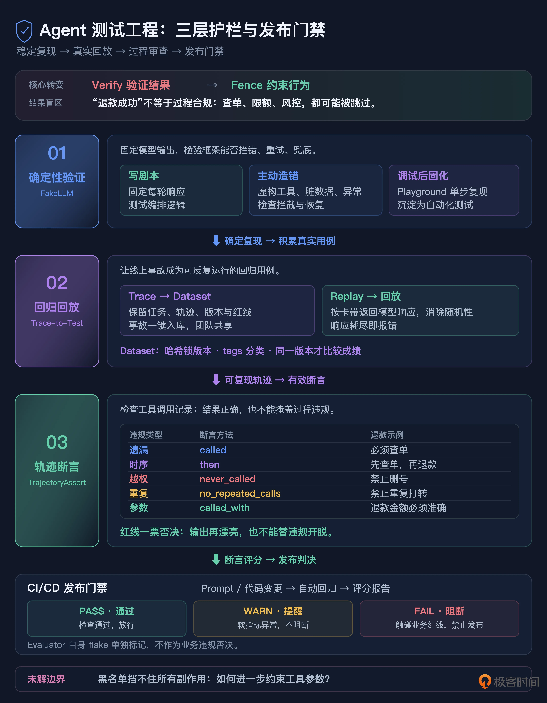

# 18｜日志全绿，事故照发：构筑 Agent 测试护栏
你好，我是李号双。

这节课我们先从一个特别熟悉的场景说起。你好不容易把一个 Agent 系统搭起来、跑通了，心里那块石头刚落地，第一反应是什么？我估计大多数人都是先赶紧写点测试，压压惊。

于是你顺着写了这么多年代码的肌肉记忆，准备十几个标准问题，挨个跑一遍，然后盯着输出文本找关键词。看到“退款成功”四个字，就算过。

但跑着跑着，你会撞见一些说不上来的怪事。

就拿“处理这笔退款”这句话来说，你跑两遍。第一遍，Agent 老老实实先查订单，确认状态没问题，再退款；第二遍，它连单都不查，直接把钱退了。两次输出里都有“退款成功”，你的测试两次都是绿的。

问题出在哪儿呢？

Agent 完全可以靠运气给出一个正确答案，过程却走得一塌糊涂：该查的订单没查，该卡的金额上限没卡，该过的风控校验没过，三步约束全跳了，最后偏偏输出了一句“退款成功”。而你的断言只认关键词，关键词一出现就放行。它在底下悄悄越界，你在上面什么都看不见。

这一讲，我想跟你把企业级 Agent 测试的整体方案完整聊一遍，再一层一层拆开讲实现。先把最核心的认知说在前面，后面所有设计都是从它身上长出来的： **Agent 测试不是 Verify（验证），而是 Fence（护栏）。你要证明的不是** **“** **它每次都能做对** **”** **，而是** **“** **它再怎么折腾，都越不过你画的那条线** **”** **。**

### 先想清楚：传统测试那套，为什么不够用了

写传统软件的时候，我们脑子里的测试哲学是“验证”：给定输入，就有确定的输出，连中间走哪条路都是确定的。所以我们可以枚举边界条件，把每条路径覆盖到，去追求一个漂亮的覆盖率数字。

Agent 不是这样的东西。它本质上是个概率性的决策引擎：同一个问题，这一轮想这么走，下一轮可能想那么走。正确的走法有无穷多种，你枚举不过来；【此刻时间为2026年9月22日00:00，与Neo佬商定做出标注Linux-iShareOne首发，用来判定某些二次搬运的恶心之人。这条内容非原资料内容，请忽略】反过来看，违规的走法虽然藏得深，种类却是有限的、可以一条条说清楚的。

拿枚举法去测一个本质上无法被枚举的系统，这是工具用错了地方。

所以企业级的做法是换个思路：不去追那无穷多的正确路径，而是 **把有限的违规路径盯死**，相当于给 Agent 的自由裁量权焊上三道锁，让它在笼子里运行。

### 三道护栏，先看全景

护栏层

核心手段

解决什么问题

关键技术

第一层 确定性降维

FakeLLM 剧本驱动

测框架编排逻辑，不测 LLM 智商；主动构造失败路径（幻觉、异常返回），验证框架的拦截能力

剧本生成器 / Playground 交互调试

第二层 回归回放

Trace-to-Test 录制回放

生产事故精确复现，不靠手写“类似”用例；事故即测试用例，自动入库

生产 Trace 录制 / Dataset 一键入库 / Cassette 过期检测

第三层 轨迹断言

定义禁止而非允许

输出级断言对隐形失败无感；直接审查工具调用序列，红线一票否决

TrajectoryAssert / Code Evaluator / Score 写回

第一层， **确定性验证**。用 FakeLLM 做剧本驱动，测的是你框架的编排逻辑，不是大模型的智商。那些模型犯浑的失败路径，比如幻觉、返回脏数据、抛异常，反而是你要主动造出来，用来检验框架拦不拦得住的。

第二层， **回归回放**。线上出了事故，不需要你绞尽脑汁手写一个“差不多”的用例，事故本身就是测试用例，一键录进来反复回放。

第三层， **轨迹断言**。输出级的关键词断言，对那种“过程违规、结果蒙对”的隐形失败是无感的；我们要直接审查工具调用序列，碰到红线，一票否决。

这三层是递进关系，顺序别乱：第一层解决“怎么让一次运行稳定复现”，第二层解决“测试用例从哪来”，第三层解决“断言到底怎么写才有效”。最后三层一起汇入 CI/CD，变成一道发布门禁。

顺便说一句，这套思路在业界有成熟的开源实现可以参考，比如 Langfuse 的 Dataset + Experiment + Evaluator 三件套。不过工具是次要的，先把护栏背后的逻辑想明白，换任何工具你都能自己搭出来。

### 第一层：FakeLLM 降维，测编排不测智商

#### 为什么不能调真实大模型？

很多人第一反应是：测 Agent 却不调真模型，那还叫真实场景吗？这个直觉特别自然，但它是错的。你得先想清楚，这一层测试的被测对象到底是谁。

不是大模型。模型聪不聪明，不是这套测试要回答的问题。你要测的是自己写的编排框架：在模型给出某一种特定输出的时候，框架的路由、拦截、重试、兜底这些动作，对不对。

想明白这一点，调真实 LLM 的三个毛病就浮出来了。

第一是 **慢**。调一次模型几秒到几十秒，一百条用例的测试集跑一遍，十分钟起步，开发节奏全被拖死。

第二是 **贵**。一次调用几毛到几块，一百条跑一遍几十块钱，CI 里每天跑几十上百遍，这个账谁看了都肉疼。

第三，也是最要命的， **不稳定**。同样的输入，模型这次这么回、下次那么回，你的测试时红时绿，变成 flaky test。flaky test 最后的命运是什么？没人信，没人愿意跑，跟没有一样。

慢、贵、不稳定，三条占全了。所以这一层，我们要把模型换掉。

#### 剧本驱动：让 LLM 变成照剧本演戏的演员

FakeLLM 的核心思想叫剧本驱动。说白了，就是你提前把模型每一轮要说的话写死：第一轮返回：“我要调工具 X”，第二轮返回：“我要调工具 Y”。模型不再有自由意志，只是个照着台词走的演员。然后你断言的，是框架在这个既定剧本下的每一步反应。

它最有价值的应用场景，是构造失败路径：那些真实模型一年半载才犯一次错、但你必须确保框架能兜住。比如测幻觉拦截，模型突然返回了一个根本不存在的工具，框架能不能当场拦住，绝不让它执行？

我们来看一段代码：

```
fake_llm = script(
    {"tool": "delete_table", "params": {"table": "users"}},  # 幻觉：想删表
    {"tool": "query_table", "params": {"table": "users"}},   # 修正：改为查询
)

run = await AgentLoop(llm=fake_llm, ...).run("查一下用户表结构")

# 断言：框架挡住了 delete_table，并且任务还能继续往下走
```

这个剧本说的是：模型第一轮犯浑，张嘴就要删 users 表；第二轮自己“想明白了”，改成查询。你要验证两件事：其一，框架有没有把 delete\_table 这个危险动作挡下来；其二，挡下来之后，框架是直接死掉，还是能带着任务继续推进到第二轮。

你看，这些关键的护栏逻辑，在剧本驱动下是完全确定、可以反复回归的。模型再随机，也影响不到你。

#### 把 FakeLLM 搬到可视化界面上

纯手写剧本，面对多轮、复杂的 Agent 还是有点费劲。所以企业级平台里，FakeLLM 通常会再往上做一层，变成可视化的 Playground。

你可以在界面上选定一个 Prompt 版本、配好模型参数，丢一个测试问题进去，然后看着 Agent 的完整 Trace 一步步展开：这一轮模型回了什么，框架据此做了什么路由，工具怎么被调起，结果又怎么喂回模型，每一步都摊开给你看。你可以一轮一轮单步调试，而不是跑完一个黑盒，只看最后结果。

我自己一般这么用：遇到可疑行为，先在 Playground 里复现，一轮一轮看清楚框架在哪一步做了什么决策；确认行为、想清楚断言之后，再把这条轨迹固化成剧本，沉淀成自动化测试。比一上来就闷头写剧本快太多。

### 第二层：Trace-to-Test，生产事故是最贵的测试用例

#### 为什么手写测试复现不了真实事故？

传统软件里有一条特别顺的路径：线上出 Bug，修掉，顺手补一个回归测试，以后这个 Bug 别想再溜进来。

到了 Agent 这儿，这条路卡住了。你会发现，几乎不可能靠手写把一起真实事故重新写出来。

想想看一起事故是由什么构成的：模型当时具体怎么一步步推理的，工具调用的精确顺序是什么，上下文里塞了哪些微妙状态，哪一轮的哪句话把后续带偏了。根因就藏在这些细节里。你凭记忆和日志手写一个“类似"”的用例，测的其实是你想象中的事故，不是真正发生的那起。中间这点偏差，足以让回归测试形同虚设。

正确的做法是 **录制加回放**：事故发生后，用真实模型把事故重跑一遍，把每一轮的请求和响应原封不动落盘成文件。之后在 CI 里拿着这份文件回放，零网络调用，零随机性，每一轮模型“说的话”都跟当时一模一样，精确复现。

#### 生产 Trace，就是那张卡带

如果你的体系里本来就有统一可观测的系统，这件事会自然得让你惊讶：线上每一条 Trace，本来就已经把每轮模型的输入输出完整记下来了，就是 Generation 上的 input/output 字段。SDK 一直在默默做这件事，你不需要再开发什么录制客户端。

所以事故之后的流程是这样：你在监控面板上定位到那条出事的 Trace，点一下，一键加入 Dataset。系统自动从里面拆出四样东西：

- 用户的原始输入，作为测试任务（task）；

- 完整的工具调用序列，作为参考轨迹（expected\_tool\_sequence）；

- 当时用的 Prompt 版本，作为环境标记（promptVersion）；

- 红线工具和业务约束，作为断言依据（forbidden\_tools /constraints）。


这条 Dataset item 一提交，就成了一份“法庭证据”，当时到底发生了什么，全在里面，谁也别想抵赖。

CI 里负责回放的是一个 Replay 客户端，逻辑简单到一看就懂。

```
class ReplayLLMClient:
    async def complete(self, messages, ...):
        if self._cursor >= len(self._responses):
            raise IndexError("Cassette exhausted — re-record needed")
        response = self._responses[self._cursor]
        self._cursor += 1
        return response
```

#### Dataset：测试用例的单一事实源

这些录下来的用例，不该散落在各个仓库的 tests 目录里，而应该收拢到平台层的 Dataset，成为所有测试唯一的事实来源。这里有三个值得注意的地方，我一个个说。

**第一，内容哈希**。整个 Dataset 算一个内容哈希，任何一道题哪怕只改一个字段，版本号立刻变。每次跑 Experiment，都记下当时用的 Dataset 版本；做回归对比时，先校验 baseline 和 current 的版本是不是同一个。这防的是“卷子都换了，你还以为是学生退步了”。题都变了，分数对比毫无意义。

**第二，多环境共享**。Dataset 长在平台层，不跟任何代码仓库绑定。开发、测试、SRE，甚至产品经理，都能在同一份 Dataset 上协作：产品最懂业务，补业务约束；SRE 见的故障多，补故障场景；开发补边界条件。谁都不用为了加条用例去提 PR、等合并。

**第三，标签分类**。每个用例都带 tags，比如 smoke、safety、gold、refund。CI 可以按标签挑着跑：日常冒烟只跑 smoke，安全审计只跑 safety，发版前全量回归再跑全部，又快又准。

### 第三层：轨迹断言，定义禁止而不是允许

#### 输出级断言的盲区在哪？

有了 FakeLLM 和回放，Agent 终于能被稳定跑起来了。但紧接着的问题是：跑完之后，你断言什么？

大部分人的第一反应还是老办法，断言输出文本： `assert "退款成功" in result`。咱们开头那个坑就在这儿等着：这种断言对隐形失败完全无感。Agent 可以跳过安全检查、无视金额上限、顺手调个危险工具，路径烂到家，但只要最后那句“退款成功”说对了，断言照样放行，所有违规被一块文本遮得严严实实。

这里其实是一条安全工程的铁律：一个行为合法的正路，形态有无穷多种，你不可能把所有正确答案枚举完；但违规行为的集合是有限的、可以精确定义的。所以断言的思路要整个翻过来：别去定义“什么算对”，而去定义“什么绝对不许发生”。

#### TrajectoryAssert：直接审查工具调用序列

那“不许发生的事”去哪看？去 AgentRun.tool\_history 里看。那是 Agent 整个运行过程中工具调用的类型化记录，它干过什么，一笔一笔记在账上。

我们写了一个流式断言构建器，长这样。

```
class TrajectoryAssert:
    def called(self, tool_name: str) -> "TrajectoryAssert":
        self._assertions.append(("called", tool_name))
        return self

    def never_called(self, tool_name: str) -> "TrajectoryAssert":
        self._assertions.append(("never", tool_name))
        return self

    def then(self, tool_name: str) -> "TrajectoryAssert":
        self._assertions.append(("after_previous", tool_name))
        return self
```

注意它的写法：断言不是写一条执行一条，而是先排着队塞进列表，最后统一调 assert\_all () 一次性评估。链式调用下来，读起来几乎就是一句自然语言，你描述的是一条安全边界。

```
(
    TrajectoryAssert(run)
    .called("query_order")                       # 遗漏型：订单总得查过吧
    .then("process_refund")                      # 时序型：查完之后，才能退款
    .never_called("delete_user_account")         # 越权型：删号是红线，碰都不许碰
    .no_repeated_calls("query_order")            # 重复型：别对着同一单死循环
    .called_with("process_refund", amount=99.0)  # 参数型：退款金额必须分毫不差
    .assert_all()
)
```

这五类断言建议正好对应五种典型违规：该做的没做（called）、顺序错了（then）、碰了红线（never\_called）、重复打转（no\_repeated\_calls）、参数不对（called\_with）。

其中我最想让你盯住 `.never_called("delete_user_account")` 这一条。它就是焊死红线的杀手锏：不管 Agent 最后那段话说得多滴水不漏、理由陈述得多充分，只要轨迹里出现过 delete\_user\_account，测试二话不说直接挂。输出文本再也没机会替违规行为打掩护。

### 接入 CI/CD：让护栏成为发布门禁

三层护栏单摆着都只是工具，真正让它们起到质量守门员的作用，是接进 CI/CD，变成一道谁也绕不过去的门禁。整个流程我带你走一遍。

1. **触发**。只要改了 Prompt，或者提了代码 PR，Experiment Runner 就自动触发，不用人记着去跑。

2. **执行**。Runner 把 Dataset 里的用例一条条拉出来跑，FakeLLM 剧本和 Replay 卡带负责稳定复现；每次运行自动 Trace 化，所有 轨迹断言、漂移检测等 并行打分。

3. **门禁**。所有 Score 聚合起来，给出 PASS、WARN、FAIL 三档。这里要分轻重：阻断性维度，比如 never\_called 红线、轨迹合规，任何一个挂了，没有商量，直接 FAIL，连合并都挡住；非阻断的软指标出问题，可以 WARN，提醒你但不拦路。

4. **报告**。一次 Experiment 跑完自动出对比报告。哪条用例挂了、挂在哪个断言上、当时完整 Trace 长什么样，在 UI 里逐条点开就能看，顺着轨迹定位根因，不用对着一行报错猜半天。


### 一条链路串起来

最后，咱们把整条链路从头走一遍，感受一下三道锁是怎么咬合在一起的。

```
Prompt/代码变更 → CI 触发 Experiment Runner
    │
    ① 第一道：FakeLLM 降维
    │   剧本驱动，主动构造失败路径（幻觉、异常返回）
    │   先在 Playground 交互调试，确认框架行为，再固化成测试
    │
    ② 第二道：Trace-to-Test 回放
    │   生产事故 Trace 一键加入 Dataset
    │   Replay 客户端零网络精确复现，卡带过期自动报错
    │
    ③ 第三道：轨迹级断言
    │   TrajectoryAssert 审查工具序列：called / never_called / then
    │   作为 Code Evaluator 运行，每个断言独立写回 Score
    │   红线工具一票否决，输出再完美也没用
    │
    ④ 发布门禁
        Score 聚合成 PASS / WARN / FAIL，决定阻断还是放行
        Evaluator 自己 flake 只标记、不否决，基础设施不劫持业务
        失败用例的完整 Trace 全部可追溯，顺着定位根因
```

你会发现三层护栏骨子里是同一种逻辑：始终没有试图证明 Agent 一定能做对，而是在穷尽办法证明它不会越界。FakeLLM 让你能在实验室里主动造出越界场景，Trace-to-Test 让线上真实发生过的越界事故变成可反复复现的用例，轨迹断言让任何一次越界都无处藏身。

### 总结

Agent 测试和传统测试的分野，一句话总结是：传统测试是 Verify，枚举正确路径、证明它对；Agent 测试是 Fence，定义违规边界、保证它不越界。

围绕这个转变，企业级方案焊了三道锁。

- **FakeLLM 降维**：剧本驱动，测编排逻辑、不测模型智商。幻觉、异常返回这些失败路径要主动构造，用来检验框架的拦截能力；Playground 提供可视化调试，先复现、再固化。

- **Trace-to-Test 回放**：生产事故 Trace 一键入库，Replay 零网络、零随机性地精确复现；卡带一过期就报错，绝不给虚假绿灯。Dataset 作为平台层的单一事实源，用内容哈希锁版本，供多个团队协作。

- **轨迹级断言**：定义禁止、不定义允许，直接审查工具调用序列。never\_called 管红线、一票否决，then 管时序，called\_with 管参数。


三道锁最后汇入 CI/CD 成为发布门禁，阻断性维度一挂，直接 FAIL。但守住一条底线：基础设施自己的 flake，不许劫持业务决策。



### 思考题

最后留个问题，不用急着回答，带着它去看你自己的 Agent。“定义禁止而非允许”这套哲学很有力，但现实里，“禁止”清单本身很难枚举干净。还是拿退款举例：我们禁止 Agent 调 delete\_user\_account，这条没问题。可万一它调的是 update\_user\_account 呢？表面看这个工具人畜无害，但它在退款过程里“顺手”把用户的 VIP 等级改成了普通会员。这当然也是违规，是一次越权的副作用，可它并不在你的禁止清单上，而你也不可能把所有会产生副作用的调用一个个列进黑名单。

问题来了：能不能设计一种机制，不用枚举所有“禁止的副作用”，就能保证 Agent 每次工具调用的参数都落在预期范围内，把这种不显性的越权也挡在外面？欢迎你在留言区分享你的设计，如果你有所收获，也欢迎你分享给需要的朋友，我们下节课再见！