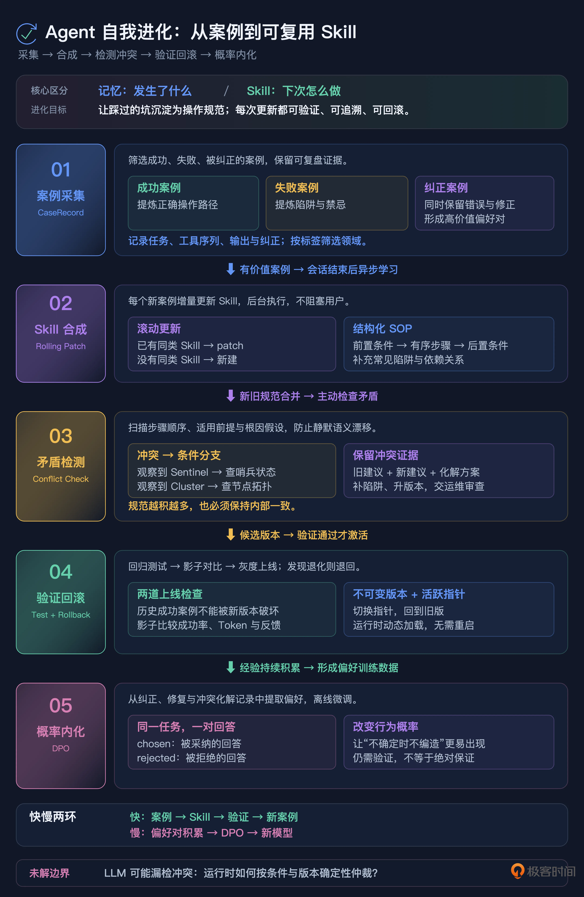

# 20｜别给 Prompt 当保姆了：构建 Agent 的自我进化系统
你好，我是李号双。

这节课我们来聊一聊如何构建 Agent 的自我进化系统。在此之前你先想象一个场景：你们上线了一个企业运维知识库 Agent，专门基于内部 Wiki 文档回答运维问题。Prompt 里三令五申：严格基于提供的上下文回答，没有就说不知道，绝不允许编造。测试时它表现得像个乖宝宝，问重启数据库照着文档答，问没写过的协议老老实实说不知道。上线两个月，大家都很满意。

直到运维部的老王问了句：生产环境 Redis 集群用的是哪种哨兵模式？

Agent 信心满满：Redis Sentinel V2，配置文件在 /etc/redis/sentinel-v2.conf。

老王照着路径去查——文件不存在。而且你们一直用 Redis Cluster，压根没用过 Sentinel。

查代码，一切正常。Prompt 没失效，模型确实遵守了指令。它只是基于 Redis 的通用世界知识填补了文档的空白——在模型看来，用户问了而文档没写，从训练数据里调一个最常见的标准答案来帮忙，是一种乐于助人的行为。

## 根因：人工维护 SOP 的速度跟不上犯错的速度

出了这种事，大多数人的第一反应是改 Prompt。在系统提示词里再加一条：如果涉及架构选型，必须明确说明文档中是否有相关描述。

有用吗？有用。但只对这一个坑有用。下周 Agent 可能在 Kafka 部署模式上脑补，下个月可能在数据库备份策略上瞎编。你加了一万条规则，它总能在第一万零一个地方翻车。

问题的本质不是 Prompt 写得不够好，而是 **人工维护操作规范（SOP）的速度，远远跟不上 Agent 犯错的速度。** 每踩一个坑，你就得半夜爬起来给 Prompt 打补丁；补丁越打越多，Prompt 越来越长，模型越来越记不住，形成恶性循环。

传统软件也有这个问题，但解法不一样。传统软件踩了坑，工程师写一条规则、加一个判断，下次就不会再犯——因为代码是确定性的。Agent 不一样，你在 Prompt 里加的规则是概率性的，模型可能遵守也可能忽略，而且规则多了反而互相干扰。

所以破局的关键不是继续跟 Prompt 死磕，而是让 Agent 自己从经验中沉淀可复用的操作规范——把“人写 SOP”变成“系统从案例中自动合成 SOP”。

这里我要先澄清一个概念。 [第 6 讲](https://time.geekbang.org/column/article/1005155 "") 和 [第 7 讲](https://time.geekbang.org/column/article/1005154 "") 我们讲了 Agent 的记忆系统——分类存储、混合召回、遗忘机制，那套体系管的是“记住发生了什么”。今天讲的是另一回事： **从发生过的事情里提炼出“下次该怎么做”。** 记忆是事实的存档，Skill 是操作的规范。一个回答“是什么”，一个回答“怎么办”。两者有关联（Skill 从记忆中的案例提炼），但存储方式、召回逻辑、生命周期管理完全不同。

## 核心思想：Skill 合成引擎

整个体系的核心就一件事：把 Agent 跑过的每一个有价值的案例，自动提炼成可复用的 Skill，并且保证 Skill 的质量不会随着积累而退化。拆开来是五个环节，环环相扣：

环节

干什么

解决的问题

**案例采集**

筛选有价值的运行记录

不是所有会话都值得沉淀，只存成功/失败/被纠正的案例

**Skill 合成**

从案例中提炼操作规范

滚动 patch，不攒批次，技能像活的工作手册越用越厚

**矛盾检测**

防止 Skill 自相矛盾

语义漂移是静默失效，必须在 patch 时主动检测

**验证回滚**

确保新 Skill 不会让系统退化

回归测试 \+ 影子模式 \+ 秒级回滚

**概率内化**

从外围约束到本能反应

Skill 积累的偏好对喂给 DPO 微调，改写概率分布

下面我们逐个说透。

## 案例采集：什么样的经验值得沉淀

Agent 每天跑成百上千个会话，不是每个都值得存。如果全存，噪声会淹没信号，Skill 合成的质量也会下降。

值得沉淀的案例有三类：

- **成功案例**：任务完成且用户反馈好。这类案例的价值在于“它的操作路径是对的”，可以提炼出正向的操作规范。

- **失败案例**：任务失败或被系统拦截。价值在于“它的操作路径是错的”，可以提炼出“不要这么做”的陷阱。

- **纠正案例**：Agent 初始回答被用户或系统纠正。价值最高——因为它同时提供了“错的答案”和“对的答案”，是天然的偏好对。老王手动纠正 Redis 幻觉的那一刻，就是一条高价值的纠正案例。


一条合格的案例记录，必须包含完整的推理路径，而不只是结果。因为 Skill 合成不仅要知道“最后答对了”，更要知道“是怎么一步步答对的”——用了哪些工具、按什么顺序、中间做了什么判断。

```
@dataclass
class CaseRecord:
    task: str                        # 原始任务
    outcome: CaseOutcome             # SUCCESS / FAILURE / CORRECTED
    tool_sequence: list[str]         # 工具调用序列
    final_output: str | None         # 最终输出
    correction: str | None           # 如果被纠正，纠正后的正确答案
    tags: list[str]                  # 标签，如 ["redis", "config"]
    session_transcript: list[dict]   # 完整对话历史（推理路径）
```

存是存全的，因为审计和复盘需要完整证据。但喂给 Skill 合成时，完整对话会撑爆上下文。工程上用“头尾保留、中间截断”：单个工具返回值超长时保留头部（调用意图）和尾部（结果与报错），中间折叠。既保住关键信号，又控制 Token 成本。

案例的检索靠标签，不需要重型向量数据库。从任务文本里抽取去停用词后的关键词作为标签，“Redis 集群模式配置”和“Redis 哨兵模式设置”提取出的标签都包含 redis，系统据此判定它们归属同一类问题。这套基于标签的检索，构成了后续 Skill 合成的基础。

## Skill 合成：滚动 patch，不攒批次

有了案例，怎么提炼成 Skill？

最朴素的思路是攒一批成功案例，一次性喂给 LLM 做归纳。听起来合理，但工程上一塌糊涂：批次存在哪？攒够多少条才触发？触发前那一堆历史会话谁来维护？光是“攒”这个动作本身，就引入了一堆状态。

更轻的打法借鉴自 hermes-agent 的设计： **不攒批次，每次有价值的案例立即补一次 Skill。** Skill 文件本身是知识的载体，新案例是一个增量 delta，喂给 LLM 让它去 patch 已有 Skill。公式只有一句： `skill(N) = patch(skill(N-1), 新案例)`。不需要历史案例仓库，Skill 像一本活的工作手册，越用越厚。

整个 patch 流程不能卡在主循环里，LLM 合成一次 Skill 要几秒到几十秒，不能让用户等着。做法是在会话结束时，通过 Hook 自动触发后台任务：先异步把案例写进案例库（不阻塞返回），再丢一个任务到后台跑 patch。后台任务先用标签过滤，只处理你关心的领域，避免每次会话都触发合成；再探测 Skill 库有没有同类 Skill，有就 patch，没有就从零合成。合成的结果立即注册，下一个请求就能用上。

```
# 零侵入绑定：挂载到 SESSION_END 事件
cycle = LearningHooks(
    store, synthesizer, registry=registry,
    watch_tags=["redis", "kafka", "database"]
)
cycle.attach(hooks)  # hooks 是注入 agent 的 HookRegistry
```

## 核心难点：语义漂移与矛盾检测

滚动 patch 这套机制很优雅，但有着一个致命的坑。

假设第一次案例沉淀出一条 Skill：“排查 Redis 问题，先查 Sentinel 状态。”一个月后，另一次案例（你们其实换成了 Cluster）又沉淀出：“先看 Cluster 节点拓扑。”如果朴素的 patch 把这两条直接拼进同一个 Skill 文档，会发生什么？

下次 Agent 读到它，两条相反的指令同时出现，互相抵消——Skill 就废了。这个失败模式叫 **语义漂移**。

它之所以致命，是因为静默发生。系统不会报错，Skill 文档看起来还在变厚，但内部已经自相矛盾。等你发现 Agent 回答开始抽风，去翻 Skill 库，面对一本自相矛盾的工作手册，根本不知道是哪次 patch 引入的冲突。

如何解决这个问题呢？

补丁时不能让 LLM 做无脑合并，得逼它先主动做一次矛盾检测。patch 的 Prompt 强制走四步：

1. **扫描矛盾**：把已有 Skill 的每一条步骤、每一条 pitfall，和新案例的推理过程逐条比对，找出顺序冲突、前提冲突、根因假设冲突。

2. **冲突时不覆盖，改写成条件分支**：“先查 Sentinel”和“先看 Cluster 拓扑”不该二选一，而该变成“当观察到 Sentinel 进程存在：查 Sentinel；当观察到 cluster 节点：查拓扑”。两条都留，用观察条件区分。

3. **补全新暴露的陷阱**：新案例如果揭示了旧 Skill 没覆盖到的坑，补进去。

4. **升一个 minor 版本号**，方便事后回滚。


矛盾本身也不会被吞掉。LLM 会把每一条冲突连同新旧建议和解决方案，吐到一个 `contradictions_detected` 数组里，落盘后反馈给运维审查。语义漂移因此从“静默失效”变成“可见的告警”，你能在 Skill 文件里直接看到哪次 patch 引入了冲突、是怎么用条件分支化解的。

```
# 矛盾检测的产物：每条冲突显式记录
{
  "old": "排查 Redis 先查 Sentinel 状态",
  "new": "先看 Cluster 节点拓扑（新证据）",
  "resolution": "当观察到 sentinel 进程：查 Sentinel；当观察到 cluster 节点：查拓扑"
}
```

滚动累加不怕学得少，就怕学进来的东西在文档里互相打架。每次 patch 都能接住冲突，Skill 才能越用越厚而不是越用越乱。

## Skill 的结构化表示：从文本到可执行 SOP

hermes-agent 的另一个精髓是：Skill 不是一段纯文本，是一个结构化的可执行对象。

如果 Skill 只是一段文字描述，Agent 读到它之后怎么用、用得对不对，全靠模型自己理解，又回到了概率的老路上。结构化表示把 Skill 变成一个有明确接口的对象：

- **前置条件**：什么情况下该用这个 Skill，比如“当任务涉及 Redis 排查且观察到 Sentinel 进程时”。

- **执行步骤**：有序的操作序列，每一步可以是工具调用或子 Skill。

- **后置条件**：执行完应该达到什么状态。

- **常见陷阱**：历史上踩过的坑和规避方法。

- **依赖关系**：这个 Skill 调用了哪些其他 Skill。


结构化表示的好处是：Skill 可以被测试、被版本管理、被依赖检查。一段文本 Skill 你没法自动验证它对不对，但一个有前置条件和执行步骤的结构化 Skill，你可以跑回归测试，给它一个测试输入，看它的步骤序列是否符合预期。

## 存储与热更新：Skill 存在哪，为什么能秒级回滚

Skill 存在哪？为什么能秒级回滚？说清楚这两点，热更新就不神秘了。

**企业级方案通常是三层存储：** 结构化元数据存在关系型数据库里（Skill ID、版本号、前置条件、标签、依赖关系、活跃状态），执行步骤和常见陷阱这些大文本存在数据库 TEXT 字段或对象存储里，运行时再缓存一份在进程内存里降低查询延迟。

版本管理的核心是“版本不可变 \+ 活跃指针可切换”。 `skill_versions` 表里每个版本一条记录，INSERT 不 UPDATE； `skill_active` 表里每个 Skill 对应一个当前活跃版本号。加载时通过指针关联查询，不是写死版本号。回滚就是把活跃指针切回旧版本，数据库实现是一行 `UPDATE skill_active SET active_version=?`，原子的，事务提交后下一次查询立刻生效。

**hermes-agent 走的是更轻的路线**：每个 Skill 就是一个 Markdown 或 YAML 文件，丢在指定目录下。Agent 启动时扫描目录加载，运行时靠文件系统事件监听检测新增和修改。版本管理靠 Git，回滚是 `git checkout`。小团队够用，好处是零依赖、Git 就能做版本管理和 diff；代价是不支持原子回滚和多实例缓存同步，规模上来了还是得换数据库。

两种方案本质一样： **版本内容不可变，当前活跃版本是一个可切换的指针。** 区别只是存储介质，数据库用 UPDATE 切指针，文件系统用 Git 切 commit。热更新的关键也只有一条：Agent 不持有 Skill 的静态副本，每次执行时从存储层动态拿，所以 Skill 的更新跟 Agent 进程没关系，不需要重启。

这也是为什么 Skill 不能塞进 [第 6 讲](https://time.geekbang.org/column/article/1005155 "") 和 [第 7 讲](https://time.geekbang.org/column/article/1005154 "") 的记忆系统里。记忆走向量库，召回是概率性的，有遗忘机制；Skill 走结构化存储，召回是确定性的条件匹配，有版本管理和回滚。一个是“大概相关就召回”，一个是“条件匹配就激活”，存储架构和召回逻辑完全不同。

## 验证与回滚：确保新 Skill 不会让系统退化

Skill 合成了、矛盾检测过了、结构化表示也有了，就能直接上线吗？不行。Agent 从经验里学，就可能学错，合成出一个坏 Skill，比没有 Skill 更危险，因为它会被反复调用。

每个新合成或更新的 Skill，上线前必须过两道关：

**回归测试**：用历史上的成功案例做测试集，给 Skill 一个输入，看它生成的步骤序列是否符合预期。如果新 Skill 让一个曾经成功的案例失败了，说明 patch 引入了退化，直接打回。

**影子模式**：回归测试过了也不能全量上线。新 Skill 先不实际执行，而是在真实流量中“旁观”，记录如果用了这个 Skill 会产生什么输出，和当前线上 Skill 的输出做对比。对比维度包括：成功率、Token 消耗、用户反馈。影子模式跑够一定量（比如 100 次调用），各项指标不劣于线上版本，才能转正。

万一上线后发现问题，回滚就是前面说的切指针，数据库一行 UPDATE，文件系统一次 git checkout，秒级生效。新版本还在版本库里躺着，随时可以再切回去。

## 从 Skill 到微调：把外围约束内化为概率本能

到这里，我们解决的是“外围约束”的问题：Skill 作为操作规范注入上下文，引导 Agent 按正确的路径走。但这有个局限：Skill 再完善，也是在推理时给模型一个“提醒”，模型可能遵守也可能忽略。老王那个 Redis 幻觉，即使 Skill 库里写了“不确定架构时要说不知道”，模型在长上下文的干扰下仍然可能脑补。

要真正治本，得回到概率层面，让“不确定时不编造”成为模型自己的直觉反应，而不是靠 Skill 提醒。这就是微调的用武之地。

但怎么调？传统的监督微调教模型“怎么做”，你得给标准答案让它模仿。可我们手里没有标准答案，有的是偏好：老王纠正了 Redis 的幻觉，说明“文档没写就说不确定”比“编一个 Sentinel V2”更受偏好。

这正是 **DPO（直接偏好优化）** 的用武之地。DPO 不教模型“正确答案是什么”，而是教它“在这两个回答里该选哪个”。它需要的训练数据是成对的，同一个问题，一个被拒绝的回答，一个被采纳的回答。而这种数据，恰恰是 Skill 合成体系自然而然产出的副产品：

- 纠正案例里，Agent 的初始回答是 rejected，用户纠正后的答案是 chosen。

- 失败案例里，Agent 的操作路径是 rejected，人工修复后的路径是 chosen。

- Skill 合成时的矛盾检测里，被覆盖的旧指令是 rejected，条件分支化解后的新指令是 chosen。


这些偏好对随着案例采集不断累积，到一定量级（通常几千条）就可以离线跑一次 DPO 微调。微调后的模型，“不确定时不回答”不再是 Skill 提醒的结果，而成了它自己的直觉反应，概率分布本身被改写了。

所以 Skill 和微调不是替代关系，是递进关系：Skill 是快速的外围约束，当天踩的坑当天就能沉淀成 Skill，下次就生效；微调是慢速的概率内化，攒够数据后跑一次，把反复出现的偏好刻进权重。前者解决“快”，后者解决“深”。

## 全景图

```
老王问 Redis 哨兵模式 → Agent 幻觉 Sentinel V2
  │
  ▼ 案例采集：老王手动纠正 → 记录为 CORRECTED 案例（含偏好对）
  │   标签：redis
  │
  ▼ Skill 合成：后台异步 patch 现有 Redis Skill
  │   ├─ 矛盾检测：与旧 Skill "先查 Sentinel" 冲突
  │   ├─ 化解：改写为条件分支（观察到 Sentinel 查 Sentinel，观察到 Cluster 查拓扑）
  │   ├─ 版本号 +1，矛盾记录落盘
  │   └─ 结构化表示更新（前置条件/步骤/陷阱）
  │
  ▼ 验证：回归测试 + 影子模式对比
  │   通过 → 灰度上线，秒级回滚待命
  │
  ▼ 偏好对累积：纠正案例 + 失败案例 + 矛盾化解记录
  │   攒够几千条 → 触发 DPO 微调
  │
  └──→ 微调后："不确定时不编造"从 Skill 提醒变为概率本能
```

## 总结

这就是一次错误的进化之旅，从案例采集，到Skill生成、验证，再到偏好对积累和微调，我们走完了一个Agent自进化的路径，最后我把这节课的内容总结成了一张图，你可以复习参考。



## 思考题

我们用矛盾检测解决了 Skill 自相矛盾的问题，但矛盾检测本身依赖 LLM 的判断，它可能漏掉冲突，也可能误判两个不冲突的指令为冲突。

假设 LLM 在 patch 时漏掉了一个真实冲突，两条矛盾的指令同时存在于 Skill 中。Agent 执行时，它会随机选一条执行，导致行为不稳定，有时候查 Sentinel，有时候查 Cluster，完全不可预测。

在无法保证 LLM 矛盾检测 100% 准确的前提下，设计一种“运行时冲突仲裁”机制，让 Agent 在遇到矛盾 Skill 时不会随机选择，而是有一个确定性的仲裁策略。提示：结构化 Skill 的前置条件和版本号可以作为仲裁依据——新版本的条件分支应该覆盖旧版本的无条件指令，但怎么让 Agent 在运行时“知道”哪个是新版本、哪个该优先？

欢迎你在留言区分享你的设计，如果你有所收获，也欢迎你分享给需要的朋友！