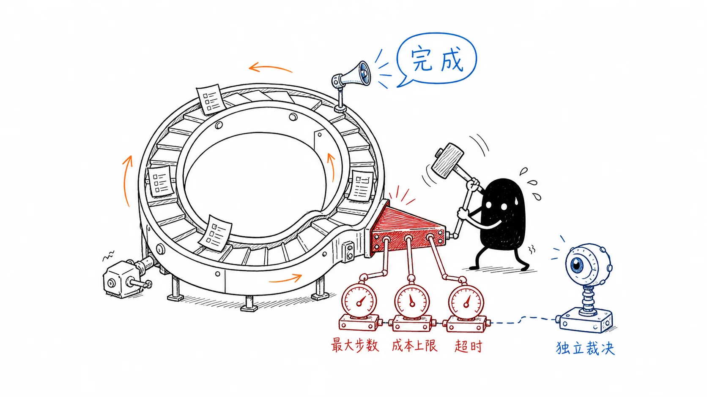
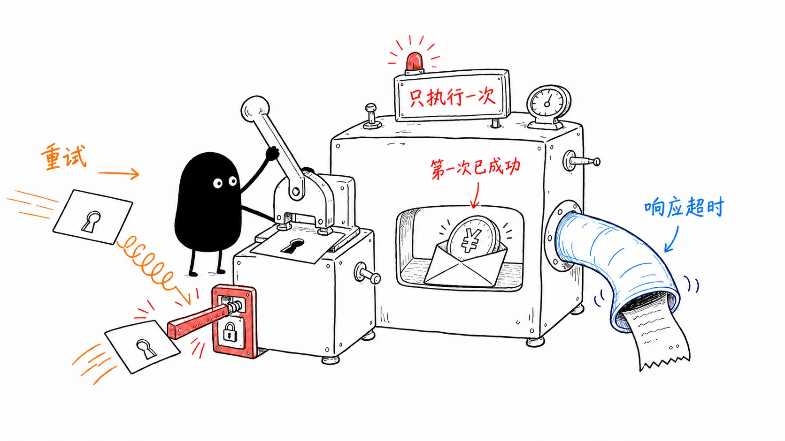
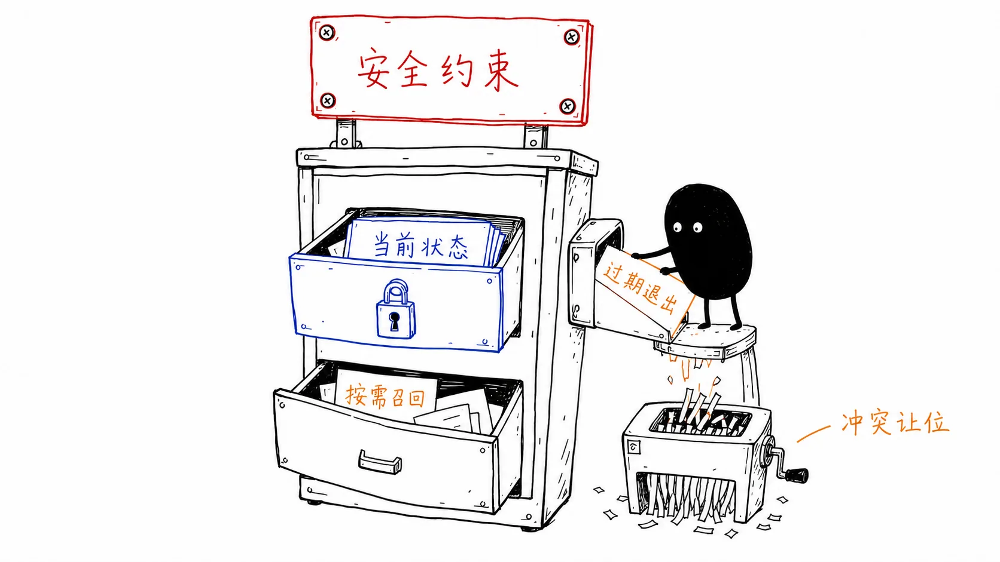
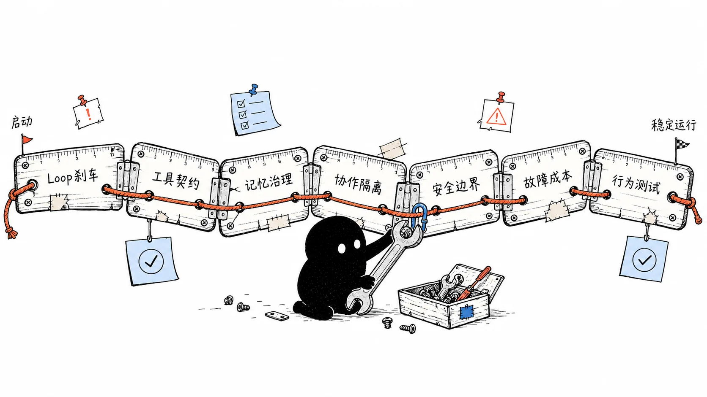
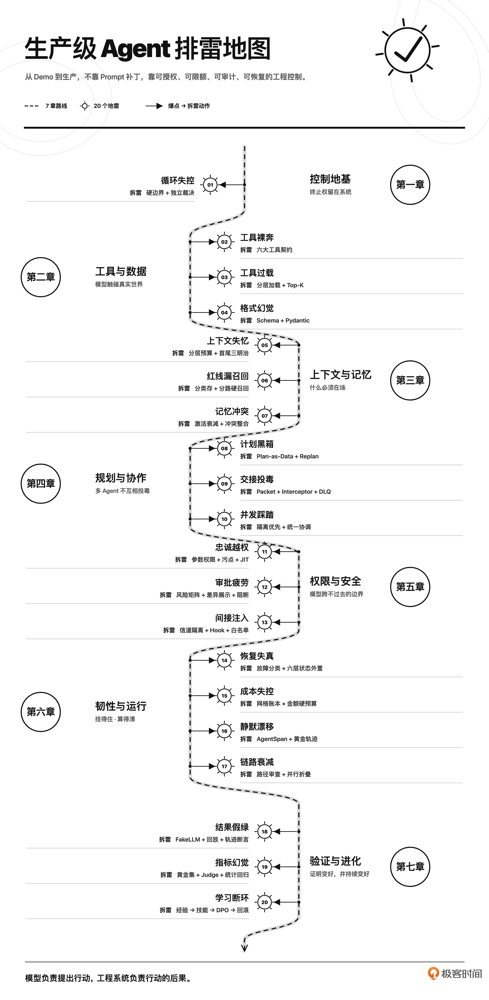
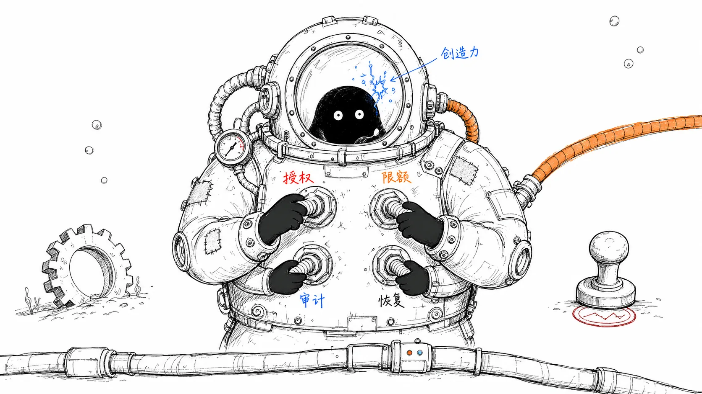

# 开篇词｜Agent 跑起来之后，真正的工程才刚开始
> 生产级 Agent 的关键，不是让模型更会决策，而是让每一次真实行动都经过可授权、可限额、可审计、可恢复的系统控制。

你好，我是李号双，eBay 资深架构师。

让一个 Agent 在 Demo 里跑起来可能只需要几百行代码；但让它在真实的生产环境里活下去，却要剥掉一层皮。

过去几年，我带团队将 Agent 应用于研发运维、智能客服和数据分析等场景，持续处理系统从 Demo 走向生产时遇到的稳定性、安全与成本问题。在一线实践的过程中，我发现给 Agent 增加能力并不难，难的是把最终审批权、操作熔断权和成本控制权留在工程系统手里。模型可以规划行动，但系统要管住它的手脚，也必须算清它的账。

即使模型判断失误，系统也能让错误 **及时中止、清晰可查、快速恢复**。也是在反复修补这些问题的过程中，我越来越确定：让 Agent 跑起来，和让 Agent 在生产环境里活下去，是两件完全不同的事。而后者就是我们这门课要解决的问题。

## 生产环境的脾气

生产事故很少一开始就表现为“系统彻底崩溃”。更常见的情况是看似一切良好，但结果已经悄然偏离。我们先来看三个最典型、也最容易被低估的地雷。

### 第一个地雷：把终止权交给模型

Agent 是一个循环。既然是循环，就必须回答一个问题：什么时候停？最直接的做法，是在 Prompt 里告诉模型：“任务完成后停止。”这句话没有错，但它不能成为系统唯一的刹车。

模型可能在任务尚未完成时宣布成功，也可能因为连续遇到模糊错误，不断尝试同一种方案。前一种情况会造成“幻觉终止”，后一种情况则会让 Agent 在原地空转，工具调用次数和 Token 消耗不断上升。更麻烦的是，这两种问题都不一定报错。循环可能正常结束，接口可能返回 200，监控面板也可能一片绿色，但任务实际上没有完成。

因此，终止不能只是模型的一项判断。生产系统必须在模型之外设置硬边界，包括最大步数、最大成本、最长执行时间、重复行为检测，以及独立的结果裁决机制。 **模型可以踩油门，但刹车必须掌握在系统手里。**

### 第二个地雷：把工具执行权直接交给模型

工具是 Agent 作用于真实世界的通道。搜索一次资料没有太大风险，但退款、发邮件、修改订单、删除数据不一样。这些操作一旦重复执行，后果不会随着下一轮推理自动消失。

假设退款接口第一次调用后已经成功，只是响应超时了。Agent 看到“超时”，决定重试。如果系统没有 **幂等** 保护，用户收到的可能不是一次退款，而是两次退款。

这时，仅仅要求模型“不要重复调用”没有意义。模型不应该负责生成幂等键，也不应该独自判断一个带副作用的工具能否重试。工具需要向运行时明确声明：它是否只读、是否有副作用、能否重试、是否需要审批、成本是多少、返回结果能否分页。Loop 再根据这些元数据决定如何执行。

这也是为什么生产级工具设计不只是写好一个函数。 **工具的描述、权限、幂等、错误语义和结果规模，都必须成为明确的工程契约。**

### 第三个地雷：让关键约束靠相似度召回

很多 Agent 会把业务知识、安全约束和用户记忆都放进向量库，需要时再按相似度取回。这个设计看起来很统一，实际上埋着很大的风险。

业务知识没有被召回，可能只是回答不够准确；安全红线没有被召回，结果可能就是一次真实事故。例如，系统里明明存着“禁止 Agent 执行 ORM 删除操作”的约束，但这条规则与当前请求的相似度不够高，没有进入 Top-K。对模型来说，这条规则就等于不存在。

记忆也有类似的问题。数据库里的状态可以更新和覆盖，若缺少版本、有效期、权威来源和失效机制，旧记忆可能与新状态同时进入上下文并造成冲突。模型可能上一轮判断订单已经发货，下一轮又根据旧记忆说订单尚未处理。

这不是简单的“记忆不够多”，而是记忆缺少生命周期。

因此，生产系统不能把所有内容都交给同一条召回链路。安全约束、任务状态、业务知识和个体记忆，需要分层管理；旧记忆还要能够衰减、失效，并在发生冲突时退出当前上下文。遗忘不是系统缺陷。失控的记忆才是。

以上这些问题无法靠模型“更聪明”来解决，它们需要的是系统级的工程防御。 **这门课程要帮你建立的，正是一套生产级 Agent 的防御思维**：系统已经出问题时，你知道从哪里定位；问题尚未发生时，你知道应该在哪里提前设防。

## 沿着一条完整链路排雷

在带领团队将 Agent 从 Demo 推向生产的实践中，我发现像这样的工程地雷还有很多。我把这些真实踩过的坑，系统整理成了 20 个问题，沿着 Agent 从启动到稳定运行的完整链路，带你逐个拆解、逐个排雷。

### 第一章：给 Loop 装上刹车

从终止权、执行权和状态控制入手。你会用硬边界与独立裁决避免无限循环和幻觉终止，把模型的“提议”与系统的“裁决”分开，并用显式状态机和检查点让中断任务可以恢复，而不是每次从头再跑。这一部分的目标，是先建立整门课的工程底座：概率负责探索，代码负责守边界。

### 第二章：把工具变成工程契约

讨论工具原子性、描述质量、由运行时或业务层生成并持久化的幂等键、分级错误语义，以及 Native Tool 与 MCP Server 的统一治理。目标是建立从注册、授权到执行和审计的治理规范，而不是把安全寄托在模型“这次别调错”。

### 第三章：治理上下文和记忆

上下文窗口是模型单次推理可见的有限输入，不是运行时内存，更不是永久存储。你会区分哪些信息必须始终注入上下文、哪些可以按需召回、哪些应该压缩或淘汰，并通过分层预算、多路径召回、记忆衰减和冲突检测，让重要约束不被淹没，让过期信息主动退场。

### 第四章：隔离多 Agent 协作中的污染

多 Agent 不等于把几个模型连起来聊天。我们会把模型生成的计划外化为可查看、可版本化的任务图，并让执行状态可以恢复；对于依赖关系明确的任务，再用 DAG 表达执行关系。随后通过增量重规划、事件溯源、检查点和 Handoff 契约，控制 Agent 之间究竟交接什么。默认隔离，按需共享。

### 第五章：建立模型跨不过去的安全边界

RBAC 主要解决用户、角色和权限之间的授权关系，却未必挡得住多个合法工具组合后的数据泄露。我们会把权限约束下沉到参数和数据流，讨论参数级限制、污点追踪、即时授权、独立熔断和多层防护（Guardrails）。这样，即使模型提出了越权动作，执行请求也应在架构层被拦截。

### 第六章：让 Agent 扛得住故障，也算得清成本

网络抖动、参数错误、权限拒绝和业务冲突不能一律重试。你会学习故障分类、差异化重试与熔断、状态外置、混合持久化、成本预算与轨迹级可观测性。定位静默失效时，不只看到 Agent 做了什么，还要看见执行轨迹为什么一步步偏离预期。

### 第七章：从“测试输出”走向“测试行为”

最终答案正确，不代表执行过程正确。Agent 可能读取了不该读取的数据、调用了不该调用的工具、经历十几次无效重试，最后碰巧答对。我们会用 FakeLLM 将模型输出替换为可控响应，先隔离模型的不确定性；再用轨迹级断言检查执行过程，用 LLM-as-Judge 辅助评估开放性结果。对反复出现的问题，再讨论实时校验、经验账本、技能沉淀与微调。

每一讲都会沿着同一条工程链路展开： **发现问题 → 定位根因 → 完成生产化改造 → 复盘方案边界。** 你会先看到错误是怎么发生的，再判断问题究竟出在哪里。之后，我们会给出生产级实现，并说明这套方案解决了什么、没有解决什么，以及它需要付出怎样的工程成本。

除了课程中复现问题的代码，我还准备了一套生产级的开源框架 [ProdAgent](https://github.com/limenagent/prodagent "")。它内置了 Agent 运行可视化 Web UI，你可以直接启动 Sample Agent，实时观察每一步决策、工具调用和状态流转；也可以随时打断、注入异常或修改参数，亲手调试生产级 Agent 的防御机制。理论之外，你能真正“看见”Agent 在干什么，也能验证改造前后的行为差异。无论是个人学习还是团队 Code Review，都可以把这套代码直接带进工程讨论。

不过，我不希望你把这门课学成某个框架的使用说明。状态机、幂等、污点追踪、事件溯源、Guardrail 和轨迹测试，都是与编程语言和 Agent 框架无关的工程模式。无论团队使用 Python、Java、Go 还是 TypeScript，都可以把这些方法迁移到自己的技术栈中。

**这门课适合谁学？**

- 如果你已经能独立写出一个 Agent Loop，正在考虑把它接入真实业务，这门课可以帮你提前发现从 Demo 到生产之间最容易被忽略的问题。

- 如果你正在维护线上 Agent，被稳定性、安全、成本或者“找不到根因”的问题困扰，这门课会给你一套更加系统的定位和改造方法。

- 如果你在负责 Agent 平台、AI 中间层或者 LLM 网关，这门课可以帮助你从单点能力跳出来，建立覆盖架构、工具、权限、状态和测试的整体视角。

- 如果你没有从零写过 Loop，只是在成熟模型、Agent SDK 或现成 AI 工具外面包了一层业务流程，也没关系，只要它能持续调用工具、读写数据或替用户行动，这 20 个问题同样适用。

但我也要把门槛说清楚：这不是一门 Agent 入门课。如果你还没有调用过大模型 API，也没有写过 Agent Loop，建议先完成一个可以调用工具、处理反馈并持续执行的 Agent，再回来学习。否则，很多工程问题你虽然能听懂概念，却很难真正理解它为什么危险。

## 跑起来只是工程的开始

模型能力还会继续进步，框架也会不断迭代。但企业能否把 Agent 放进核心业务，最终比拼的不会只是模型排行榜上的分数，而是有没有能力控制它的边界，解释它的行为，承受它的失败，并为它的每一次行动负责。跑起来只是工程的开始。

回过头看，Agent 上到生产环境之后，最大的变化不是流量变大了，也不是模型调用次数变多了，而是 Agent 开始真正影响业务。一旦它可以修改数据、触发交易、调用外部系统或者代替用户行动，我们就不能再把稳定和安全寄托在模型“足够聪明”上。

**创造力让 Agent 诞生，防御性工程让 Agent 活下来。** 接下来，我们就从 Agent 最基本的 Loop 开始，把这 20 个工程地雷一个个拆开、排掉。