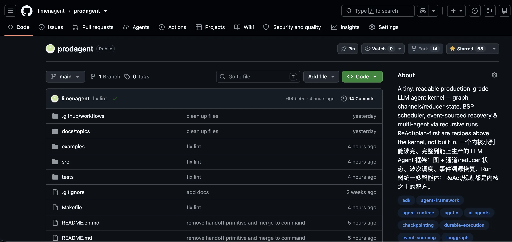

# 结束语｜代码不会骗人：在试错中长出 Agent 直觉
你好，我是李号双。

这一讲写完，这个专栏就算正式结束了。说真的，心里挺复杂的。写的过程中一直收到同学留言，说看不懂，问是不是自己基础太差了。我每次都回：不是你的问题，多看几遍就好。可回得多了，我自己也在琢磨，到底卡在哪。

后来我想明白了。这门课讲的东西，你得真的把一个 Agent 跑起来过、最好还出过事，才会有体感。就拿死循环那讲来说，如果你从没见过一个 Agent 自顾自跑了几十轮、token 一路往上烧，你看那段代码大概会觉得 “不就加个计数器嘛”，没什么感觉；可你要是真出过一次事，再回头看那几行，心情完全不一样。所以看不懂太正常了，不是你基础不好，是你还没被坑过。这其实是好事，说明你还没交过学费。

那到底怎样才能更好的理解这个专栏里提到“坑”呢。我建议你直接去看代码，先在脑子里构建一个概念：一个工业级的 Agent 框架到底长什么样子，再回过头来看看专栏，你可能有不同的视野。你可以看看专栏配套的框架代码，地址在 [这里](http://github.com/limenagent/prodagent "")。

## 那这个开源项目，现在该怎么读？

不过我得先跟你交个底： **这个 repo 最近被我整个重写了一遍。** 你要是早些时候来过，可能记得它是个两万多行、十几个包、一千多个测试的 “大而全” 框架。这回我没接着“往上堆”，而是“往回收”。 因为我越来越确信，想让你真正看懂一个框架是怎么来的，最好的办法不是给你一座走进去会迷路的大楼，而是给你一个小到能从头读完的标本。

重写之后，它的内核只有 **11 个文件、大约 1700 行**，整个项目加起来不到 5000 行；运行时不依赖任何第三方库，全是 Python 标准库；配了 65 个测试，全部离线就能跑，不联网、不花一分钱 token；另外有 10来个示例，从 “一个工具的 Hello World” 一直排到多 Agent 并行委派、断点续跑、流式背压。这个量，你静下心来是真能读完的，不像有些框架光核心就十几万行，看都看不到头。

如果你想更直观地 “看”，仓库里还藏着一个 Playground。在根目录敲一句 `make play`，浏览器打开本地端口，就能在网页上一个场景一个场景地点：右侧是一条完整的事件流时间线，节点什么时候开始、状态怎么变、哪里停下来等人审批、几个 Agent 之间怎么委派和接力，全都画给你看。第一次看到那条时间线往前走的时候，很多抽象就不再是名词了。

## 下一门课的计划

如果你在我们的 [课程群](https://time.geekbang.org/hybrid/mp/jump?t=weixin%253A%252F%252Fdl%252Fbusiness%252F%253Ft%253DWsMGHPFVBNj&url=https%3A%2F%2Fstatic001.geekbang.org%2Fresource%2Fimage%2F97%2Ff7%2F9784aaf95e7d5fe7d5d9b65bb026bdf7.jpg "") 里，可能听我提过，我在准备下一个专栏。现在可以正式跟你说了，下一个专栏叫《生产级 Agent 框架设计与实现》。

如果说《生产级 Agent 排雷实战》回答的是 “Agent 跑起来之后，出了问题怎么防、怎么修”，那这门新课回答的是另一个更靠前的问题： **一个框架，到底是怎么从零长出来的。** 它不教你用哪个框架，而是带你用第一性原理，推导出一个生产级 Agent 框架为什么这么设计、为什么不选另一条路、选了这条路的代价是什么。重写后的 ProdAgent，就是这门课配套的标本，你完全可以边看边照着自己手写一个出来。

你读代码、看新课的时候，哪儿卡住了、觉得哪一步跳得太大，欢迎直接去 repo 提 issue。我自己写的时候总容易觉得 “这不是理所当然的吗”，但对你来说，那一步可能正好是最卡的地方。问的人多的地方，我优先展开讲、优先补注释。

写这个专栏的几个月，很多问题我自己也重新想了一遍，有些曾经觉得天经地义的做法，写着写着发现站不住脚，又回头改了代码。所以它对我来说从来不只是输出，更像一次把自己也讲明白的过程。谢谢你一路看到这里。

Agent 开发这行还很早，今天看来很时髦的做法，明年可能就换了一茬。但有两条我想不会变：一是别太相信模型，该有的护栏一道都别省；二是想真正 hold 住一个系统，就得看得懂它最内核的那几根梁柱。

那我们就新课见了。

最后我准备了一份 [结课问卷](https://geekbang.feishu.cn/share/base/form/shrcnJ1CTBxFPAWj4i3rSyc04Eb "xxx")，你可以花两分钟填写一下，希望收到你的反馈。

